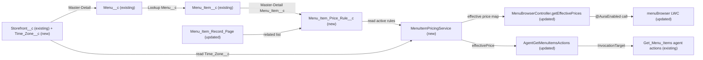

# Implementation spec — Happy-hour pricing on menu items

> Let restaurants set a fixed happy-hour price on specific menu items for chosen days of the week between a start and end time, and show that price wherever the org reads menu prices while the window is active.

_Based on the requirement, the evidence reported by AskCoworker, and read-only org queries where noted. Assumptions and missing evidence are identified below. Specification only — nothing is implemented or deployed._

---

## 1. The requirement

Restaurants (`Storefront__c` records) can run happy-hour pricing on specific menu items (`Menu_Item__c`) during certain hours. The user decided the scope: a happy-hour price is a **fixed override price per menu item** that applies on **chosen days of the week between a start time and an end time**, stored in a new Menu Item Price Rule object (item, price, days, start/end time). The base price `Menu_Item__c.Price__c` is never overwritten; the happy-hour price is applied when prices are read. The request contained no deploy, data-change, or credential instructions.

| # | Responsibility | Trigger | Where it lives |
| --- | --- | --- | --- |
| 1 | Store happy-hour price rules per menu item (price, days of week, start time, end time, active flag) | User creates or edits a rule | `Menu_Item_Price_Rule__c` (new), related list on `Menu_Item_Record_Page` |
| 2 | Reject invalid rules (negative price, end not after start, no days) | Rule insert or update | Validation rules on `Menu_Item_Price_Rule__c` (new) |
| 3 | Work out the price in effect now, in the restaurant's local time | Any read through the pricing service | `MenuItemPricingService` (new), `Storefront__c.Time_Zone__c` (new) |
| 4 | Show the happy-hour price in the menu browser | `menuBrowser` LWC loads a menu | `MenuBrowserController.getEffectivePrices` (new method), `menuBrowser` (updated) |
| 5 | Return the happy-hour price to agents | `Get_Menu_Items` agent actions run | `AgentGetMenuItemsActions` (updated, `MenuItemSummary.effectivePrice`) |
| 6 | Give rule managers access | Permission set assignment | `Menu_Item_Price_Rule_Manager` (new) |

## 2. Grounding — reuse before building

Target org: `TestWriteSpecDE` (Developer Edition, org ID `00Dak00001COqNeEAL`, `connectedStatus` Connected). API version: `67.0` (`sfdx-project.json` `sourceApiVersion`; org `apiVersion` 67.0). Org default time zone `America/Los_Angeles`. _verified by org query_

**Data model**

- **`Storefront__c`** (CustomObject) — the restaurant. `Type__c` picklist includes `Restaurant` and `Bar/Pub`; OWD internal `ReadWrite`, external `Private`. 21 records, all with `Address__StateCode__s` = `TX` (20 in `Dallas`, 1 in `Plano`). No custom field for a time zone exists (full Tooling `CustomField` list of 15 fields checked). _verified by org query_
- **`Menu__c`** (CustomObject) — Master-Detail `Menu__c.Storefront__c` to `Storefront__c`; OWD `ControlledByParent`. _verified by org query_
- **`Menu_Item__c`** (CustomObject) — the menu item. Custom fields (complete Tooling `CustomField` list): `Available__c` (Checkbox), `Calories__c`, `Description__c`, `Image_URL__c`, `Menu_Category__c` (Lookup), `Menu__c` (Lookup to `Menu__c`), `Price__c` (Currency(16,2), nillable). OWD internal `ReadWrite`, external `Private`. 206 records. No child custom objects. _verified by org query_
- **`Promotion__c`** (CustomObject) — storefront-level promotion with `Discount_Percentage__c` (Percent), `Start_Date__c` / `End_Date__c` (Date), `Status__c` (`Active`, `Expired`, `Canceled`), Lookup `Storefront__c`. It has no link to `Menu_Item__c` and no time-of-day or day-of-week fields. 1 record (`Active`). _verified by org query_
- **`Storefront_Hours_of_Operation__c`** (CustomObject) — `Day_of_Week__c` picklist (`Monday` … `Sunday`), `Opening_Time__c` / `Closing_Time__c` as Text(255) holding values such as `08:00 AM`. _verified by org query_
- **Same concept elsewhere:** Tooling `CustomField` searches for `Happy`, `Discount`, `Special`, `Sale`, `Price`, `Time`, `Hour`, `Promo`, and `Zone` return only `Menu_Item__c.Price__c`, `Promotion__c.Discount_Percentage__c`, `Promotion__c.Promotion_Code__c`, `Storefront_Hours_of_Operation__c.Opening_Time__c` / `Closing_Time__c`, `Marketing_Event__c.Promotion__c`, and unrelated fields (Data 360 `9sd…` object fields filtered out). Tooling `CustomObject` search for `Price`, `Happy`, `Rule` returns nothing. `Menu_Item_Price_Rule__c` does not exist. _verified by org query_

**Automation and code on the objects in scope**

- **Triggers:** no `ApexTrigger` on `Menu_Item__c`, `Menu__c`, `Promotion__c`, `Storefront__c`, `Storefront_Hours_of_Operation__c`, or `Menu_Category__c`. _verified by org query_
- **Flows:** `FlowDefinitionView` returns no flow triggered on `Menu_Item__c`, `Promotion__c`, `Menu__c`, or `Storefront__c`. The only scheduled flow is `Orch`. _verified by org query_
- **Validation rules:** none on `Menu_Item__c`, `Promotion__c`, or `Storefront__c`. _verified by org query_
- **Readers of `Menu_Item__c.Price__c`** (`MetadataComponentDependency` plus a search of all 70 unmanaged Apex class bodies): `AgentGetMenuItemsActions`, `AgentUpdateMenuItemPriceActions`, `AgentCreateMenuWithItemsActions`, `MenuBrowserController`, `MenuDescriptionPromptGrounding` (all `with sharing`), and FlexiPage `Menu_Record_Page`. _verified by org query_
- **`MenuBrowserController`** (ApexClass, `with sharing`) — `getMenuItems(String menuId)` returns `List<Menu_Item__c>` with `Price__c` for items where `Available__c = true`. Its only caller is LWC `menuBrowser`, whose template shows `item.Price__c`. _verified by org query_
- **`AgentGetMenuItemsActions`** (ApexClass, `with sharing`) — invocable `Get Menu Items`; validates `Storefront__c.Account__c` ownership, reads up to 200 items, returns `MenuItemSummary.price` and a JSON copy in `menuItemsJson`. Its class Id is the `InvocationTarget` of many `GenAiFunctionDefinition` records named `Get_Menu_Items` and `Get_Menu_Items_…`. No component references it through `MetadataComponentDependency`. _verified by org query_
- **`AgentUpdateMenuItemPriceActions`** (ApexClass) — overwrites `Price__c` on one item. Reused as-is for base-price changes; not used for happy hour because a scheduled overwrite would change the price every other reader sees. _verified by org query_
- **Tests:** no Apex test class references `MenuBrowserController`, `AgentGetMenuItemsActions`, or `Menu_Item__c`. _verified by org query_
- **`Menu_Item_Record_Page`** (FlexiPage, `flexipage:recordHomeTemplateDesktop`) — Dynamic Forms field sections, no related list component. _verified by org query_
- **Access to `Menu_Item__c`** (`ObjectPermissions`, complete): `Agentforce_Reference_App` (unmanaged, R/C/E/D, 1 assignment), `sfdc_accelerate_dms` (R/C/E/D), `sfdc_a360_sfcrm_data_extract` (Read), `sfdc_slack` (Read), Analytics Cloud Integration User profile (Read), System Administrator profile (R/C/E/D). The `sfdc_*` permission sets have namespace `sfdcInternalInt`. _verified by org query_
- **Data 360:** `SELECT COUNT() FROM DataStream` returns 0. _verified by org query_

Candidates examined and rejected:

- `Promotion__c` — storefront-level, percentage-based, and date-only; the user chose a fixed per-item price on recurring days and hours. Extending it would need an item junction plus time and day fields and would change the meaning of an object the `Create_Promotion` agent action already writes. _user decision_
- `Storefront_Hours_of_Operation__c` — describes opening hours, stores times as Text; it holds no price. _verified by org query_
- Scheduled overwrite of `Menu_Item__c.Price__c` — would change the price for every reader, including the base-price agent action and prompt grounding. _assumption_

Evidence sources: `sf org display`; `sf sobject list --sobject custom`; `sf sobject describe` for `Menu_Item__c`, `Promotion__c`, `Storefront_Hours_of_Operation__c`, `Menu__c`, `Menu_Category__c`, `Transaction__c`, `Storefront__c`; Tooling `EntityDefinition`, `CustomField`, `CustomObject`, `ApexTrigger`, `ValidationRule`, `ApexClass` (bodies), `MetadataComponentDependency`, `LightningComponentBundle`, `LightningComponentResource`, `FlexiPage` (with `Metadata`), `GenAiFunctionDefinition`, `GenAiPlannerDefinition`; SOQL on `FlowDefinitionView`, `ObjectPermissions`, `FieldPermissions`, `PermissionSet`, `PermissionSetAssignment`, `Organization`, `Network`, `BotDefinition`, `DataStream`, and aggregates on `Promotion__c`, `Menu_Item__c`, `Storefront__c`. AskCoworker returned no `citedReferences`; its statements kept here were re-checked by org query (Section 8).

## 3. Architecture

Why the pieces are drawn this way:

1. `Menu_Item_Price_Rule__c` is a child of `Menu_Item__c` because the user chose per-item rules and an item can have several windows (for example weekday and weekend). Master-Detail makes sharing follow the item and deletes rules with their item. _user decision; assumption (documented platform behavior)_
2. `MenuItemPricingService` is Apex. A formula field on `Menu_Item__c` cannot read child records or evaluate "now" in another time zone, and a roll-up cannot filter by the current day and time; flows cannot be called from `menuBrowser` or return a per-item map to it. The price is computed when read, so no scheduled job or overwrite of `Price__c` is needed. _assumption (documented platform behavior)_
3. One service is shared by the two price readers that serve customers and merchants (`MenuBrowserController` and `AgentGetMenuItemsActions`), so the rule logic lives in one place. _assumption_
4. `Storefront__c.Time_Zone__c` feeds the service because `Time` fields store a wall-clock time with no time zone, and the org default (`America/Los_Angeles`) differs from the storefronts' location (Texas). _verified by org query; assumption (documented platform behavior)_
5. `getMenuItems` keeps its signature because `menuBrowser` binds to its `Menu_Item__c` fields; the new method adds the effective prices beside it. _verified by org query_
6. `Get_Menu_Items` agent actions are existing nodes; their input schema does not change. _verified by org query_

## 4. Metadata changes

**Data model**

- **Create `Menu_Item_Price_Rule__c`** — CustomObject, label "Menu Item Price Rule", plural "Menu Item Price Rules". Name field is Auto Number `HHR-{0000}`. Sharing `ControlledByParent`. Description: "A happy-hour price for one menu item on chosen days between a start and end time (restaurant local time)."
- **Create `Menu_Item_Price_Rule__c.Menu_Item__c`** — CustomField, Master-Detail to `Menu_Item__c`, label "Menu Item", child relationship name `Price_Rules` (`Price_Rules__r`), `reparentableMasterDetail = false`, sharing setting Read/Write.
- **Create `Menu_Item_Price_Rule__c.Price__c`** — CustomField, Currency(16,2) (same precision as `Menu_Item__c.Price__c`), label "Happy Hour Price", required. Help text: "The fixed price charged for this item while the rule is active. Replaces the item's regular price."
- **Create `Menu_Item_Price_Rule__c.Days_of_Week__c`** — CustomField, MultiselectPicklist, restricted, 7 visible lines, values `Monday`, `Tuesday`, `Wednesday`, `Thursday`, `Friday`, `Saturday`, `Sunday` (same values and order as `Storefront_Hours_of_Operation__c.Day_of_Week__c`). Required through rule `Days_Of_Week_Required`.
- **Create `Menu_Item_Price_Rule__c.Start_Time__c`** — CustomField, Time, label "Start Time", required. Help text: "Start of the happy-hour window in the restaurant's local time (inclusive)."
- **Create `Menu_Item_Price_Rule__c.End_Time__c`** — CustomField, Time, label "End Time", required. Help text: "End of the happy-hour window in the restaurant's local time (exclusive). Must be later than Start Time on the same day."
- **Create `Menu_Item_Price_Rule__c.Active__c`** — CustomField, Checkbox, label "Active", default `true`. Lets a restaurant pause a rule without deleting it.
- **Create `Menu_Item_Price_Rule__c.Price_Not_Negative`** — ValidationRule, active. Formula `Price__c < 0`; error on `Price__c`: "Happy Hour Price cannot be negative." Blank `Price__c` gives no error (the field is required); `0` is allowed.
- **Create `Menu_Item_Price_Rule__c.End_Time_After_Start_Time`** — ValidationRule, active. Formula `End_Time__c <= Start_Time__c`; error on `End_Time__c`: "End Time must be later than Start Time. Windows that cross midnight are not supported; create two rules instead." Both fields are required, so blanks never reach the rule; with a blank value the comparison returns no error.
- **Create `Menu_Item_Price_Rule__c.Days_Of_Week_Required`** — ValidationRule, active. Formula `ISBLANK(Days_of_Week__c)`; error on `Days_of_Week__c`: "Select at least one day."
- **Create `Storefront__c.Time_Zone__c`** — CustomField, Picklist, restricted, label "Time Zone", values (API value = label) `America/Chicago` (default), `America/Denver`, `America/Phoenix`, `America/Los_Angeles`, `America/New_York`, `America/Anchorage`, `Pacific/Honolulu`. Help text: "Local time zone of the restaurant. Happy-hour price rules are evaluated in this time zone." Values are valid `TimeZoneSidKey` IDs for `Datetime.format(String, String)`.

**Apex**

- **Create `MenuItemPricingService`** — ApexClass, `public inherited sharing`. `public static Map<Id, Decimal> getEffectivePrices(Set<Id> menuItemIds, Datetime asOf)`: one SOQL `SELECT Id, Price__c, Menu__r.Storefront__r.Time_Zone__c, (SELECT Price__c, Days_of_Week__c, Start_Time__c, End_Time__c FROM Price_Rules__r WHERE Active__c = true) FROM Menu_Item__c WHERE Id IN :menuItemIds`. For each item: time zone = `Time_Zone__c`, or the org default `Organization.TimeZoneSidKey` when blank (queried once, only if needed); local day = `asOf.format('u', tz)` mapped 1–7 to `Monday`–`Sunday`; local time = `Time.newInstance` from `asOf.format('HH', tz)`, `'mm'`, `'ss'`. A rule matches when its `Days_of_Week__c` split on `;` contains the local day and `Start_Time__c <= local time < End_Time__c`. The effective price is the lowest `Price__c` of the matching rules; with no match it is `Menu_Item__c.Price__c` (which may be null). Never writes any record. `asOf` is a parameter so tests can fix the time.
- **Create `MenuItemPricingServiceTest`** — ApexClass (`@isTest`), tests in Section 7.
- **Update `MenuBrowserController`** — ApexClass. Add `@AuraEnabled public static Map<Id, Decimal> getEffectivePrices(String menuId)`: queries the Ids of `Menu_Item__c` where `Menu__c = :menuId AND Available__c = true` (the same filter as `getMenuItems`) and returns `MenuItemPricingService.getEffectivePrices(ids, Datetime.now())`. Not `cacheable`, because the result depends on the time. `getMenuItems` and `getMenuCategories` are unchanged; the class stays `with sharing`.
- **Create `MenuBrowserControllerTest`** — ApexClass (`@isTest`), tests in Section 7.
- **Update `AgentGetMenuItemsActions`** — ApexClass. Add to `MenuItemSummary`: `@InvocableVariable(label='Effective Price' description='Price in effect right now, including an active happy-hour price rule (Menu_Item_Price_Rule__c). Equals Price when no rule applies.') public Decimal effectivePrice;`. After the existing item query, call `MenuItemPricingService.getEffectivePrices` once for the returned Ids with `Datetime.now()` and set `effectivePrice` per summary. `price` keeps returning `Price__c`; `menuItemsJson` now also carries `effectivePrice`. Request fields, ownership checks, `LIMIT 200`, and `with sharing` are unchanged.
- **Create `AgentGetMenuItemsActionsTest`** — ApexClass (`@isTest`), tests in Section 7.

**UX**

- **Update `menuBrowser`** — LightningComponentBundle. Import `getEffectivePrices` from `@salesforce/apex/MenuBrowserController.getEffectivePrices`; call it when a menu loads, beside `getMenuItems`. When an item's effective price differs from `Price__c`, show the effective price with a "Happy hour" badge and the regular price struck through; otherwise show `Price__c` as today. If the call fails, show `Price__c` (the menu still renders). Add Jest tests in the bundle for both display states.
- **Create `Menu_Item_Price_Rule__c-Menu Item Price Rule Layout`** — Layout with `Menu_Item__c`, `Price__c`, `Days_of_Week__c`, `Start_Time__c`, `End_Time__c`, `Active__c`.
- **Create `Menu_Item_Price_Rule__c`** — CustomTab for the object, so rule managers can list all rules across items.
- **Update `Menu_Item_Record_Page`** — FlexiPage. Add a `force:relatedListSingleContainer` for `Price_Rules__r` in the main tab set, columns `Name`, `Price__c`, `Days_of_Week__c`, `Start_Time__c`, `End_Time__c`, `Active__c`. This changes the Menu Item record page for every user who has access to the object; users without access do not see the list. Retrieve the current page before editing.

**Security**

- **Create `Menu_Item_Price_Rule_Manager`** — PermissionSet, label "Menu Item Price Rule Manager". Object: `Menu_Item_Price_Rule__c` Read, Create, Edit, Delete; `Menu_Item__c` Read. Fields: Read and Edit on `Menu_Item_Price_Rule__c.Price__c`, `Days_of_Week__c`, `Start_Time__c`, `End_Time__c`, `Active__c` (the Master-Detail field needs no FLS entry); Read and Edit on `Storefront__c.Time_Zone__c`. Tab `Menu_Item_Price_Rule__c` visible. Apex class access: `MenuBrowserController`.

## 5. Data 360 (Data Cloud) data involved

Not applicable — this change does not use Data 360. `SELECT COUNT() FROM DataStream` returns 0 (verified by org query). `sfdc_a360_sfcrm_data_extract` reads `Menu_Item__c` today; it gets no access to the new object or field, because deploying them grants no access to permission sets outside the deployment.

## 6. Security considerations

- **Execution context:** `MenuItemPricingService` is `inherited sharing` and runs in the caller's mode. Both callers are `with sharing` (verified by org query), so record sharing on `Menu_Item__c` applies, and rules follow their item (`ControlledByParent`). Its SOQL runs in system mode for CRUD and FLS, the same as the existing classes, so a caller without access to `Menu_Item_Price_Rule__c` or `Storefront__c.Time_Zone__c` still gets correct prices. This exposes only a computed price that the same user could already see as a menu price; no rule fields are returned. _assumption (documented platform behavior)_
- **Record visibility:** `Menu_Item__c` internal OWD is `ReadWrite` and external is `Private` (verified by org query). Every internal user who is granted object access sees all rules; external users see rules only for items shared to them.
- **Agent path:** `AgentGetMenuItemsActions` keeps its `Storefront__c.Account__c` ownership check before it reads items, so an agent returns effective prices only for the caller's own storefronts (verified by org query). No new input is added, so no new caller-supplied ID reaches authorization.
- **Grants:** only the new `Menu_Item_Price_Rule_Manager` gets object and field access. Not granted, by design: `Agentforce_Reference_App` (broad, 1 assignment; the agent does not need rule access to compute prices), `sfdc_accelerate_dms`, `sfdc_a360_sfcrm_data_extract`, `sfdc_slack` (namespace `sfdcInternalInt`, platform-managed), and all profiles. The System Administrator profile gets no FLS on the new fields from this deployment; admins receive the permission set. _verified by org query; assumption_
- **Apex class access:** `menuBrowser` callers need access to `MenuBrowserController`. Who holds that access today was not checked; the new method needs the same access as `getMenuItems`, so existing users are unaffected. The permission set adds it for rule managers.
- **Data exposure:** the new fields hold prices and schedules, no personal data.

## 7. Testing strategy

Apex tests (never claimed as run):

- **`MenuItemPricingServiceTest`** — builds `Storefront__c` (`Time_Zone__c = 'America/Chicago'`), `Menu__c`, `Menu_Item__c` (`Price__c = 10`), and rules; passes fixed `asOf` values built with `Datetime.newInstanceGmt` so the Chicago local time is known.
  - Matching day and time returns the rule price.
  - Wrong day returns `Price__c`.
  - Before `Start_Time__c` returns `Price__c`; exactly at `Start_Time__c` returns the rule price (inclusive); exactly at `End_Time__c` returns `Price__c` (exclusive).
  - `Active__c = false` rule is ignored.
  - Two matching rules (8 and 6) return 6 (lowest wins); a rule price higher than `Price__c` still applies (override).
  - No rules returns `Price__c`; item with null `Price__c` and no rule returns null; with a matching rule returns the rule price.
  - Time zone: the same `asOf` matches under `America/Chicago` and does not match under `America/Los_Angeles` for a window that one time zone is inside and the other is not (verifies the load-bearing time-zone logic).
  - Blank `Time_Zone__c` uses the org default time zone (assert against `[SELECT TimeZoneSidKey FROM Organization]`).
  - Day mapping: one `asOf` per weekday asserts the `format('u', tz)` mapping to `Monday`–`Sunday` (verifies the load-bearing day logic).
  - Bulk: 200 items with 2 rules each in one call use 1 SOQL query for items and rules (assert with `Limits.getQueries()`).
  - No DML: `Menu_Item__c.Price__c` is unchanged after the call.
- **`MenuBrowserControllerTest`** — a rule covering all 7 days from `00:00` to `23:59:59.999` returns the rule price for an available item; an item with `Available__c = false` is not in the map; a menu with no rules returns `Price__c`; an unknown menu Id returns an empty map.
- **`AgentGetMenuItemsActionsTest`** — with `Account`, `Storefront__c.Account__c`, `Menu__c`, items, and an all-day rule: `effectivePrice` equals the rule price and `price` still equals `Price__c`; without a rule `effectivePrice` equals `price`; `menuItemsJson` contains `effectivePrice`; ownership mismatch still returns "Access denied" with no items; null `accountId` still returns the existing error.
- **`menuBrowser` Jest tests** (in the bundle) — renders the struck-through regular price and badge when the effective price differs; renders only `Price__c` when equal or when `getEffectivePrices` rejects.

Recommended verification (manual, in a sandbox; declarative parts):

1. Validation rules: saving a rule with price `-1`, with `End_Time__c` equal to or earlier than `Start_Time__c`, and with no days is blocked with the stated messages; price `0` saves.
2. Deleting a `Menu_Item__c` deletes its rules; undeleting the item restores them; the `Menu_Item__c` field on a rule cannot be changed after save.
3. As a user with `Menu_Item_Price_Rule_Manager`: the related list shows on `Menu_Item_Record_Page`, and the user can create, edit, and delete rules and set `Storefront__c.Time_Zone__c`. As a user without it: no related list and no rule access, while `menuBrowser` still shows happy-hour prices.
4. With `Time_Zone__c = America/Chicago`, create a rule for today covering the current Chicago hour; `menuBrowser` on the item's menu shows the happy-hour price; after the window ends (or after unchecking `Active__c`) and a reload, it shows `Price__c`.
5. Run a `Get_Menu_Items` action in Agent Builder during an active window: the response shows `effectivePrice` in the outputs or in `menuItemsJson`, and the agent's existing outputs are unchanged.

## 8. Open decisions

### Open

1. **Backfill `Storefront__c.Time_Zone__c` (blocking for delivery).** The field's default applies only to new records. Until the 21 existing storefronts (all in Dallas or Plano, TX, verified by org query) have `America/Chicago`, their rules are evaluated in the org default `America/Los_Angeles`, two hours off. Data step after deployment: export `Id, Time_Zone__c` of `Storefront__c` as a backup, then set `Time_Zone__c = America/Chicago` on all 21 records (Data Import Wizard or Data Loader, by an admin who holds `Menu_Item_Price_Rule_Manager`). Rollback: clear the field from the export. Assumption: Dallas and Plano use `America/Chicago` (external fact).
2. **Assign `Menu_Item_Price_Rule_Manager` (blocking for delivery).** Nobody can create rules until the permission set is assigned. Which users manage happy hours for restaurants is not specified; the org's merchant-facing channels are agents (`Merchant_Support_Agent`, `Merchant_Management_Agent`) and two Experience sites in status `UnderConstruction` (verified by org query). Default: assign it to the internal staff who maintain menus.
3. **Agent action to create rules (non-blocking, proposal).** Merchants cannot create rules through an agent today; a `Create Menu Item Price Rule` invocable action (with the same `Account__c` ownership check as `AgentCreatePromotionActions`) and its `GenAiFunction` rows would add that channel. Not in the inventory because the requirement names no channel.
4. **Agent output schema (non-blocking).** Whether the stored output schema of the `Get_Menu_Items` `GenAiFunction` records lists the new `effectivePrice` output automatically could not be read. `menuItemsJson` carries it in every case. If the separate output is wanted, refresh the action outputs in Agent Builder after deployment (manual check 5).
5. **Time-format pattern `'u'` (non-blocking, load-bearing for the day logic).** The day mapping relies on `Datetime.format('u', tz)` returning 1–7 for Monday–Sunday (Java `SimpleDateFormat` behavior used by Apex). The weekday test in Section 7 verifies it; if it fails, compute the day from `Date.newInstance(1900, 1, 1).daysBetween(localDate)` modulo 7 (1 January 1900 was a Monday).
6. **Place `Storefront__c.Time_Zone__c` on the storefront record page (non-blocking, proposal).** The field is set once per storefront by the backfill; it is not placed on a page. Add it to the `Storefront__c` record page if restaurants will be onboarded outside Texas.
7. **Other price readers (non-blocking, proposal).** `MenuDescriptionPromptGrounding` (menu description generation) and FlexiPage `Menu_Record_Page` keep showing `Price__c`; they describe the regular menu, not the live price. `AgentCreatePromotionActions` defaults `Status__c` to `Draft`, a value not in the `Status__c` picklist (verified by org query); this is unrelated to the requirement and left as is.
8. **Windows across midnight (non-blocking).** Rejected by `End_Time_After_Start_Time`; a late-night happy hour needs two rules (for example `22:00`–`23:59:59` on Friday and `00:00`–`02:00` on Saturday).

Deployment sequence: (1) `Menu_Item_Price_Rule__c`, its fields, validation rules, layout, tab, and `Storefront__c.Time_Zone__c`; (2) `MenuItemPricingService` and its test; (3) `MenuBrowserController`, `AgentGetMenuItemsActions`, and their tests; (4) `menuBrowser`; (5) `Menu_Item_Record_Page`; (6) `Menu_Item_Price_Rule_Manager`; then the data step in item 1 and the assignment in item 2.

### Resolved

- **Price form:** a fixed override price per item, not a percentage discount. _user decision_
- **Schedule form:** chosen days of the week between a start and end time, not date ranges. _user decision_
- **Apply at read time, never overwrite `Menu_Item__c.Price__c`:** an overwrite would change what every other reader sees and would need a scheduled job. _assumption_
- **Overlapping rules:** the lowest matching price wins, so the result does not depend on query order. A matching rule applies even when its price is higher than `Price__c`, because the user chose an override. _assumption_
- **Time zone per storefront, not hard-coded:** AskCoworker proposed hard-coding `America/Chicago` in Apex; replaced with `Storefront__c.Time_Zone__c` and an org-default fallback so a restaurant outside Texas is not priced in the wrong hour. _assumption_
- **Scope:** all `Storefront__c` records can use rules, not only `Type__c = Restaurant`; the requirement's "restaurants" names the storefront concept, and a type filter would exclude `Bar/Pub`. _assumption_
- **Setup channel:** rules are managed in the standard record UI (related list and tab). _assumption_
- **AskCoworker proposals dropped or corrected:** a Lookup instead of Master-Detail (replaced: rules have no meaning without their item); granting `Agentforce_Reference_App` access (dropped: broad permission set, not needed for price computation); Currency(7,2) (replaced by 16,2 to match `Price__c`); changing `getMenuItems` to return a wrapper (rejected: it would break `menuBrowser`'s bindings; a new method is added instead); setting `MenuItemSummary.price` to the effective price (rejected: `price` keeps its meaning, `effectivePrice` is added).
- **AskCoworker factual errors (org query and documented behavior win):** (1) "`Transaction__c` has no business fields" — Tooling `CustomField` lists 6 (`Contact`, `Payment_Method`, `Refund_Reason`, `Total_Amount`, `Transaction_Date`, `Transaction_Type`) that `describe` hides; none links to menu items, so checkout pricing is out of reach and not designed. (2) "Validation rules are not queryable via SOQL" — Tooling `ValidationRule` returned results (none on the objects in scope). (3) "Cascade-deleted detail records cannot be undeleted" — undeleting the master record restores its detail records (documented platform behavior). After the second error, every AskCoworker fact kept in this spec was re-verified by org query.
- **AskCoworker timeouts:** discovery call D1 and the inventory call I each failed once (error, timeout); both were resent narrower (I split into data-model and pricing halves) and answered.

## 9. Change set

| # | Action | Type | API name | Module | Why |
| --- | --- | --- | --- | --- | --- |
| 1 | Create | CustomObject | `Menu_Item_Price_Rule__c` | force-app/main/default/objects | Stores happy-hour price rules per menu item |
| 2 | Create | CustomField | `Menu_Item_Price_Rule__c.Menu_Item__c` | force-app/main/default/objects | Master-Detail link to the menu item |
| 3 | Create | CustomField | `Menu_Item_Price_Rule__c.Price__c` | force-app/main/default/objects | Fixed happy-hour price |
| 4 | Create | CustomField | `Menu_Item_Price_Rule__c.Days_of_Week__c` | force-app/main/default/objects | Days the rule applies |
| 5 | Create | CustomField | `Menu_Item_Price_Rule__c.Start_Time__c` | force-app/main/default/objects | Window start (inclusive) |
| 6 | Create | CustomField | `Menu_Item_Price_Rule__c.End_Time__c` | force-app/main/default/objects | Window end (exclusive) |
| 7 | Create | CustomField | `Menu_Item_Price_Rule__c.Active__c` | force-app/main/default/objects | Pause a rule without deleting it |
| 8 | Create | ValidationRule | `Menu_Item_Price_Rule__c.Price_Not_Negative` | force-app/main/default/objects | Reject negative prices |
| 9 | Create | ValidationRule | `Menu_Item_Price_Rule__c.End_Time_After_Start_Time` | force-app/main/default/objects | Reject empty or reversed windows |
| 10 | Create | ValidationRule | `Menu_Item_Price_Rule__c.Days_Of_Week_Required` | force-app/main/default/objects | Require at least one day |
| 11 | Create | CustomField | `Storefront__c.Time_Zone__c` | force-app/main/default/objects | Evaluate windows in the restaurant's local time |
| 12 | Create | ApexClass | `MenuItemPricingService` | force-app/main/default/classes | Single place that computes the price in effect now |
| 13 | Create | ApexClass | `MenuItemPricingServiceTest` | force-app/main/default/classes | Tests day, time, time-zone, overlap, and bulk logic |
| 14 | Update | ApexClass | `MenuBrowserController` | force-app/main/default/classes | New `getEffectivePrices` method for the menu browser |
| 15 | Create | ApexClass | `MenuBrowserControllerTest` | force-app/main/default/classes | Tests `getEffectivePrices` |
| 16 | Update | ApexClass | `AgentGetMenuItemsActions` | force-app/main/default/classes | Return `effectivePrice` to agents |
| 17 | Create | ApexClass | `AgentGetMenuItemsActionsTest` | force-app/main/default/classes | Tests `effectivePrice` and unchanged checks |
| 18 | Update | LightningComponentBundle | `menuBrowser` | force-app/main/default/lwc | Show the happy-hour price in the menu browser |
| 19 | Create | Layout | `Menu_Item_Price_Rule__c-Menu Item Price Rule Layout` | force-app/main/default/layouts | Record layout for rules |
| 20 | Create | CustomTab | `Menu_Item_Price_Rule__c` | force-app/main/default/tabs | List all rules |
| 21 | Update | FlexiPage | `Menu_Item_Record_Page` | force-app/main/default/flexipages | Related list to manage rules on the item |
| 22 | Create | PermissionSet | `Menu_Item_Price_Rule_Manager` | force-app/main/default/permissionsets | Access for users who manage happy-hour rules |

A child price-rule object on `Menu_Item__c`, evaluated at read time in each storefront's time zone by one Apex service that the menu browser and the Get Menu Items agent action call.

Total: 22 · Create: 18 · Update: 4 · Delete: 0
