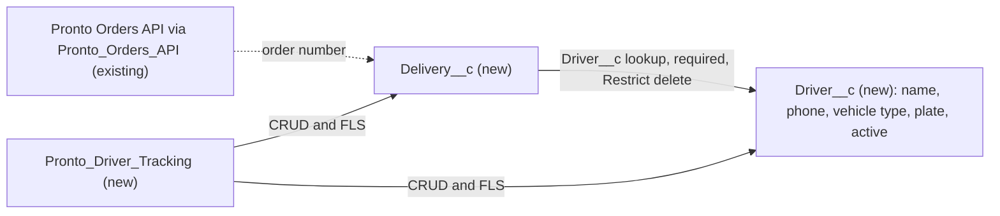

# Implementation spec — Delivery driver tracking

> Record delivery drivers with the vehicle they use, and link each delivered Pronto order to the driver who delivered it.

_Based on the requirement, the evidence reported by AskCoworker, and read-only org queries where noted. Assumptions and missing evidence are identified below. Specification only — nothing is implemented or deployed._

---

## 1. The requirement

Track delivery drivers, which vehicle each driver uses, and which orders each driver delivered. The user clarified that drivers are contractors, not Salesforce Users, that a new Driver object should hold name, phone, vehicle type, license plate, and an active flag, and that each delivered order is linked to its driver (*user decision*). The request contained no deploy or data-change instruction.

| # | Responsibility | Trigger | Where it lives |
| --- | --- | --- | --- |
| 1 | Store each driver (name, phone, active flag) | User creates or edits a driver record | `Driver__c` |
| 2 | Store the vehicle each driver uses (vehicle type, license plate) | User creates or edits a driver record | `Driver__c.Vehicle_Type__c`, `Driver__c.License_Plate__c` |
| 3 | Record which orders each driver delivered | User or integration creates a delivery record for an order | `Delivery__c` with `Delivery__c.Order_Number__c` and `Delivery__c.Driver__c` |
| 4 | Let the operations team view and maintain drivers and deliveries | Permission set assignment | `Pronto_Driver_Tracking`, tabs, and layouts |

## 2. Grounding — reuse before building

Target org: `TestWriteSpecDE` (Developer Edition, not a sandbox, `00Dak00001COqNeEAL`). API version: `67.0`.

- **No driver, vehicle, or delivery object exists.** The full custom object list (`sf sobject list --sobject custom`) and a Tooling `CustomObject` search for `%Driver%`, `%Deliver%`, `%Vehicle%` returned nothing. _verified by org query_
- **No field anywhere represents a driver, vehicle, or license plate.** Tooling `CustomField` searches for `%Driver%`, `%Vehicle%`, `%Deliver%`, `%Courier%`, `%Fleet%`, `%Plate%`, `%License%` found only unrelated fields (for example `Lead.Current_Delivery_Partners__c`, `Lead.Delivery_Capability__c`, and a business license field on another custom object). Data model object fields (`9sd…`) were filtered out. _verified by org query_
- **Pronto orders are not stored in Salesforce.** `OrderPickerController` and `OrderStatusCardAction` state in their source: "orders live in an external system (the Heroku Orders API surfaced through External Services / Named Credentials), not in a Salesforce Order object". Their sample order numbers are strings such as `'10293'`. _verified by org query (Tooling `ApexClass.Body`)_
- **`Pronto_Orders_API`** (NamedCredential) — exists. _verified by org query_
- **Standard `Order`** — 0 records, no custom fields; no triggers; one flow (`Create_OS`, record-triggered, inactive) on `Order`. _verified by org query_
- **`Transaction__c`** (CustomObject) — custom fields `Contact__c` (Lookup to `Contact`, description "Customer"), `Payment_Method__c`, `Refund_Reason__c`, `Total_Amount__c`, `Transaction_Date__c`, `Transaction_Type__c` (restricted picklist `Sale`, `Refund`); 0 records; no triggers or flows. It models customer payments, not deliveries. _verified by org query_
- **`Contact`** — record types `Business_Contact` (11 records) and `Customer_Contact` (187 records); no driver record type. `Contact.Lifetime_Orders__c` is described as "Total number of orders this customer has placed lifetime (app-side aggregation)". _verified by org query_
- **No existing permission set for drivers or deliveries.** `PermissionSet WHERE Name LIKE '%Driver%' OR Name LIKE '%Deliver%'` returned only `DeliveryEstimationServicePermSet` (a platform permission set for delivery estimates, unrelated). No tab exists for `Driver__c` or `Delivery__c`. _verified by org query_
- **Data 360** — `SELECT COUNT() FROM DataStream` returned 0. _verified by org query_

Candidates examined and rejected: `Contact` with a Driver record type — the user chose a separate Driver object for contractors (*user decision*); `User` — drivers are not Salesforce Users (*user decision*); `ServiceResource` (Field Service objects are present in the org, 0 records) — it is designed around Users and scheduling, which the requirement does not need (*assumption*); standard `Order` and `Transaction__c` as the order record — orders live in the external Pronto Orders API, and `Transaction__c` models payments (*verified by org query*); a separate Vehicle object — the user chose vehicle fields on the driver (*user decision*).

Evidence sources: `sf org display`; `sf sobject list` (custom and all); Tooling `CustomObject`, `CustomField` (with `Metadata` by Id for `Transaction__c`), `EntityDefinition`, `ApexTrigger`, `ApexClass` bodies (all unmanaged classes searched for `Transaction__c`, `Driver`, `Vehicle`, `Delivery`, `Order`, `ServiceResource`), `NamedCredential`, `MetadataComponentDependency` on `Transaction__c` (0 rows), `CustomApplication`; standard `FlowDefinitionView`, `PermissionSet`, `TabDefinition`, `RecordType`, `Organization`, `DataStream`, and record counts. AskCoworker returned no citedReferences. After four AskCoworker claims were contradicted by queries or documented behavior (see Section 8), every AskCoworker fact kept here was verified, and the *T* (testing) call was skipped; Section 7 is based on the inventory and documented platform behavior.

## 3. Architecture

Why the pieces are drawn this way:

1. `Driver__c` is a standalone object because drivers are contractors, not Users (*user decision*). Vehicle type and license plate are fields on it (*user decision*).
2. `Delivery__c` stores one row per delivered order. It holds the external order number as text because the order record lives in the Pronto Orders API, not in Salesforce (*verified by org query*). The dotted edge means the value is copied from the external system; no callout or integration is in this inventory.
3. `Delivery__c.Driver__c` is a Lookup (not Master-Detail) so that deliveries stay reparentable and are not cascade-deleted with a driver; Restrict prevents deleting a driver who has delivery history (*assumption*).
4. No flow, trigger, or Apex is needed: the requirement is data capture, and standard required-field and unique checks cover the rules (*assumption (documented platform behavior)*).

## 4. Metadata changes

**Data model**

- **Create `Driver__c`** — CustomObject. Label "Driver", plural "Drivers". Standard Name field is Text, label "Driver Name". Sharing model Public Read/Write (record visibility; object access is still granted only through `Pronto_Driver_Tracking`). Allow Reports on; no history tracking.
- **Create `Driver__c.Phone__c`** — CustomField, Phone, label "Phone", not required.
- **Create `Driver__c.Vehicle_Type__c`** — CustomField, restricted Picklist, label "Vehicle Type", not required, values `Bicycle`, `Scooter`, `Motorcycle`, `Car`, `Van` (no default).
- **Create `Driver__c.License_Plate__c`** — CustomField, Text(20), label "License Plate", not required, not unique.
- **Create `Driver__c.Active__c`** — CustomField, Checkbox, label "Active", default `true`.
- **Create `Delivery__c`** — CustomObject. Label "Delivery", plural "Deliveries". Standard Name field is Auto Number, label "Delivery Number", format `DEL-{0000000}`, starting at 1. Sharing model Public Read/Write. Allow Reports on.
- **Create `Delivery__c.Order_Number__c`** — CustomField, Text(50), label "Order Number", required, Unique (case-insensitive), External ID. Holds the Pronto Orders API order number (for example `10293`) and allows upsert by order number.
- **Create `Delivery__c.Driver__c`** — CustomField, Lookup to `Driver__c`, label "Driver", relationship name `Deliveries`, required, `deleteConstraint` Restrict.

**UX**

- **Create `Driver__c-Driver Layout`** — Layout. Fields: `Name`, `Phone__c`, `Vehicle_Type__c`, `License_Plate__c`, `Active__c`, Owner. Related list: Deliveries (`Delivery__c`, columns Name, `Order_Number__c`, CreatedDate).
- **Create `Delivery__c-Delivery Layout`** — Layout. Fields: `Name`, `Order_Number__c`, `Driver__c`, Owner, CreatedDate.
- **Create `Driver__c`** — CustomTab for the `Driver__c` object (any standard tab style).
- **Create `Delivery__c`** — CustomTab for the `Delivery__c` object.

**Security**

- **Create `Pronto_Driver_Tracking`** — PermissionSet, label "Pronto Driver Tracking". Object permissions: Create, Read, Edit, Delete on `Driver__c` and `Delivery__c` (no View All or Modify All). Field permissions Read and Edit on `Driver__c.Phone__c`, `Driver__c.Vehicle_Type__c`, `Driver__c.License_Plate__c`, `Driver__c.Active__c`. `Delivery__c.Order_Number__c` and `Delivery__c.Driver__c` are required fields, so they get no field-permission entries (required fields are always readable and editable by users with object access). Tab settings: `Driver__c` and `Delivery__c` Visible.

## 5. Data 360 (Data Cloud) data involved

Not applicable — this change does not use Data 360. The org has 0 data streams (*verified by org query*).

## 6. Security considerations

- **Execution context.** No Apex or flows are added; all access runs in the user's context with standard sharing.
- **Record sharing.** Both objects use Public Read/Write so the operations team shares one list of drivers and deliveries (*assumption*). Record visibility does not grant object access: users without object permissions cannot see either object (*assumption (documented platform behavior)*).
- **Object and field access.** `Pronto_Driver_Tracking` is the only grant. Deploying new fields grants no field-level security to any profile or permission set outside the deployment; View All Data and Modify All Data do not override field-level security (*assumption (documented platform behavior)*). The System Administrator profile gets object access through Modify All Data but no field access to the four optional `Driver__c` fields unless it is granted separately (non-blocking; admins can be assigned the permission set). No existing permission set or profile is changed.
- **Data exposure.** `Driver__c.Phone__c` and `Driver__c.License_Plate__c` are personal data of contractors. Only holders of `Pronto_Driver_Tracking` can read them. No encryption is proposed; Shield licensing cannot be confirmed with read-only queries.
- **Delete.** Permission set holders can delete deliveries and drivers. Restrict on `Delivery__c.Driver__c` blocks deleting a driver while any delivery references the driver (*assumption (documented platform behavior)*).
- **Assignment.** Assigning `Pronto_Driver_Tracking` to the operations users is a Setup step (Setup > Permission Sets > Manage Assignments), blocking for delivery of Responsibility 4.

## 7. Testing strategy

All changes are declarative, so there are no Apex tests. Run these manual checks in a sandbox as a user who holds `Pronto_Driver_Tracking`:

1. Create a driver with name, phone, vehicle type `Car`, and a plate; confirm `Active__c` defaults to checked and all fields show on `Driver__c-Driver Layout`.
2. Confirm `Vehicle_Type__c` rejects a value outside the list (restricted picklist) through the API or Data Loader.
3. Create a delivery with order number `10293` and the driver; confirm it appears in the driver's Deliveries related list.
4. Negative: create a second delivery with `10293` (and with `10293` in a different case if order numbers can contain letters); confirm a duplicate-value error.
5. Negative: save a delivery without a driver or without an order number; confirm the required-field error.
6. Delete: try to delete a driver who has a delivery; confirm the delete is blocked. Delete the delivery, then confirm the driver can be deleted; undelete the delivery only after restoring the driver.
7. Reparent: change a delivery's driver; confirm it moves to the other driver's related list.
8. Bulk: upsert 200 deliveries by `Order_Number__c` with Data Loader or Bulk API; confirm existing order numbers update and new ones insert.
9. Permission: as a user without `Pronto_Driver_Tracking`, confirm the Driver and Delivery tabs and records are not accessible. As an admin without the permission set, confirm the phone and plate fields are hidden (verifies the field-access statement in Section 6).

## 8. Open decisions

### Open

1. **Permission set assignment (blocking for delivery).** Assign `Pronto_Driver_Tracking` to the users who maintain drivers and deliveries. Which users these are is not specified; recommended default: the operations or dispatch team.
2. **How deliveries get created (non-blocking).** No integration from the Pronto Orders API writes deliveries today; `Pronto_Orders_API` exists but no Apex calls it (*verified by org query*). This spec supports manual entry and upsert by `Delivery__c.Order_Number__c`. An automated feed from the Pronto app is a separate proposal.
3. **One driver per order (non-blocking, load-bearing).** `Delivery__c.Order_Number__c` is unique, so each order has at most one delivery record and one driver (*assumption*). If an order can be handed between drivers, remove the unique flag. Verified by test 4 in Section 7.
4. **Vehicle type values (non-blocking).** The user had no preference; the values `Bicycle`, `Scooter`, `Motorcycle`, `Car`, `Van` are an *assumption*. Adjust before deployment if the business uses other categories.
5. **Proposals (non-blocking, not in inventory).** A delivery date or delivered-at field; a lookup filter that allows only active drivers on `Delivery__c.Driver__c`; a delivery count on the driver (a roll-up needs Master-Detail, so a report is the alternative); adding both tabs to an existing app such as `Merchant_Management_Console` or `Customer_Support` (changes a shared app for everyone); a lookup from `Delivery__c` to `Storefront__c`.

### Resolved

- **Driver identity (user decision).** Asked whether drivers should be a new Driver object, a Contact record type, or Salesforce Users/`ServiceResource`. Answer: new Driver object with name, phone, vehicle type, plate, active; drivers are contractors, not Users.
- **Vehicle model (user decision).** Asked whether the vehicle is fields on the driver or a separate Vehicle object. Answer: vehicle type and plate on the driver. Vehicle type values: no preference (see Open 4).
- **Where orders live (assumption, decided without a question).** Apex source states orders live in the external Pronto Orders API; standard `Order` and `Transaction__c` have 0 records. The order is referenced by its order number text on `Delivery__c`.
- **Name fields, sharing model, delete constraint, and the permission set name** are implementation choices (*assumption*).
- **AskCoworker corrections.** (1) D1 said `Transaction__c` has no business fields; Tooling `CustomField` shows six custom fields. (2) D2 said validation rules are not queryable; Tooling `ValidationRule` is queryable (no validation rules are needed, because no existing object changes). (3) R said a nonexistent driver Id fails with `INVALID_FIELD_FOR_INSERT_UPDATE`; the documented error for an invalid lookup Id is `INVALID_CROSS_REFERENCE_KEY` or `FIELD_INTEGRITY_EXCEPTION`, and R also suggested clearing `Driver__c` before deleting a driver, which a required lookup does not allow. (4) R said Public Read/Write gives all internal users object access and that System Administrators have implicit field access; object permissions are still required, and View All Data and Modify All Data do not override field-level security. After four wrong claims, *T* was skipped.
- **Dropped AskCoworker proposals.** `Delivery__c.Delivery_Date__c`, `Delivery__c.Storefront__c`, and a roll-up `Driver__c.Total_Deliveries__c` (invalid on a Lookup) were dropped as not required; listed in Open 5. AskCoworker's Private sharing default was replaced with Public Read/Write so the team shares one driver list, with access gated by the permission set.
- **Deployment sequence.** Deploy objects and fields, then layouts and tabs, then `Pronto_Driver_Tracking` (it references all of them), then assign the permission set.

## 9. Change set

| # | Action | Type | API name | Module | Why |
| --- | --- | --- | --- | --- | --- |
| 1 | Create | CustomObject | `Driver__c` | force-app/main/default/objects | Driver record for contractors (Responsibility 1) |
| 2 | Create | CustomField | `Driver__c.Phone__c` | force-app/main/default/objects/Driver__c/fields | Driver phone (Responsibility 1) |
| 3 | Create | CustomField | `Driver__c.Vehicle_Type__c` | force-app/main/default/objects/Driver__c/fields | Vehicle the driver uses (Responsibility 2) |
| 4 | Create | CustomField | `Driver__c.License_Plate__c` | force-app/main/default/objects/Driver__c/fields | Vehicle the driver uses (Responsibility 2) |
| 5 | Create | CustomField | `Driver__c.Active__c` | force-app/main/default/objects/Driver__c/fields | Active flag (Responsibility 1) |
| 6 | Create | CustomObject | `Delivery__c` | force-app/main/default/objects | One record per delivered order (Responsibility 3) |
| 7 | Create | CustomField | `Delivery__c.Order_Number__c` | force-app/main/default/objects/Delivery__c/fields | External Pronto order reference (Responsibility 3) |
| 8 | Create | CustomField | `Delivery__c.Driver__c` | force-app/main/default/objects/Delivery__c/fields | Links the order to its driver (Responsibility 3) |
| 9 | Create | Layout | `Driver__c-Driver Layout` | force-app/main/default/layouts | Places driver fields and the Deliveries related list (Responsibility 4) |
| 10 | Create | Layout | `Delivery__c-Delivery Layout` | force-app/main/default/layouts | Places delivery fields (Responsibility 4) |
| 11 | Create | CustomTab | `Driver__c` | force-app/main/default/tabs | Navigation to drivers (Responsibility 4) |
| 12 | Create | CustomTab | `Delivery__c` | force-app/main/default/tabs | Navigation to deliveries (Responsibility 4) |
| 13 | Create | PermissionSet | `Pronto_Driver_Tracking` | force-app/main/default/permissionsets | Object, field, and tab access (Responsibility 4) |

Two new objects, `Driver__c` with vehicle fields and `Delivery__c` linking an external order number to a driver, are exposed through one dedicated permission set.

Total: 13 · Create: 13 · Update: 0 · Delete: 0
