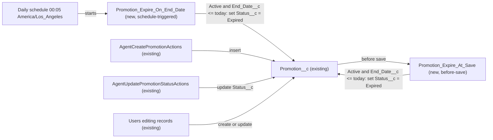

# Implementation spec — Promotion auto-expiry on end date

> Set `Promotion__c.Status__c` to `Expired` automatically when a promotion reaches its `End_Date__c`, so nobody has to expire promotions by hand.

_Based on the requirement, the evidence reported by AskCoworker, and read-only org queries where noted. Assumptions and missing evidence are identified below. Specification only — nothing is implemented or deployed._

---

## 1. The requirement

The original request, "Can the promo stuff be more automated?", was narrowed by the user to one outcome: promotions expire automatically on their end date, and nothing else (*user decision*). The request contained no instructions to deploy or change data.

| # | Responsibility | Trigger | Where it lives |
| --- | --- | --- | --- |
| 1 | Set `Status__c` to `Expired` on every `Active` promotion whose `End_Date__c` is today or earlier, as the calendar date passes | Daily schedule, 00:05 org time | `Promotion_Expire_On_End_Date` (new schedule-triggered flow) |
| 2 | Keep the rule true when a promotion is created or edited as `Active` with an `End_Date__c` of today or earlier | `Promotion__c` create and update | `Promotion_Expire_At_Save` (new before-save record-triggered flow) |

## 2. Grounding — reuse before building

Target org: `TestWriteSpecDE` (Developer Edition, `00Dak00001COqNeEAL`, time zone `America/Los_Angeles`). API version: `67.0` (`sourceApiVersion` in `sfdx-project.json`, *verified by project file*; org `apiVersion` 67.0, *verified by org query*).

- **`Promotion__c`** (CustomObject, `DurableId` `01Iak00000Dx4JZ`) — the only object in scope. Its seven custom fields are `Description__c`, `Discount_Percentage__c`, `End_Date__c`, `Promotion_Code__c`, `Start_Date__c`, `Status__c`, `Storefront__c` (Tooling `CustomField`, complete list). _verified by org query_
- **`Promotion__c.End_Date__c`** (Date, not required; description "The date when the promotion ends."). _verified by org query_
- **`Promotion__c.Status__c`** (Picklist, not required, no default, not restricted; values `Active`, `Expired`, `Canceled`). The `Expired` value already exists, so no picklist change is needed. _verified by org query_
- **Existing automation on `Promotion__c`: none.** 0 Apex triggers (Tooling `ApexTrigger`), 0 flows of any type (`FlowDefinitionView WHERE TriggerObjectOrEventId = 'Promotion__c'`), 0 validation rules (Tooling `ValidationRule`), 0 workflow rules (Tooling `WorkflowRule`), 0 approval processes (`ProcessDefinition`). No flow API name contains "Promo". The only schedule-triggered flow in the org is `Orch`, which has no trigger object. No scheduled Apex job relates to promotions (`CronTrigger`: 5 jobs, all platform jobs). _verified by org query_
- **Readers and writers of `Promotion__c`** (`MetadataComponentDependency` on the object and on `Status__c` and `End_Date__c`, plus a search of all 70 unmanaged Apex class bodies): _verified by org query_
  - `AgentCreatePromotionActions` (Apex, `with sharing`) — inserts promotions; sets `End_Date__c` and sets `Status__c` to the caller value or `'Draft'` when blank.
  - `AgentUpdatePromotionStatusActions` (Apex, `with sharing`) — sets `Status__c` to the caller-supplied value.
  - `MerchantRiskScoreAction` (Apex, `with sharing`) — reads `Start_Date__c` only; not affected.
  - `Storefront_Record_Page` (FlexiPage) — references `End_Date__c`; display only.
- **Data shape:** 1 `Promotion__c` record (`Status__c = 'Active'`); 0 `Active` records with `End_Date__c < TODAY`; 0 records with a blank `End_Date__c`. No backfill is needed at deployment. _verified by org query_
- **Automated Process user** exists (`autoproc@00dak00001coqneeal`); schedule-triggered flows run as this user. _verified by org query_ (user exists); running-user behavior is *assumption (documented platform behavior)*.

Candidates examined and rejected: `Gift_Certificate__c` (has its own `Expiration_Date__c` field; a different object, out of scope); `Storefront__c.Status__c` (no `Expired` value, not a promotion status, *reported by AskCoworker*, not needed by the design); a formula field for "is expired" (the user asked for `Status__c` to change); Apex batch or trigger (the behavior is fully declarative).

Evidence sources: `sf org display`; `sf sobject list --sobject custom`; `sf sobject describe --sobject Promotion__c`; Tooling queries on `EntityDefinition`, `CustomField` (including `Metadata` for `Status__c` and `End_Date__c`), `ApexTrigger`, `ValidationRule`, `WorkflowRule`, `MetadataComponentDependency`, `ApexClass` bodies, `GenAiFunctionDefinition`; standard queries on `FlowDefinitionView`, `ProcessDefinition`, `CronTrigger`, `Promotion__c` counts, `ObjectPermissions`, `DataStream`, `Organization`, `User`. AskCoworker returned no citedReferences.

## 3. Architecture

Why the pieces are drawn this way:

1. `Promotion__c` has no automation today (*verified by org query*), so both flows are new and nothing existing needs to change.
2. A date passing is not a record event, so only a scheduled mechanism can expire an untouched record. A schedule-triggered flow is the standard declarative tool for this (*assumption (documented platform behavior)*), and is preferred over scheduled Apex (design rules: standard mechanism, then flow, then code).
3. A daily run leaves a gap: a record saved as `Active` with an end date of today or earlier after the 00:05 run would stay `Active` for up to a day. The before-save flow closes that gap on create and update, so the rule stays true for records that start matching on update. It writes to `$Record` with no extra DML (*assumption (documented platform behavior)*).
4. The two existing Apex writers and manual edits are callers of the before-save flow; they are shown as existing and are not changed.

## 4. Metadata changes

**Automation**

- **Create `Promotion_Expire_On_End_Date`** — Flow, schedule-triggered (`AutoLaunchedFlow` with a Scheduled start), delivered Active. Label "Promotion - Expire On End Date". Schedule: daily, start 00:05 in the org time zone (`America/Los_Angeles`). Object `Promotion__c`; start filter `Status__c` Equals `Active`. Decision element "Is past end date": `{!$Record.End_Date__c}` Is Null = `false` AND `{!$Record.End_Date__c}` Less Than or Equal `{!$Flow.CurrentDate}`. Outcome true: Update Records on `$Record`, set `Status__c` = `Expired`; no other fields. Default outcome: end. Records with blank `End_Date__c`, and records with `Status__c` `Expired` or `Canceled`, are never changed.
- **Create `Promotion_Expire_At_Save`** — Flow, record-triggered, before save (Fast Field Updates), delivered Active. Label "Promotion - Expire At Save". Object `Promotion__c`; trigger: a record is created or updated. Entry condition formula: `ISPICKVAL({!$Record.Status__c}, "Active") && NOT(ISBLANK({!$Record.End_Date__c})) && {!$Record.End_Date__c} <= {!$Flow.CurrentDate}`; run "every time a record is updated and meets the condition requirements". Assignment element: `{!$Record.Status__c}` = `Expired`. No DML element.

**Tests**

- **Create `Promotion_Expire_At_Save_Past_End_Date`** — FlowTest for `Promotion_Expire_At_Save`. Initial record (create path): `Status__c = Active`, `End_Date__c = 2020-01-01`, `Name = Flow Test Promotion`. Assertion: `{!$Record.Status__c}` Equals `Expired`. Uses a fixed past date, so it needs no org-specific record IDs and stays valid on any run date.

## 5. Data 360 (Data Cloud) data involved

Not applicable — this change does not use Data 360. The org has 0 `DataStream` records (*verified by org query*). The managed permission set `sfdc_a360_sfcrm_data_extract` has Read on `Promotion__c` (*verified by org query*), so if a data stream is added later, it would see `Status__c = Expired` values the same as any other value.

## 6. Security considerations

- **Execution context.** `Promotion_Expire_On_End_Date` runs as the Automated Process user in system context without sharing, so it sees and updates every matching promotion regardless of owner (*assumption (documented platform behavior)*). `Promotion_Expire_At_Save` runs in the saving user's transaction in system context; it does not enforce the saving user's field-level security on `Status__c` (*assumption (documented platform behavior)*).
- **CRUD/FLS and permission sets.** No permission set or profile changes are needed; neither flow needs a user grant. Current object access on `Promotion__c` (complete list from `ObjectPermissions`, *verified by org query*): Read and Edit — `sfdc_accelerate_dms` (managed, `sfdcInternalInt`) and profile `X00ex00000018ozh_128_09_04_12_1`; Read only — `Pronto_Deep_Dive_Workshop`, `sfdc_a360_sfcrm_data_extract`, `sfdc_slack`, and profile `X00e1a000000N1wLAAS`. These are unchanged.
- **Behavior change for other callers.** A user or agent that saves a promotion as `Active` with an end date of today or earlier now gets `Expired` instead. This is the requirement's intent (*user decision*). The two agent actions still return success; the record status is `Expired`.
- **Data exposure.** No new fields, no new access, no external callouts. Last Modified By on expired records shows Automated Process for scheduled expiries.

## 7. Testing strategy

| # | Type | Component | Behavior |
| --- | --- | --- | --- |
| 1 | FlowTest | `Promotion_Expire_At_Save_Past_End_Date` | Creating an `Active` promotion with `End_Date__c = 2020-01-01` saves it as `Expired`. |

`Promotion_Expire_On_End_Date` has only a scheduled path, so it gets manual checks, not a test row. No Apex test class is added (no code in this change).

Recommended verification (manual, in a sandbox):

1. Create an `Active` promotion with `End_Date__c` = today and one with `End_Date__c` = tomorrow. Confirm the first saves as `Expired` (before-save flow) and the second stays `Active`.
2. Before-save negative cases: create `Active` with blank `End_Date__c` (stays `Active`); create `Canceled` with a past date (stays `Canceled`); update a `Canceled` promotion with a past date to `Active` (saves as `Expired`); update an `Active` promotion's `End_Date__c` to yesterday (saves as `Expired`).
3. Scheduled path: create an `Active` promotion with `End_Date__c` = tomorrow, a `Canceled` one with the same date, and an `Active` one with a blank `End_Date__c`. After the 00:05 run on the end date, confirm the first is `Expired` with Last Modified By Automated Process, and the other two are unchanged.
4. Bulk: insert 200 `Active` promotions with a past `End_Date__c` (for example with Data Loader); confirm all save as `Expired` with no errors.
5. Agent path: call the `Create_Promotion` agent action with a past end date; confirm success and `Status__c = Expired`.
6. Time zone boundary (load-bearing assumption A1): confirm `{!$Flow.CurrentDate}` at 00:05 `America/Los_Angeles` returns the expected calendar date, so a promotion ending today is expired on that date.

## 8. Open decisions

### Open

1. **"Draft" status from `AgentCreatePromotionActions` (non-blocking).** The class sets `Status__c` to `'Draft'` when no status is given, and `AgentUpdatePromotionStatusActions` describes "Draft, Active, Paused, Ended" as common values (*verified by org query*, class bodies). None of these except `Active` is in the value set; the picklist is unrestricted, so they save as off-list values (*verified by org query*). A `Draft` promotion is never expired by this design. Recommendation: a separate change to align the agent actions with the value set (proposal, not in this inventory).
2. **No reinstatement (non-blocking).** If `End_Date__c` is extended on an `Expired` promotion, the status stays `Expired`; a person sets it back to `Active`. The requirement does not ask for the reverse direction. Recommendation: accept.
3. **Deployment sequence (non-blocking).** Deploy `Promotion_Expire_At_Save`, then `Promotion_Expire_At_Save_Past_End_Date`, then `Promotion_Expire_On_End_Date`. No data step is needed: 0 overdue `Active` records today (*verified by org query*); re-run `SELECT COUNT() FROM Promotion__c WHERE Status__c = 'Active' AND End_Date__c < TODAY` just before deployment, since the first scheduled run expires any it finds.

### Resolved

- **Scope** — user decision: only automatic expiry on end date; other promotion automation is out of scope.
- **A1 (load-bearing) — "on end date" means `End_Date__c <= today`** — assumption, from the wording "expire on end date": a promotion is `Expired` on its end date. Verification case 6 in Section 7. Both flows depend on it.
- **Only `Active` promotions change** — assumption: `Canceled` and `Expired` are left alone, so a manual cancellation is never overwritten.
- **Blank `End_Date__c` never expires** — assumption; 0 such records today (*verified by org query*).
- **Run time 00:05 org time zone** — assumption (implementation decision); AskCoworker marked the run time as blocking, but it is an implementation choice with a safe, reversible default.
- **Before-save flow added** — assumption (design rule: records that start matching on create or update keep the rule true).
- **AskCoworker corrections.** (1) AskCoworker said validation rules are "not queryable via SOQL"; Tooling `ValidationRule` returned 0 rules on `Promotion__c` (*verified by org query*). (2) AskCoworker said `'Draft'` is "not a valid picklist value" and implied such records are invalid; the picklist is unrestricted, so `'Draft'` saves as an off-list value (*verified by org query*). After these two wrong claims, every AskCoworker fact kept in this spec was verified by org query. AskCoworker's "Proposal" claims about permission sets and sharing that the design does not need were dropped, except the `ObjectPermissions` list, which was verified.
- **AskCoworker R call** timed out once and was retried narrower (runtime and execution context only); permission sets, data exposure, and Data 360 were covered with org queries (`ObjectPermissions`, `DataStream`).

## 9. Change set

| # | Action | Type | API name | Module | Why |
| --- | --- | --- | --- | --- | --- |
| 1 | Create | Flow | `Promotion_Expire_On_End_Date` | force-app/main/default/flows | Expires `Active` promotions daily once `End_Date__c` is today or earlier (responsibility 1). |
| 2 | Create | Flow | `Promotion_Expire_At_Save` | force-app/main/default/flows | Expires `Active` promotions saved with `End_Date__c` today or earlier (responsibility 2). |
| 3 | Create | FlowTest | `Promotion_Expire_At_Save_Past_End_Date` | force-app/main/default/flowtests | Tests the main outcome of `Promotion_Expire_At_Save`. |

Two new flows on `Promotion__c` (one daily schedule, one before-save) set `Status__c` to `Expired` on the end date; nothing existing changes.

Total: 3 · Create: 3 · Update: 0 · Delete: 0
