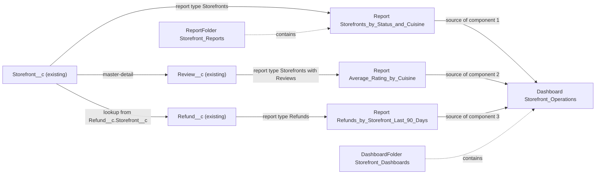

# Implementation spec — Storefront reporting dashboard

> Give the business one dashboard that shows storefronts by status and cuisine, average review rating by cuisine, and refunds by storefront over the last 90 days.

_Based on the requirement, the evidence reported by AskCoworker, and read-only org queries where noted. Assumptions and missing evidence are identified below. Specification only — nothing is implemented or deployed._

---

## 1. The requirement

The original request was "we need better reporting on storefronts". When asked what the reporting should show, the user clarified it as a dashboard with three views: storefronts by status and cuisine, average rating by cuisine, and refunds by storefront over the last 90 days (*user decision*). The request contained no out-of-scope instructions.

| # | Responsibility | Trigger | Where it lives |
| --- | --- | --- | --- |
| 1 | Show the count of storefronts by `Status__c` and `Cuisine__c` | User opens or refreshes the dashboard or report | `Storefront_Reports/Storefronts_by_Status_and_Cuisine`, dashboard `Storefront_Dashboards/Storefront_Operations` |
| 2 | Show the average review rating per cuisine | User opens or refreshes the dashboard or report | `Storefront_Reports/Average_Rating_by_Cuisine`, dashboard `Storefront_Dashboards/Storefront_Operations` |
| 3 | Show refunds (count and total amount) per storefront with an issue date in the last 90 days | User opens or refreshes the dashboard or report | `Storefront_Reports/Refunds_by_Storefront_Last_90_Days`, dashboard `Storefront_Dashboards/Storefront_Operations` |
| 4 | Let internal users find and open the reports and the dashboard | Not specified | `Storefront_Reports` and `Storefront_Dashboards` folders |

## 2. Grounding — reuse before building

Target org: `TestWriteSpecDE` (Developer Edition, `00Dak00001COqNeEAL`, not a sandbox). API version: `67.0`. _verified by org query_; `sourceApiVersion` `67.0` _verified by project file_ (`sfdx-project.json`).

- **`Storefront__c`** (CustomObject) — the subject of the dashboard; 21 records, all with `Status__c` = `Active`. _verified by org query_
- **`Storefront__c.Status__c`** (Picklist) — active values `Active`, `Inactive`, `Pending Activation`, `Suspended`, `Closed`. _verified by org query_
- **`Storefront__c.Cuisine__c`** (Picklist) — a large active value set (for example `American`, `Italian`, `Vegan`). The 21 records hold 11 distinct values; `Various` (11 records), `Fine Dining`, `Farm-to-Table`, `Marketplace`, and `Fusion` are stored values that are not in the active value set. No record has a blank cuisine. _verified by org query_
- **`Review__c`** (CustomObject) — child of `Storefront__c` through the master-detail field `Review__c.Storefront__c` (relationship `Reviews__r`, cascade delete). 92 records; none has a blank `Review__c.Rating__c` (Number). `Review__c.Status__c` is blank on all 92 records. _verified by org query_
- **`Refund__c`** (CustomObject) — linked to `Storefront__c` through the lookup `Refund__c.Storefront__c` (relationship `Refunds__r`). Relevant fields: `Refund__c.Issue_Date__c` (Date), `Refund__c.Amount__c` (Currency), `Refund__c.Status__c` (Picklist: `Pending`, `Approved`, `Processing`, `Completed`, `Failed`, `Cancelled`). The org has 0 `Refund__c` records. _verified by org query_
- **`Storefront__c.Average_Review_Score__c`** (Formula, Number) — `Total_Score__c / Total_Reviews__c`. 2 storefronts have `Total_Reviews__c` = 0, so the formula has no value for them. _verified by org query_
- **Sharing** — internal organization-wide defaults: `Storefront__c` ReadWrite, `Refund__c` ReadWrite, `Review__c` ControlledByParent. _verified by org query_
- **Object and field access (complete for unmanaged permission sets and profiles)** — Read on all three objects: permission sets `Agentforce_Reference_App` and `Pronto_Deep_Dive_Workshop`, and the `System Administrator` and `Analytics Cloud Integration User` profiles. Read on the six report fields (`Storefront__c.Status__c`, `Storefront__c.Cuisine__c`, `Review__c.Rating__c`, `Refund__c.Issue_Date__c`, `Refund__c.Amount__c`, `Refund__c.Storefront__c`): only `Agentforce_Reference_App` and `Pronto_Deep_Dive_Workshop`, each with 1 active assignment. The org has 4 active standard users. _verified by org query_
- **Group `AllInternalUsers`** (Group, type `Organization`) — exists and is the sharing target for the new folders. _verified by org query_
- **Existing dashboards** — 8 visible dashboards; 2 have `Type` = `LoggedInUser`, 6 have `SpecifiedUser`. _verified by org query_
- **No automation** — no Apex triggers and no record-triggered flows on `Storefront__c`, `Refund__c`, or `Review__c`. Reports do not depend on automation. _verified by org query_

Candidates examined and rejected:
- `Storefront__c.Average_Review_Score__c` as the rating measure — averaging it per cuisine gives an unweighted average of storefront averages, and it has no value for the 2 storefronts with no reviews. The design averages `Review__c.Rating__c` instead.
- Existing reports, dashboards, and folders — no `Report` with `Storefront`, `Refund`, `Review`, `Cuisine`, or `Rating` in its name; no `Dashboard` title with `Store`, `Refund`, or `Review`; no report or dashboard `Folder` with `Store`, `Operation`, `Refund`, or `Review` in its name. All existing ones belong to Own Secure, Enablement, PRM, and Einstein Bot packages. _verified by org query_
- Existing `Storefront` permission set for reporting — none exists (`PermissionSet` name `LIKE '%Storefront%'` returned 0 rows). _verified by org query_

Evidence sources: `sf org display`; `sf sobject list --sobject custom`; `sobject describe` of `Storefront__c`, `Review__c`, `Refund__c`; SOQL on `Report`, `Dashboard`, `Folder`, `Group`, `EntityDefinition`, `ObjectPermissions`, `FieldPermissions`, `PermissionSetAssignment`, `User`, `Organization`, `FlowDefinitionView`, `DataStream`, Tooling `ApexTrigger`, and record counts on the three objects. AskCoworker returned no citedReferences; its object mapping and report-type proposals are *reported by AskCoworker* and were checked against the queries above.

## 3. Architecture

Why the pieces are drawn this way:

1. `Storefront__c`, `Review__c`, and `Refund__c` and their relationships are existing (*verified by org query*). No data model change is needed: every field the three views use already exists.
2. Each view uses the standard report type that Salesforce creates for a reportable custom object: `CustomEntity$Storefront__c` for storefronts, `CustomEntityCustomEntity$Storefront__c$Review__c` (Storefronts with Reviews) for the master-detail child, and `CustomEntity$Refund__c` for refunds, which includes the fields of its lookup parent `Storefront__c` (*assumption (documented platform behavior)*; depends on Allow Reports, see Section 8). No custom report type is needed.
3. The rating view averages `Review__c.Rating__c` so each review counts once (a review-weighted average per cuisine), rather than averaging `Storefront__c.Average_Review_Score__c` (*assumption*).
4. Reports and dashboards are the standard mechanism for this requirement; no flow or Apex is involved.

## 4. Metadata changes

**Access**

- **Create `Storefront_Reports`** — ReportFolder, label "Storefront Reports". Folder share: `AllInternalUsers` (sharedToType `Organization`) with access level View. Holds rows 3 to 5.
- **Create `Storefront_Dashboards`** — DashboardFolder, label "Storefront Dashboards". Folder share: `AllInternalUsers` (sharedToType `Organization`) with access level View. Holds row 6.

**Reports**

- **Create `Storefront_Reports/Storefronts_by_Status_and_Cuisine`** — Report, label "Storefronts by Status and Cuisine". Report type `CustomEntity$Storefront__c`. Summary format, grouped by `Storefront__c.Status__c`, then by `Storefront__c.Cuisine__c`. Detail columns: storefront name, `Storefront__c.Status__c`, `Storefront__c.Cuisine__c`. Measure: record count. No filters (all storefronts). Stored cuisine values that are not in the active value set (for example `Various`) appear as their own groups.
- **Create `Storefront_Reports/Average_Rating_by_Cuisine`** — Report, label "Average Rating by Cuisine". Report type `CustomEntityCustomEntity$Storefront__c$Review__c` (Storefronts with Reviews). Summary format, grouped by `Storefront__c.Cuisine__c`. Aggregates: average of `Review__c.Rating__c` (1 decimal place) and record count (number of reviews). No filters (all reviews). Storefronts with no reviews do not contribute to any group.
- **Create `Storefront_Reports/Refunds_by_Storefront_Last_90_Days`** — Report, label "Refunds by Storefront (Last 90 Days)". Report type `CustomEntity$Refund__c`. Summary format, grouped by the storefront name through `Refund__c.Storefront__c`. Detail columns: refund name, `Refund__c.Issue_Date__c`, `Refund__c.Status__c`, `Refund__c.Amount__c`. Aggregates: sum of `Refund__c.Amount__c` and record count. Filter: `Refund__c.Issue_Date__c` equals `LAST_N_DAYS:90` (today and the previous 90 days). No status filter. Refunds with a blank `Refund__c.Storefront__c` appear in a "-" group.

**Dashboard**

- **Create `Storefront_Dashboards/Storefront_Operations`** — Dashboard, title "Storefront Operations", `dashboardType` `LoggedInUser` (each viewer sees data under their own record and field access). Three components: (1) stacked bar chart from `Storefront_Reports/Storefronts_by_Status_and_Cuisine`, x-axis `Storefront__c.Status__c`, stacked by `Storefront__c.Cuisine__c`, value record count; (2) horizontal bar chart from `Storefront_Reports/Average_Rating_by_Cuisine`, one bar per `Storefront__c.Cuisine__c`, value average `Review__c.Rating__c`, sorted descending; (3) bar chart from `Storefront_Reports/Refunds_by_Storefront_Last_90_Days`, one bar per storefront, value sum of `Refund__c.Amount__c`, with the refund count shown in the table or tooltip.

## 5. Data 360 (Data Cloud) data involved

Not applicable — this change does not use Data 360. The org has 0 `DataStream` records (*verified by org query*), and reports and dashboards read the CRM objects directly.

## 6. Security considerations

- **Execution context.** Reports run as the user who opens them. The dashboard is `LoggedInUser`, so each component runs its source report as the viewer and applies the viewer's sharing, object permissions, and field-level security (*assumption (documented platform behavior)*).
- **Record access.** Internal organization-wide defaults are ReadWrite for `Storefront__c` and `Refund__c` and ControlledByParent for `Review__c` (*verified by org query*). A viewer who has object Read therefore sees all records; the reports add no new record exposure. Organization-wide defaults do not grant object permissions; object Read still comes from a permission set or profile (*assumption (documented platform behavior)*).
- **Who sees data.** The users who can see data in all three views are those assigned `Agentforce_Reference_App` or `Pronto_Deep_Dive_Workshop`; these are the only unmanaged permission sets or profiles with Read on the six report fields (*verified by org query*). The `System Administrator` profile has object Read but no field Read on those fields (*verified by org query*), so an administrator without one of these permission sets cannot use the fields in the reports. Field access does not come from View All Data (*assumption (documented platform behavior)*).
- **Folder access.** Both folders are shared with `AllInternalUsers` at View level. Any internal user can open the reports and dashboard; users without field access cannot see or group by the restricted fields.
- **Permission sets.** No permission set or profile changes. No existing permission set is widened. A dedicated read-only permission set for other viewers is a proposal in Section 8.
- **Data exposure.** `Refund__c.Amount__c` is financial data. It is shown only to viewers who already have field Read on it. No personal contact data (`Refund__c.Contact__c`, `Review__c.Customer__c`) is included.

## 7. Testing strategy

All changes are declarative reports, folders, and a dashboard, so there are no Apex tests or Flow Tests. Recommended verification, to run in a sandbox or scratch org after deployment:

1. **Prerequisite check (load-bearing).** In Setup, confirm Allow Reports is enabled on `Storefront__c`, `Review__c`, and `Refund__c`, and that the report types Storefronts, Storefronts with Reviews, and Refunds appear in the new report wizard. Rows 3 to 6 depend on this.
2. **Status and cuisine.** As a user with `Agentforce_Reference_App`, run `Storefront_Reports/Storefronts_by_Status_and_Cuisine`. Expect 21 records under `Active`, with `Various` = 11 and 10 other cuisines at 1 each (matches the current data).
3. **Average rating.** Run `Storefront_Reports/Average_Rating_by_Cuisine`. Expect 92 reviews in total. For one cuisine, compare the report average with a SOQL `AVG(Rating__c)` for reviews whose storefront has that cuisine; they must match.
4. **Refund 90-day boundary.** With test `Refund__c` records linked to a storefront, set `Refund__c.Issue_Date__c` to today, to today minus 90 days, and to today minus 91 days. Expect the first two in `Storefront_Reports/Refunds_by_Storefront_Last_90_Days` and the third excluded. Add one refund with a blank `Refund__c.Storefront__c` and expect it in the "-" group. Delete the test records afterwards.
5. **Empty state.** Before any test refunds exist, open the dashboard and confirm component 3 shows no data without an error.
6. **Permission case.** Open the dashboard as a user without `Agentforce_Reference_App` or `Pronto_Deep_Dive_Workshop`. Expect access to the folder and dashboard, but no data in the restricted fields.
7. **Dashboard type limit.** Confirm the dashboard saves with `LoggedInUser`. Developer Edition allows a limited number of dynamic dashboards (see Section 8).

## 8. Open decisions

### Open

1. **Allow Reports on the three objects (blocking for delivery).** The Allow Reports setting of `Storefront__c`, `Review__c`, and `Refund__c` cannot be read with the allowed commands. Rows `Storefront_Reports/Storefronts_by_Status_and_Cuisine`, `Storefront_Reports/Average_Rating_by_Cuisine`, `Storefront_Reports/Refunds_by_Storefront_Last_90_Days`, and `Storefront_Dashboards/Storefront_Operations` depend on the standard report types that exist only when it is enabled. Recommended default: verify in Setup before deployment (Section 7, step 1); if it is off, enable Allow Reports on the object (an update to that object) before deploying the reports.
2. **Dynamic dashboard limit (non-blocking).** 2 visible dashboards already use `LoggedInUser` (*verified by org query*). Developer Edition allows 3 dynamic dashboards (*assumption (documented platform behavior)*), so `Storefront_Dashboards/Storefront_Operations` would use the last one. Hidden-folder dashboards may not be visible to the query. Recommended default: keep `LoggedInUser`; if the deploy fails on the limit, switch to `SpecifiedUser` with a running user who holds `Agentforce_Reference_App`. That fallback shows the running user's data to all viewers.
3. **Viewer access beyond the current permission sets (non-blocking).** Only holders of `Agentforce_Reference_App` or `Pronto_Deep_Dive_Workshop` see data in all three views. The requirement names no audience. Proposal: if other users need the dashboard, create a dedicated read-only permission set with Read on the three objects and the six report fields, and assign it to them. It is not in the inventory.
4. **Refund status filter (non-blocking).** The refund view counts refunds in all statuses, including `Failed` and `Cancelled`. Recommended default: keep all statuses and show `Refund__c.Status__c` as a column; add a status filter later if the business wants only completed refunds.
5. **No refund data yet (non-blocking).** The org has 0 `Refund__c` records, so component 3 is empty until refunds exist. Loading data is not part of this spec.
6. **Off-list cuisine values (non-blocking).** 15 of 21 storefronts hold cuisine values that are not in the active `Storefront__c.Cuisine__c` value set (`Various`, `Fine Dining`, `Farm-to-Table`, `Marketplace`, `Fusion`). The reports group by stored values, so these appear as they are. Cleaning or mapping them is a separate data step, not part of this spec.

### Resolved

- **Scope (user decision).** The vague request was clarified by the user as the three dashboard views in Section 1.
- **Rating measure (assumption).** Average of `Review__c.Rating__c` per `Storefront__c.Cuisine__c`, not an average of `Storefront__c.Average_Review_Score__c`, because the formula is blank for 2 storefronts with no reviews (*verified by org query*) and would weight every storefront equally.
- **90-day date field (assumption).** `Refund__c.Issue_Date__c`, the business date of the refund, rather than `CreatedDate`.
- **Folder sharing and names (assumption).** New folders `Storefront_Reports` and `Storefront_Dashboards` shared at View with `AllInternalUsers`; AskCoworker proposed `Pronto_`-prefixed names, which were not kept.
- **AskCoworker corrections.** (a) It said `Storefront__c.Cuisine__c` values could not be enumerated; `describe` returned the full active value set. (b) It said the organization-wide defaults give all internal users object Read; object Read comes only from permission sets and profiles, and the query shows which ones grant it. (c) It said group `AllInternalUsers` does not exist; the `Group` query found it (type `Organization`). (d) It proposed module "Storefront Reporting" and the filter `LAST_90_DAYS`; the spec uses `force-app` paths and `LAST_N_DAYS:90`. (e) It said Data 360 is involved because a managed data-extract permission set has Read; no change here uses Data 360. After more than two wrong AskCoworker claims, every AskCoworker fact kept in this spec was verified by org query or is tagged as documented platform behavior. Its other proposals (a custom report type, a separate zero-review report) were dropped.
- **Deployment sequence.** Deploy the folders (rows 1 and 2), then the three reports, then the dashboard.

## 9. Change set

| # | Action | Type | API name | Module | Why |
| --- | --- | --- | --- | --- | --- |
| 1 | Create | ReportFolder | `Storefront_Reports` | force-app/main/default/reports | Shared folder for the three storefront reports |
| 2 | Create | DashboardFolder | `Storefront_Dashboards` | force-app/main/default/dashboards | Shared folder for the storefront dashboard |
| 3 | Create | Report | `Storefront_Reports/Storefronts_by_Status_and_Cuisine` | force-app/main/default/reports/Storefront_Reports | Storefronts by status and cuisine |
| 4 | Create | Report | `Storefront_Reports/Average_Rating_by_Cuisine` | force-app/main/default/reports/Storefront_Reports | Review-weighted average rating by cuisine |
| 5 | Create | Report | `Storefront_Reports/Refunds_by_Storefront_Last_90_Days` | force-app/main/default/reports/Storefront_Reports | Refund count and amount per storefront, last 90 days |
| 6 | Create | Dashboard | `Storefront_Dashboards/Storefront_Operations` | force-app/main/default/dashboards/Storefront_Dashboards | One dashboard with the three views |

Three new reports on the standard report types of the existing objects feed one new dynamic dashboard, stored in two new folders shared with all internal users.

Total: 6 · Create: 6 · Update: 0 · Delete: 0
