# Implementation spec — Win-back segment: no order in 60 days and more than 1000 loyalty points

> Give Contacts a loyalty points balance and a last order date, then build a Data 360 segment of lapsed high-balance customers and activate it to Marketing Cloud Engagement for a win-back campaign.

_Based on the requirement, the evidence reported by AskCoworker, and read-only org queries where noted. Assumptions and missing evidence are identified below. Specification only — nothing is implemented or deployed._

---

## 1. The requirement

Segment customers (Contacts) whose last order is more than 60 days old and whose net loyalty points balance is more than 1000, and make the segment available to a win-back campaign. The user decided that the segment is activated to Marketing Cloud. The requirement contained no deploy or data-change instruction.

| # | Responsibility | Trigger | Where it lives |
| --- | --- | --- | --- |
| 1 | Hold each customer's net loyalty points balance | Insert, update, delete, or undelete of a `Loyalty_Transaction__c` record | `Contact.Loyalty_Points_Earned__c`, `Contact.Loyalty_Points_Redeemed__c`, `Contact.Loyalty_Points_Balance__c` |
| 2 | Hold each customer's last order date | Pronto app integration write-back after an order | `Contact.Last_Order_Date__c` (populated outside Salesforce; see Section 8) |
| 3 | Bring the Contact data into Data 360 | Data stream refresh schedule | `Contact_CRM_Stream`, `Contact_to_Individual`, `Contact_to_ContactPointEmail`, `ssot__Individual__dlm` |
| 4 | Select Contacts with last order more than 60 days ago and balance more than 1000 | Segment publish schedule | `Win_Back_60_Days_1000_Points` |
| 5 | Deliver the segment to Marketing Cloud for the win-back campaign | Activation after each segment publish | `Marketing_Cloud_Engagement`, `Win_Back_60_Days_1000_Points_MCE` |
| 6 | Let marketers and the Data 360 connector read the new fields | Permission set assignment | `Win_Back_Segmentation` |

## 2. Grounding — reuse before building

Target org: `TestWriteSpecDE` (Developer Edition, not a sandbox, Org ID `00Dak00001COqNeEAL`). API version: `67.0`.

- **`Contact`** (standard object) — the customer. 198 records, all with `Email` and `Pronto_App_Account_Id__c` populated. _verified by org query_
- **`Loyalty_Transaction__c`** (custom object) — loyalty point events. `Contact__c` is MasterDetail(`Contact`), relationship name `Loyalty_Transactions`, not reparentable. `Points__c` is Number. `Transaction_Type__c` picklist: `Earn`, `Redeem`. `Transaction_Source__c` picklist: `Order`, `Promotion`, `Manual Adjustment`. 0 records exist, so the sign used for Redeem points cannot be observed. _verified by org query_
- **No existing points balance or last order date field.** The complete Tooling `CustomField` list for `Contact` has 9 fields (`Contact_Status`, `Favorite_Cuisine`, `Member_Number`, `Languages`, `Level`, `Pronto_App_Account_Id`, `Lifetime_Orders`, `Lifetime_Value`, `Loyalty_Tier`); an org-wide search for Point, Order, Balance, and Loyal field names found no balance or last-order field on a customer object. _verified by org query_
- **`Contact.Lifetime_Orders__c`, `Contact.Lifetime_Value__c`** (CustomField) — described as app-side aggregations from the Pronto app; null on all 198 Contacts. This is the existing pattern for order data on `Contact`. _verified by org query_
- **`Contact.Pronto_App_Account_Id__c`** (CustomField) — described as the external identifier used to join app-side order data to Contact. _verified by org query_
- **`OrderPickerController`** (ApexClass, `with sharing`) — its comment states that orders live in the external Heroku Orders API, not in Salesforce `Order`, and its body returns sample orders. Standard `Order` has 0 records. `Review__c.Order_Date__c` exists but only on reviews (92 records), so it is not an order history. _verified by org query_
- **`Pronto_Orders_API`** (NamedCredential) — exists; no Apex class references it by name. _verified by org query_
- **Automation on the objects involved** — no Apex triggers on `Contact`, `Account`, `Loyalty_Transaction__c`, `Order`, `Campaign`, or `CampaignMember`; no record-triggered flows on `Contact`, `Loyalty_Transaction__c`, `Campaign`, or `CampaignMember` (one inactive flow `Create_OS` on `Order`); no validation rules on `Contact` or `Loyalty_Transaction__c`; `MetadataComponentDependency` returns no references to `Loyalty_Transaction__c`; no unmanaged Apex class body references `Loyalty_Transaction__c` or `Points__c`. _verified by org query_
- **Data 360** — 1 `DataSpace`, 0 `DataStream`, 0 `MarketSegment`, 0 `ActivationTarget` records. The `Salesforce Standard Data Model` package (`ssot`) is installed; the Marketing Cloud Connect package is not. _verified by org query_
- **`sfdc_a360_sfcrm_data_extract`** (PermissionSet) — namespace `sfdcInternalInt`, so it cannot be edited; assigned to 1 user (the Data 360 CRM connector user); has Read on `Loyalty_Transaction__c.Points__c`. _verified by org query_. It has Read on `Contact`. _reported by AskCoworker_
- **Name checks** — no permission set, report, or field with the names used in Section 9 exists. _verified by org query_

Evidence sources: `sf sobject describe` of `Contact`, `Loyalty_Transaction__c`, `Review__c`, `Account`; Tooling `EntityDefinition`, `CustomField` (including `Contact__c` metadata), `ApexTrigger`, `ApexClass` bodies, `ValidationRule`, `MetadataComponentDependency`, `NamedCredential`, `InstalledSubscriberPackage`; standard `FlowDefinitionView`, `PermissionSet`, `PermissionSetAssignment`, `FieldPermissions`, `ObjectPermissions`, `Campaign`, `Report`, `Organization`, and record counts. AskCoworker returned no citedReferences.

## 3. Architecture

```mermaid
flowchart LR
  app["Pronto app integration (existing, external)"] -->|"writes last order date"| lod["Contact.Last_Order_Date__c"]
  lt["Loyalty_Transaction__c (existing)"] -->|"roll-up SUM Earn"| earn["Contact.Loyalty_Points_Earned__c"]
  lt -->|"roll-up SUM Redeem"| red["Contact.Loyalty_Points_Redeemed__c"]
  earn -->|"formula"| bal["Contact.Loyalty_Points_Balance__c"]
  red -->|"formula"| bal
  bal -->|"ingested by"| ds["Contact_CRM_Stream"]
  lod -->|"ingested by"| ds
  ds -->|"mapped by"| m1["Contact_to_Individual"]
  ds -->|"mapped by"| m2["Contact_to_ContactPointEmail"]
  m1 -->|"populates"| ind["ssot__Individual__dlm"]
  ind -->|"filtered by"| seg["Win_Back_60_Days_1000_Points"]
  seg -->|"activated by"| act["Win_Back_60_Days_1000_Points_MCE"]
  act -->|"sends to"| tgt["Marketing_Cloud_Engagement"]
```

Why the pieces are drawn this way:

1. `Loyalty_Transaction__c` is the master-detail child of `Contact`, so roll-up summary fields on `Contact` can total its points without code. _verified by org query_ (relationship); roll-up availability on a master-detail parent is _assumption (documented platform behavior)_.
2. Two filtered roll-ups and a formula replace one SUM because the sign of Redeem points is unknown with 0 records. `Earned - ABS(Redeemed)` gives the net balance whether Redeem points are stored as positive or as negative numbers, as long as one convention is used. _assumption_
3. Orders are not in Salesforce. `Contact.Last_Order_Date__c` follows the existing pattern of app-side aggregations written to `Contact` (`Lifetime_Orders__c`, `Lifetime_Value__c`), keyed by `Pronto_App_Account_Id__c`. _verified by org query_ (pattern); the write-back itself is outside this org and is an _assumption_.
4. The 60-day comparison is done in the segment, not in a CRM formula, so it is evaluated at each segment publish and does not depend on the Contact record changing. _assumption_
5. The Data 360 path (data stream, mappings to the standard Individual and Contact Point Email objects, segment, activation) is the platform path to activate a segment to Marketing Cloud Engagement; Data 360 is provisioned in this org. _verified by org query_ (provisioning); the path is _assumption (documented platform behavior)_.
6. No Apex is used; every component is declarative.

## 4. Metadata changes

**Data model**

- **Create `Contact.Loyalty_Points_Earned__c`** — Roll-Up Summary, label "Loyalty Points Earned". SUM of `Loyalty_Transaction__c.Points__c`, filter criteria: `Transaction_Type__c` equals `Earn`. Recalculated by the platform on insert, update, delete, and undelete of child records.
- **Create `Contact.Loyalty_Points_Redeemed__c`** — Roll-Up Summary, label "Loyalty Points Redeemed". SUM of `Loyalty_Transaction__c.Points__c`, filter criteria: `Transaction_Type__c` equals `Redeem`.
- **Create `Contact.Loyalty_Points_Balance__c`** — Formula (Number, 0 decimal places), label "Loyalty Points Balance". Formula: `BLANKVALUE(Loyalty_Points_Earned__c, 0) - ABS(BLANKVALUE(Loyalty_Points_Redeemed__c, 0))`. Blank fields treated as zero.
- **Create `Contact.Last_Order_Date__c`** — Date, label "Last Order Date", not required, help text "Date of the customer's most recent order, written by the Pronto app integration." Null means no order has been recorded; such Contacts are excluded from the segment.

**Security**

- **Create `Win_Back_Segmentation`** — PermissionSet, label "Win-Back Segmentation". Read on `Contact`; Read (no Edit) on `Contact.Loyalty_Points_Earned__c`, `Contact.Loyalty_Points_Redeemed__c`, `Contact.Loyalty_Points_Balance__c`, `Contact.Last_Order_Date__c`. To be assigned to the marketers who run the campaign and to the Data 360 CRM connector user (Section 8).

**Data 360**

- **Create `Contact_CRM_Stream`** — DataStream from the Salesforce CRM connector on `Contact` in the default data space. Fields: `Id`, `FirstName`, `LastName`, `Email`, `Pronto_App_Account_Id__c`, `Loyalty_Points_Balance__c`, `Last_Order_Date__c`. Refresh: daily full refresh by default (Section 8, item on formula change detection).
- **Create `Contact_to_Individual`** — ObjectSourceTargetMap from the `Contact` data lake object to `ssot__Individual__dlm`: `Id` to Individual Id, `FirstName`, `LastName`, and the two custom attributes added by the next change.
- **Create `Contact_to_ContactPointEmail`** — ObjectSourceTargetMap from the `Contact` data lake object to the Contact Point Email data model object: `Email` to email address, `Id` to party (Individual) Id. Required for email activation.
- **Update `ssot__Individual__dlm`** — add two custom attributes: `Loyalty_Points_Balance` (Number) and `Last_Order_Date` (Date), mapped from the stream.
- **Create `Win_Back_60_Days_1000_Points`** — MarketSegment on Individual. Filter: `Last_Order_Date` is not null AND `Last_Order_Date` is on or before 60 days ago (relative date) AND `Loyalty_Points_Balance` greater than 1000. Publish schedule: daily.
- **Create `Marketing_Cloud_Engagement`** — ActivationTarget. Conditional: a Marketing Cloud Engagement account must be connected to Data 360 in this org; this cannot be confirmed with read-only queries.
- **Create `Win_Back_60_Days_1000_Points_MCE`** — MarketSegmentActivation of `Win_Back_60_Days_1000_Points` to `Marketing_Cloud_Engagement`, with Contact Point Email as the contact point and `FirstName`, `LastName`, `Last_Order_Date`, `Loyalty_Points_Balance` as activated attributes. Conditional: depends on `Marketing_Cloud_Engagement`.

## 5. Data 360 (Data Cloud) data involved

Data 360 is involved. `Contact_CRM_Stream` ingests `Contact` (including `Email`, names, and the two new values) into the default data space. `Contact_to_Individual` and `Contact_to_ContactPointEmail` map it to the standard Individual and Contact Point Email objects from the installed `ssot` package. `Win_Back_60_Days_1000_Points` filters Individuals, and `Win_Back_60_Days_1000_Points_MCE` sends members with their email address to Marketing Cloud Engagement. Data 360 is provisioned (1 `DataSpace`) with no existing streams, segments, or activation targets. _verified by org query_. Data 360 definitions cannot be read with the allowed commands, so the metadata type names and deployability of these components are _assumption_.

## 6. Security considerations

- **Execution context.** Roll-up and formula calculation run in system context and ignore sharing and FLS. Segment evaluation and activation run inside Data 360 and do not apply Salesforce record sharing. _assumption (documented platform behavior)_
- **CRUD/FLS.** `Win_Back_Segmentation` grants Read only. Users without it (or another grant) do not see the four new fields. Permission sets are not the only grant path: profiles can also grant FLS; no profile change is proposed.
- **Data 360 connector.** The CRM connector user holds `sfdc_a360_sfcrm_data_extract`, which is namespaced and cannot be edited (_verified by org query_). New fields are ingested only if that user has Read FLS on them, so it must also be assigned `Win_Back_Segmentation` (Section 8).
- **Integration write-back.** The Pronto app integration user needs Edit on `Contact.Last_Order_Date__c`. That user was not identified, and no grant is included (Section 8).
- **Data exposure.** Email addresses, names, last order date, and points balance leave Salesforce for Marketing Cloud Engagement. The new fields hold behavioral data, not new categories of personal data. Consent and data-processing coverage for this transfer is an open item (Section 8).

## 7. Testing strategy

No Apex is in the inventory, so no Apex test class is planned. All cases below are recommended verification in a sandbox after deployment; none has been run.

- **Balance roll-up:** insert an `Earn` transaction of 1500 for a Contact; `Contact.Loyalty_Points_Balance__c` is 1500. Insert a `Redeem` transaction of 600 (then repeat with -600 on another Contact); the balance is 900 in both cases.
- **Update transitions:** change a transaction from `Earn` to `Redeem` and change `Points__c`; both roll-ups and the balance recalculate. Delete and undelete a transaction; the balance goes down and back up.
- **Bulk:** insert 200 transactions across 200 Contacts, and 200 for one Contact; totals are correct.
- **Boundaries:** balance 1000 is excluded, 1001 is included. Last order date 60 days ago is included, 59 days ago is excluded. Null `Last_Order_Date__c` is excluded. A Contact with no transactions has balance 0 and is excluded.
- **Start and stop matching:** a Contact whose last order date ages past 60 days enters the segment at the next publish with no record change. A Contact whose `Last_Order_Date__c` is updated to today, or whose balance drops to 1000 or below after a redemption, leaves the segment at the next stream refresh and publish.
- **Permissions:** a user without `Win_Back_Segmentation` cannot see the four fields; a user with it can read but not edit them. Before and after assigning the permission set to the connector user, confirm the stream ingests `Loyalty_Points_Balance__c` and `Last_Order_Date__c`.
- **Segment count:** compare the published segment count with `SELECT COUNT() FROM Contact WHERE Loyalty_Points_Balance__c > 1000 AND Last_Order_Date__c <= {date 60 days before today}` using a literal date.
- **Activation:** after publish, the Marketing Cloud Engagement audience count matches the segment count.

## 8. Open decisions

### Open

1. **Last order date population (blocking for delivery).** No Salesforce data holds order dates; `Contact.Last_Order_Date__c` is empty until the Pronto app integration writes it for each Contact by `Pronto_App_Account_Id__c`. Until then the segment has 0 members. Recommended: the Pronto app team adds this field to the same write-back that is meant to populate `Lifetime_Orders__c`, plus a one-time backfill of historical last order dates. The backfill is a data step without which responsibility 4 fails.
2. **Pronto integration user access (blocking for delivery).** The integration user needs Edit on `Contact.Last_Order_Date__c`. The user and its current grants are not identified, and a grant to an integration was not asked for. Recommended: a separate permission set with Edit on that one field, assigned to that user only.
3. **Data 360 connector user access (blocking for delivery).** `sfdc_a360_sfcrm_data_extract` cannot be edited. Recommended default: assign `Win_Back_Segmentation` to the connector user (1 current assignee of `sfdc_a360_sfcrm_data_extract`). This grant to an integration user needs approval.
4. **Marketing Cloud Engagement connection (blocking).** `Marketing_Cloud_Engagement` and `Win_Back_60_Days_1000_Points_MCE` are Conditional: a Marketing Cloud Engagement account must be connected to Data 360. No read-only query can confirm this. Everything else can be deployed first.
5. **Formula change detection in the stream (non-blocking).** Roll-up and formula values change when child records change. Whether the CRM connector's incremental sync detects those changes is not verified. Recommended default: a daily full refresh of `Contact_CRM_Stream`, then verify.
6. **Redeem sign convention (non-blocking).** 0 transactions exist. The formula uses `ABS` on redeemed points, which is correct if all Redeem records use the same sign. Mixed signs would produce a wrong balance; recommend a validation rule later if this is seen.
7. **Consent and data transfer (non-blocking for build, blocking for go-live).** Email addresses are sent to Marketing Cloud Engagement. Confirm consent and data-processing coverage before activating.
8. **Data 360 metadata names and deployment sequence (non-blocking).** Type names and API names for the Data 360 components are assumptions. Sequence: fields 1-4 and `Win_Back_Segmentation`; permission set assignments; `Contact_CRM_Stream`; `ssot__Individual__dlm` attributes and both mappings; `Win_Back_60_Days_1000_Points`; then (after item 4) `Marketing_Cloud_Engagement` and `Win_Back_60_Days_1000_Points_MCE`.
9. **Page layout placement (non-blocking).** No layout change is proposed; the segment is built and used in Data 360, and the fields are readable through reports and field access. Adding them to a Contact layout would change a shared layout for all its users.

### Resolved

- **Delivery channel — user decision.** The segment is activated to Marketing Cloud. A Salesforce Campaign and report were rejected for this reason.
- **Last order date source — assumption.** The user had no preference. Chosen: a new `Contact` date field written by the Pronto app, because orders live in the external Pronto Orders API (`OrderPickerController` comment), `Order` has 0 records, and `Contact` already holds app-side order aggregates. Rejected: a roll-up of `Loyalty_Transaction__c` records with source `Order` (not every order earns points, and there are 0 transactions), `Review__c.Order_Date__c` (reviews only), and a scheduled Apex callout to `Pronto_Orders_API` (code, and the integration pattern already exists).
- **"More than 1000 loyalty points" — assumption.** Interpreted as the net balance after redemptions, strictly greater than 1000.
- **"Haven't ordered in 60 days" — assumption.** Last order date on or before 60 days before today; Contacts with no recorded order are excluded because a win-back targets former buyers.
- **Correction to AskCoworker.** AskCoworker said the activation needs the Marketing Cloud Connect package. Data 360 activation to Marketing Cloud Engagement uses the Marketing Cloud Engagement connection configured in Data 360, not that package. _assumption (documented platform behavior)_
- **Correction to AskCoworker.** Roll-up filters were given as `ISPICKVAL` formulas; roll-up filter criteria are field-equals-value conditions, as written in Section 4. A sign-dependent Conditional formula was replaced by the sign-independent `ABS` formula.
- **Correction to AskCoworker.** The proposed custom data model object for the segment was replaced by the standard Individual object, which Data 360 segments and email activation use.
- **Dropped AskCoworker proposals.** Campaign and CampaignMember automation, an Apex batch for the balance, a Data 360 calculated insight, and a flow callout were not added.

## 9. Change set

| # | Action | Type | API name | Module | Why |
| --- | --- | --- | --- | --- | --- |
| 1 | Create | CustomField | `Contact.Loyalty_Points_Earned__c` | force-app/main/default/objects/Contact/fields | Total earned points for the balance |
| 2 | Create | CustomField | `Contact.Loyalty_Points_Redeemed__c` | force-app/main/default/objects/Contact/fields | Total redeemed points for the balance |
| 3 | Create | CustomField | `Contact.Loyalty_Points_Balance__c` | force-app/main/default/objects/Contact/fields | Net balance compared with 1000 |
| 4 | Create | CustomField | `Contact.Last_Order_Date__c` | force-app/main/default/objects/Contact/fields | Last order date compared with 60 days |
| 5 | Create | PermissionSet | `Win_Back_Segmentation` | force-app/main/default/permissionsets | Read access for marketers and the Data 360 connector |
| 6 | Create | DataStream | `Contact_CRM_Stream` | Not specified | Ingest Contact values into Data 360 |
| 7 | Create | ObjectSourceTargetMap | `Contact_to_Individual` | Not specified | Map Contact to the Individual profile |
| 8 | Create | ObjectSourceTargetMap | `Contact_to_ContactPointEmail` | Not specified | Map email for activation |
| 9 | Update | DataModelObject | `ssot__Individual__dlm` | Not specified | Attributes for balance and last order date |
| 10 | Create | MarketSegment | `Win_Back_60_Days_1000_Points` | Not specified | The win-back segment |
| 11 | Create | ActivationTarget | `Marketing_Cloud_Engagement` | Not specified | Marketing Cloud destination |
| 12 | Create | MarketSegmentActivation | `Win_Back_60_Days_1000_Points_MCE` | Not specified | Send the segment to Marketing Cloud |

Roll-ups and a formula on `Contact` hold the points balance, an app-written date holds the last order, and a Data 360 segment on those values is activated to Marketing Cloud Engagement.

Total: 12 · Create: 11 · Update: 1 · Delete: 0
