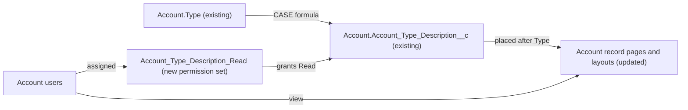

# Implementation spec — Show the Account Type Description on the Account record

> Show the existing readable description of each Account `Type` value on the Account record page, and give users read access to it.

_Based on the requirement, the evidence reported by AskCoworker, and read-only org queries where noted. Assumptions and missing evidence are identified below. Specification only — nothing is implemented or deployed._

---

## 1. The requirement

Users who view an Account need to see a readable description of what its `Type` value means. The description already exists as the formula field `Account.Account_Type_Description__c`, so the gap is only placement on the record page and field access. No user questions were needed; no out-of-scope instructions were present.

| # | Responsibility | Trigger | Where it lives |
| --- | --- | --- | --- |
| 1 | Produce a readable description for each Account `Type` value | Record read (formula evaluated at read time) | `Account.Account_Type_Description__c` (existing) |
| 2 | Show the description on the Account record, next to `Type` | Opening an Account record | `Account_Record_Page_Customer`, `Business_Account_Record_Page`, and the four Account layouts |
| 3 | Let the users who view Accounts read the field | Permission set assignment | New permission set `Account_Type_Description_Read` |

## 2. Grounding — reuse before building

Target org: `TestWriteSpecDE` (ID `00Dak00001COqNeEAL`). API version: `67.0`.

- **`Account.Account_Type_Description__c`** (CustomField, Formula (Text), unmanaged, Id `00Nak00004nK0SlEAK`) — the description already exists. Its formula is `CASE(Type, ...)` with one description for each of the 13 active `Type` values, and the else value `"Other"`. Example: "Independent Vendor" returns "A standalone business providing food or related services. Often a single location with independent ownership, such as a family-run restaurant or shop." _verified by org query_
- **`Account.Type`** (standard picklist) — 13 active values: Restaurant Group, Food Chain, Franchise Owner, Independent Vendor, Ghost Kitchen, Food Truck, Caterer, Convenience Store, Grocery Store, Corporate Client, Supplier, Distributor, Customer Account. Every value has a branch in the formula. _verified by org query_
- **Account data shape** — Customer Account 189, Independent Vendor 5, Restaurant Group 5, blank 1. _verified by org query_
- **Placement today** — the field is on none of the four Account layouts (`Account-Account Layout`, `Account-Account %28Sales%29 Layout`, `Account-Account %28Marketing%29 Layout`, `Account-Account %28Support%29 Layout`) and on neither Account record page (`Account_Record_Page_Customer`, `Business_Account_Record_Page`). Both record pages use Dynamic Forms field sections that contain `Record.Type`. On the layouts, `Type` is in the "Additional Information" section (`Account-Account Layout`, `Account-Account %28Marketing%29 Layout`) or the "Account Information" section (`Account-Account %28Sales%29 Layout`, `Account-Account %28Support%29 Layout`). _verified by org query_
- **Field access today** — Read on the field is granted only by the permission sets `sfdc_accelerate_dms`, `sfdc_a360_sfcrm_data_extract`, `sfdc_slack` (namespace `sfdcInternalInt`, Session type, not editable), `Agentforce_Reference_App`, and `Pronto_Deep_Dive_Workshop` (each assigned to 1 user). No profile grants Read on the field. `Account.Type` itself is readable by 45 profiles, including System Administrator, Standard User, `Custom%3A Sales Profile`, `Custom%3A Marketing Profile`, and `Custom%3A Support Profile`. _verified by org query_
- **Readers of the field** — no `MetadataComponentDependency` rows reference it (18- and 15-character Id), no unmanaged Apex class body (70 checked) mentions it, and the `prontoProfileCard` LWC on both record pages does not reference it. _verified by org query_
- **Record types** — `Customer_Account` and `Partner_Account` are active on Account. Page and layout assignments per record type and profile cannot be read. _verified by org query_

Candidates examined and rejected: `Account.Description` (standard Long Text Area) — free text per record, not a per-type description; inline help text on `Account.Type` — help text is one text for the whole field, not per value; widening `Agentforce_Reference_App` or `Pronto_Deep_Dive_Workshop`, which already grant Read — design rules prefer a dedicated permission set over widening existing ones.

Evidence sources: `sf sobject describe` on Account; Tooling `CustomField`, `Layout.Metadata`, `FlexiPage.Metadata`, `MetadataComponentDependency`, `ApexClass` bodies, `LightningComponentResource`; `FieldPermissions`, `PermissionSet`, `RecordType`, `DataStream`, and an Account `GROUP BY Type` count. AskCoworker returned no citedReferences.

## 3. Architecture

Why the pieces are drawn this way:

1. `Account.Type` drives `Account.Account_Type_Description__c` through its CASE formula. _verified by org query_
2. The formula already covers every active `Type` value, so no new field, formula, or automation is needed. _verified by org query_
3. The field is placed next to `Type` on both Dynamic Forms record pages and, where they are still used, on the four layouts. _assumption_ (placement is an implementation decision)
4. Placement does not grant field access. Only the new permission set grants Read to the people who view Accounts. _assumption (documented platform behavior)_

## 4. Metadata changes

**Security**

- **Create `Account_Type_Description_Read`** — PermissionSet, label "Account Type Description Read". Object permission: Read on `Account` (a permission set that grants field permissions must also grant Read on the object). Field permission: Read on `Account.Account_Type_Description__c`; Edit not granted (formula field). No other permissions. Assigned to the internal users who view Account records (setup step, Section 8).

**UX**

- **Update `Account_Record_Page_Customer`** — FlexiPage. Add a field instance for `Record.Account_Type_Description__c` (uiBehavior `readonly`) directly after `Record.Type` in the same Dynamic Forms field section. No visibility filter.
- **Update `Business_Account_Record_Page`** — FlexiPage. Add a field instance for `Record.Account_Type_Description__c` (uiBehavior `readonly`) directly after `Record.Type` in the same Dynamic Forms field section. No visibility filter.
- **Update `Account-Account Layout`** — Layout. Conditional: only if this layout is still shown to some users (a profile, app, or record type that does not use one of the two Dynamic Forms pages, or mobile); settled by a sandbox check of page and layout assignments. Add `Account_Type_Description__c` (Readonly) directly after `Type` in the "Additional Information" section.
- **Update `Account-Account %28Sales%29 Layout`** — Layout. Conditional: same condition as `Account-Account Layout`. Add `Account_Type_Description__c` (Readonly) directly after `Type` in the "Account Information" section.
- **Update `Account-Account %28Marketing%29 Layout`** — Layout. Conditional: same condition as `Account-Account Layout`. Add `Account_Type_Description__c` (Readonly) directly after `Type` in the "Additional Information" section.
- **Update `Account-Account %28Support%29 Layout`** — Layout. Conditional: same condition as `Account-Account Layout`. Add `Account_Type_Description__c` (Readonly) directly after `Type` in the "Account Information" section.

## 5. Data 360 (Data Cloud) data involved

Not applicable — this change does not use Data 360. The org has 0 `DataStream` records (_verified by org query_). The managed permission set `sfdc_a360_sfcrm_data_extract` already has Read on the field (_verified by org query_); this spec does not change it.

## 6. Security considerations

- **Execution context:** no Apex, flow, or trigger is added. The formula is evaluated when the record is read, in the reading user's context. _assumption (documented platform behavior)_
- **Sharing:** unchanged. Users see the description only on Accounts they can already see.
- **CRUD/FLS:** a field on a page or layout is shown only to users with Read field access. Today no profile grants Read on `Account.Account_Type_Description__c` (_verified by org query_), so after placement alone, users on System Administrator, Standard User, `Custom%3A Sales Profile`, `Custom%3A Marketing Profile`, `Custom%3A Support Profile`, and every other profile would still not see it. View All Data and Modify All Data do not override field-level security. _assumption (documented platform behavior)_
- **Grants:** `Account_Type_Description_Read` grants Read on `Account` and Read on the field. Users who hold it already have Account Read through their profile, so the Account Read grant adds nothing for them. No profile is changed, and no existing permission set is widened. The five permission sets that already grant Read are unchanged.
- **Data exposure:** the description is fixed text that depends only on `Account.Type`, which the same users can already read. No personal or financial data is exposed.

## 7. Testing strategy

All changes are declarative (permission set, record pages, layouts). There are no automated tests; the formula is unchanged. Recommended manual verification in a sandbox:

1. **Permission, positive:** assign `Account_Type_Description_Read` to a Standard User test user. Open an Account with `Type` = "Customer Account"; the description appears directly after `Type`, read-only, with the Customer Account text.
2. **Permission, negative:** a Standard User test user without the permission set, and without `Agentforce_Reference_App` or `Pronto_Deep_Dive_Workshop`, does not see the field.
3. **System Administrator:** without the permission set, an administrator does not see the field (no profile grant); after assignment, the field appears.
4. **Values:** open one Account each with `Type` = "Independent Vendor" and "Restaurant Group" and compare with the formula text. For the other 10 values (no records today), set `Type` on a sandbox test Account and check each text.
5. **Blank `Type`:** the one Account with a blank `Type` shows "Other" (see Section 8).
6. **Both record pages:** check the field on `Account_Record_Page_Customer` and `Business_Account_Record_Page` (for example on a `Customer_Account` and a `Partner_Account` record).
7. **Layouts (load-bearing check for the Conditional rows):** in Setup, check Lightning page assignments and Page Layout Assignment for each profile and record type, and on mobile. Deploy the layout rows only if a layout is still shown somewhere.

## 8. Open decisions

### Open

1. **Layout rows are Conditional (non-blocking).** `Account-Account Layout`, `Account-Account %28Sales%29 Layout`, `Account-Account %28Marketing%29 Layout`, and `Account-Account %28Support%29 Layout` are needed only if some users still see a layout instead of one of the two Dynamic Forms record pages. Page activation and layout assignment cannot be read with the allowed commands. Recommended default: check the assignments in a sandbox (Section 7, step 7); if in doubt, deploy the layout rows too, because adding a read-only field next to `Type` is harmless.
2. **Permission set assignment (blocking for delivery).** The field is invisible to everyone without Read access, and no profile grants it. After deployment, assign `Account_Type_Description_Read` in Setup (Permission Sets > Account Type Description Read > Manage Assignments) to the internal users who view Accounts. Recommended default: all active internal users on the Sales, Marketing, Support, Standard User, and System Administrator profiles. Portal, community, guest, and integration profiles are not included.
3. **Blank `Type` shows "Other" (non-blocking proposal).** The formula's else value makes an Account with a blank `Type` (1 record today) display "Other", which reads like a value. Changing the formula is not needed for this requirement. Proposal: wrap the CASE in `IF(ISPICKVAL(Type, ""), "", ...)` in a later change.
4. **New `Type` values (non-blocking).** A future `Type` value shows "Other" until the formula gets a new branch. Recommended default: whoever adds a `Type` value also updates `Account.Account_Type_Description__c`.

Deployment sequence: deploy `Account_Type_Description_Read`, `Account_Record_Page_Customer`, `Business_Account_Record_Page`, and the layout rows that apply together (the field already exists), then assign the permission set.

### Resolved

- **Requirement mostly met** — the description field and its content already exist for all 13 values, so no field or formula is created or changed. _verified by org query_
- **Access mechanism** — a new dedicated permission set, not profile grants and not widening `Agentforce_Reference_App` or `Pronto_Deep_Dive_Workshop`. _assumption_ (design rule; no user preference asked)
- **Placement** — read-only, directly after `Type` on both record pages. _assumption_
- **AskCoworker corrections:** the inventory proposal made both FlexiPage rows Conditional; they are unconditional, because both pages exist and adding the field is safe whether or not a page is active (_verified by org query_). AskCoworker's runtime answer cited example descriptions "Prospect" and "Customer - Direct", which are not in the formula (_verified by org query_), and said a future data stream would include the field automatically; data stream fields are selected when the stream is set up (_assumption (documented platform behavior)_). Its testing answer said System Administrators have implicit field access through View All Data; View All Data does not override field-level security, and no profile grants Read on the field (_verified by org query_). With three wrong claims, every AskCoworker fact kept in this spec was verified by org query. The "prior session" fact about `Storefront__c.Cuisine__c`, the Account OWD claim, and the proposals for a profile grant, a stored text field, and an LWC were dropped as not needed.

## 9. Change set

| # | Action | Type | API name | Module | Why |
| --- | --- | --- | --- | --- | --- |
| 1 | Create | PermissionSet | `Account_Type_Description_Read` | force-app/main/default/permissionsets | Grants Read on the description field, which no profile grants today |
| 2 | Update | FlexiPage | `Account_Record_Page_Customer` | force-app/main/default/flexipages | Shows the description next to `Type` on this Dynamic Forms record page |
| 3 | Update | FlexiPage | `Business_Account_Record_Page` | force-app/main/default/flexipages | Shows the description next to `Type` on this Dynamic Forms record page |
| 4 | Update | Layout | `Account-Account Layout` | force-app/main/default/layouts | Conditional: shows the description where this layout is still used |
| 5 | Update | Layout | `Account-Account %28Sales%29 Layout` | force-app/main/default/layouts | Conditional: shows the description where this layout is still used |
| 6 | Update | Layout | `Account-Account %28Marketing%29 Layout` | force-app/main/default/layouts | Conditional: shows the description where this layout is still used |
| 7 | Update | Layout | `Account-Account %28Support%29 Layout` | force-app/main/default/layouts | Conditional: shows the description where this layout is still used |

The existing formula field `Account.Account_Type_Description__c` is reused; the change only places it next to `Type` and grants Read through a dedicated permission set.

Total: 7 · Create: 1 · Update: 6 · Delete: 0
