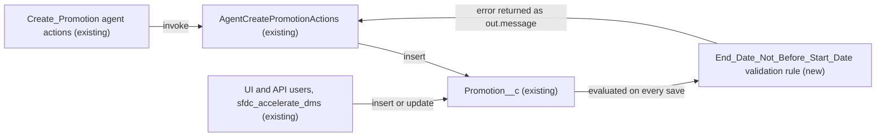

# Implementation spec — Promotion end date cannot be before start date

> Block any save of a `Promotion__c` record whose `End_Date__c` is earlier than its `Start_Date__c`.

_Based on the requirement, the evidence reported by AskCoworker, and read-only org queries where noted. Assumptions and missing evidence are identified below. Specification only — nothing is implemented or deployed._

---

## 1. The requirement

Stop users, agents, and integrations from saving a promotion (`Promotion__c`) whose end date is before its start date. The rule applies on create and, so that it stays true, on edit (*assumption*, per the design rule for rules that existing records could break later). No out-of-scope instructions were in the request.

| # | Responsibility | Trigger | Where it lives |
| --- | --- | --- | --- |
| 1 | Reject a `Promotion__c` save when both dates are set and `End_Date__c` < `Start_Date__c` | Insert and update of `Promotion__c` (every channel: UI, API, Apex, agent actions) | New validation rule `Promotion__c.End_Date_Not_Before_Start_Date` |
| 2 | Return the rejection to agent users of the Create Promotion action | Agent invokes `Create_Promotion` | Existing `AgentCreatePromotionActions` catch block (no change) |

## 2. Grounding — reuse before building

Target org: `TestWriteSpecDE` (org ID `00Dak00001COqNeEAL`, connected). API version: `67.0` (`sourceApiVersion` `67.0` in `sfdx-project.json`, *verified by project file*).

- **`Promotion__c`** (CustomObject) — the only object that holds promotions; `EntityDefinition.DurableId` `01Iak00000Dx4JZ`. _verified by org query_
- **`Promotion__c.Start_Date__c`** and **`Promotion__c.End_Date__c`** (CustomField, type `date`, `nillable` true, no default). _verified by org query_
- **Custom fields on `Promotion__c`** (complete list, Tooling `CustomField`): `Description`, `Discount_Percentage`, `End_Date`, `Promotion_Code`, `Start_Date`, `Status`, `Storefront`. None already stores a date-order flag. _verified by org query_
- **`Promotion__c.Storefront__c`** (CustomField, Lookup to `Storefront__c`, nillable, no cascade delete). _verified by org query_
- **Existing enforcement on `Promotion__c`:** 0 validation rules (Tooling `ValidationRule WHERE EntityDefinitionId = '01Iak00000Dx4JZ'`), 0 Apex triggers, 0 flows triggered on the object (`FlowDefinitionView`), 0 workflow rules. The requirement is not met today. _verified by org query_
- **Same concept elsewhere:** the only other `Start_Date`/`End_Date` custom fields are `End_Date` on `Marketing_Event__c` (no `Start_Date`); `Marketing_Event__c` has 0 validation rules, so there is no existing date-order rule to copy. _verified by org query_
- **`AgentCreatePromotionActions`** (ApexClass, `with sharing`, unmanaged) — the only Apex class that inserts `Promotion__c`. It copies `startDate`/`endDate` inputs into the record with no date-order check, and wraps `insert promo` in `catch (Exception e) { out.success = false; out.message = e.getMessage(); }`. _verified by org query_ (class body)
- **Readers and writers of `Promotion__c`** (dependencies plus Apex body search over all 70 unmanaged classes): `AgentCreatePromotionActions` (insert), `AgentUpdatePromotionStatusActions` (updates `Status__c` only), `MerchantRiskScoreAction` (reads `Start_Date__c`), and FlexiPage `Storefront_Record_Page` (references both date fields). _verified by org query_
- **Agent actions** targeting `AgentCreatePromotionActions`: `Create_Promotion` and 5 per-agent copies (`Create_Promotion_179Kj000000Lak9`, `_179Kj000000oapi`, `_179Kj000000t8j7`, `_179Kj000000t8jJ`, `_179Kj000000t8rT`). _verified by org query_
- **Create/Edit access on `Promotion__c`:** managed permission set `sfdc_accelerate_dms` (namespace `sfdcInternalInt`) and the System Administrator profile. Read only: `Pronto_Deep_Dive_Workshop`, `sfdc_a360_sfcrm_data_extract`, `sfdc_slack`, Analytics Cloud Integration User profile. _verified by org query_
- **Existing data:** 1 `Promotion__c` record, `Start_Date__c` `2027-03-27`, `End_Date__c` `2027-04-12`, so it already satisfies the rule. _verified by org query_

Candidates examined and rejected: before-save record-triggered flow and Apex trigger (a validation rule is the standard mechanism and covers every DML path); a pre-insert check in `AgentCreatePromotionActions` (duplicates the rule for one caller only).

Evidence sources: `sf org display`; custom object list; `Promotion__c` describe; Tooling `EntityDefinition`, `CustomField`, `ValidationRule`, `ApexTrigger`, `WorkflowRule`, `MetadataComponentDependency`, `ApexClass` bodies, `GenAiFunctionDefinition`; `FlowDefinitionView`; `ObjectPermissions`; `Promotion__c` record count and dates; `DataStream` count. AskCoworker returned no citedReferences.

## 3. Architecture

Why the pieces are drawn this way:

1. `Promotion__c` has no triggers, flows, or validation rules today (*verified by org query*), so the new validation rule is the only save-time logic on the object.
2. Validation rules run on every insert and update, whatever the channel, running user, or sharing mode, and do not run on delete or undelete (*assumption (documented platform behavior)*). That covers the UI, the API path of `sfdc_accelerate_dms`, and the Apex insert in `AgentCreatePromotionActions`.
3. `AgentCreatePromotionActions` catches the resulting `DmlException` and returns `success = false` with the exception message (*verified by org query*, class body), so no Apex change is needed.

## 4. Metadata changes

**Enforcement**

- **Create `Promotion__c.End_Date_Not_Before_Start_Date`** — ValidationRule, Active. Error condition formula: `AND(NOT(ISBLANK(Start_Date__c)), NOT(ISBLANK(End_Date__c)), End_Date__c < Start_Date__c)`. Error location: field `End_Date__c`. Error message: "End Date cannot be before Start Date." Description: "Blocks saving a promotion whose end date is earlier than its start date. Does not fire when either date is blank; equal dates are allowed." Blank handling: when either date is blank the formula returns FALSE and the save is allowed. Fires on create and on edit.

## 5. Data 360 (Data Cloud) data involved

Not applicable — this change does not use Data 360. The org has 0 `DataStream` records (*verified by org query*); `sfdc_a360_sfcrm_data_extract` has Read on `Promotion__c` (*verified by org query*) and needs no change.

## 6. Security considerations

- Validation rules run in the platform save process, not in Apex; they apply to every user and integration, including System Administrator and `sfdc_accelerate_dms` users, regardless of sharing or field-level security (*assumption (documented platform behavior)*).
- No object, field, permission set, or profile access changes. No new data is exposed. The error message contains no record data.
- `AgentCreatePromotionActions` stays `with sharing`; the raw `DmlException` text (which includes `FIELD_CUSTOM_VALIDATION_EXCEPTION` and the rule message) is returned to the agent user through `out.message` (*verified by org query* for the catch block; message format is *assumption (documented platform behavior)*).

## 7. Testing strategy

Declarative-only change: manual checks in a sandbox, no new Apex test class.

| Case | Steps | Expected |
| --- | --- | --- |
| Invalid create | Create `Promotion__c` with `Start_Date__c` = today, `End_Date__c` = today − 1 | Save blocked; error on `End_Date__c` |
| Valid create | `End_Date__c` = today + 7 | Saves |
| Equal dates | Both dates = today | Saves |
| Blank dates | Only start set; only end set; neither set | All save |
| Invalid edit | Edit the existing record so `End_Date__c` is before `Start_Date__c` | Save blocked |
| Unrelated edit | Change only `Status__c` on a record with valid dates (the path `AgentUpdatePromotionStatusActions` uses) | Saves |
| Agent path | Invoke `Create_Promotion` (or run `AgentCreatePromotionActions.invoke` in anonymous Apex) with an end date before the start date | `success = false`, `message` contains "End Date cannot be before Start Date.", no record created |
| Bulk | Load 10 rows through Bulk API 2.0, mixing valid and invalid dates | Invalid rows fail per row; valid rows commit |
| Regression | Run `MerchantRiskScoreActionTest` (the only test class that references a `Promotion__c` reader or writer; it inserts no `Promotion__c`) | Passes unchanged |

## 8. Open decisions

### Open

1. **`sfdc_accelerate_dms` writes (non-blocking).** The managed permission set grants Create/Edit on `Promotion__c` (*verified by org query*), but whether its integration writes promotion dates, and how it reports a rejected row, cannot be read. Recommended default: deploy the rule; tell the integration owner that invalid date ranges will now be rejected.
2. **Agent error text (non-blocking).** The agent receives the full `DmlException` message rather than only the rule text. Proposal, not in inventory: map `FIELD_CUSTOM_VALIDATION_EXCEPTION` to the plain rule message in `AgentCreatePromotionActions`.

### Resolved

- Enforce on create and edit, not create only, so the rule stays true after edits — *assumption* (design rule; the single existing record already complies).
- Rule fires only when both dates are set; dates stay optional — *assumption* (both fields are `nillable` and the requirement does not ask to require them).
- Equal start and end dates are allowed (`<`, not `<=`) — *assumption* (wording "before").
- Validation rule chosen over flow or Apex — *assumption* (standard mechanism).
- No data clean-up step: the one existing record already has `End_Date__c` after `Start_Date__c` — *verified by org query*.
- AskCoworker claimed validation rules were not queryable; the Tooling `ValidationRule` query succeeded and returned 0 rows (correction, *verified by org query*).
- AskCoworker's CRUD table left out the System Administrator profile, which has Create/Edit (correction, *verified by org query*).
- Dropped AskCoworker items not needed by this design: the `'Draft'` status default in `AgentCreatePromotionActions`, reparenting notes, the "silent failure" claim about `sfdc_accelerate_dms`, and an optional Apex regression test.
- No clarifying question was asked: the requirement's wording and the design rules settled every fork.

## 9. Change set

| # | Action | Type | API name | Module | Why |
| --- | --- | --- | --- | --- | --- |
| 1 | Create | ValidationRule | `Promotion__c.End_Date_Not_Before_Start_Date` | force-app/main/default/objects/Promotion__c/validationRules | Blocks saving a promotion whose end date is before its start date |

A single validation rule on `Promotion__c` enforces date order on every save; existing callers surface its error unchanged.

Total: 1 · Create: 1 · Update: 0 · Delete: 0
