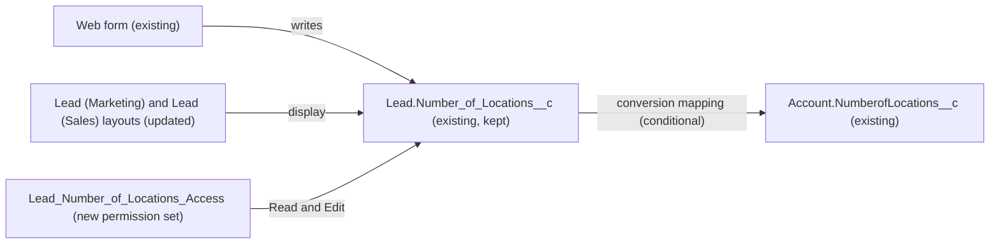

# Implementation spec — Remove the duplicate Lead "Number of Locations" field

> Keep `Lead.Number_of_Locations__c`, move any values from `Lead.NumberofLocations__c` into it, and delete `Lead.NumberofLocations__c`.

_Based on the requirement, the evidence reported by AskCoworker, and read-only org queries where noted. Assumptions and missing evidence are identified below. Specification only — nothing is implemented or deployed._

---

## 1. The requirement

Lead has two custom fields labelled "Number of Locations"; remove one. The user decided which one: keep `Lead.Number_of_Locations__c` (the web form uses it), migrate data from `Lead.NumberofLocations__c`, then delete `Lead.NumberofLocations__c` (*user decision*). The request contained no deploy or data-change instruction.

| # | Responsibility | Trigger | Where it lives |
| --- | --- | --- | --- |
| 1 | Carry any existing `Lead.NumberofLocations__c` values into `Lead.Number_of_Locations__c` | One-time data step before the delete | Data step (Section 8) |
| 2 | Users who saw "Number of Locations" on Lead layouts keep seeing and editing it, now on the kept field | Record view and edit | `Lead-Lead %28Marketing%29 Layout`, `Lead-Lead %28Sales%29 Layout`, `Lead_Number_of_Locations_Access` |
| 3 | Lead conversion keeps populating `Account.NumberofLocations__c` if it does so today | Lead conversion | `LeadConvertSettings` (Conditional) |
| 4 | Only one "Number of Locations" field remains on Lead | Deployment | Delete of `Lead.NumberofLocations__c` |

## 2. Grounding — reuse before building

Target org: `TestWriteSpecDE` (ID `00Dak00001COqNeEAL`, connected). API version: `67.0`.

- **`Lead.NumberofLocations__c`** (CustomField, Id `00Nak00004nK0UdEAK`) — the field to delete. Number(3,0), unmanaged (`NamespacePrefix` null), no description or help text, not required. Populated on 0 of 5 Leads. _verified by org query_
- **`Lead.Number_of_Locations__c`** (CustomField, Id `00Nak00004nK0THEA0`) — the field to keep. Number(5,0), unmanaged, no description or help text, not required. Populated on 0 Leads. No `MetadataComponentDependency` rows (18- and 15-character Id). _verified by org query_
- **Dependencies of `Lead.NumberofLocations__c`**: `MetadataComponentDependency` returns only `Lead (Marketing) Layout` and `Lead (Sales) Layout`. `Lead (Support) Layout` and `Lead Layout` do not reference it. _verified by org query_
- **Code and automation**: none of the 70 unmanaged Apex class bodies or the 5 Apex trigger bodies contain either field name; no Apex trigger exists on Lead; none of the 21 unmanaged flow versions (Tooling `Flow.Metadata`) mention either field; neither Lead FlexiPage (`Lead_Record_Page`, `Lead_Record_Page1`) contains either field; Lead has no validation rules. _verified by org query_
- **Managed flows on Lead** — `CreateSalesLead` (`sales_sfa_flows`, active), `CreateLeadAndOpp` and `DcCreateLeadAndOpp` (`sfdc_fieldservice`), `ApprovalDispatcher` (`prm_slack_flows`, inactive). These are packaged and their metadata was not read. _verified by org query_ (existence only)
- **Field access on `Lead.NumberofLocations__c`**: 49 `FieldPermissions` rows — 45 profiles (every profile in the org, including `Guest License User` and `System Administrator`, all Read and Edit) and 4 permission sets (`sfdc_accelerate_dms` Read and Edit; `sfdc_a360_sfcrm_data_extract`, `sfdc_slack`, `Agentforce_Reference_App` Read only). _verified by org query_
- **Field access on `Lead.Number_of_Locations__c`**: 4 rows, no profiles — `Agentforce_Reference_App` (Read, Edit), `sfdc_accelerate_dms` (`sfdcInternalInt`, Read, Edit), `sfdc_a360_sfcrm_data_extract` and `sfdc_slack` (`sfdcInternalInt`, Read). _verified by org query_
- **`Account.NumberofLocations__c`** (CustomField, Id `00Nak00004nK0UREA0`) — Number(3,0), populated on 10 Accounts, on three Account layouts. It is the likely Lead conversion target of the deleted field; the mapping itself cannot be read. _verified by org query_ (field); *assumption* (mapping)
- Active users: 8 users across `System Administrator`, `Merchant Support Profile`, `Customer Support Profile`, `ESW_Merchant_Service_Agent_1737676393072 Profile`, `Chatter Free User`, `Einstein Agent User`, `Analytics Cloud Security User`, `Analytics Cloud Integration User` (1 each), plus 4 with no profile. _verified by org query_
- The web form that writes `Lead.Number_of_Locations__c` is not visible in the org metadata. _user decision_
- No project file under `force-app` or `design` references either field. _verified by project file_

Candidates examined and rejected: keeping `Lead.NumberofLocations__c` — the user chose the other field; a migration flow — nothing to migrate today, so a one-time data step is enough; updating the 45 profiles — broad and includes guest and community profiles.

Evidence sources: `sf org display`; Tooling `CustomField`, `MetadataComponentDependency`, `Layout`, `ValidationRule`, `ApexClass`, `ApexTrigger`, `Flow`, `FlexiPage`; `FieldPermissions`, `FlowDefinitionView`, `User`, `PermissionSet`, `COUNT()` on Lead and Account. AskCoworker returned no citedReferences. After four wrong AskCoworker claims (see Section 8), the *R* and *T* calls were skipped and their topics were covered with the org queries above.

## 3. Architecture

Why the pieces are drawn this way:

1. The web form writes the kept field (*user decision*).
2. The two layouts that show the deleted field today get the kept field in the same position, so users do not lose the field (*verified by org query* for current placement).
3. The kept field has no profile access, so without a grant the layout placement shows nothing to internal users. A dedicated permission set gives Read and Edit instead of widening 45 profiles.
4. If the deleted field is mapped to `Account.NumberofLocations__c` on conversion, the mapping moves to the kept field (*assumption*; the mapping cannot be read).

## 4. Metadata changes

**UX**

- **Update `Lead-Lead %28Marketing%29 Layout`** — Layout. Replace `Lead.NumberofLocations__c` with `Lead.Number_of_Locations__c` in the same section and position. Retrieve the layout before editing. Changes the layout for everyone assigned to it.
- **Update `Lead-Lead %28Sales%29 Layout`** — Layout. Same replacement as the Marketing layout. Retrieve before editing.

**Security**

- **Create `Lead_Number_of_Locations_Access`** — PermissionSet, label "Lead Number of Locations Access". Field permission `Lead.Number_of_Locations__c` Read and Edit. No object permissions (users get Lead access from their profile). Assigned to the internal users who work Leads (data step, Section 8).

**Automation**

- **Update `LeadConvertSettings`** — LeadConvertSettings. Conditional: only if Lead Setup currently maps `Lead.NumberofLocations__c` to `Account.NumberofLocations__c` (or another field). Change the source of that mapping to `Lead.Number_of_Locations__c`. The kept field is Number(5,0) and `Account.NumberofLocations__c` is Number(3,0); if Setup refuses the mapping, see Section 8 Open item 2.

**Data model**

- **Delete `Lead.NumberofLocations__c`** — CustomField. Impact: removes the field, its data (0 values today), its 49 field-permission rows, and its placement on the two layouts; the conversion mapping from it, if any, is removed. Prerequisites: data step done, layouts and permission set deployed and assigned, conversion mapping moved, reports and list views checked. Backup: retrieve `Lead.NumberofLocations__c` and both layouts into source control and export Lead `Id` with the field's values. Rollback: undelete the field from Deleted Fields within 15 days (restores data, but not layout placement or field permissions — redeploy those from the backup), or recreate it from the retrieved source.

## 5. Data 360 (Data Cloud) data involved

Not applicable — this change does not use Data 360.

## 6. Security considerations

- No new code; no execution context or sharing changes.
- Today every profile has Read and Edit on `Lead.NumberofLocations__c`; the kept field has no profile access. `View All Data` and `Modify All Data` do not override field-level security, so System Administrators also need the grant (*assumption (documented platform behavior)*).
- `Lead_Number_of_Locations_Access` grants Read and Edit on `Lead.Number_of_Locations__c` only. No profile, including `Guest License User` and the community and portal profiles, receives access; this narrows exposure compared with the deleted field.
- Existing grants on the kept field (`Agentforce_Reference_App`, `sfdc_accelerate_dms`, `sfdc_a360_sfcrm_data_extract`, `sfdc_slack`) are unchanged. The managed permission sets are not edited.
- The web form's write path is outside the org metadata we can read; confirm it still writes after deployment (Section 7).

## 7. Testing strategy

All changes are declarative; no Apex or Flow Tests are added. Recommended verification in a sandbox:

1. **Data step:** before the delete, `SELECT COUNT() FROM Lead WHERE NumberofLocations__c != null` returns 0 (or, after the copy, every such Lead has the same value in `Number_of_Locations__c`).
2. **Layouts:** as a user with `Lead_Number_of_Locations_Access` on the Marketing and Sales layouts, open a Lead: one "Number of Locations" field is shown and editable, and it saves to `Lead.Number_of_Locations__c`.
3. **Permission (negative):** as a user without the permission set, the field is not visible on the layout.
4. **Web form:** submit the web form; the new Lead has `Number_of_Locations__c` set.
5. **Conversion (load-bearing assumption check):** before the delete, inspect Setup → Object Manager → Lead → Fields & Relationships → Map Lead Fields. If a mapping exists, after `LeadConvertSettings` is updated convert a Lead with `Number_of_Locations__c` = 12 and confirm `Account.NumberofLocations__c` = 12; also try a value above 999 to see the Account field's limit.
6. **Delete:** after deleting `Lead.NumberofLocations__c`, the managed flows `CreateSalesLead` and `CreateLeadAndOpp` still run (create a Lead through each) and no report or list view errors.

## 8. Open decisions

### Open

1. **Lead conversion mapping (non-blocking).** `LeadConvertSettings` cannot be read with the allowed commands. The Conditional row `LeadConvertSettings` applies only if `Lead.NumberofLocations__c` is mapped today. Check in Setup (Section 7 step 5) before deployment.
2. **Precision mismatch for the mapping (non-blocking).** `Lead.Number_of_Locations__c` is Number(5,0); `Account.NumberofLocations__c` is Number(3,0). Whether Setup accepts this mapping, and what happens to values above 999, is *assumption*; verify in a sandbox. If it is refused, the proposal is to widen `Account.NumberofLocations__c` to Number(5,0) (not in the inventory; it changes an Account field the requirement does not name).
3. **Reports and list views (non-blocking).** They cannot be read. Check Lead reports and list views for `Lead.NumberofLocations__c` and switch them to `Lead.Number_of_Locations__c` before the delete.
4. **Managed flows (non-blocking).** `CreateSalesLead`, `CreateLeadAndOpp`, and `DcCreateLeadAndOpp` are packaged; their metadata was not read. Packaged flows cannot reference a subscriber's unmanaged field by design (*assumption*); Section 7 step 6 confirms it.
5. **Permission set assignment (blocking for delivery).** Assign `Lead_Number_of_Locations_Access` to the internal users who work Leads before the delete. Default (*assumption*): the active `System Administrator`, `Merchant Support Profile`, and `Customer Support Profile` users; add others as needed. Without the assignment, responsibility 2 fails.

Deployment sequence:
1. Retrieve `Lead.NumberofLocations__c`, both layouts, and `LeadConvertSettings` into source control; export Lead `Id`, `NumberofLocations__c`.
2. Data step: re-run `SELECT COUNT() FROM Lead WHERE NumberofLocations__c != null`. If it is above 0, copy `NumberofLocations__c` into `Number_of_Locations__c` where `Number_of_Locations__c` is blank (Data Loader or Data Import Wizard); where both are set and differ, keep `Number_of_Locations__c` and list the conflicts for the owner.
3. Deploy `Lead_Number_of_Locations_Access` and the two layouts; assign the permission set.
4. If mapped, update `LeadConvertSettings` (Setup → Map Lead Fields).
5. Check reports and list views.
6. Delete `Lead.NumberofLocations__c` (destructive change or Setup); erase it from Deleted Fields only after verification.

### Resolved

- **Which field to keep** — `Lead.Number_of_Locations__c`; delete `Lead.NumberofLocations__c` and migrate its data first. *user decision*
- **Migration mechanism** — a one-time data step, not a flow: 0 Leads hold a value today (*verified by org query*). AskCoworker's proposed `Lead_Migrate_NumberofLocations` flow was dropped. *assumption*
- **Access mechanism** — a new dedicated permission set rather than editing 45 profiles or the managed permission sets. *assumption*
- **Layouts** — replace the field in place on the two layouts that show it; `Lead (Support) Layout` and `Lead Layout` show neither field and stay unchanged (*verified by org query*). *assumption*
- **Siblings** — no other pair of Lead fields with the same meaning was found in the full Lead custom field list (24 fields). *verified by org query*
- **AskCoworker corrections:** (1) it said custom fields map on conversion by API-name match — custom lead field mapping is configured in Setup (*assumption (documented platform behavior)*); (2) it said validation rules are not queryable — Tooling `ValidationRule` returned 0 Lead rules; (3) it said System Administrator has implicit FLS — `View All Data` does not override FLS; (4) it said a field on a layout cannot be deleted — deleting a custom field removes it from layouts. Its proposed `Agentforce_Reference_App` permission set updates were dropped (speculative; that set already has Read on the deleted field and Read and Edit on the kept one, *verified by org query*).

## 9. Change set

| # | Action | Type | API name | Module | Why |
| --- | --- | --- | --- | --- | --- |
| 1 | Update | Layout | `Lead-Lead %28Marketing%29 Layout` | force-app/main/default/layouts | Replace the deleted field with the kept field |
| 2 | Update | Layout | `Lead-Lead %28Sales%29 Layout` | force-app/main/default/layouts | Replace the deleted field with the kept field |
| 3 | Create | PermissionSet | `Lead_Number_of_Locations_Access` | force-app/main/default/permissionsets | Read and Edit on the kept field, which has no profile access |
| 4 | Update | LeadConvertSettings | `LeadConvertSettings` | force-app/main/default/settings | Conditional: move the conversion mapping to the kept field |
| 5 | Delete | CustomField | `Lead.NumberofLocations__c` | force-app/main/default/objects/Lead/fields | The duplicate field the user chose to remove |

The kept field replaces the deleted one on both layouts, gets a dedicated grant, and takes over any conversion mapping before `Lead.NumberofLocations__c` is deleted.

Total: 5 · Create: 1 · Update: 3 · Delete: 1
