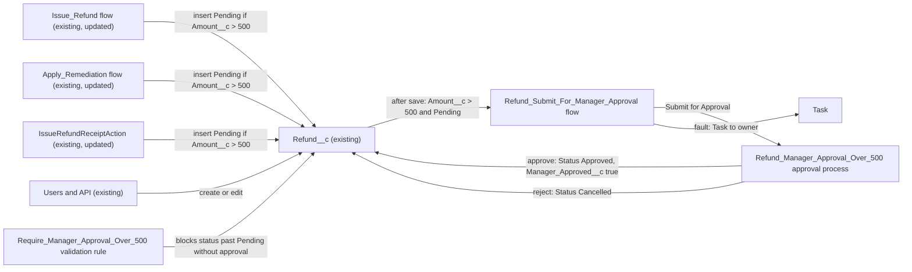

# Implementation spec — Manager approval for refunds over $500

> Refunds with `Amount__c` over 500 stay in `Pending` until the submitter's manager approves them through an approval process; approval sets `Approved`, rejection sets `Cancelled`, and a validation rule blocks every other path past `Pending`.

_Based on the requirement, the evidence reported by AskCoworker, and read-only org queries where noted. Assumptions and missing evidence are identified below. Specification only — nothing is implemented or deployed._

---

## 1. The requirement

A `Refund__c` record with `Amount__c` greater than 500 cannot move from `Pending` to `Approved`, `Processing`, `Completed`, or `Failed` until the submitter's manager approves it. The user decided that the approver is the submitter's manager (`User.ManagerId`), that approval sets `Status__c` to `Approved`, that rejection sets `Status__c` to `Cancelled`, and that manual status changes past `Pending` without approval are blocked (*user decision*). The request contained no out-of-scope instructions.

| # | Responsibility | Trigger | Where it lives |
| --- | --- | --- | --- |
| 1 | Route refunds over 500 in `Pending` to the submitter's manager | Refund created, or updated to meet the criteria | `Refund__c.Refund_Manager_Approval_Over_500` approval process, submitted by `Refund_Submit_For_Manager_Approval` |
| 2 | On approval, set `Status__c` to `Approved` and record that the approval happened | Final approval | `Refund__c.Set_Refund_Status_Approved`, `Refund__c.Set_Refund_Manager_Approved` |
| 3 | On rejection, set `Status__c` to `Cancelled` | Final rejection | `Refund__c.Set_Refund_Status_Cancelled` |
| 4 | Block any status past `Pending` for an unapproved refund over 500 (UI, API, flows, Apex) | Insert and update | `Refund__c.Require_Manager_Approval_Over_500` validation rule |
| 5 | Existing automated writers create refunds over 500 as `Pending` instead of `Approved` | Flow or agent action call | `Issue_Refund`, `Apply_Remediation`, `IssueRefundReceiptAction` |

## 2. Grounding — reuse before building

Target org: `TestWriteSpecDE` (org ID `00Dak00001COqNeEAL`, connected). API version: `67.0` (`sourceApiVersion` in `sfdx-project.json`, *verified by project file*; org `apiVersion` 67.0, *verified by org query*).

- **`Refund__c`** (CustomObject) — the refund record; unmanaged (`NamespacePrefix` null), `DurableId` `01Iak00000Dx4KP`, one record type (`Master`), internal sharing `ReadWrite`, external `Private`. 0 records today. _verified by org query_
- **`Refund__c.Amount__c`** (Currency, nillable) — the threshold field. _verified by org query_
- **`Refund__c.Status__c`** (Picklist, restricted) — values `Pending` (default), `Approved`, `Processing`, `Completed`, `Failed`, `Cancelled`. _verified by org query_
- **Custom fields on `Refund__c`** — the complete Tooling `CustomField` list is 10 fields: `Amount`, `Business_Account`, `Case`, `Contact`, `Issue_Date`, `Payment_Method`, `Processed_Date`, `Reason`, `Status`, `Storefront`. None records approval. _verified by org query_
- **Existing automation on `Refund__c`** — 0 validation rules, 0 approval processes (`ProcessDefinition` returns 0 rows for `Refund__c` and 0 rows org-wide), 0 Apex triggers, 0 workflow rules, 0 record-triggered flows. _verified by org query_
- **`Issue_Refund`** (Flow, autolaunched, active, unmanaged) — element `Create_Refund` inserts `Refund__c` with `Status__c` = `'Approved'` and `Amount__c` = `refundAmount`; returns `resultMessage` `'Refund created successfully.'`. _verified by org query_
- **`Apply_Remediation`** (Flow, autolaunched, active, unmanaged) — element `Create_Refund` inserts `Refund__c` with `Status__c` = `'Approved'`; description "Applies a make-it-right remediation by creating an approved Refund__c record…". _verified by org query_
- **`IssueRefundReceiptAction`** (ApexClass, `with sharing`) — sets `r.Status__c = 'Approved'` and inserts; invocable description "Creates an approved refund and returns a rich refund receipt for display."; message `'Issued a $' + … + ' refund "' + r.Name + '".'`; the wallet callout runs before the insert. _verified by org query_
- **`IssueRefundReceiptActionTest`** (ApexClass) — asserts `'Approved'` for a 42.50 refund. _verified by org query_
- **`Issue_Refund_Receipt`** (GenAiFunction, unmanaged) — targets `IssueRefundReceiptAction`; description "Creates an approved refund and returns a rich refund receipt rendered with a custom Lightning type."; linked to no topic (`GenAiPluginFunctionDef`) and no planner (`GenAiPlannerFunctionDef`). _verified by org query_
- **Writers of `Refund__c`** — `MetadataComponentDependency` on the object and on `Status__c` lists only `Issue_Refund`, `Apply_Remediation`, `IssueRefundReceiptAction` (plus `Refund Layout` for the field); a search of all 70 unmanaged Apex class bodies finds `Refund__c` only in `IssueRefundReceiptAction`; there are no unmanaged triggers. _verified by org query_
- **`Refund__c-Refund Layout`** (Layout) — the only layout; no FlexiPage exists for `Refund__c`. _verified by org query_
- **Managers** — 0 of 4 active standard users have `ManagerId` set; none has a role (18 roles exist). _verified by org query_
- **Access to `Refund__c`** — object Create/Edit through permission sets `Agentforce_Reference_App`, `Pronto_Deep_Dive_Workshop`, `sfdc_accelerate_dms` (`sfdcInternalInt`) and the `System Administrator` profile; Read only through `sfdc_a360_sfcrm_data_extract`, `sfdc_slack`, and the `Analytics Cloud Integration User` profile. _verified by org query_

Candidates examined and rejected: `Validate_Remediation` (Flow) — checks a proposed amount against a ceiling and a `MONTHLY_BUDGET` constant of 500 but writes no `Refund__c` record, so it is not a writer and not changed (_verified by org query_); `Refund_XSF_OS` (Flow, managed `runtime_commerce_oms`, inactive, platform-event triggered) — not a writer of this object in the dependency results (_verified by org query_); `IssueGiftCardAction` — its body does not reference `Refund__c` (_verified by org query_), contrary to AskCoworker.

Evidence sources: `sf org display`; `sobject describe Refund__c`; Tooling `EntityDefinition`, `CustomField`, `ValidationRule`, `ApexTrigger`, `WorkflowRule`, `ApexClass` bodies, `Flow.Metadata` for the three active flows, `MetadataComponentDependency`, `GenAiFunctionDefinition`, `GenAiPluginFunctionDef`, `GenAiPlannerFunctionDef`, `Layout`, `FlexiPage`; standard `ProcessDefinition`, `FlowDefinitionView`, `FieldPermissions`, `ObjectPermissions`, `User`, `UserRole`, `Group`, `Refund__c` count. AskCoworker (D1, D2, I) returned no citedReferences. AskCoworker made four wrong claims in this run (see Section 8), so every AskCoworker fact kept here was verified by org query, and the *R* and *T* calls were skipped; runtime, security, and testing were covered with org queries and documented platform behavior.

## 3. Architecture

Why the pieces are drawn this way:

1. The approval process is the standard mechanism for manager approval, and the user asked for it. No approval process exists in the org to reuse (_verified by org query_).
2. The approver is the submitter's manager: the approval step uses automated assignment by the `Manager` hierarchy field (*user decision*).
3. Approval and rejection outcomes are approval final actions that run `WorkflowFieldUpdate` components (*user decision* for the values). Field updates from approval actions do not re-run validation rules, so they are not blocked by the new rule (*assumption (documented platform behavior)*).
4. `Refund__c.Manager_Approved__c` records that the final approval happened. The validation rule needs it: after approval, later moves (`Approved` to `Processing`, `Completed`) must still pass, and a formula cannot read approval history (*assumption (documented platform behavior)*).
5. The validation rule enforces the gate on every save path (UI, API, flows, Apex), which the approval process alone does not do (*assumption (documented platform behavior)*).
6. One record-triggered flow submits the approval for every creator, instead of adding submission logic to each of the three writers. Flow has a standard "Submit for Approval" core action, so no Apex is needed for submission (*assumption (documented platform behavior)*).
7. The three writers change in place: each sets `Pending` instead of `Approved` when the amount is over 500, because otherwise the validation rule rejects their insert (_verified by org query_ that all three hard-code `'Approved'`).

## 4. Metadata changes

**Data model**

- **Create `Refund__c.Manager_Approved__c`** — CustomField, Checkbox, label "Manager Approved", default `false`, help text "Set automatically when the manager approves a refund over 500. Not editable by users." Set only by `Refund__c.Set_Refund_Manager_Approved`. No permission set or profile gets Edit on it.

**Automation**

- **Create `Refund__c.Set_Refund_Status_Approved`** — WorkflowFieldUpdate on `Refund__c.Status__c`, literal value `Approved`, "Re-evaluate Workflow Rules" off. Used as a final approval action.
- **Create `Refund__c.Set_Refund_Manager_Approved`** — WorkflowFieldUpdate on `Refund__c.Manager_Approved__c`, value `true`. Used as a final approval action.
- **Create `Refund__c.Set_Refund_Status_Cancelled`** — WorkflowFieldUpdate on `Refund__c.Status__c`, literal value `Cancelled`. Used as a final rejection action.
- **Create `Refund__c.Refund_Manager_Approval_Over_500`** — ApprovalProcess, active. Entry criteria formula: `AND(Amount__c > 500, ISPICKVAL(Status__c, "Pending"), NOT(Manager_Approved__c))`. Next automated approver determined by the `Manager` field, not the record owner's (`useApproverFieldOfRecordOwner` false), so the submitter's manager approves. Allowed submitters: record creator and record owner. Record editability: administrators only. One step, "Manager approval", assigned to the automated approver; if the submitter has no manager, submission fails (handled by the flow fault path). Initial submission action: lock the record. Final approval actions: `Refund__c.Set_Refund_Status_Approved`, `Refund__c.Set_Refund_Manager_Approved`; record stays locked. Final rejection action: `Refund__c.Set_Refund_Status_Cancelled`; unlock the record. Recall: unlock; status stays `Pending`. No email alerts (approval request emails are the standard assignment notification).
- **Create `Refund__c.Require_Manager_Approval_Over_500`** — ValidationRule, active. Formula: `AND(Amount__c > 500, NOT(Manager_Approved__c), NOT(ISPICKVAL(Status__c, "Pending")), NOT(ISPICKVAL(Status__c, "Cancelled")))`. Error location `Status__c`; message "Refunds over $500 need manager approval before they can move past Pending." Runs on insert and update, so it also covers a refund whose amount is raised above 500 after it left `Pending`. A blank `Amount__c` does not match (the comparison is false).
- **Create `Refund_Submit_For_Manager_Approval`** — Flow, record-triggered on `Refund__c`, after save, on create or update, entry conditions `Amount__c > 500` AND `Status__c = Pending` AND `Manager_Approved__c = false`, "only when a record is updated to meet the condition requirements". One "Submit for Approval" core action (`submit`): `objectId` = `$Record.Id`, `processDefinitionNameOrId` = `Refund_Manager_Approval_Over_500`, `skipEntryCriteria` = false, comment "Refund over $500 submitted for manager approval." Fault path: create a Task for `$Record.OwnerId` (when the owner is a user) with subject "Submit refund {Name} for manager approval" so the refund, which stays `Pending`, is followed up; the fault does not roll back the refund insert. Delivered Active.
- **Update `Issue_Refund`** — Flow. In `Create_Refund`, replace the `Status__c` literal `'Approved'` with a new text formula `refundStatus` = `IF({!refundAmount} > 500, "Pending", "Approved")`. Change `resultMessage` on success to `IF({!refundAmount} > 500, "Refund created and submitted for manager approval.", "Refund created successfully.")`. Inputs and outputs unchanged.
- **Update `Apply_Remediation`** — Flow. Same `refundStatus` formula in `Create_Refund`. Update the flow description to "Applies a make-it-right remediation by creating a Refund__c record (Approved, or Pending manager approval when over $500) and returning its confirmation number." Inputs and outputs unchanged.

**Apex**

- **Update `IssueRefundReceiptAction`** — ApexClass. Set `r.Status__c = req.refundAmount > 500 ? 'Pending' : 'Approved';`. For the `Pending` case, set `out.message` to "Submitted a $X refund "{Name}" for manager approval." Change the `@InvocableMethod` description to "Creates a refund (Approved, or Pending manager approval when over $500) and returns a rich refund receipt for display." Signature, sharing mode, callout order, and output shape unchanged. The receipt `status` already reads the stored value.

**Tests**

- **Update `IssueRefundReceiptActionTest`** — ApexClass. Keep `issuesRefundReceipt` (42.50 → `Approved`). Add: (a) 500.00 → `Approved` (boundary); (b) 600 by a test user with a manager → `Pending`, success true, one `ProcessInstance` with `Status = 'Pending'` for the record (exercises the record-triggered flow and approval process); (c) 600 by a test user without a manager → `Pending`, no `ProcessInstance`, one Task for the owner; (d) direct insert of a `Refund__c` with `Amount__c` 600 and `Status__c` `Approved` fails with the validation message; (e) update of a 400 `Approved` refund to `Amount__c` 600 fails; (f) bulk insert of 200 refunds over 500 as `Pending` succeeds; (g) `Approval.ProcessWorkitemRequest` approve → `Approved` and `Manager_Approved__c` true, then update to `Processing` succeeds; reject → `Cancelled`. Test users get `Refund_Approver` or the admin profile as needed.

**UX**

- **Update `Refund__c-Refund Layout`** — Layout. Add `Manager_Approved__c` as read-only in the details section and add the Approval History related list (`ProcessSteps`). This is the only layout for `Refund__c`, so the change is visible to everyone who uses it. Retrieve before editing.

**Other**

- **Update `Issue_Refund_Receipt`** — GenAiFunction. Change its description to "Creates a refund (Approved, or Pending manager approval when over $500) and returns a rich refund receipt rendered with a custom Lightning type." Input and output schema unchanged.

**Security**

- **Create `Refund_Approver`** — PermissionSet, label "Refund Approver". Object: Read on `Refund__c`. Field Read on `Refund__c.Amount__c`, `Refund__c.Status__c`, `Refund__c.Reason__c`, `Refund__c.Manager_Approved__c`. No Edit on any field. Assigned to users who act as managers for refund submitters.

## 5. Data 360 (Data Cloud) data involved

Not applicable — this change does not use Data 360.

## 6. Security considerations

- **Execution context.** The approval field updates run in system context and ignore field-level security, so `Manager_Approved__c` can be set without any user holding Edit on it (*assumption (documented platform behavior)*). The record-triggered flow runs in system context without sharing, as record-triggered flows do by default; the submitter recorded on the approval is the user whose save started the flow (*assumption (documented platform behavior)*). `IssueRefundReceiptAction` stays `with sharing` (_verified by org query_).
- **Bypass.** No permission set or profile gets Edit on `Refund__c.Manager_Approved__c`, and deploying a new field grants no field access to profiles or permission sets outside the deployment, so users (including `System Administrator` users) cannot set it through the UI or API without an admin first granting that access (*assumption (documented platform behavior)*). Apex running in system mode could still set it; no existing Apex does (_verified by org query_). The validation rule covers every save path, including the three writers.
- **Record locking.** Records are locked from submission until the final action; only administrators can edit a locked record. After approval the record stays locked. An administrator could unlock an approved refund and raise its amount; see Section 8.
- **CRUD/FLS.** `Refund_Approver` gives approvers Read on `Refund__c` and the four fields listed, no Edit. The existing permission sets `Agentforce_Reference_App`, `Pronto_Deep_Dive_Workshop`, `sfdc_accelerate_dms` keep their Create/Edit on `Refund__c` and `Status__c` (_verified by org query_); they are not changed and get no access to `Manager_Approved__c`.
- **Data exposure.** Approvers see refund amount, status, and reason. Internal sharing is already `ReadWrite` (_verified by org query_), so no sharing change is needed.

## 7. Testing strategy

- **Apex (`IssueRefundReceiptActionTest`):** cases (a)–(g) in Section 4 cover the ≤500 path, the 500.00 boundary, the Pending path with and without a manager (flow submission and fault Task), the validation rule on insert and on an amount increase, bulk insert of 200 records, approval, and rejection. These Apex DML tests exercise the record-triggered flow and the approval process better than a Flow Test, because the main outcome is an approval submission. No test has been run.
- **Recommended verification (sandbox, manual):**
  1. Load-bearing: as a user with a manager, create a 600 refund in the UI → record is `Pending`, locked, and appears in the manager's approval requests. Approve → `Approved`, `Manager Approved` checked; confirm the validation rule did not block the approval field updates.
  2. Reject another → `Cancelled`, record unlocked.
  3. Try to set a 600 `Pending` refund to `Approved` directly (as a user with `Pronto_Deep_Dive_Workshop`) → validation error.
  4. Run `Issue_Refund` and `Apply_Remediation` from Flow Builder debug with `refundAmount` 450 → `Approved`; with 600 → `Pending` and submitted. Run the agent action `Issue_Refund_Receipt` path with 600 and check the message.
  5. As the agent running user (`EinsteinServiceAgent User`) with no manager, run a 600 refund → refund saved as `Pending`, Task created for the owner, no error returned to the caller.
  6. Recall a pending approval → record unlocked, status `Pending`.

## 8. Open decisions

### Open

1. **Managers not set (blocking for delivery).** 0 of 4 active standard users have `ManagerId` (_verified by org query_). Every submitter of a refund over 500 needs a manager, or submission fails and the refund stays `Pending` with a follow-up Task. This includes the running user of agent calls to `Issue_Refund_Receipt`, `Issue_Refund`, and `Apply_Remediation` (the submitter is assumed to be the agent's running user, whose manager then approves; *assumption*). Setup step: set Manager on each submitter's user record (Setup > Users).
2. **Assign `Refund_Approver` (blocking for delivery).** Assign the permission set to each manager who approves refunds and does not already have Read on `Refund__c`.
3. **Deployment sequence (blocking for delivery).** Retrieve `Issue_Refund`, `Apply_Remediation`, `IssueRefundReceiptAction`, `IssueRefundReceiptActionTest`, `Issue_Refund_Receipt`, and `Refund__c-Refund Layout` into source control first (none is in `force-app` today; *verified by project file*). Deploy in one package, in this order: `Refund__c.Manager_Approved__c`; the three `WorkflowFieldUpdate` components; `Refund__c.Refund_Manager_Approval_Over_500`; `Refund_Submit_For_Manager_Approval`; `Issue_Refund`, `Apply_Remediation`, `IssueRefundReceiptAction`, `IssueRefundReceiptActionTest`; `Refund__c.Require_Manager_Approval_Over_500`; `Issue_Refund_Receipt`; `Refund__c-Refund Layout`; `Refund_Approver`. The validation rule must not go live before the writer updates, or writer inserts over 500 fail.
4. **Amount change after approval (non-blocking).** An administrator can unlock an approved refund and raise `Amount__c` without a new approval. Proposal: a before-save rule that clears `Manager_Approved__c` when `Amount__c` increases. Not in the inventory because only administrators can edit the locked record.
5. **Load-bearing platform behavior (non-blocking).** The design relies on approval field updates not triggering validation rules (Section 7, check 1). If a sandbox check shows otherwise, add `ISCHANGED(Manager_Approved__c)` handling to the rule formula.
6. **Reports and list views (non-blocking).** Reports and list views cannot be read; check any that filter on `Status__c` = `Approved` for refunds that now stay `Pending`.

### Resolved

- **Approver** — the submitter's manager via `User.ManagerId` (*user decision*; options offered: submitter's manager, role hierarchy, named user or queue).
- **Rejection outcome** — `Status__c` = `Cancelled` (*user decision*).
- **Existing writers** — for amounts over 500 they create the refund as `Pending` and the approval is submitted automatically; amounts of 500 or less keep `Approved` (*assumption*; the user had no preference).
- **Threshold** — "over $500" means `Amount__c > 500`; exactly 500 needs no approval (*assumption*, from the requirement's wording). The org currency is not shown in single-currency orgs; the amount is treated as dollars (*assumption*).
- **`Cancelled` is not "past Pending"** — a pending refund can be cancelled without approval, and rejection sets `Cancelled` (*assumption*).
- **Submission mechanism** — one record-triggered flow with the standard "Submit for Approval" action, instead of submission code in each writer (*assumption*).
- **AskCoworker corrections:** (1) it said `Status__c` is an unrestricted picklist; describe shows `restrictedPicklist` true (_verified by org query_). (2) It said approval processes and validation rules cannot be queried; `ProcessDefinition` and Tooling `ValidationRule` both returned results (0 rows) (_verified by org query_). (3) It said flows cannot submit approvals natively and proposed Apex `RefundApprovalSubmitAction` and its test; Flow has the "Submit for Approval" core action (*assumption (documented platform behavior)*), so both rows were dropped. (4) It said the flow bodies could not be read; Tooling `Flow.Metadata` returned both (_verified by org query_). Its proposed validation rule (with `ISNEW()` and `Approved` exempted) would have let refunds be set to `Approved` without approval and was replaced. Its `Refund__c.Approval_Status__c` formula field and recall field update were dropped as unrequested. Its claim that `IssueGiftCardAction` references `Refund__c` was contradicted by the class body.

## 9. Change set

| # | Action | Type | API name | Module | Why |
| --- | --- | --- | --- | --- | --- |
| 1 | Create | CustomField | `Refund__c.Manager_Approved__c` | force-app/main/default/objects/Refund__c/fields | Records the manager approval so the validation rule can allow later status moves |
| 2 | Create | WorkflowFieldUpdate | `Refund__c.Set_Refund_Status_Approved` | force-app/main/default/workflows | Approval sets `Status__c` to `Approved` |
| 3 | Create | WorkflowFieldUpdate | `Refund__c.Set_Refund_Manager_Approved` | force-app/main/default/workflows | Approval sets `Manager_Approved__c` |
| 4 | Create | WorkflowFieldUpdate | `Refund__c.Set_Refund_Status_Cancelled` | force-app/main/default/workflows | Rejection sets `Status__c` to `Cancelled` |
| 5 | Create | ApprovalProcess | `Refund__c.Refund_Manager_Approval_Over_500` | force-app/main/default/approvalProcesses | Submitter's manager approves refunds over 500 |
| 6 | Create | ValidationRule | `Refund__c.Require_Manager_Approval_Over_500` | force-app/main/default/objects/Refund__c/validationRules | Blocks status past `Pending` without approval on every save path |
| 7 | Create | Flow | `Refund_Submit_For_Manager_Approval` | force-app/main/default/flows | Submits refunds over 500 for approval automatically |
| 8 | Update | Flow | `Issue_Refund` | force-app/main/default/flows | Creates refunds over 500 as `Pending` |
| 9 | Update | Flow | `Apply_Remediation` | force-app/main/default/flows | Creates refunds over 500 as `Pending`; description corrected |
| 10 | Update | ApexClass | `IssueRefundReceiptAction` | force-app/main/default/classes | Creates refunds over 500 as `Pending`; message and description corrected |
| 11 | Update | ApexClass | `IssueRefundReceiptActionTest` | force-app/main/default/classes | Covers the new paths, the validation rule, and the approval |
| 12 | Update | Layout | `Refund__c-Refund Layout` | force-app/main/default/layouts | Shows `Manager_Approved__c` and approval history |
| 13 | Update | GenAiFunction | `Issue_Refund_Receipt` | force-app/main/default/genAiFunctions | Description no longer says every refund is approved |
| 14 | Create | PermissionSet | `Refund_Approver` | force-app/main/default/permissionsets | Managers need Read on refunds to approve them |

An approval process routes Pending refunds over 500 to the submitter's manager, a record-triggered flow submits them, and a validation rule keeps every other path from moving them past Pending.

Total: 14 · Create: 8 · Update: 6 · Delete: 0
