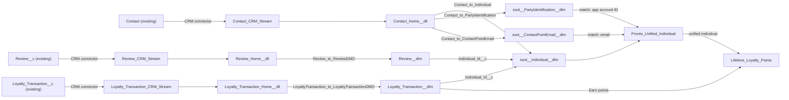

# Implementation spec — Data Cloud unified customer profile (app accounts, loyalty transactions, reviews)

> Ingest `Contact`, `Loyalty_Transaction__c`, and `Review__c` into Data Cloud through the Salesforce CRM connector, unify customers on the Pronto app account ID and email, and compute lifetime loyalty points per unified customer.

_Based on the requirement, the evidence reported by AskCoworker, and read-only org queries where noted. Assumptions and missing evidence are identified below. Specification only — nothing is implemented or deployed._

---

## 1. The requirement

Build a unified customer profile in Data Cloud that combines app accounts, loyalty transactions, and reviews. The user clarified the scope: ingest `Contact`, `Loyalty_Transaction__c`, and `Review__c` through the CRM connector, run identity resolution on `Contact.Pronto_App_Account_Id__c` plus email, and add a calculated insight for lifetime points (*user decision*). The calculated insight is added scope from that answer. The request contained no deploy or data-change instruction.

| # | Responsibility | Trigger | Where it lives |
| --- | --- | --- | --- |
| 1 | Ingest app accounts (Contacts with `Pronto_App_Account_Id__c`) into Data Cloud | CRM connector stream refresh | `Contact_CRM_Stream`, `Contact_Home__dll` |
| 2 | Ingest loyalty transactions | CRM connector stream refresh | `Loyalty_Transaction_CRM_Stream`, `Loyalty_Transaction_Home__dll` |
| 3 | Ingest reviews | CRM connector stream refresh | `Review_CRM_Stream`, `Review_Home__dll` |
| 4 | Map the data to the customer data model (Individual, Party Identification, Contact Point Email, custom loyalty and review DMOs) | Data stream mapping after each refresh | `Contact_to_Individual`, `Contact_to_PartyIdentification`, `Contact_to_ContactPointEmail`, `LoyaltyTransaction_to_LoyaltyTransactionDMO`, `Review_to_ReviewDMO` |
| 5 | Unify individuals on the app account ID and email into one profile | Identity resolution run (scheduled) | `Pronto_Unified_Individual` |
| 6 | Compute lifetime loyalty points per unified individual | Calculated insight schedule | `Lifetime_Loyalty_Points` |

## 2. Grounding — reuse before building

Target org: `TestWriteSpecDE` (Developer Edition, `00Dak00001COqNeEAL`, not a sandbox). API version: `67.0`. _verified by org query_

- **Data Cloud** is provisioned: the `DataStream`, `IdentityResolution`, and `DataSourceBundle` objects exist, and `StaticCurrencyRates_Home__dlm` exists. `SELECT COUNT() FROM DataStream` = 0, `IdentityResolution` = 0, `DataSourceBundle` = 0. No `ssot__` `__dlm` object exists yet (full `sf sobject list --sobject all` scan). Nothing is reused on the Data Cloud side. _verified by org query_
- **`Contact`** (standard object) — the customer and app account record. 198 records. _verified by org query_
- **`Contact.Pronto_App_Account_Id__c`** (Text 20, External ID, Unique) — the app account identity. Populated on 198 of 198 Contacts. _verified by org query_
- **`Contact.Email`** (Email) — populated on 198 of 198 Contacts. One address (`carlos.hernandez@example.com`) is shared by 2 Contacts, and those 2 Contacts have different `Pronto_App_Account_Id__c` values. _verified by org query_
- **`Loyalty_Transaction__c`** (custom object) — loyalty transactions. Fields: `Contact__c` (Master-Detail to `Contact`, cascade delete, not updateable after insert), `Points__c` (Number), `Transaction_Type__c` (picklist: `Earn`, `Redeem`), `Transaction_Source__c` (picklist: `Order`, `Promotion`, `Manual Adjustment`). No business date field; only `CreatedDate`. 0 records today. _verified by org query_
- **`Review__c`** (custom object) — customer reviews. Fields: `Customer__c` (Lookup to `Contact`, populated on 79 of 92 records), `Rating__c` (Number, help text "1 (poor) to 5 (excellent)"), `Comments__c` (Long Text Area 32768), `Order_Date__c` (Date), `Status__c` (picklist: `Submitted`, `Published`; blank on all 92 records), `Storefront__c` (Master-Detail to `Storefront__c`). _verified by org query_
- **`sfdc_a360_sfcrm_data_extract`** (PermissionSet, label "Data Cloud Salesforce Connector", namespace `sfdcInternalInt`, 1 assignment) — already grants Read and View All on `Contact`, `Loyalty_Transaction__c`, and `Review__c`, and Read on every field the streams use: `Contact.Email`, `Contact.Pronto_App_Account_Id__c`, `Loyalty_Transaction__c.Points__c`, `Loyalty_Transaction__c.Transaction_Type__c`, `Loyalty_Transaction__c.Transaction_Source__c`, `Review__c.Customer__c`, `Review__c.Rating__c`, `Review__c.Comments__c`, `Review__c.Order_Date__c`, `Review__c.Status__c`. No permission set in the org has FieldPermissions rows for `Contact.FirstName`, `Contact.LastName`, `Loyalty_Transaction__c.Contact__c`, or `Review__c.Storefront__c`. _verified by org query_
- **Data Cloud permission sets** `CDPAdmin` (Data Cloud Admin), `GenieAdmin` (Data Cloud Architect), and `GenieUserEnhancedSecurity` (Data Cloud User) exist in namespace `force`, and none of them is assigned to any user. _verified by org query_
- **Automation on the source objects:** no Apex triggers and no flows with `TriggerObjectOrEventId` = `Contact`, `Loyalty_Transaction__c`, or `Review__c`. Unmanaged Apex classes that read the objects: `AgentSummarizeReviewsActions` and `AgentReviewActions` (`Review__c`), `AgentGetLoyaltyTierActions` (`Loyalty_Tier__c`). The design does not change these CRM components. _verified by org query_
- **Project:** `force-app` contains no Data Cloud metadata and no references to the three objects. _verified by project file_

Candidates examined and rejected: `Transaction__c` — order and payment transactions (fields `Total_Amount`, `Payment_Method`, `Refund_Reason`), not loyalty; `Account` — merchant records (`Merchant_Code__c`, `Cuisine_Type__c`), not app accounts; `Contact.Member_Number__c` (Text 8, 187 of 198 populated) — not named by the user as a match key; `Individual` (CRM object, 0 records, `Contact.IndividualId` blank on all Contacts) — not needed because the Data Cloud Individual DMO is built from `Contact`. _verified by org query_

Evidence sources: `sf org display`; `sf sobject list` (custom and all); `sf sobject describe` on the three objects; Tooling `EntityDefinition`, `CustomField`, `ApexTrigger`, `ApexClass` body search; `FlowDefinitionView`; `PermissionSet`, `ObjectPermissions`, `FieldPermissions`, `PermissionSetAssignment`; count and `GROUP BY` queries on data shape. AskCoworker returned no citedReferences. After two AskCoworker claims were contradicted (see Section 8), every AskCoworker fact kept in this spec was checked by an org query or falls back to documented platform behavior.

## 3. Architecture

Why the pieces are drawn this way:

1. The three source objects exist and the connector permission set already reads them (_verified by org query_), so ingestion uses the standard Salesforce CRM connector (*user decision*), not the Ingestion API or Apex.
2. Each CRM data stream creates one data lake object. The `Contact` stream feeds three standard DMOs: Individual (the person), Party Identification (the app account ID as an identifier with type `Pronto App Account`), and Contact Point Email. Identity resolution match rules run on those DMOs (*assumption (documented platform behavior)*).
3. Loyalty transactions and reviews go to custom engagement DMOs with a `Individual_Id__c` relationship to `ssot__Individual__dlm.ssot__Id__c`, populated from `Loyalty_Transaction__c.Contact__c` and `Review__c.Customer__c`. Custom DMOs keep the CRM fields as they are; see Section 8 for the standard-DMO alternative (*assumption*).
4. `Pronto_Unified_Individual` produces the unified individual and its unified link object; the calculated insight joins loyalty rows through that link and sums `Earn` points (*assumption*).
5. No Apex or flow is involved; every component is standard Data Cloud configuration.

## 4. Metadata changes

**Ingestion**

- **Create `Contact_CRM_Stream`** — DataStreamDefinition. Salesforce CRM connector stream on `Contact` from org `TestWriteSpecDE`, category Profile, primary key `Id`, record modified field `LastModifiedDate`. Fields: `Id`, `FirstName`, `LastName`, `Email`, `Pronto_App_Account_Id__c`, `LastModifiedDate`. Refresh: CRM connector default (incremental). Delivered by Setup step: Data Cloud Setup > Data Streams > New > Salesforce CRM.
- **Create `Contact_Home__dll`** — MktDataTranObject (data lake object). Created with `Contact_CRM_Stream`; holds the six fields above. The `_Home` suffix is the name the CRM connector proposes and may differ (*assumption*).
- **Create `Loyalty_Transaction_CRM_Stream`** — DataStreamDefinition. CRM connector stream on `Loyalty_Transaction__c`, category Engagement, primary key `Id`, event time field `CreatedDate`, record modified field `LastModifiedDate`. Fields: `Id`, `Name`, `Contact__c`, `Points__c`, `Transaction_Type__c`, `Transaction_Source__c`, `CreatedDate`, `LastModifiedDate`. Delivered by Setup step: Data Cloud Setup > Data Streams.
- **Create `Loyalty_Transaction_Home__dll`** — MktDataTranObject (data lake object). Created with `Loyalty_Transaction_CRM_Stream`.
- **Create `Review_CRM_Stream`** — DataStreamDefinition. CRM connector stream on `Review__c`, category Engagement, primary key `Id`, event time field `CreatedDate`, record modified field `LastModifiedDate`. Fields: `Id`, `Name`, `Customer__c`, `Storefront__c`, `Rating__c`, `Comments__c`, `Order_Date__c`, `Status__c`, `CreatedDate`, `LastModifiedDate`. Delivered by Setup step: Data Cloud Setup > Data Streams.
- **Create `Review_Home__dll`** — MktDataTranObject (data lake object). Created with `Review_CRM_Stream`.

**Data model**

- **Create `Loyalty_Transaction__dlm`** — MktDataTranObject (custom data model object, category Engagement). Fields: `Loyalty_Transaction_Id__c` (Text, primary key), `Individual_Id__c` (Text, relationship to `ssot__Individual__dlm.ssot__Id__c`, many-to-one), `Points__c` (Number), `Transaction_Type__c` (Text), `Transaction_Source__c` (Text), `Transaction_Date__c` (DateTime, event time). Delivered by Setup step: Data Cloud > Data Model > New.
- **Create `Review__dlm`** — MktDataTranObject (custom data model object, category Engagement). Fields: `Review_Id__c` (Text, primary key), `Individual_Id__c` (Text, relationship to `ssot__Individual__dlm.ssot__Id__c`, many-to-one), `Storefront_Id__c` (Text), `Rating__c` (Number), `Comments__c` (Text), `Order_Date__c` (Date), `Status__c` (Text), `Review_Date__c` (DateTime, event time). Delivered by Setup step: Data Cloud > Data Model > New.
- **Create `Contact_to_Individual`** — ObjectSourceTargetMap. `Contact_Home__dll` to `ssot__Individual__dlm`: `Id` to `ssot__Id__c`, `FirstName` to `ssot__FirstName__c`, `LastName` to `ssot__LastName__c`.
- **Create `Contact_to_PartyIdentification`** — ObjectSourceTargetMap. `Contact_Home__dll` to `ssot__PartyIdentification__dlm`: `Id` to `ssot__Id__c` and to `ssot__PartyId__c`, `Pronto_App_Account_Id__c` to `ssot__IdentificationNumber__c`, constant `Pronto App Account` to `ssot__IdentificationName__c` and `ssot__PartyIdentificationTypeId__c` (formula field on the data lake object if the mapping cannot take a constant).
- **Create `Contact_to_ContactPointEmail`** — ObjectSourceTargetMap. `Contact_Home__dll` to `ssot__ContactPointEmail__dlm`: `Id` to `ssot__Id__c` and to `ssot__PartyId__c`, `Email` to `ssot__EmailAddress__c`.
- **Create `LoyaltyTransaction_to_LoyaltyTransactionDMO`** — ObjectSourceTargetMap. `Loyalty_Transaction_Home__dll` to `Loyalty_Transaction__dlm`: `Id` to `Loyalty_Transaction_Id__c`, `Contact__c` to `Individual_Id__c`, `Points__c`, `Transaction_Type__c`, `Transaction_Source__c` to the same-named fields, `CreatedDate` to `Transaction_Date__c`.
- **Create `Review_to_ReviewDMO`** — ObjectSourceTargetMap. `Review_Home__dll` to `Review__dlm`: `Id` to `Review_Id__c`, `Customer__c` to `Individual_Id__c`, `Storefront__c` to `Storefront_Id__c`, `Rating__c`, `Comments__c`, `Order_Date__c`, `Status__c` to the same-named fields, `CreatedDate` to `Review_Date__c`.

**Identity resolution**

- **Create `Pronto_Unified_Individual`** — IdentityResolution (ruleset on Individual). Delivered by Setup step: Data Cloud > Identity Resolutions > New. Match rule 1: Party Identification, exact match on `ssot__IdentificationNumber__c` where `ssot__IdentificationName__c` = `Pronto App Account`. Match rule 2: exact normalized match on `ssot__ContactPointEmail__dlm.ssot__EmailAddress__c`. Rules are alternatives (either one links records). Reconciliation: Last Updated for `ssot__FirstName__c` and `ssot__LastName__c`. Run schedule: automatic (default).

**Calculated insight**

- **Create `Lifetime_Loyalty_Points`** — MktCalcInsightObjectDef. Dimension: unified individual ID. Measure `lifetime_points__c` = `SUM(Loyalty_Transaction__dlm.Points__c)` over rows where `Transaction_Type__c = 'Earn'`, joined `Loyalty_Transaction__dlm.Individual_Id__c` to the unified link object's `SourceRecordId__c` and grouped by `UnifiedRecordId__c`. The unified object names are generated from the ruleset and must be read after the first run. Individuals with no `Earn` rows get no insight row (not 0). Schedule: every 24 hours.

## 5. Data 360 (Data Cloud) data involved

Data Cloud is the target. Sources: `Contact` (198 records), `Loyalty_Transaction__c` (0 records), `Review__c` (92 records, 13 with blank `Customer__c`) through the Salesforce CRM connector running under `sfdc_a360_sfcrm_data_extract` (_verified by org query_). Data lake objects: `Contact_Home__dll`, `Loyalty_Transaction_Home__dll`, `Review_Home__dll`. Data model objects: standard `ssot__Individual__dlm`, `ssot__PartyIdentification__dlm`, `ssot__ContactPointEmail__dlm`, and custom `Loyalty_Transaction__dlm` and `Review__dlm`. Identity resolution ruleset `Pronto_Unified_Individual` produces the unified individual and unified link objects. Calculated insight `Lifetime_Loyalty_Points` adds the lifetime points measure.

Runtime order (*assumption (documented platform behavior)*): stream refresh, then mapping into DMOs, then identity resolution, then the calculated insight on its schedule. CRM inserts, updates, and deletes reach the data lake objects on the next incremental refresh. Deleting a `Contact` cascade-deletes its `Loyalty_Transaction__c` records (_verified by org query_: `cascadeDelete` true); undeleting the `Contact` restores those children, and the next refresh re-ingests them. `Loyalty_Transaction__c.Contact__c` cannot be reparented (not updateable, _verified by org query_). A change of `Review__c.Customer__c` moves the review to the new individual on the next refresh. Reviews with blank `Customer__c` (13 of 92 today) are ingested with a blank `Individual_Id__c` and are not attached to any profile.

## 6. Security considerations

- **Connector context:** the CRM connector reads CRM data under the managed permission set `sfdc_a360_sfcrm_data_extract`, which already has Read and View All on the three objects and Read on every custom field in the streams (_verified by org query_). No permission set change is needed. That permission set is namespaced (`sfdcInternalInt`) and is not changed. Name fields (`FirstName`, `LastName`) and master-detail fields (`Loyalty_Transaction__c.Contact__c`, `Review__c.Storefront__c`) are not controlled by field-level security; their visibility follows object Read (*assumption (documented platform behavior)*).
- **Data Cloud users:** unified profiles, DMOs, and the calculated insight are visible only to users with a Data Cloud permission set. None of `CDPAdmin`, `GenieAdmin`, `GenieUserEnhancedSecurity` is assigned today (_verified by org query_). Assigning `CDPAdmin` to the implementing administrator is a blocking setup step (Section 8). No new permission set is created.
- **Data exposure:** Data Cloud does not apply CRM sharing or field-level security to DMO rows. `Contact.Email` and `Review__c.Comments__c` (free text that can contain personal data) become visible to every Data Cloud user (*assumption (documented platform behavior)*). The CRM objects, their sharing, and their field access are unchanged.

## 7. Testing strategy

No Apex tests or Flow Tests apply: every change is Data Cloud configuration. Recommended verification, run in the org after setup:

1. **Streams:** the three data streams show status Active. After the first refresh, `Contact_Home__dll` has 198 rows, `Loyalty_Transaction_Home__dll` 0, `Review_Home__dll` 92 (current counts, _verified by org query_).
2. **Mappings:** `ssot__Individual__dlm`, `ssot__PartyIdentification__dlm`, and `ssot__ContactPointEmail__dlm` each have 198 rows from this source; every Party Identification row has `ssot__IdentificationName__c` = `Pronto App Account`. `Review__dlm` has 92 rows, 13 with blank `Individual_Id__c`.
3. **Identity resolution (load-bearing):** the ruleset run completes. Each Contact with a unique app account ID and email becomes one unified individual. The 2 Contacts that share `carlos.hernandez@example.com` become one unified individual through match rule 2; confirm this against the Section 8 decision.
4. **Calculated insight:** with 0 loyalty transactions, the insight returns no rows. In a test pass, create one Contact with two `Earn` transactions (100 and 50 points) and one `Redeem` transaction; after refresh, resolution, and the insight run, `lifetime_points__c` = 150 for that unified individual. A Contact with only a `Redeem` transaction gets no insight row.
5. **Change propagation:** update a Contact's `Email`; after the next refresh and resolution run, the unified profile shows the new email. Delete a test Contact with loyalty transactions; its rows disappear after the next refresh. Undelete it; the rows return.
6. **Negative case:** a review with blank `Customer__c` does not appear on any unified profile.
7. **Permission case:** a user without a Data Cloud permission set cannot open Data Cloud or the unified profile; a user with `CDPAdmin` can.
8. **Long text:** the `Review_CRM_Stream` preview shows `Comments__c`; if the connector excludes it, the rest of the design is unaffected.

## 8. Open decisions

### Open

1. **Data Cloud Admin assignment (blocking for delivery).** No user has `CDPAdmin`, `GenieAdmin`, or `GenieUserEnhancedSecurity` (_verified by org query_). Recommended: assign `CDPAdmin` (Data Cloud Admin) to the implementing administrator in Setup > Users > Permission Set Assignments before building any row. Viewer access for other users is not requested; assign `GenieUserEnhancedSecurity` when a persona is named.
2. **Shared email merges two app accounts (non-blocking).** The user chose email as a match key. The 2 Contacts sharing `carlos.hernandez@example.com` have different `Pronto_App_Account_Id__c` values, so match rule 2 merges two app accounts into one profile (_verified by org query_). Recommended: keep the rule as decided and review the pair as a data clean-up step before the first resolution run; if they are different people, correct the email in CRM.
3. **Metadata type names and packaging (non-blocking).** The types `DataStreamDefinition`, `MktDataTranObject`, `ObjectSourceTargetMap`, `IdentityResolution`, and `MktCalcInsightObjectDef` and the generated API names (`Contact_Home__dll`, the unified object names) cannot be confirmed with read-only queries (*assumption*). Every row is delivered by Setup steps in Data Cloud; to promote to another org, add the components to a data kit. A duplicate of any Data Cloud component is ruled out by the zero counts of `DataStream` and `IdentityResolution`, but not for custom DMOs and calculated insights, which cannot be listed.
4. **Loyalty data is empty (non-blocking).** `Loyalty_Transaction__c` has 0 records (_verified by org query_), so `Lifetime_Loyalty_Points` returns nothing until loyalty data exists. The design is complete; UAT needs test transactions.

### Resolved

- **Source and scope (*user decision*).** Asked: "Which source should the unified profile use for app accounts, and which keys should decide that two records are the same customer? Options: (a) CRM `Contact` records via the Salesforce CRM connector, with `Pronto_App_Account_Id__c` (198 of 198 populated) as the app account ID — recommended; (b) an external Pronto app system through the Ingestion API. Keys: app account ID only, or app account ID plus email." Answer: ingest `Contact`, Loyalty Transaction, and Review via the CRM connector; identity resolution on Pronto App Account Id plus email; add a calculated insight for lifetime points.
- **Lifetime points definition (*assumption*).** "Lifetime points" is the sum of `Points__c` on `Earn` transactions. This does not depend on the sign convention of `Redeem` points, which no data settles (0 records). A net-balance insight is a proposal.
- **Custom DMOs for loyalty and reviews (*assumption*).** Custom engagement DMOs map the CRM fields one to one. Mapping loyalty rows to standard loyalty DMOs would require loyalty program member data that the org does not have (no loyalty program objects in the custom object scan, _verified by org query_).
- **Stream field lists (*assumption*).** Streams carry only the fields the responsibilities need. `Contact.Loyalty_Tier__c`, `Contact.Member_Number__c`, `Contact.Lifetime_Orders__c`, and `Contact.Lifetime_Value__c` can be added to `Contact_CRM_Stream` later as a proposal; the requirement does not ask for them.
- **Correction: connector field access (AskCoworker wrong claim 1).** D1 reported that missing FLS on `Loyalty_Transaction__c.Contact__c` blocks ingestion. Master-detail fields have no field-level security; no permission set in the org has a FieldPermissions row for that field (_verified by org query_), and the object Read grant covers it. No permission change is needed.
- **Correction: undelete behavior (AskCoworker wrong claim 2).** R reported that undeleting a `Contact` does not restore cascade-deleted `Loyalty_Transaction__c` records. Documented behavior is that undeleting a master record restores its detail records (*assumption (documented platform behavior)*). After this second wrong claim, all remaining AskCoworker facts were checked against org queries.
- **Correction: empty insight result.** AskCoworker said the insight "returns 0" for individuals without transactions; a grouped SUM produces no row for them (*assumption (documented platform behavior)*).
- **Dropped AskCoworker content:** "prior session" references to `Loyalty_Transaction__c.Order_Id__c` and `Order_Total__c` in an "accepted inventory" (untraceable; the fields do not exist, _verified by org query_); `Phone`, `Birthdate`, and `AccountId` in the Contact stream and Birthdate reconciliation (not needed); the claim that `Comments__c` ingestion is conditional (kept as a verification step only); custom DMO fields named `ssot__IndividualId__c` (custom DMO fields do not use the `ssot__` namespace).
- **Deployment sequence.** Assign `CDPAdmin` (Open 1); create the three data streams and their data lake objects; create the two custom DMOs; create the five mappings; review the shared-email pair (Open 2); create and run `Pronto_Unified_Individual`; after the first run, read the unified object names and create `Lifetime_Loyalty_Points`.

## 9. Change set

| # | Action | Type | API name | Module | Why |
| --- | --- | --- | --- | --- | --- |
| 1 | Create | DataStreamDefinition | `Contact_CRM_Stream` | Not specified | Ingest app accounts (Contacts) through the CRM connector |
| 2 | Create | MktDataTranObject | `Contact_Home__dll` | Not specified | Data lake object for the Contact stream |
| 3 | Create | DataStreamDefinition | `Loyalty_Transaction_CRM_Stream` | Not specified | Ingest loyalty transactions |
| 4 | Create | MktDataTranObject | `Loyalty_Transaction_Home__dll` | Not specified | Data lake object for the loyalty stream |
| 5 | Create | DataStreamDefinition | `Review_CRM_Stream` | Not specified | Ingest reviews |
| 6 | Create | MktDataTranObject | `Review_Home__dll` | Not specified | Data lake object for the review stream |
| 7 | Create | MktDataTranObject | `Loyalty_Transaction__dlm` | Not specified | Custom DMO linking loyalty rows to Individual |
| 8 | Create | MktDataTranObject | `Review__dlm` | Not specified | Custom DMO linking reviews to Individual |
| 9 | Create | ObjectSourceTargetMap | `Contact_to_Individual` | Not specified | Build Individual from Contact |
| 10 | Create | ObjectSourceTargetMap | `Contact_to_PartyIdentification` | Not specified | App account ID as an identity key |
| 11 | Create | ObjectSourceTargetMap | `Contact_to_ContactPointEmail` | Not specified | Email as an identity key |
| 12 | Create | ObjectSourceTargetMap | `LoyaltyTransaction_to_LoyaltyTransactionDMO` | Not specified | Map loyalty rows to the custom DMO |
| 13 | Create | ObjectSourceTargetMap | `Review_to_ReviewDMO` | Not specified | Map reviews to the custom DMO |
| 14 | Create | IdentityResolution | `Pronto_Unified_Individual` | Not specified | Unify individuals on app account ID and email |
| 15 | Create | MktCalcInsightObjectDef | `Lifetime_Loyalty_Points` | Not specified | Lifetime Earn points per unified individual |

Three CRM connector streams feed standard identity DMOs and two custom engagement DMOs, one identity resolution ruleset unifies individuals on app account ID and email, and one calculated insight adds lifetime points.

Total: 15 · Create: 15 · Update: 0 · Delete: 0
