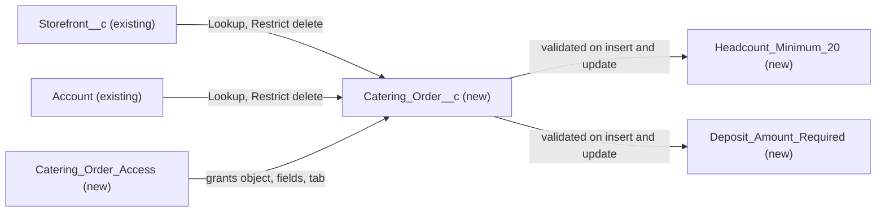

# Implementation spec — Catering orders with deposit and minimum headcount of 20

> Add a Catering Order object, related to a storefront and a customer account, that cannot be saved without a deposit amount greater than zero and a headcount of at least 20.

_Based on the requirement, the evidence reported by AskCoworker, and read-only org queries where noted. Assumptions and missing evidence are identified below. Specification only — nothing is implemented or deployed._

---

## 1. The requirement

Catering orders need a deposit and a minimum headcount of 20. No catering order concept exists in the org, so the user decided on a new Catering Order object that records headcount, event date, deposit amount, and whether the deposit is paid, related to `Storefront__c` and the customer `Account` (*user decision*). The request contained no deploy or data instructions.

| # | Responsibility | Trigger | Where it lives |
| --- | --- | --- | --- |
| 1 | Record catering orders for a storefront and a customer account, with headcount, event date, deposit amount, and deposit paid | User creates or edits a record | `Catering_Order__c` and its fields |
| 2 | Block save when headcount is below 20 | Insert and update | `Catering_Order__c.Headcount_Minimum_20` |
| 3 | Block save when no deposit amount greater than zero is entered | Insert and update | `Catering_Order__c.Deposit_Amount_Required` |
| 4 | Give catering staff access to the object, fields, and tab | Permission set assignment | `Catering_Order_Access` |

## 2. Grounding — reuse before building

Target org: `TestWriteSpecDE` (ID `00Dak00001COqNeEAL`, connected). API version: `67.0` (`sourceApiVersion` `67.0` in `sfdx-project.json`, _verified by project file_).

- **No catering object exists.** The unmanaged custom objects are `Event_Storefront__c`, `Gift_Certificate__c`, `Loyalty_Transaction__c`, `Marketing_Event__c`, `Menu_Category__c`, `Menu_Item__c`, `Menu__c`, `Onboarding_Application__c`, `Payment_Methods__c`, `Promotion__c`, `Refund__c`, `Region__c`, `Review__c`, `Storefront_Hours_of_Operation__c`, `Storefront_Tag__c`, `Storefront__c`, `Transaction__c`. _verified by org query_
- **No field for the same concepts.** Tooling `CustomField` with `DeveloperName` LIKE `%Cater%`, `%Deposit%`, `%Headcount%`, `%Guest%` returned no rows on any object; `%Attend%` returned only `Marketing_Event__c.Expected_Attendance__c` and `Marketing_Event__c.Actual_Attendance__c`. _verified by org query_
- **`Storefront__c`** (CustomObject) — lookup target. 21 records; has `Account__c` Lookup(Account); internal sharing `ReadWrite`, external `Private`; 0 Apex triggers and 0 record-triggered flows. _verified by org query_
- **`Account`** (standard object) — lookup target for the customer. Internal sharing `ReadWrite`, external `Private`; 0 Apex triggers and 0 record-triggered flows. _verified by org query_
- **Permission sets on the parents.** `Agentforce_Reference_App` grants Read/Create/Edit/Delete, View All, and Modify All on `Storefront__c` and Read/Create, View All, Modify All on `Account`; `Pronto_Deep_Dive_Workshop` grants Read and View All on both. Neither is widened. _verified by org query_
- **Project source.** `force-app/main/default/objects` and `force-app/main/default/permissionsets` are empty. _verified by project file_
- **Data 360.** `SELECT COUNT() FROM DataStream` returned 0. _verified by org query_

Candidates examined and rejected:
- `Marketing_Event__c` — a promotional event object (`Type__c` values `Food Festival`, `Grand Opening`, `Seasonal`, `Tasting`, `Live Entertainment`, `Community`, `Holiday`, `Loyalty`, `Pop-Up`, `Class & Workshop`; no Catering value; 12 records) with `Expected_Attendance__c` (Number) and `Budget__c` (Currency) but no deposit field; _verified by org query_. The user chose a dedicated object (*user decision*).
- Standard `Order` — 0 records and only one inactive managed flow, `Create_OS` (namespace `runtime_commerce_oms`); _verified by org query_. Not chosen by the user.
- `Transaction__c` — no custom fields; _reported by AskCoworker_, consistent with the Tooling `CustomField` search above.
- Storefront and order Apex classes `AgentStorefrontActions`, `AgentGetStorefrontsByAccountActions`, `StorefrontPickerAction`, `OrderPickerAction`, `OrderPickerController`, `OrderStatusCardAction` exist (unmanaged; _verified by org query_). The requirement does not ask any of them to read catering orders, so none changes.

Evidence sources: `sf org display`; `sf sobject list`; `sobject describe` of `Marketing_Event__c`, `Order`, `Opportunity`, `Transaction__c`, `Storefront__c`; Tooling `CustomField`, `ApexTrigger`, `ApexClass`, `ValidationRule`, `MetadataComponentDependency`; `FlowDefinitionView`; `EntityDefinition`; `ObjectPermissions`; `PermissionSet`; `DataStream`. AskCoworker returned no citedReferences.

## 3. Architecture

Why the pieces are drawn this way:

1. `Catering_Order__c` is a new object because nothing in the org represents a catering order (_verified by org query_) and the user chose a dedicated object (*user decision*).
2. Both relationships are required lookups with delete constraint Restrict, not master-detail: a storefront or account that has catering orders cannot be deleted, so no order is lost by cascade delete (*assumption*). The requirement asks for no roll-ups, which is the main reason for master-detail.
3. Enforcement uses validation rules, the standard mechanism for save-time rules. No flow or Apex is needed, and no automation exists on the parent objects that could interfere (_verified by org query_).
4. A new dedicated permission set is used because the existing permission sets that reach the parent objects are broad (Modify All on `Storefront__c`) and must not be widened.

## 4. Metadata changes

**Data model**

- **Create `Catering_Order__c`** — CustomObject. Label "Catering Order", plural "Catering Orders". Name field: Auto Number, display format `CO-{0000}`, starting at 1. `sharingModel` `ReadWrite` and `externalSharingModel` `Private`, matching `Storefront__c` and `Account`. Allow Reports enabled. Search enabled.
- **Create `Catering_Order__c.Storefront__c`** — CustomField, Lookup(`Storefront__c`). Label "Storefront". Required. `deleteConstraint` `Restrict`. Relationship name `Catering_Orders`.
- **Create `Catering_Order__c.Account__c`** — CustomField, Lookup(`Account`). Label "Customer Account". Required. `deleteConstraint` `Restrict`. Relationship name `Catering_Orders`.
- **Create `Catering_Order__c.Headcount__c`** — CustomField, Number(5, 0). Label "Headcount". Required. Help text: "Number of guests. Must be at least 20."
- **Create `Catering_Order__c.Event_Date__c`** — CustomField, Date. Label "Event Date". Optional (the requirement does not make it mandatory).
- **Create `Catering_Order__c.Deposit_Amount__c`** — CustomField, Currency(16, 2). Label "Deposit Amount". Required. Help text: "Deposit agreed for this order. Must be greater than zero."
- **Create `Catering_Order__c.Deposit_Paid__c`** — CustomField, Checkbox. Label "Deposit Paid". Default `false`. Tracks collection; not enforced.

**Automation**

- **Create `Catering_Order__c.Headcount_Minimum_20`** — ValidationRule, active. Formula `Headcount__c < 20`. Error message "Catering orders need a headcount of at least 20." Error location `Headcount__c`. Blank handling: the field is required, so a blank value is rejected by the required flag whatever the rule returns for blank; 0 fires the rule.
- **Create `Catering_Order__c.Deposit_Amount_Required`** — ValidationRule, active. Formula `Deposit_Amount__c <= 0`. Error message "Catering orders need a deposit amount greater than zero." Error location `Deposit_Amount__c`. Result: 0 or negative fires; blank is blocked by the required flag.

**UX**

- **Create `Catering_Order__c-Catering Order Layout`** — Layout. Section "Order Details": `Name` (read-only), `Storefront__c`, `Account__c`, `Event_Date__c`, `Headcount__c`. Section "Deposit": `Deposit_Amount__c`, `Deposit_Paid__c`. Assigned to all profiles (only one layout exists for the new object).
- **Create `Catering_Order__c`** — CustomTab for the object, so users can open the list and create records.

**Security**

- **Create `Catering_Order_Access`** — PermissionSet, label "Catering Order Access". Object `Catering_Order__c`: Read, Create, Edit (no Delete, no View All, no Modify All). Field Read and Edit on `Catering_Order__c.Storefront__c`, `Catering_Order__c.Account__c`, `Catering_Order__c.Headcount__c`, `Catering_Order__c.Event_Date__c`, `Catering_Order__c.Deposit_Amount__c`, `Catering_Order__c.Deposit_Paid__c`. Object Read on `Storefront__c` and `Account` so the lookups resolve. Tab setting `Catering_Order__c`: Visible.

## 5. Data 360 (Data Cloud) data involved

Not applicable — this change does not use Data 360. The org has 0 data streams (_verified by org query_).

## 6. Security considerations

- **Execution context.** Only validation rules run on save; they evaluate every record regardless of the running user's field access (*assumption (documented platform behavior)*). No Apex or flow is added.
- **Sharing.** `Catering_Order__c` is internal `ReadWrite`, external `Private` (*assumption*, matching the parents that are _verified by org query_). Any internal user with object access can read and edit every catering order. External and guest users see none.
- **CRUD/FLS.** Only `Catering_Order_Access` grants access. Deploying a new object and fields grants no object or field access to any profile or permission set that is not part of the deployment (*assumption (documented platform behavior)*). The System Administrator profile has View All Data and Modify All Data, and the `Analytics Cloud Integration User` profile has View All Data (_verified by org query_); both reach records through those permissions, and neither receives field access on deploy.
- **Not granted.** `Agentforce_Reference_App`, `Pronto_Deep_Dive_Workshop`, the managed `sfdcInternalInt` permission sets, and the profiles `Custom%3A Sales Profile`, `Custom%3A Marketing Profile`, and `Custom%3A Support Profile` get no access to `Catering_Order__c`.
- **Delete.** Users with `Catering_Order_Access` cannot delete catering orders; see Section 8.
- **Data exposure.** The object stores deposit amounts and customer account links, visible to all holders of `Catering_Order_Access`.

## 7. Testing strategy

All changes are declarative, so there are no Apex test classes and no Flow Tests. Recommended manual verification in a sandbox, as a user who holds only `Catering_Order_Access`:

1. **Headcount boundary.** Save with `Headcount__c` = 19: blocked by `Headcount_Minimum_20`. Save with 20: succeeds.
2. **Headcount on update.** Edit a saved order from 25 to 19: blocked.
3. **Deposit boundary.** Save with `Deposit_Amount__c` = 0 or -1: blocked by `Deposit_Amount_Required`. Save with 0.01: succeeds.
4. **Blank values.** Save with `Headcount__c` or `Deposit_Amount__c` blank: blocked by the required flag. This verifies the load-bearing assumption that the required flags cover blanks the rules do not.
5. **Both rules.** Save with `Headcount__c` = 1 and `Deposit_Amount__c` = 0: both errors shown.
6. **Deposit Paid.** Toggle `Deposit_Paid__c` on a valid order: saves; no rule references it.
7. **Bulk.** Insert 200 records with Data Loader (or anonymous Apex `Database.insert(records, false)`), 100 valid and 100 with `Headcount__c` = 5: 100 succeed and 100 fail with the headcount error.
8. **Permission.** A user without `Catering_Order_Access` cannot see the tab or open a record; a user with it can create, read, and edit, but not delete.
9. **Restrict delete.** Delete a `Storefront__c` or `Account` that has a catering order: blocked by the platform.

## 8. Open decisions

### Open

1. **Permission set assignment (blocking for delivery).** Nobody can use catering orders until `Catering_Order_Access` is assigned. The users who take catering orders are not specified. Recommended default: assign in Setup > Permission Sets > Catering Order Access > Manage Assignments to the catering staff after deployment.
2. **Delete access (non-blocking).** The requirement does not say who may delete catering orders. Default: no Delete in `Catering_Order_Access`; administrators can delete through Modify All Data. Add Delete if staff must remove orders.
3. **App placement (non-blocking).** The tab is visible through the permission set but is not added to any Lightning app, because no app was named. Proposal: add the tab to the app catering staff use.
4. **Storefront related list (non-blocking).** Proposal: add a Catering Orders related list to the `Storefront__c` and `Account` layouts. Not included because changing shared layouts changes them for everyone and the requirement does not ask for it.
5. **Event date rules (non-blocking).** `Event_Date__c` is optional and past dates are allowed, because the requirement does not say otherwise. Proposal: make it required or block past dates if the business wants that.
6. **Undelete edge case (non-blocking).** If a catering order is in the Recycle Bin, its parent may be deletable; undeleting the order afterward may fail or leave the lookup empty (*assumption*, not verified). Check in a sandbox if it matters.

Deployment sequence: deploy `Catering_Order__c` and its fields, then the validation rules, layout, and tab, then `Catering_Order_Access` (one deployment in dependency order works); then assign the permission set.

### Resolved

- **Which object is a catering order.** The user chose a new Catering Order object related to `Storefront__c` and the customer `Account`, with headcount, event date, deposit amount, and deposit paid (*user decision*). `Marketing_Event__c` and `Order` were rejected (Section 2).
- **Meaning of "need a deposit".** The user asked for a deposit amount and a deposit paid field but did not say which is enforced. Decision: a deposit amount greater than zero is required on save; `Deposit_Paid__c` is tracked and not enforced, because requiring payment before save would block taking an order before the deposit is collected (*assumption*).
- **Headcount field.** A new `Catering_Order__c.Headcount__c`, not `Marketing_Event__c.Expected_Attendance__c`, follows from the object decision (*user decision*).
- **Lookup instead of master-detail, with Restrict delete** (*assumption*). A required lookup cannot use Clear delete behavior, so Restrict is used; AskCoworker's statement that an order "can exist if the storefront is deleted" was corrected accordingly.
- **Correction to AskCoworker: sharing.** AskCoworker said the new object "inherits" the parents' sharing model. A new object's sharing comes from its own `sharingModel` metadata; it is set explicitly to `ReadWrite` / `Private` (*assumption (documented platform behavior)*).
- **Correction to AskCoworker: profiles.** AskCoworker said no profile other than System Administrator has View All Data. The query shows `Analytics Cloud Integration User` has View All Data (_verified by org query_). This was the second wrong AskCoworker claim, so every AskCoworker fact kept in this spec was re-verified by query.
- **Validation formulas.** AskCoworker's `Deposit_Amount__c = null || Deposit_Amount__c <= 0` and required flags were simplified: the required flag blocks blanks and the rule tests only `<= 0` (*assumption*).
- **Dropped AskCoworker proposals:** a compact layout (the platform default is enough), a required `Event_Date__c`, a past-date rule, and a Delete grant — none is asked for by the requirement.
- **Event date field required or not.** Kept optional; the requirement names the field but not a rule (*assumption*).

## 9. Change set

| # | Action | Type | API name | Module | Why |
| --- | --- | --- | --- | --- | --- |
| 1 | Create | CustomObject | `Catering_Order__c` | force-app/main/default/objects/Catering_Order__c | Catering orders need their own record (user decision) |
| 2 | Create | CustomField | `Catering_Order__c.Storefront__c` | force-app/main/default/objects/Catering_Order__c/fields | Relate the order to the storefront |
| 3 | Create | CustomField | `Catering_Order__c.Account__c` | force-app/main/default/objects/Catering_Order__c/fields | Relate the order to the customer account |
| 4 | Create | CustomField | `Catering_Order__c.Headcount__c` | force-app/main/default/objects/Catering_Order__c/fields | Store the headcount the minimum applies to |
| 5 | Create | CustomField | `Catering_Order__c.Event_Date__c` | force-app/main/default/objects/Catering_Order__c/fields | Store the event date (user decision) |
| 6 | Create | CustomField | `Catering_Order__c.Deposit_Amount__c` | force-app/main/default/objects/Catering_Order__c/fields | Store the required deposit |
| 7 | Create | CustomField | `Catering_Order__c.Deposit_Paid__c` | force-app/main/default/objects/Catering_Order__c/fields | Track whether the deposit is collected (user decision) |
| 8 | Create | ValidationRule | `Catering_Order__c.Headcount_Minimum_20` | force-app/main/default/objects/Catering_Order__c/validationRules | Enforce the minimum headcount of 20 |
| 9 | Create | ValidationRule | `Catering_Order__c.Deposit_Amount_Required` | force-app/main/default/objects/Catering_Order__c/validationRules | Enforce a deposit greater than zero |
| 10 | Create | Layout | `Catering_Order__c-Catering Order Layout` | force-app/main/default/layouts | Place the fields for users |
| 11 | Create | CustomTab | `Catering_Order__c` | force-app/main/default/tabs | Let users open and create catering orders |
| 12 | Create | PermissionSet | `Catering_Order_Access` | force-app/main/default/permissionsets | Grant object, field, lookup-target, and tab access |

A new `Catering_Order__c` object with required lookups to `Storefront__c` and `Account`, enforced by two validation rules and accessed through one dedicated permission set.

Total: 12 · Create: 12 · Update: 0 · Delete: 0
