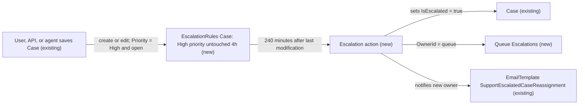

# Implementation spec — Escalate untouched high-priority cases after 4 hours

> Open `Case` records with `Priority` = `High` that nobody modifies for 4 hours are escalated (`IsEscalated` = true) and reassigned to a new `Escalations` queue by a standard Case escalation rule.

_Based on the requirement, the evidence reported by AskCoworker, and read-only org queries where noted. Assumptions and missing evidence are identified below. Specification only — nothing is implemented or deployed._

---

## 1. The requirement

Escalate high-priority cases that have not been touched in 4 hours; the user decided that "escalate" means setting `IsEscalated` and reassigning the case to an Escalations queue, that "touched" means modified, and that business hours are not required (*user decision*).

| # | Responsibility | Trigger | Where it lives |
| --- | --- | --- | --- |
| 1 | Detect open `Case` records with `Priority` = `High` whose last modification is 4 hours old | Case create or edit starts or restarts the age clock | `EscalationRules` `Case` (new rule entry) |
| 2 | Mark the case escalated (`IsEscalated` = true) | Escalation action fires at 240 minutes | `EscalationRules` `Case` (platform sets `IsEscalated` when an escalation action fires) |
| 3 | Reassign the case to the Escalations queue and notify the new owner | Same escalation action | `EscalationRules` `Case`, `Queue` `Escalations`, existing `SupportEscalatedCaseReassignment` email template |

## 2. Grounding — reuse before building

Target org: `TestWriteSpecDE` (Developer Edition, `00Dak00001COqNeEAL`, not a sandbox). API version: `67.0`.

- **`Case.Priority`** (standard picklist) — values `High`, `Medium`, `Low`. _verified by org query_
- **`Case.IsEscalated`** (standard checkbox) — the platform escalation flag. _verified by org query_ Open cases today: 1 open `High` case (not escalated), 2 open `Medium` cases already escalated, 3 open `Medium` cases not escalated. _verified by org query_
- **`CaseStatus`** — `New` (default), `On Hold`, `Escalated`, `Closed` (only `Closed` has `IsClosed` = true). _verified by org query_ The design does not change `Status`.
- **`Case` automation** — 0 Apex triggers on `Case`, `CaseComment`, `Task`, or `EmailMessage`; 0 record-triggered flows on those objects; the only scheduled flow is the managed `Orch` ("Orchestration flow for Recurrence Scheduler", version `runtime_industries_recurrence__Orch-1`). _verified by org query_
- **`Escalate_Case`** (Flow, AutoLaunchedFlow, active, no trigger, `SystemModeWithoutSharing`) — takes `caseId` and `escalationReason`, sets `IsEscalated` = true, sets `Priority` = `High`, and appends the reason to `Description`. It is the target of agent action `Escalate_Case_179hk0000002Pjx` (`GenAiFunctionDefinition`). _verified by org query_ It has no time trigger, so it does not meet the requirement; it is not changed.
- **Case assignment rule `Standard`** (`AssignmentRule`, active, `SobjectType` = `Case`). Its entries cannot be read. _verified by org query_
- **Case escalation rules** — the `EscalationRule` sObject is not queryable ("sObject type 'EscalationRule' is not supported"), so whether a Case escalation rule already exists could not be checked. _verified by org query_
- **`SlaProcess` `Standard Case`** (entitlement process, active, `SobjectType` = `Case`), with 0 `Entitlement` records. _verified by org query_ No case is linked to it, so its milestones cannot act on cases today.
- **Queues** — only `Merchant_Messaging_Queue` (`MessagingSession`) and `Unqualified_Leads` (`Lead`); no queue supports `Case`, and no `Group` has `DeveloperName` = `Escalations`. _verified by org query_ Omni-Channel `ServiceChannel` records exist only for `MessagingSession` and `VoiceCall`. _verified by org query_
- **`BusinessHours` `Default`** — the only record, default, active, 00:00–00:00 (24 hours), `America/Los_Angeles`. _verified by org query_
- **`SupportEscalatedCaseReassignment`** and **`SupportEscalatedCaseNotification`** (EmailTemplate, text, active, folder "Unfiled Public Classic Email Templates", unmanaged) — generic merge fields (`{!Case.CaseNumber}`, `{!Case.Subject}`, `{!Account.Name}`); the reassignment body reads "escalated to you since it is nearing its SLA time limit and is still open". _verified by org query_
- **Case sharing** — `Organization.DefaultCaseAccess` = `ReadEditTransfer`. _verified by org query_
- **Custom fields on `Case`** — `EngineeringReqNumber__c`, `PotentialLiability__c`, `Product__c`, `SLAViolation__c`, `Business_Account__c`, `Storefront__c`; no custom field on any non-Data 360 object has a name containing Escalat, Touch, Aging, Inactiv, or Stale. _verified by org query_

Candidates examined and rejected: `Escalate_Case` flow — no time trigger, and it also forces `Priority` = `High` and writes `Description`, which the requirement does not ask for; `SLAViolation__c` — a Yes/No picklist with no writer in scope, not an escalation mechanism; `SlaProcess` `Standard Case` — needs entitlements on every case, which no case has; scheduled flow — a polling design where the standard escalation rule does the job.

Evidence sources: `sf org display`; `sobject describe Case`; SOQL on `CaseStatus`, `Case` (aggregates), `FlowDefinitionView`, `Flow.Metadata` for `Escalate_Case`, `GenAiFunctionDefinition`, `ApexTrigger`, `CustomField`, `AssignmentRule`, `SlaProcess`, `Entitlement`, `BusinessHours`, `QueueSobject`, `Group`, `ServiceChannel`, `EmailTemplate`, `Organization`; AskCoworker returned no citedReferences.

## 3. Architecture

Why the pieces are drawn this way:

1. A Case escalation rule is the platform's standard mechanism for "escalate a case that has been open N hours without change": its entry can base age on the last modification time, and its action sets `IsEscalated`, reassigns, and notifies. _assumption (documented platform behavior)_ No flow or Apex is needed, and no trigger or record-triggered flow exists on `Case` to extend (_verified by org query_).
2. The queue is new because no queue supports `Case` (_verified by org query_).
3. The existing reassignment email template is reused as the notification to the new owner, instead of creating a new template (_verified by org query_ that it exists and uses generic merge fields).
4. `Escalate_Case` and its agent action stay unchanged. A case that the agent escalates keeps `Priority` = `High`, so it also enters the new rule and is reassigned to the queue if nobody modifies it for 4 hours. _assumption (documented platform behavior)_

## 4. Metadata changes

**Data model**

- **Create `Escalations`** — Queue. Label "Escalations", `DeveloperName` `Escalations`, supported object (`queueSobject`) `Case`. Members: placeholder `<ESCALATIONS_QUEUE_MEMBERS>` (users, roles, or public groups), blocking for delivery (Section 8, item 1). Queue email: leave blank and select "Send Email to Members" so the reassignment notification reaches members.

**Automation**

- **Create `Case`** — EscalationRules. Conditional: a Case escalation rule may already exist and cannot be read by query; retrieve `EscalationRules:Case` before deploying. If no rule exists, create rule `High_Priority_Untouched_4h` (active). If an active rule exists, add the entry below as the first entry of that active rule instead, because only one Case escalation rule can be active. Rule entry: criteria `Case: Priority equals High` and `Case: Closed equals False`; "Set business hours" = ignore business hours (`businessHoursSource` `None`); "How escalation times are set" = "Based on last modification time of the case" (`escalationStartTime` `CaseLastModified`). One escalation action: age over 4 hours (`minutesToEscalation` 240), auto-assign to queue `Escalations` (`assignedTo` `Escalations`, `assignedToType` `Queue`), notification template `unfiled$public/SupportEscalatedCaseReassignment` (`assignedToTemplate`). No additional notified users and no "notify case owner". The platform sets `IsEscalated` = true when the action fires. Depends on row 1.

## 5. Data 360 (Data Cloud) data involved

Not applicable — this change does not use Data 360.

## 6. Security considerations

- **Execution context.** Escalation actions run as a platform process, not as the user who last edited the case, so no user needs Edit on `OwnerId` or `IsEscalated` for the rule to fire. _assumption (documented platform behavior)_
- **Sharing.** Case org-wide default is `ReadEditTransfer` (Public Read/Write/Transfer) (_verified by org query_), so the previous owner and other agents keep access after reassignment to the queue.
- **CRUD/FLS.** Queue members need Read and Edit on `Case` to work escalated cases; this spec assumes the support agents chosen as members already have it through their profiles or permission sets (_assumption_). No new field is created, so no field-level security changes; no permission set or profile is changed.
- **Data exposure.** The notification email contains `CaseNumber`, `Subject`, `Account.Name`, and `Product__c` and goes only to queue members (_verified by org query_ for the template body).

## 7. Testing strategy

This is a declarative-only change (queue and escalation rule), so there is no Apex test or Flow Test; use these manual checks in a sandbox. "Monitor Case Escalations" in Setup shows the cases waiting for an escalation action. For faster runs, temporarily set the action to the smallest allowed age (30 minutes) in the sandbox only, then restore 240 before promotion. Never claim tests ran.

1. **Positive (load-bearing).** Create an open case with `Priority` = `High`; do not edit it. Confirm it appears in "Monitor Case Escalations", and after 4 hours `IsEscalated` = true, `OwnerId` is the `Escalations` queue, and queue members received `SupportEscalatedCaseReassignment`.
2. **Negative priority.** An open case with `Priority` = `Medium` or `Low` is never escalated by this rule.
3. **Edit resets the clock.** Edit a `High` case at 3.5 hours; confirm escalation happens 4 hours after the edit, not after creation.
4. **Priority changes.** Change a `Medium` case to `High`; confirm the clock starts at that edit. Change a `High` case to `Medium` before 4 hours; confirm it leaves the escalation queue.
5. **Close.** Close a `High` case before 4 hours; confirm it is not escalated.
6. **API and agent edits.** Update a `High` case through the API (for example with the `Escalate_Case` flow via its agent action) and confirm the rule still evaluates it.
7. **Bulk.** Insert 200 `High` cases with Data Loader; confirm all appear in the escalation queue and all are reassigned.
8. **Existing rule (blocking prerequisite).** Retrieve `EscalationRules:Case` first and confirm which rule is active (Section 8, item 2).

## 8. Open decisions

### Open

1. **Escalations queue members (blocking for delivery).** The requirement and the user gave no members; the placeholder `<ESCALATIONS_QUEUE_MEMBERS>` must be filled in the `Escalations` queue before cases routed there can be worked. Recommended default: a public group of the support leads.
2. **Existing escalation rule for `Case` (blocking for delivery).** `EscalationRules` `Case` is `Conditional:` because escalation rules cannot be read by query and only one can be active. Retrieve `EscalationRules:Case` before deploying; if an active rule exists, add the new entry to it as the first entry (entries are evaluated in order and the first match wins), which changes that rule for `High` cases, so confirm with its owner.
3. **Cases already open (non-blocking).** Escalation rules evaluate cases when they are created or edited. The 1 existing open `High` case (_verified by org query_) enters the rule only after its next edit. Data step, if wanted: touch open `High` cases once after deployment (for example a no-op update through Data Loader), after exporting them for backup.
4. **Assignment rule interaction (non-blocking risk).** The active Case assignment rule `Standard` cannot be read; if it assigns cases to owners on edit, it does not undo the queue reassignment by itself, but a later edit with "assign using active assignment rules" could move the case away from the queue. Recommended: check its entries in Setup.
5. **Template wording (non-blocking).** `SupportEscalatedCaseReassignment` says "nearing its SLA time limit"; it is accurate enough to reuse. A wording update is a proposal, not part of this change.

### Resolved

- **Meaning of "escalate"** — set `IsEscalated` = true and reassign to an Escalations queue (*user decision*).
- **Meaning of "touched"** — modified; the rule uses "Based on last modification time of the case" (*user decision*).
- **Business hours** — not required; the rule ignores business hours. The only `BusinessHours` record is 24 hours a day anyway (_verified by org query_) (*user decision*).
- **"High-priority"** — `Priority` = `High`, the exact picklist value (_assumption_, the requirement's wording).
- **Open only** — entry criterion `Closed equals False` (*user decision*: "not Closed").
- **Mechanism** — a Case escalation rule rather than a scheduled flow or Apex, because it is the standard mechanism for this job (_assumption_).
- **`Status`** — not changed to `Escalated`; the requirement does not ask for it (_assumption_).
- **AskCoworker corrections** — dropped the separate `EscalationAction` row (it is part of the `EscalationRules` component), the Update of `SupportEscalatedCaseReassignment` (its body was read and uses generic merge fields), the proposed `IsEscalated equals False` entry criterion (a scope filter the requirement does not state, which would stop agent-escalated cases from reaching the queue), and the proposed `Status` = `Escalated` update. AskCoworker's claim that escalation actions can be tested at 1 minute was replaced by the documented minimum age of 30 minutes.

## 9. Change set

| # | Action | Type | API name | Module | Why |
| --- | --- | --- | --- | --- | --- |
| 1 | Create | Queue | `Escalations` | force-app/main/default/queues | Destination for escalated Case records; no Case queue exists |
| 2 | Create | EscalationRules | `Case` | force-app/main/default/escalationRules | Escalates open High cases 240 minutes after last modification and reassigns them to `Escalations` |

A standard Case escalation rule escalates and reassigns open high-priority cases that nobody modifies for 4 hours, into a new queue.

Total: 2 · Create: 2 · Update: 0 · Delete: 0
