# Implementation spec — Onboarding application stale-submission alert

> Notify the onboarding managers when an `Onboarding_Application__c` record has stayed in `Status__c` = `Submitted` for 3 days, so applications stop getting lost.

_Based on the requirement, the evidence reported by AskCoworker, and read-only org queries where noted. Assumptions and missing evidence are identified below. Specification only — nothing is implemented or deployed._

---

## 1. The requirement

The original requirement "Fix onboarding." was too vague to design; the user clarified it as: onboarding applications get lost, and applications in `Submitted` status for more than 3 days should notify the onboarding manager (*user decision*). The user had no preference on who the onboarding manager is, so the recommended default (a new public group) is used (*assumption*). The request carried no deploy or data-change instruction.

| # | Responsibility | Trigger | Where it lives |
| --- | --- | --- | --- |
| 1 | Detect an application that is still in `Submitted` 3 days after it entered that status | Record created with, or updated to, `Status__c` = `Submitted`; checked 3 days later | `Onboarding_Application_Submitted_Reminder` (Flow, scheduled path) |
| 2 | Notify the onboarding managers about that application | Scheduled path of responsibility 1 | `Onboarding_Application_Stalled` (CustomNotificationType) sent to `Onboarding_Managers` (Group) |
| 3 | Let the notified managers open the application | Recipient clicks the notification | `Onboarding_Manager_Access` (PermissionSet) |

## 2. Grounding — reuse before building

Target org: `TestWriteSpecDE` (Developer Edition, `00Dak00001COqNeEAL`, not a sandbox). API version: `67.0` (org and `sfdx-project.json`). Org connected.

- **`Onboarding_Application__c`** (CustomObject, DurableId `01Iak00000Dx4JU`) — the object in scope; internal sharing model `ReadWrite`, external `Private`; 0 records. _verified by org query_
- **`Onboarding_Application__c.Status__c`** (Picklist, restricted, required) — values `Submitted` (default), `Under Review`, `Approved`, `Onboarded`; field history tracking off. _verified by org query_
- **`Onboarding_Application__c.Application_Submitted_Date__c`** (DateTime) — exists, but nothing in the org writes it: its only dependency is `Onboarding Application Layout`, and no flow, trigger, or Apex class references the object. _verified by org query_ Not used as the timer source for that reason (see Section 8).
- **`Onboarding_Application__c.Merchant_Business_Name__c`** (Text) — used in the notification title. _verified by org query_
- **`Onboarding_Application__c.Onboarding_Specialist__c`** (Lookup User, description "Onboarding Specialist assigned by the Agent") — considered as recipient, not chosen (see rejected candidates). _verified by org query_
- Other custom fields on the object (complete list from Tooling `CustomField`): `Account__c` (Lookup Account), `Application_Created_Date__c` (DateTime), `Business_License_Number__c`, `Operational_Procedures__c`. _verified by org query_
- **Existing automation on the object: none.** Checked: `FlowDefinitionView` by trigger object and by name, `ApexTrigger`, `ValidationRule`, `WorkflowRule`, `ProcessDefinition`, `MetadataComponentDependency` on the object and on `Status__c`, `Onboarding_Specialist__c`, `Application_Submitted_Date__c`, and a search of all 70 unmanaged Apex class bodies for "onboarding". _verified by org query_ The only scheduled flow in the org is `Orch` (no trigger object). _verified by org query_
- **Object access today:** `ObjectPermissions` rows exist only for `sfdc_a360_sfcrm_data_extract`, `sfdc_slack`, `sfdc_accelerate_dms`, and the profiles `System Administrator` and `Analytics Cloud Integration User`. _verified by org query_
- **Custom notification types:** 4 exist (`enablement_coaching_feedback_ready`, `Config_Delete_Complete`, `Security_Center_Extension_Alerts`, `Shield_Extension_Alerts`); none relates to onboarding. _verified by org query_
- **Names to be created are free:** no Group, PermissionSet, Flow, or CustomNotificationType with "Onboard" in its name exists. _verified by org query_

Candidates examined and rejected: `Onboarding_Application__c.Onboarding_Specialist__c` — it names a specialist, not a manager, and lost applications are likely the ones nobody picked up; the user's manager (`User.ManagerId`) — 0 active users have a manager set, so it would deliver nothing _verified by org query_; roles, queues, and public groups — no role matches "Onboard" or "Manager", and the only queues are `Merchant_Messaging_Queue` and `Unqualified_Leads` _verified by org query_; `Region__c.Onboarding_Specialist__c` — `Onboarding_Application__c` has no lookup to `Region__c` _verified by org query_; email alert — no onboarding email template and no org-wide email address exist _verified by org query_.

Evidence sources: `sf org display`; `sf sobject list`; Tooling `CustomField` (with `Metadata` by Id), `ValidationRule`, `WorkflowRule`, `ApexTrigger`, `ApexClass` bodies, `MetadataComponentDependency`, `LightningComponentBundle`, `FlexiPage`; `EntityDefinition`, `FieldDefinition`, `FlowDefinitionView`, `ProcessDefinition`, `ObjectPermissions`, `FieldPermissions`, `Group`, `QueueSobject`, `UserRole`, `User`, `CustomNotificationType`, `EmailTemplate`, `OrgWideEmailAddress`, `BusinessHours`, `GenAiFunctionDefinition`, `BotDefinition`. AskCoworker (D1 and I) returned no citedReferences. D2 was skipped because the org queries above answered its questions. After four wrong AskCoworker claims, R and T were skipped and their topics were covered with org queries and documented platform behavior.

## 3. Architecture

```mermaid
flowchart LR
  n1["Onboarding_Application__c (existing)"] -->|"created or updated to Status__c = Submitted"| n2["Onboarding_Application_Submitted_Reminder (new flow)"]
  n2 -->|"scheduled path, 3 days later, still Submitted"| n3["Onboarding_Application_Stalled (new notification type)"]
  n3 -->|"sent to"| n4["Onboarding_Managers (new group)"]
  n5["Onboarding_Manager_Access (new permission set)"] -->|"Read access for recipients"| n1
```

Why the pieces are drawn this way:

1. `Onboarding_Application__c` has no automation today (_verified by org query_), so a new record-triggered flow is the standard mechanism; no Apex is needed.
2. The flow is after-save, triggers on create and update, with entry condition `Status__c` equals `Submitted` and "Only when a record is updated to meet the condition requirements". Its scheduled path runs 3 days after the record was created or updated to meet the condition. When a record stops meeting the condition (status changes) before the path runs, Salesforce cancels the pending path. _assumption (documented platform behavior)_ This notifies once per entry into `Submitted`, not every day.
3. The scheduled path does a Get Records on `Group` where `DeveloperName` = `Onboarding_Managers` (no hard-coded ID) and a Send Custom Notification action with that group ID as recipient. Custom notifications accept public group IDs as recipients. _assumption (documented platform behavior)_
4. `Onboarding_Manager_Access` gives recipients Read on the record they are notified about; the existing grants are only on system and integration permission sets. _verified by org query_

## 4. Metadata changes

**Alerting**

- **Create `Onboarding_Application_Stalled`** — CustomNotificationType. Label "Onboarding Application Stalled"; channels Desktop and Mobile.
- **Create `Onboarding_Application_Submitted_Reminder`** — Flow (record-triggered, after save, on `Onboarding_Application__c`). Trigger: a record is created or updated. Entry condition: `Status__c` Equals `Submitted`, run "Only when a record is updated to meet the condition requirements". No immediate-path actions. Scheduled path `Still_Submitted_After_3_Days`: time source "when the record is created or updated", offset 3 Days after. Path elements: (1) Decision `Is_Still_Submitted` — `{!$Record.Status__c}` Equals `Submitted`, otherwise end; (2) Get Records `Get_Onboarding_Managers_Group` — `Group` where `DeveloperName` = `Onboarding_Managers`, first record; if none is found, end without error; (3) Send Custom Notification — type `Onboarding_Application_Stalled` (looked up by `CustomNotificationType.DeveloperName`), recipient ID collection holding the group ID, target ID `{!$Record.Id}`, title "Onboarding application waiting 3 days: {!$Record.Merchant_Business_Name__c}", body "This application has been in Submitted status for 3 days. Open it to review or reassign." Delivered status: Active.

**Recipients**

- **Create `Onboarding_Managers`** — Group (public group, Type Regular). Label "Onboarding Managers". Members: `{ONBOARDING_MANAGER_USERS}` placeholder, blocking for delivery (see Section 8).

**Security**

- **Create `Onboarding_Manager_Access`** — PermissionSet. Label "Onboarding Manager Access". Object: `Onboarding_Application__c` Read. Field Read (not Edit): `Onboarding_Application__c.Account__c`, `Onboarding_Application__c.Application_Created_Date__c`, `Onboarding_Application__c.Application_Submitted_Date__c`, `Onboarding_Application__c.Business_License_Number__c`, `Onboarding_Application__c.Merchant_Business_Name__c`, `Onboarding_Application__c.Onboarding_Specialist__c`, `Onboarding_Application__c.Operational_Procedures__c`. `Status__c` is required, so it is readable with object access and has no field permission entry.

## 5. Data 360 (Data Cloud) data involved

Not applicable — this change does not use Data 360.

## 6. Security considerations

- The scheduled path runs in system context as the Automated Process user, so it can read the record and the group regardless of the running user's access. _assumption (documented platform behavior)_
- The notification shows the merchant business name to every member of `Onboarding_Managers`. Recipients who lack Read on `Onboarding_Application__c` see the notification but cannot open the record. _assumption (documented platform behavior)_ That is why `Onboarding_Manager_Access` is included.
- Field access today (`FieldPermissions`, complete for the object): Read on all seven non-required custom fields for `sfdc_accelerate_dms` (also Edit), `sfdc_a360_sfcrm_data_extract`, and `sfdc_slack`. No profile has a `FieldPermissions` row on these fields. _verified by org query_ The new permission set grants Read only. No existing permission set or profile is changed.
- Internal sharing is `ReadWrite`, so object Read plus the permission set is enough for managers to see all applications. _verified by org query_
- No credentials, callouts, or external systems are involved.

## 7. Testing strategy

The flow's only logic runs on a scheduled path, so it gets no Flow Test or Apex test row. Recommended manual verification in a sandbox (not run):

1. Assign `Onboarding_Manager_Access` to a test user and add that user to `Onboarding_Managers`.
2. Create an `Onboarding_Application__c` with `Status__c` = `Submitted`. In Setup > Time-Based Workflow (or Paused and Failed Flow Interviews / scheduled path monitoring), confirm one pending scheduled path for the record, due 3 days after creation.
3. Change another application from `Submitted` to `Under Review` before the path runs; confirm its pending path is removed and no notification is sent.
4. Move an application from `Under Review` back to `Submitted`; confirm a new pending path due 3 days after that update (timer restarts).
5. To see the notification without waiting, temporarily set the offset to a short value in the sandbox copy only, or use the Debug option with scheduled path selection; confirm the test user receives "Onboarding application waiting 3 days: …" in the bell and on mobile, and that clicking it opens the record.
6. Bulk: insert 200 applications in `Submitted` through Data Loader or anonymous Apex; confirm 200 pending paths and no errors.
7. Negative: rename or remove the group in a sandbox; confirm the path ends without error and sends nothing.
8. Permission: log in as a group member without `Onboarding_Manager_Access`; confirm they can see the notification but cannot open the record.
9. Delete a pending application; confirm its pending path is removed.

## 8. Open decisions

### Open

1. **Group members (blocking for delivery).** `Onboarding_Managers` has no members until someone names the onboarding managers (`{ONBOARDING_MANAGER_USERS}`). 0 active users have a manager set and no role or queue identifies them. _verified by org query_ Without members, notifications reach nobody. Setup step: add the users to the group (in the `Group` metadata or Setup > Public Groups) and assign them `Onboarding_Manager_Access`.
2. **Recipient choice (non-blocking).** The user had no preference; the recommended default is the new group. If the onboarding manager should instead be `Onboarding_Application__c.Onboarding_Specialist__c`, replace the Get Records step with that field as recipient and drop `Onboarding_Managers`. _assumption_
3. **Populating `Application_Submitted_Date__c` (non-blocking, proposal).** The field exists but nothing sets it. Stamping it is not needed for the alert and is not in the inventory. A before-save flow that fills it when blank on entry to `Submitted` is a follow-on proposal.
4. **Existing records (non-blocking).** 0 records exist today, so no backfill is needed. _verified by org query_ Any records loaded later with `Submitted` status start their 3-day timer on insert.

### Resolved

- **Clarified requirement.** "Fix onboarding." was clarified by the user to the stale-submission alert (*user decision*).
- **"More than 3 days" means 72 hours after entering `Submitted`, calendar time, not business days** (*assumption*). The default `BusinessHours` record exists but the requirement does not mention business days.
- **Timer source is the trigger time, not `Application_Submitted_Date__c`** (*assumption*), because nothing writes that field today (_verified by org query_).
- **One notification per entry into `Submitted`** (*assumption*); repeat reminders are not requested.
- **Channel is a Salesforce custom notification** (*assumption*): no onboarding email template or org-wide email address exists (_verified by org query_).
- **AskCoworker corrections.** D1 said the object has only one custom field (`Status__c`), that no submitted-date field exists, and that no field identifies a responsible user; Tooling `CustomField` shows 8 custom fields including `Application_Submitted_Date__c` and `Onboarding_Specialist__c` (_verified by org query_). The I proposal to create `Onboarding_Application__c.Application_Submitted_Date__c` was dropped because the field exists. Its scheduled flow with filter `Application_Submitted_Date__c <= LAST_N_DAYS:3` was rejected: `LAST_N_DAYS:3` selects the last 3 days (the opposite of the intent), the field is never populated, and a daily run would re-notify every day. It was replaced by a record-triggered flow with a scheduled path. Its stamping flow `Stamp_Application_Submitted_Date` was moved to a proposal (Open item 3). Its "Onboarding" module values were replaced by standard source-format paths.
- **Deployment sequence.** Deploy `Onboarding_Application_Stalled`, `Onboarding_Managers`, and `Onboarding_Manager_Access` before (or with) `Onboarding_Application_Submitted_Reminder`; then add group members and assign the permission set.

## 9. Change set

| # | Action | Type | API name | Module | Why |
| --- | --- | --- | --- | --- | --- |
| 1 | Create | CustomNotificationType | `Onboarding_Application_Stalled` | force-app/main/default/notificationtypes | Notification type for the stale-application alert |
| 2 | Create | Flow | `Onboarding_Application_Submitted_Reminder` | force-app/main/default/flows | Detects applications still in Submitted 3 days later and sends the notification |
| 3 | Create | Group | `Onboarding_Managers` | force-app/main/default/groups | Recipients (the onboarding managers) |
| 4 | Create | PermissionSet | `Onboarding_Manager_Access` | force-app/main/default/permissionsets | Read access so recipients can open the application |

A record-triggered flow on `Onboarding_Application__c` schedules a check 3 days after an application enters `Submitted` and sends a custom notification to the `Onboarding_Managers` group if it is still `Submitted`.

Total: 4 · Create: 4 · Update: 0 · Delete: 0
