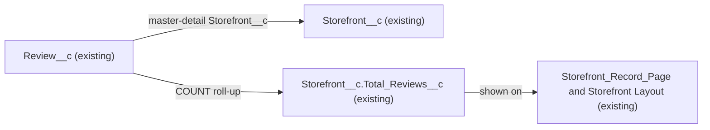

# Implementation spec — Review count on restaurant (Storefront) records

> Show how many reviews each restaurant has on its record; the org already does this with an existing roll-up summary field.

_Based on the requirement, the evidence reported by AskCoworker, and read-only org queries where noted. Assumptions and missing evidence are identified below. Specification only — nothing is implemented or deployed._

---

## 1. The requirement

Each restaurant record should show its number of reviews; verification shows this is already delivered by `Storefront__c.Total_Reviews__c`, so no metadata changes are required.

| # | Responsibility | Trigger | Where it lives |
| --- | --- | --- | --- |
| 1 | Count the reviews of each restaurant | Insert, delete, undelete, or reparenting of a `Review__c` record (roll-up recalculation) | `Storefront__c.Total_Reviews__c` (existing) |
| 2 | Show the count on the restaurant record | Viewing a `Storefront__c` record | `Storefront__c-Storefront Layout` and FlexiPage `Storefront_Record_Page` (existing) |

## 2. Grounding — reuse before building

Target org: `TestWriteSpecDE` (org ID `00Dak00001COqNeEAL`). API version: `67.0`.

- **`Storefront__c`** (CustomObject) — the restaurant record. No object with "Restaurant" in its name exists in the full custom object list. _verified by org query_ AskCoworker describes it as the merchant-facing location entity. _reported by AskCoworker_ It has 21 records. _verified by org query_
- **`Review__c`** (CustomObject) — the review. 92 records. _verified by org query_ `Review__c.Storefront__c` is a master-detail reference to `Storefront__c` (`cascadeDelete` true, relationship `Reviews__r`). _verified by org query_
- **`Storefront__c.Total_Reviews__c`** (CustomField, Roll-Up Summary) — label "Total Reviews", `summaryOperation` = `count`, `summaryForeignKey` = `Review__c.Storefront__c`, `summaryFilterItems` = empty (counts every review), description "The total number of reviews received by the storefront." _verified by org query_ Values across the 21 storefronts: min 0, max 8, sum 92, which equals the 92 `Review__c` records. _verified by org query_
- **`Storefront__c-Storefront Layout`** (Layout, the only layout on the object) — `Total_Reviews__c` is in the "Information" section. _verified by org query_
- **`Storefront_Record_Page`** (FlexiPage, RecordPage, the only FlexiPage for the object) — Dynamic Forms field `Record.Total_Reviews__c` is in the "Reviews" field section of the Details tab. _verified by org query_ Page activation and assignment cannot be read. _assumption_
- **Field access** — `Storefront__c.Total_Reviews__c` has Read in the permission sets `Agentforce_Reference_App`, `Pronto_Deep_Dive_Workshop`, `sfdc_a360_sfcrm_data_extract`, `sfdc_accelerate_dms`, and `sfdc_slack`; no profile has a `FieldPermissions` row for it. This is the same grant set as `Storefront__c.Cuisine__c`, `Storefront__c.Total_Score__c`, and `Storefront__c.Average_Review_Score__c`. _verified by org query_

Candidates examined and rejected: `Storefront__c.Total_Score__c` (sum of ratings, not a count) and `Storefront__c.Average_Review_Score__c` (formula `Total_Score__c / Total_Reviews__c`, an average); `Storefront__c.Review_Summary__c` (text area, not a count); `Account.Total_Storefronts__c` (counts storefronts, _reported by AskCoworker_). Every other custom field with "Review" in its name belongs to Data 360 data model objects (`9sd` IDs). _verified by org query_

Evidence sources: `sf org display`; `sf sobject list --sobject custom`; describes of `Storefront__c` and `Review__c`; Tooling `EntityDefinition`, `CustomField` (by object, by name, and `Metadata` of `Total_Reviews__c`), `Layout` and `FlexiPage` `Metadata`; `FieldPermissions` and `ObjectPermissions`; aggregate queries on `Storefront__c` and `Review__c`. AskCoworker D1 returned no citedReferences. D2, I, R, and T were not sent because the org queries showed the requirement is already met.

## 3. Architecture

Why the pieces are drawn this way:

1. `Review__c` is the master-detail child of `Storefront__c`, and `Total_Reviews__c` is an unfiltered COUNT roll-up over that relationship. _verified by org query_
2. The platform recalculates a roll-up summary when child records are inserted, deleted, undeleted, or reparented. _assumption (documented platform behavior)_
3. The field is placed on the only layout and the only record page of the object. _verified by org query_

## 4. Metadata changes

No metadata changes are required.

## 5. Data 360 (Data Cloud) data involved

Not applicable — this change does not use Data 360.

## 6. Security considerations

No access changes. Users see the count only with Read on `Storefront__c` and field-level Read on `Storefront__c.Total_Reviews__c`; the field has exactly the same grants as the other `Storefront__c` fields checked, so anyone who sees the restaurant's other details sees the count. _verified by org query_ A roll-up summary counts all child reviews regardless of the viewer's sharing access to individual `Review__c` records. _assumption (documented platform behavior)_

## 7. Testing strategy

No new tests; nothing changes. Recommended verification in a sandbox or the org:

1. Open a `Storefront__c` record as a user with one of the permission sets listed in Section 2 and confirm "Total Reviews" is shown in the "Reviews" section (checks that `Storefront_Record_Page` is the active page).
2. Add a `Review__c` to that storefront and confirm the count increases by 1; delete it and confirm it decreases.

## 8. Open decisions

### Open

1. **Record page activation (non-blocking).** Activation of `Storefront_Record_Page` cannot be read. The field is also on `Storefront__c-Storefront Layout`, so it shows with either the FlexiPage or the default page. Recommended default: confirm with verification step 1.

### Resolved

- "Restaurant" maps to `Storefront__c` and "review" to `Review__c`; no Restaurant object exists. _verified by org query_
- The count includes every review. `Review__c.Status__c` has values `Submitted` and `Published`, but all 92 reviews have a blank status, so a status filter would change nothing today and is not asked for. Filtering to published reviews is a proposal only. _assumption_
- AskCoworker's claim that the requirement is fully met, and its field details, were confirmed by org queries; its placement "Unknown" was settled by the layout and FlexiPage queries. _verified by org query_

## 9. Change set

| # | Action | Type | API name | Module | Why |
| --- | --- | --- | --- | --- | --- |

No metadata changes are required; the existing roll-up `Storefront__c.Total_Reviews__c` already counts and shows each restaurant's reviews.

Total: 0 · Create: 0 · Update: 0 · Delete: 0
