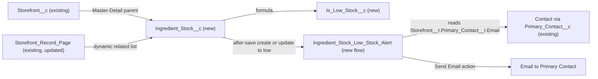

# Implementation spec — Kitchen inventory with low-stock email alerts per storefront

> Track ingredient stock levels for each `Storefront__c` and email the storefront's Primary Contact when an ingredient drops to or below its reorder threshold.

_Based on the requirement, the evidence reported by AskCoworker, and read-only org queries where noted. Assumptions and missing evidence are identified below. Specification only — nothing is implemented or deployed._

---

## 1. The requirement

Each storefront tracks its ingredient stock levels and gets alerted when an ingredient runs low; the user decided that the alert goes to the storefront's Primary Contact (`Storefront__c.Primary_Contact__c`). The request contained no out-of-scope instructions.

| # | Responsibility | Trigger | Where it lives |
| --- | --- | --- | --- |
| 1 | Record each ingredient's stock level, unit, and reorder threshold for one storefront | User creates or edits a stock record | `Ingredient_Stock__c` (new), child of `Storefront__c` |
| 2 | Flag an ingredient as low when its quantity is at or below its threshold | Every save (formula) | `Ingredient_Stock__c.Is_Low_Stock__c` (new) |
| 3 | Alert the storefront's Primary Contact when an ingredient becomes low | Create, or update that changes the record to low | Flow `Ingredient_Stock_Low_Stock_Alert` (new) |
| 4 | Let inventory users see and maintain stock from the storefront | Opening a storefront record | `Storefront_Record_Page` related list, `Ingredient_Stock__c` tab, permission set `Kitchen_Inventory_Manager` |

## 2. Grounding — reuse before building

Target org: `TestWriteSpecDE` (`00Dak00001COqNeEAL`, Developer Edition, not a sandbox). API version: `67.0` (`sourceApiVersion` 67.0 in `sfdx-project.json`, _verified by project file_).

- **`Storefront__c`** (CustomObject) — the storefront that owns the stock. 21 records, all owned by one user (`OrgFarm EPIC`, System Administrator profile); 15 custom fields, none about stock or inventory; internal sharing model `ReadWrite`. _verified by org query_
- **`Storefront__c.Primary_Contact__c`** (Lookup to `Contact`) — the alert recipient. Populated on all 21 storefronts (10 distinct contacts); 0 of those contacts have a blank email; 0 have `HasOptedOutOfEmail = true`; 0 are linked to a `User` (`User.ContactId`). _verified by org query_
- **`Storefront_Record_Page`** (FlexiPage, RecordPage for `Storefront__c`) — uses `lst:dynamicRelatedList` components in `relatedTabContent`. _verified by org query_
- **`Storefront__c-Storefront Layout`** (Layout) — the only layout on `Storefront__c`. _verified by org query_
- **No automation on `Storefront__c`, `Menu__c`, `Menu_Item__c`:** 0 Apex triggers, 0 flows in `FlowDefinitionView` with those trigger objects, 0 validation rules. _verified by org query_
- **No existing stock concept:** no custom object and no unmanaged custom field matching Stock, Inventory, Ingredient, Quantity, Threshold, Reorder, or Par_Level (the only matches are `ssot` Data 360 data model object fields); no `Ingredient`/`Stock` custom object; Field Service `ProductItem` is not in the org. `InventoryReservation` and `InventoryItemReservation` exist in the object list. _verified by org query_

Candidates examined and rejected:
- `InventoryReservation` / `InventoryItemReservation` — these are reservation records for commerce inventory, not stock levels per location; _assumption (documented platform behavior)_.
- `Menu_Item__c.Available__c` (Checkbox) — means menu availability, not ingredient quantity; changing it on low stock would alter behavior for existing readers (AskCoworker reported `MenuBrowserController` filters on it). _verified by org query_ (field exists); reader _reported by AskCoworker_.
- `Alert`, `AlertController`, `SendCustomNotification` Apex classes — managed classes in namespaces `sc_ext` and `shield_ext` (security packages), not editable or related. _verified by org query_
- Custom notification types (`enablement_coaching_feedback_ready`, `Config_Delete_Complete`, `Security_Center_Extension_Alerts`, `Shield_Extension_Alerts`) — unrelated; in-app notifications also need a `User` recipient, and no Primary Contact has one. _verified by org query_

Evidence sources: `sf sobject list` (custom and all), `sobject describe` of `Storefront__c`, `Menu__c`, `Menu_Item__c`; Tooling `CustomField`, `CustomObject`, `EntityDefinition`, `ApexClass`, `ApexTrigger`, `ValidationRule`, `LightningComponentBundle`, `Layout`, `FlexiPage` (with `Metadata`), `CustomNotificationType`, `PermissionSet`; standard `FlowDefinitionView`, `ObjectPermissions`, `TabDefinition`, `Organization`, and aggregate counts on `Storefront__c`, `Contact`, `User`. AskCoworker returned no citedReferences. After two wrong AskCoworker claims (see Section 8), every AskCoworker fact kept here was verified by query, except the `MenuBrowserController` reader, which is labelled.

## 3. Architecture

Why the pieces are drawn this way:

1. `Ingredient_Stock__c` is a Master-Detail child of `Storefront__c`: every stock record belongs to exactly one storefront, access follows the storefront, and there are no existing writers to break. This mirrors the existing `Menu__c.Storefront__c` Master-Detail (_verified by org query_).
2. `Is_Low_Stock__c` is a formula so the low state is always current without automation (standard mechanism before flow).
3. The flow is after-save because it sends email (an action on committed data). It uses "only when a record is updated to meet the condition requirements", so it emails once per transition into low stock, not on every save while low.
4. Email is the channel because the Primary Contact is a `Contact` with no `User` (_verified by org query_); custom notifications require a `User` recipient (_assumption (documented platform behavior)_). The flow's Send Email core action addresses the contact's email directly, so no email template or Apex is needed.
5. The storefront record page shows the new related list; the page already uses dynamic related lists (_verified by org query_).

## 4. Metadata changes

**Data model**

- **Create `Ingredient_Stock__c`** — CustomObject. Label "Ingredient Stock", plural "Ingredient Stocks". `Name` is Text, label "Ingredient Name" (for example "Flour"). Sharing is Controlled by Parent. Allow Reports enabled. Description: "Stock level of one ingredient at one storefront."
- **Create `Ingredient_Stock__c.Storefront__c`** — CustomField, Master-Detail to `Storefront__c`. Label "Storefront", relationship name `Ingredient_Stocks` (child relationship `Ingredient_Stocks__r`). Sharing setting Read Only (`writeRequiresMasterRead = true`: Read on the storefront is enough to create and edit its stock records). Not reparentable. Deleting a storefront deletes its stock records.
- **Create `Ingredient_Stock__c.Quantity_On_Hand__c`** — CustomField, Number(16, 2), required. Label "Quantity On Hand". Help text: "Current quantity in stock, in the unit of measure."
- **Create `Ingredient_Stock__c.Unit_Of_Measure__c`** — CustomField, Picklist, not restricted, not required. Label "Unit of Measure". Values: `Each`, `g`, `kg`, `oz`, `lb`, `mL`, `L`. Default none.
- **Create `Ingredient_Stock__c.Reorder_Threshold__c`** — CustomField, Number(16, 2), required. Label "Reorder Threshold". Help text: "Alert the storefront's primary contact when the quantity on hand is at or below this value."
- **Create `Ingredient_Stock__c.Is_Low_Stock__c`** — CustomField, Formula (Checkbox). Label "Is Low Stock". Formula: `Quantity_On_Hand__c <= Reorder_Threshold__c`. Blank handling `BlankAsZero`; both inputs are required, so blanks occur only on records loaded without validation. Results: quantity 0 and threshold 0 gives true; quantity 5 and threshold 5 gives true; quantity 6 and threshold 5 gives false.

**Automation**

- **Create `Ingredient_Stock_Low_Stock_Alert`** — Flow, record-triggered on `Ingredient_Stock__c`, after save, on create and update. Entry condition `Is_Low_Stock__c` Equals true, with "Only when a record is updated to meet the condition requirements". Decision: continue only if `{!$Record.Storefront__r.Primary_Contact__r.Email}` is not blank and `{!$Record.Storefront__r.Primary_Contact__r.HasOptedOutOfEmail}` is false. Action: Send Email (`emailSimple`) to `{!$Record.Storefront__r.Primary_Contact__r.Email}`, subject "Low stock: {!$Record.Name} at {!$Record.Storefront__r.Name}", plain-text body "{!$Record.Name} at {!$Record.Storefront__r.Name} is low: {!$Record.Quantity_On_Hand__c} {!$Record.Unit_Of_Measure__c} on hand (reorder threshold {!$Record.Reorder_Threshold__c})." Delivered Active. Runs in system context without sharing (default for record-triggered flows).

**UX**

- **Create `Ingredient_Stock__c-Ingredient Stock Layout`** — Layout. Fields: `Name`, `Storefront__c`, `Quantity_On_Hand__c`, `Unit_Of_Measure__c`, `Reorder_Threshold__c`, `Is_Low_Stock__c` (read only), plus system information.
- **Create `Ingredient_Stock__c`** — CustomTab for the object (any standard tab style).
- **Update `Storefront_Record_Page`** — FlexiPage. Add an `lst:dynamicRelatedList` for `Ingredient_Stocks__r` to `relatedTabContent`, showing `Name`, `Quantity_On_Hand__c`, `Unit_Of_Measure__c`, `Reorder_Threshold__c`, `Is_Low_Stock__c`. This changes the page for everyone who opens a storefront; it only adds a list.
- **Update `Storefront__c-Storefront Layout`** — Layout. Conditional: only if `Storefront_Record_Page` is not the active record page for the users who need stock (activation cannot be read). Add the `Ingredient_Stocks__r` related list with the same columns. Retrieve the layout before editing.

**Security**

- **Create `Kitchen_Inventory_Manager`** — PermissionSet. Object `Ingredient_Stock__c`: Read, Create, Edit, Delete. Field access: Read and Edit on `Quantity_On_Hand__c`, `Unit_Of_Measure__c`, `Reorder_Threshold__c`; Read on `Is_Low_Stock__c` (formula). `Storefront__c`: Read only. Tab `Ingredient_Stock__c`: Visible. No existing permission set or profile is changed.

## 5. Data 360 (Data Cloud) data involved

Not applicable — this change does not use Data 360. The org has Data 360 data model object fields (`ssot` namespace) with inventory names; none are used.

## 6. Security considerations

- **Execution context:** the flow runs in system context without sharing, so it can read `Storefront__r.Primary_Contact__r.Email` even when the saving user cannot see the contact. The email reveals only the ingredient name, storefront name, quantity, unit, and threshold, which the recipient's storefront owns.
- **Sharing:** `Ingredient_Stock__c` is Controlled by Parent. `Storefront__c` internal sharing is `ReadWrite` (_verified by org query_), so every internal user with object access sees every storefront's stock; external sharing on `Storefront__c` is `Private`. With the Read Only master-detail sharing setting, users need only Read on the storefront record to edit its stock.
- **CRUD/FLS:** only `Kitchen_Inventory_Manager` grants access to the new object and fields. Deploying new fields grants no field access to any profile or permission set outside the deployment (_assumption (documented platform behavior)_); View All Data and Modify All Data do not override field-level security, so administrators also need `Kitchen_Inventory_Manager` to see the new fields. Existing permission sets with `Storefront__c` access (`Agentforce_Reference_App`, `Pronto_Deep_Dive_Workshop`, managed `sfdc_accelerate_dms`, `sfdc_a360_sfcrm_data_extract`, `sfdc_slack`) are not changed and get no access to the new object. _verified by org query_ (list of permission sets with `Storefront__c` object rows, permission sets only; profiles not listed).
- **Data exposure:** emails go to external contact addresses. Opted-out contacts (`HasOptedOutOfEmail = true`) are skipped.

## 7. Testing strategy

No Apex is added, so there are no Apex test classes. No Flow Test is added: the flow's main outcome is a sent email, which a Flow Test cannot assert, and a stock record needs an org-specific storefront ID. Recommended verification (manual, in a sandbox or this org, with a test storefront whose Primary Contact has a mailbox you control):

1. **Create low:** create a stock record with quantity 4 and threshold 5. Expect `Is_Low_Stock__c` true and one email to the Primary Contact.
2. **Boundary:** quantity 5, threshold 5. Expect `Is_Low_Stock__c` true and one email (the rule is "at or below", load-bearing assumption).
3. **Not low:** quantity 6, threshold 5. Expect false and no email.
4. **Transition:** update a record from quantity 10 to 3 (threshold 5). Expect one email.
5. **Already low:** update from 3 to 2. Expect no email.
6. **Recovers and drops again:** update to 8 (no email), then to 1. Expect one email.
7. **Threshold raised:** quantity 4, threshold changed from 3 to 5. Expect one email.
8. **Opted-out contact:** set `HasOptedOutOfEmail = true` on the test contact, drive a record to low. Expect no email and no error on save.
9. **Bulk:** use Data Import Wizard or Data Loader to insert 10 records, 5 of them low. Expect 5 emails and a successful load. Keep bulk tests small: Developer Edition limits single emails to external addresses (see Section 8).
10. **Permission:** as a user with `Kitchen_Inventory_Manager` and Read on the storefront, create and edit stock from the storefront's related list. As a user without it, the tab and related list are not available.
11. **Delete and undelete:** delete a low record and undelete it. Expect no email on either (record-triggered flows do not run on delete or undelete).
12. **Page placement:** open a storefront and confirm the Ingredient Stocks related list appears; if not, apply the `Storefront__c-Storefront Layout` row.

## 8. Open decisions

### Open

1. **`Storefront__c-Storefront Layout` related list (non-blocking).** Conditional row: FlexiPage activation cannot be read. If `Storefront_Record_Page` is the active record page, skip the layout change. Check in Setup, Lightning App Builder, Activation.
2. **Email delivery (non-blocking, load-bearing).** Email deliverability cannot be read with the allowed commands. Developer Edition orgs limit single emails to external addresses per day (documented as 15 per day for Developer Edition; _assumption (documented platform behavior)_); sends beyond the limit fail. Recommended default: confirm Setup, Deliverability is "All email" and test with small volumes; production limits are higher. Verification case: Section 7 steps 1 and 9.
3. **Assign `Kitchen_Inventory_Manager` (blocking for delivery).** No one can create stock records until it is assigned. Which users (storefront staff or internal operations) get it is Not specified; assign it in Setup, Permission Sets, Manage Assignments.
4. **Opted-out Primary Contacts get no alert (non-blocking).** Today 0 of the 10 contacts are opted out (_verified by org query_). Proposal, not in inventory: create a Task for the storefront owner when the contact is opted out.
5. **Negative quantities (non-blocking).** No rule stops a negative `Quantity_On_Hand__c`; a negative value counts as low. Proposal: a validation rule `Quantity_On_Hand__c < 0`, not in inventory because the requirement does not ask for it.

### Resolved

- **Alert recipient (user decision).** Question: "Who should receive the low-stock alert: (a) the storefront's Primary Contact (`Storefront__c.Primary_Contact__c`, set on all 21 storefronts, 10 distinct contacts with email, none a Salesforce user), (b) the storefront record owner (today one System Administrator owns all 21), or (c) both? Recommendation: (a)." Answer: the storefront's Primary Contact.
- **Channel is email (assumption).** The Primary Contacts have no `User` records (_verified by org query_), so in-app custom notifications cannot reach them. AskCoworker's *I* proposed a `Low_Stock_Alert` CustomNotificationType and a conditional EmailTemplate; both were dropped. The Send Email action with a plain-text body needs no template.
- **Threshold per ingredient (assumption).** "Runs low" is measured against a `Reorder_Threshold__c` value entered on each stock record, at or below the threshold. No single business threshold is needed.
- **Master-Detail instead of Lookup (assumption).** AskCoworker proposed a Lookup with Restrict delete to keep stock history; the requirement tracks current stock, not history, and Master-Detail matches the existing `Menu__c` pattern and gives parent-controlled access.
- **`Name` holds the ingredient name (assumption).** AskCoworker proposed a separate `Ingredient_Name__c` and an auto-number `Name`; using the standard `Name` field avoids an extra field.
- **Unit as picklist (assumption).** Standard unit set; unrestricted so users can add values. AskCoworker proposed Text(50).
- **No duplicate alerts (correction).** AskCoworker *I* said the flow would email on every save while low; its own row used "only when updated to meet the criteria", which fires only on the transition into low stock.
- **AskCoworker corrections.** *D2* said validation rules and LWC bundles are not queryable; Tooling `ValidationRule` (0 rules on the three objects) and `LightningComponentBundle` (13 unmanaged bundles, including `menuBrowser` and `storefrontSelector`) were queried. *R* said the flow's Send Email action is limited to 10 emails per transaction; that limit applies to Apex `Messaging.sendEmail` calls, and record-triggered flow actions are bulkified, so it was dropped (_assumption (documented platform behavior)_). After the second wrong claim, every AskCoworker fact kept was verified.
- **Dropped AskCoworker proposals:** `Menu_Item__c.Available__c` automation, scheduled flow, Apex trigger, `Last_Alert_Sent__c` field, undelete alert.
- **Deployment sequence:** object and fields, then permission set, layout, and tab, then flow (Active), then FlexiPage; then assign the permission set.

## 9. Change set

| # | Action | Type | API name | Module | Why |
| --- | --- | --- | --- | --- | --- |
| 1 | Create | CustomObject | `Ingredient_Stock__c` | force-app/main/default/objects/Ingredient_Stock__c | Holds one ingredient's stock for one storefront |
| 2 | Create | CustomField | `Ingredient_Stock__c.Storefront__c` | force-app/main/default/objects/Ingredient_Stock__c/fields | Ties stock to its storefront |
| 3 | Create | CustomField | `Ingredient_Stock__c.Quantity_On_Hand__c` | force-app/main/default/objects/Ingredient_Stock__c/fields | Current stock level |
| 4 | Create | CustomField | `Ingredient_Stock__c.Unit_Of_Measure__c` | force-app/main/default/objects/Ingredient_Stock__c/fields | Unit for the quantity |
| 5 | Create | CustomField | `Ingredient_Stock__c.Reorder_Threshold__c` | force-app/main/default/objects/Ingredient_Stock__c/fields | Level that counts as low |
| 6 | Create | CustomField | `Ingredient_Stock__c.Is_Low_Stock__c` | force-app/main/default/objects/Ingredient_Stock__c/fields | Current low-stock flag |
| 7 | Create | Flow | `Ingredient_Stock_Low_Stock_Alert` | force-app/main/default/flows | Emails the Primary Contact when stock becomes low |
| 8 | Create | Layout | `Ingredient_Stock__c-Ingredient Stock Layout` | force-app/main/default/layouts | Record layout for stock |
| 9 | Create | CustomTab | `Ingredient_Stock__c` | force-app/main/default/tabs | Navigation to stock records |
| 10 | Create | PermissionSet | `Kitchen_Inventory_Manager` | force-app/main/default/permissionsets | Access for inventory users |
| 11 | Update | FlexiPage | `Storefront_Record_Page` | force-app/main/default/flexipages | Shows stock on the storefront |
| 12 | Update | Layout | `Storefront__c-Storefront Layout` | force-app/main/default/layouts | Conditional: related list if the FlexiPage is not active |

A new `Ingredient_Stock__c` child of `Storefront__c` with a low-stock formula, and a record-triggered flow that emails the storefront's Primary Contact when an ingredient becomes low.

Total: 12 · Create: 10 · Update: 2 · Delete: 0
