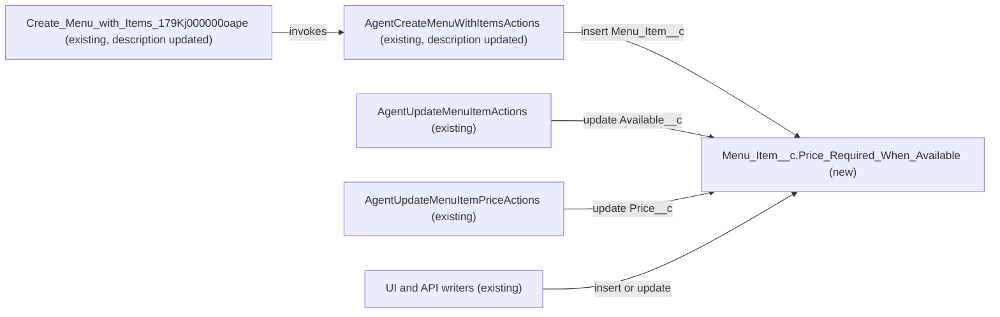

# Implementation spec — Available menu items require a price greater than zero

> Block any save of a `Menu_Item__c` record that is marked available while its price is blank, zero, or negative.

_Based on the requirement, the evidence reported by AskCoworker, and read-only org queries where noted. Assumptions and missing evidence are identified below. Specification only — nothing is implemented or deployed._

---

## 1. The requirement

Every menu item with `Menu_Item__c.Available__c` checked must have `Menu_Item__c.Price__c` greater than zero; a blank price does not meet the rule. No user decision changed the scope, and the request contained no out-of-scope instructions.

| # | Responsibility | Trigger | Where it lives |
| --- | --- | --- | --- |
| 1 | Reject an insert or update of a menu item that is available with a blank, zero, or negative price | Insert and update of `Menu_Item__c`, from any caller (UI, Apex, API) | `Menu_Item__c.Price_Required_When_Available` (new validation rule) |
| 2 | Keep the agent-facing description of the Create Menu With Items action true after the rule exists | Not applicable (description text read by Agentforce and Agent Builder) | `AgentCreateMenuWithItemsActions` and `Create_Menu_with_Items_179Kj000000oape` |

## 2. Grounding — reuse before building

Target org: `TestWriteSpecDE` (org ID `00Dak00001COqNeEAL`, connected). API version: `67.0` (`sourceApiVersion` `67.0` in `sfdx-project.json`, _verified by project file_).

- **`Menu_Item__c`** (CustomObject, unmanaged, `DurableId` `01Iak00000Dx4JS`) — the only object in scope. It has 7 custom fields: `Available__c`, `Calories__c`, `Description__c`, `Image_URL__c`, `Menu_Category__c`, `Menu__c`, `Price__c`. _verified by org query_
- **`Menu_Item__c.Available__c`** (Checkbox) — "Indicates whether the menu item is currently available for order." Default `true`, not nillable. This is the "marked available" flag. _verified by org query_
- **`Menu_Item__c.Price__c`** (Currency, precision 18, scale 2) — "he price of the menu item." (description as stored). Nillable, no default. _verified by org query_
- **Existing enforcement on `Menu_Item__c`:** 0 validation rules (Tooling `ValidationRule`), 0 Apex triggers, 0 flows with trigger object `Menu_Item__c` (`FlowDefinitionView`), 0 workflow rules. The requirement is not met today. _verified by org query_
- **Data shape:** 206 `Menu_Item__c` records; all 206 have `Available__c = true`; 0 have `Price__c` blank; 0 have `Price__c <= 0`. No existing record breaks the new rule. _verified by org query_
- **Components that reference `Menu_Item__c`, `Price__c`, or `Available__c`** (complete for `MetadataComponentDependency` and unmanaged Apex bodies): Apex classes `AgentCreateMenuWithItemsActions`, `AgentUpdateMenuItemActions`, `AgentUpdateMenuItemPriceActions`, `AgentGetMenuItemsActions`, `MenuBrowserController`, `MenuDescriptionPromptGrounding`; FlexiPage `Menu_Record_Page`. No flow references them. _verified by org query_
- **Writers** (from Apex bodies): _verified by org query_
  - `AgentCreateMenuWithItemsActions` (`with sharing`) inserts one `Menu__c`, then inserts all items in one `insert itemRecords`. It sets `Available__c = true` when the input omits `available`, and leaves `Price__c` blank when `price` is omitted. All exceptions are caught into `out.message`; there is no `Savepoint`. The `itemsJson` `@InvocableVariable` description says "Only name is required per item."
  - `AgentUpdateMenuItemActions` (`with sharing`) can set `Available__c`; it does not set `Price__c`. Exceptions go to `out.message`.
  - `AgentUpdateMenuItemPriceActions` (`with sharing`) sets `Price__c` to any non-null `Decimal`. Exceptions go to `out.message`.
- **`Create_Menu_with_Items_179Kj000000oape`** (GenAiFunction, unmanaged) — the only agent action whose invocation target is `AgentCreateMenuWithItemsActions` (`01pak00000VxZBPAA3`). Its input schema cannot be read with the allowed commands. _verified by org query_
- **Permission sets with Edit on `Price__c` and `Available__c`:** `Agentforce_Reference_App` (unmanaged) and `sfdc_accelerate_dms` (managed, namespace `sfdcInternalInt`). No permission set changes are needed. _verified by org query_
- **Unmanaged Apex test classes:** none of the 70 unmanaged classes other than the six above reference `Menu_Item__c`, and none of the six is a test class. _verified by org query_

Candidates examined and rejected: `Menu__c.Active__c` (menu-level availability; the requirement says the item is "marked available", which is `Menu_Item__c.Available__c`); a before-save record-triggered flow (a validation rule is the standard mechanism); Apex guards in `AgentUpdateMenuItemActions` and `AgentUpdateMenuItemPriceActions` (duplicate validation; see Section 8).

Evidence sources: `sf org display`; `sf sobject list --sobject custom`; `sf sobject describe` of `Menu_Item__c`; Tooling `EntityDefinition`, `CustomField`, `ValidationRule`, `ApexTrigger`, `WorkflowRule`, `MetadataComponentDependency`, `ApexClass` bodies, `GenAiFunctionDefinition`; standard `FlowDefinitionView`, `FieldPermissions`, `DataStream`, and `COUNT()` queries on `Menu_Item__c`. AskCoworker (D1, D2, I, R, T) returned no citedReferences.

## 3. Architecture

Why the pieces are drawn this way:

1. The validation rule runs in the save order of every insert and update of `Menu_Item__c`, whatever the caller (UI, Apex, API, Data Loader). _assumption (documented platform behavior)_
2. The three Apex writers are the only unmanaged code that writes `Menu_Item__c`. _verified by org query_ They reach the rule through their existing DML and already return the exception text in `out.message`, so they need no code change. _verified by org query_ (catch blocks)
3. `Create_Menu_with_Items_179Kj000000oape` invokes `AgentCreateMenuWithItemsActions`. _verified by org query_ Only their descriptions change.

## 4. Metadata changes

**Data model**

- **Create `Menu_Item__c.Price_Required_When_Available`** — ValidationRule, Active. Error condition formula: `AND(Available__c, OR(ISBLANK(Price__c), Price__c <= 0))`. Error message: "A menu item marked as available must have a price greater than zero." Error location: field `Price__c`. Description: "Available menu items need a price greater than zero." The formula is well under the 3,900-character limit. Blank handling: `ISBLANK(Price__c)` catches a blank price explicitly, so the rule blocks an available item with a blank price, blocks price `0` and negative prices, and allows `0.01` and above. When `Available__c` is false, the rule never blocks, whatever the price.

**Other**

- **Update `AgentCreateMenuWithItemsActions`** — ApexClass. Change only the `description` of the `itemsJson` `@InvocableVariable` so it is no longer false. Replace "Only name is required per item." with "name is required per item. price must be greater than zero when available is true or omitted (available defaults to true); set available to false for an item with no price." No executable code changes, no signature change.
- **Update `Create_Menu_with_Items_179Kj000000oape`** — GenAiFunction. Conditional: only if its input schema (`input/schema.json`) repeats the old "Only name is required per item" text for `itemsJson`. Retrieve it into source control before editing, then apply the same description text as the `AgentCreateMenuWithItemsActions` row.

## 5. Data 360 (Data Cloud) data involved

Not applicable — this change does not use Data 360. `SELECT COUNT() FROM DataStream` returned 0. _verified by org query_

## 6. Security considerations

- **Execution context:** the validation rule is evaluated by the platform on save for every user and integration, including `sfdc_accelerate_dms` API callers and the `with sharing` Apex writers. It cannot be bypassed by FLS, sharing, or permission set grants. _assumption (documented platform behavior)_
- **CRUD/FLS:** no changes. No new fields, so no field access grants. `Agentforce_Reference_App` and `sfdc_accelerate_dms` keep their existing Edit access on `Price__c` and `Available__c`. _verified by org query_
- **Permission sets:** none created or changed. No managed permission set is touched.
- **Data exposure:** none. The rule's error message contains no record data. The Apex writers return the platform's validation error text in `out.message` to the agent, which already happens for any DML error today. _verified by org query_ (catch blocks)

## 7. Testing strategy

The validation rule is declarative, and the Apex update changes only a description string, so no new Apex test class or Flow Test is added. All cases below are recommended manual verification in a sandbox.

| # | Case | Expected |
| --- | --- | --- |
| 1 | Insert with `Available__c = true`, `Price__c = 12.99` | Saves |
| 2 | Insert with `Available__c = true`, `Price__c` blank (UI default for Available is checked) | Blocked; error on `Price__c` |
| 3 | Insert with `Available__c = true`, `Price__c = 0` and with `-5` | Blocked |
| 4 | Boundary: `Available__c = true`, `Price__c = 0.01` | Saves |
| 5 | Insert with `Available__c = false`, `Price__c` blank, `0`, and `-1` | All save |
| 6 | Update: check `Available__c` on an item with blank price (record starts matching) | Blocked |
| 7 | Update: clear `Price__c`, or set it to `0`, on an available item | Blocked |
| 8 | Update: uncheck `Available__c` on an item, then set its price to `0` | Both save |
| 9 | Bulk: Data Loader insert of 200 rows, 100 invalid (available, blank price) and 100 valid, with partial success | 100 fail with the rule's message, 100 succeed |
| 10 | Agent path: invoke `AgentCreateMenuWithItemsActions` with one item that omits both `price` and `available` | `success = false`, `message` contains the rule's error; no items are inserted; the `Menu__c` record remains (existing behavior, Section 8) |
| 11 | Agent path: `AgentUpdateMenuItemActions` with `available = true` on an item with blank price; `AgentUpdateMenuItemPriceActions` with `price = 0` on an available item | Both return `success = false` with the rule's error |
| 12 | Deployment check: run `SELECT COUNT() FROM Menu_Item__c WHERE Available__c = true AND (Price__c = null OR Price__c <= 0)` just before deploying | Returns 0 (it returned 0 on this analysis) |
| 13 | Agent description: open the Create Menu with Items action in Agent Builder | `itemsJson` shows the new description text |

## 8. Open decisions

### Open

1. **`Create_Menu_with_Items_179Kj000000oape` input schema (non-blocking).** The GenAiFunction row is Conditional: on its input schema repeating the old `itemsJson` description. The schema cannot be read with the allowed commands. Recommended default: retrieve the GenAiFunction before deployment; if the schema does not contain the old text, drop the row.
2. **Empty menus left by a failed Create Menu With Items call (non-blocking, proposal).** `AgentCreateMenuWithItemsActions` inserts `Menu__c` before the items and catches the exception without a `Savepoint`, so when the new rule rejects any item, all items fail and the new `Menu__c` remains without items. _verified by org query_ (Apex body). This is existing behavior for any item insert error; the requirement does not depend on it. Proposal: add a `Savepoint` and `Database.rollback` in the catch block in a separate change.
3. **Apex deployment coverage (non-blocking).** No unmanaged test class references `Menu_Item__c`. _verified by org query_ The `AgentCreateMenuWithItemsActions` change is description-only, but a production deployment of any Apex class runs tests and needs 75% org-wide coverage. _assumption (documented platform behavior)_ Recommended default: deploy with the org's existing test run; if coverage fails, deploy the validation rule on its own first.
4. **External API writers (non-blocking).** `sfdc_accelerate_dms` (managed) has Edit on both fields. _verified by org query_ Whether any integration sends available items without a price cannot be read from the org. After deployment such inserts fail with the rule's error, which is what the requirement asks for. Recommended default: tell integration owners before go-live.
5. **Undelete (non-blocking).** Validation rules do not run on undelete. _assumption (documented platform behavior)_ No record in the Recycle Bin can be restored in a failing state unless it failed before deletion; all current records pass. No change proposed.

Deployment sequence: run case 12; deploy `Menu_Item__c.Price_Required_When_Available`; then deploy `AgentCreateMenuWithItemsActions` and, if it applies, `Create_Menu_with_Items_179Kj000000oape`. Rollback: deactivate or delete the validation rule, and redeploy the retrieved class and GenAiFunction.

### Resolved

- **"Marked available" means `Menu_Item__c.Available__c`.** The field's description matches the requirement's words; `Menu__c.Active__c` is menu-level. _assumption_
- **A blank price fails the rule.** "Need a price greater than zero" means a price must exist. _assumption_ (from the requirement wording). AskCoworker's D1 open decision about allowing $0 was dropped: the requirement states "greater than zero".
- **Correction to AskCoworker D1 and D2:** they said validation rules are not SOQL-queryable and their existence is unknown. Tooling `ValidationRule WHERE EntityDefinitionId = '01Iak00000Dx4JS'` returned 0 rules. _verified by org query_
- **Correction to AskCoworker I:** it proposed Apex pre-checks in `AgentUpdateMenuItemActions` and `AgentUpdateMenuItemPriceActions`. They were dropped: they duplicate the validation rule, and the `AgentUpdateMenuItemPriceActions` check (`price <= 0`) would also reject zero prices on unavailable items, which the requirement allows. Both classes already return the error text. _verified by org query_ (Apex bodies)
- **Correction to AskCoworker T:** it said the GenAiFunction may not exist and that an existing test class covers `AgentCreateMenuWithItemsActions`. `Create_Menu_with_Items_179Kj000000oape` exists, and no test class references `Menu_Item__c`. _verified by org query_
- After two wrong AskCoworker claims, every AskCoworker fact kept in this spec was checked with an org query or tagged as documented platform behavior. Other dropped AskCoworker proposals (formula helper field, menu-level availability cascade, before-undelete trigger) are outside the requirement.

## 9. Change set

| # | Action | Type | API name | Module | Why |
| --- | --- | --- | --- | --- | --- |
| 1 | Create | ValidationRule | `Menu_Item__c.Price_Required_When_Available` | force-app/main/default/objects/Menu_Item__c/validationRules | Blocks available menu items with a blank, zero, or negative price |
| 2 | Update | ApexClass | `AgentCreateMenuWithItemsActions` | force-app/main/default/classes | `itemsJson` description "Only name is required per item" becomes false |
| 3 | Update | GenAiFunction | `Create_Menu_with_Items_179Kj000000oape` | force-app/main/default/genAiFunctions | Conditional: agent action input description repeats the old text |

One validation rule on `Menu_Item__c` enforces the rule for every writer, and two description updates keep the agent action's instructions accurate.

Total: 3 · Create: 1 · Update: 2 · Delete: 0
