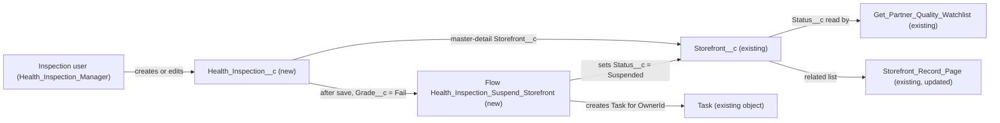

# Implementation spec — Storefront health inspections and automatic suspension

> Record each health inspection (date, score, grade) against its storefront, and set the storefront to Suspended when an inspection has the grade Fail.

_Based on the requirement, the evidence reported by AskCoworker, and read-only org queries where noted. Assumptions and missing evidence are identified below. Specification only — nothing is implemented or deployed._

---

## 1. The requirement

Track health inspection results for every storefront, with scores and inspection dates, and suspend any storefront with a failing grade. The user clarified that grades are `A`, `B`, `C`, and `Fail`, and that `Fail` is the failing grade that suspends the storefront (*user decision*). The request contained no deploy, data-change, or credential instruction.

| # | Responsibility | Trigger | Where it lives |
| --- | --- | --- | --- |
| 1 | Record an inspection per storefront with inspection date, score, and grade | User creates or edits a `Health_Inspection__c` record | `Health_Inspection__c` (new), child of `Storefront__c` |
| 2 | Show a storefront's inspections on the storefront | Viewing a `Storefront__c` record | `Storefront_Record_Page` related list; `Storefront__c-Storefront Layout` related list (conditional) |
| 3 | Suspend the storefront when an inspection has grade `Fail` | `Health_Inspection__c` created with, or updated to, `Grade__c` = `Fail` | Flow `Health_Inspection_Suspend_Storefront` (new) sets `Storefront__c.Status__c` = `Suspended` |
| 4 | Tell the storefront owner that the storefront was suspended | Same as 3 | Same flow creates a Task for `Storefront__c.OwnerId` |
| 5 | Give inspection users access | Permission set assignment | `Health_Inspection_Manager` (new) |

## 2. Grounding — reuse before building

Target org: `TestWriteSpecDE` (Developer Edition, not a sandbox, ID `00Dak00001COqNeEAL`). API version: `67.0` (`sfdx-project.json` `sourceApiVersion` `67.0`, org `apiVersion` `67.0`). _verified by project file_ / _verified by org query_

- **`Storefront__c`** (CustomObject) — the storefront that is inspected and suspended. 21 records, all with `Status__c` = `Active`, all owned by Users (`Owner.Type` = `User`). Internal sharing `ReadWrite`, external `Private`. _verified by org query_
- **`Storefront__c.Status__c`** (Picklist) — active values `Active`, `Inactive`, `Pending Activation`, `Suspended`, `Closed`. `Suspended` already exists, so no picklist change is needed. _verified by org query_
- **Automation on `Storefront__c`** — no Apex triggers, no record-triggered flows (`FlowDefinitionView WHERE TriggerObjectOrEventId = 'Storefront__c'` returned 0), no validation rules, no workflow rules, no approval processes, no duplicate rules. Managed packages in the org (`sc_ext`, `shield_ext`, `datamask`, `sfdcInternalInt`) were not inspected for automation on this object. _verified by org query_
- **Writers and readers of `Storefront__c.Status__c`** (from `MetadataComponentDependency` on the field and an Apex body search of all 70 unmanaged classes; partial for reports and list views, which cannot be read): _verified by org query_
  - `AgentUpdateStorefrontDetailsActions` (ApexClass, `with sharing`) writes `Status__c` from a caller-supplied `status` value (`sf.Status__c = req.status;`), so an agent action can set any status, including changing `Suspended` back to `Active`.
  - `StorefrontPickerController` (ApexClass, `with sharing`) reads `Status__c` for display.
  - `Get_Partner_Quality_Watchlist` (Flow, autolaunched, read-only by its description) filters `Status__c` = `Active`; suspended storefronts will drop out of its results, which matches the intent of suspension.
- **No existing inspection data model.** No custom object in `sf sobject list --sobject custom` means inspection; `sf sobject list --sobject all` matched only unrelated platform objects (`ComplianceIssue`, `SecurityHealthCheckResult` and similar). No unmanaged custom field in the org matches `Inspect`, `Health`, `Grade`, `Suspen`, `Sanit`, or `Complian`. `Health_Inspection__c`, flow `Health_Inspection_Suspend_Storefront`, and permission set `Health_Inspection_Manager` do not exist. _verified by org query_
- **`Review__c.Storefront__c`** — existing master-detail child pattern of `Storefront__c` (child relationship listed in the `Storefront__c` describe). _verified by org query_ (master-detail type _reported by AskCoworker_)
- **`Storefront_Record_Page`** (FlexiPage) — the storefront record page; its Related tab uses `lst:dynamicRelatedList` components with `parentFieldApiName` `Storefront__c.Id`. Activation and assignment cannot be read. _verified by org query_
- **`Storefront__c-Storefront Layout`** (Layout) — the only layout on `Storefront__c`. _verified by org query_
- **Permission sets with `Storefront__c` access** (complete list from `ObjectPermissions`): `Agentforce_Reference_App` (CRUD, View All, Modify All), `Pronto_Deep_Dive_Workshop` (Read, View All), managed `sfdc_accelerate_dms` (CRUD, View All, Modify All), managed `sfdc_a360_sfcrm_data_extract` and `sfdc_slack` (Read, View All), and two profiles. _verified by org query_
- **Data 360:** `SELECT COUNT() FROM DataStream` returned 0. _verified by org query_
- **Project source:** `force-app/main/default/objects`, `flexipages`, `layouts`, `permissionsets`, and `tabs` are empty, so `Storefront_Record_Page` and `Storefront__c-Storefront Layout` must be retrieved before editing. _verified by project file_

Candidates examined and rejected: `Storefront__c.Total_Score__c` and `Storefront__c.Average_Review_Score__c` — customer review scores (`Average_Review_Score__c` = `Total_Score__c / Total_Reviews__c`), not inspection scores; `ComplianceIssue` and `SecurityHealthCheckResult` — platform security objects, not food-safety inspections; managed `ssot` grade fields (`LetterGradeCode`, `NumericGradeNumber`) — Data 360 education model fields; extending `AgentUpdateStorefrontDetailsActions` — it is an agent action for a caller-supplied status and does not run on inspection events.

Evidence sources: `sf org display`; custom and full object lists; `Storefront__c` describe; Tooling `CustomField`, `ApexTrigger`, `ValidationRule`, `WorkflowRule`, `MetadataComponentDependency`, `ApexClass` bodies, `Flow.Metadata` for `Get_Partner_Quality_Watchlist` and `Apply_Remediation`, `FlexiPage.Metadata`, `Layout`; standard `FlowDefinitionView`, `ProcessDefinition`, `DuplicateRule`, `ObjectPermissions`, `FieldPermissions`, `EntityDefinition`, `TabDefinition`, `Organization`, `DataStream`. AskCoworker returned no citedReferences. Four AskCoworker claims were wrong (Section 8), so every AskCoworker fact kept here was verified by org query, and the *T* call was skipped; testing and open decisions were derived from the verified facts.

## 3. Architecture

Why the pieces are drawn this way:

1. `Health_Inspection__c` is a new child object because a storefront has many inspections over time and no existing object stores them (Section 2). Master-detail follows the existing `Review__c` pattern, makes every inspection belong to exactly one storefront, and inherits `Storefront__c` sharing (*assumption*).
2. The flow runs on the child because the grade is on the inspection record, not a roll-up or formula on the parent. A record-triggered flow is the standard declarative way to update a master record; no Apex is needed (design rule: standard mechanism, then flow, then code).
3. The flow updates only `Storefront__c.Status__c`, an existing field whose value `Suspended` already exists (*verified by org query*).
4. `Get_Partner_Quality_Watchlist` and `StorefrontPickerController` are unchanged readers of `Status__c` (*verified by org query*).

## 4. Metadata changes

**Data model**

- **Create `Health_Inspection__c`** — CustomObject. Label "Health Inspection", plural "Health Inspections". Name field: Auto Number, label "Inspection Number", format `HI-{00000}`. Sharing: Controlled by Parent. Allow Reports enabled. Description: "One health inspection result for a storefront."
- **Create `Health_Inspection__c.Storefront__c`** — CustomField, Master-Detail(`Storefront__c`), label "Storefront", relationship name `Health_Inspections`, not reparentable, sharing setting "Read Only" (`writeRequiresMasterRead` = true), so Read access to the storefront is enough to create, edit, or delete its inspections.
- **Create `Health_Inspection__c.Inspection_Date__c`** — CustomField, Date, label "Inspection Date", required.
- **Create `Health_Inspection__c.Score__c`** — CustomField, Number(5, 2), label "Score", required (the requirement asks for scores). No range rule; the scale is not specified (Section 8).
- **Create `Health_Inspection__c.Grade__c`** — CustomField, restricted Picklist, label "Grade", required, values in order `A`, `B`, `C`, `Fail`, no default.

**Automation**

- **Create `Health_Inspection_Suspend_Storefront`** — Flow, record-triggered on `Health_Inspection__c`, after save, trigger on create and update, entry condition formula `ISPICKVAL({!$Record.Grade__c}, 'Fail')` with "Only when a record is updated to meet the condition requirements". Elements: (1) Decision `Parent_Can_Be_Suspended`: `{!$Record.Storefront__r.Status__c}` is not `Suspended` and not `Closed`; otherwise end. (2) Update Records `Suspend_Storefront`: the `Storefront__c` record with `Id` = `{!$Record.Storefront__c}`, set `Status__c` = `Suspended`. (3) Create Records `Notify_Owner`: Task with `OwnerId` = `{!$Record.Storefront__r.OwnerId}`, `WhatId` = `{!$Record.Storefront__c}`, `Subject` = "Storefront suspended: failed health inspection", `ActivityDate` = `{!$Flow.CurrentDate}`, `Priority` = `High`, `Description` naming the inspection number, date, and score. Run in system context without sharing (default for record-triggered flows). Delivered status: Active.

**UX**

- **Create `Health_Inspection__c-Health Inspection Layout`** — Layout. Section "Inspection Details": `Name`, `Storefront__c`, `Inspection_Date__c`, `Score__c`, `Grade__c`; System Information section. Assigned to all profiles.
- **Create `Health_Inspection__c`** — CustomTab for the object (any standard tab style), so inspection records can be opened and listed.
- **Update `Storefront_Record_Page`** — FlexiPage. Add an `lst:dynamicRelatedList` to `relatedTabContent` with `parentFieldApiName` `Storefront__c.Id`, `relatedListApiName` `Health_Inspections__r`, columns `Name`, `Inspection_Date__c`, `Score__c`, `Grade__c`, sorted by `Inspection_Date__c` descending, `maxRecordsToDisplay` 10. Retrieve the page before editing.
- **Update `Storefront__c-Storefront Layout`** — Layout. Conditional: only if some users see `Storefront__c` records through the page layout rather than `Storefront_Record_Page` (page activation cannot be read). Add the `Health_Inspections__r` related list with columns `Name`, `Inspection_Date__c`, `Score__c`, `Grade__c`. Retrieve the layout before editing.

**Security**

- **Create `Health_Inspection_Manager`** — PermissionSet, label "Health Inspection Manager". Object `Health_Inspection__c`: Read, Create, Edit, Delete (no View All, no Modify All). Field access Read and Edit: `Health_Inspection__c.Inspection_Date__c`, `Health_Inspection__c.Score__c`, `Health_Inspection__c.Grade__c` (the master-detail field has no field-level security). Object `Storefront__c`: Read (needed to select the parent and see the related list). Tab `Health_Inspection__c`: Visible. No change to any existing permission set or profile.

## 5. Data 360 (Data Cloud) data involved

Not applicable — this change does not use Data 360. The org has no data streams (`SELECT COUNT() FROM DataStream` returned 0; *verified by org query*).

## 6. Security considerations

- **Execution context.** `Health_Inspection_Suspend_Storefront` is a record-triggered flow and runs in system context without sharing, so it updates `Storefront__c.Status__c` and creates the Task even though `Health_Inspection_Manager` grants only Read on `Storefront__c` (*assumption (documented platform behavior)*). This is intended: an inspector can suspend a storefront only by recording a `Fail` inspection, not by editing the storefront.
- **Sharing.** `Health_Inspection__c` is Controlled by Parent, so a user sees an inspection only when they can see its storefront. `Storefront__c` internal sharing is `ReadWrite`, so all internal users with object access can see all storefronts (*verified by org query*). With the parent-sharing setting in Section 4, creating an inspection needs Read access to the storefront record.
- **CRUD/FLS.** Only `Health_Inspection_Manager` grants access to `Health_Inspection__c` and its fields. Deploying the new object and fields gives no object or field access to any profile or permission set that is not in the deployment, including `Agentforce_Reference_App`, `Pronto_Deep_Dive_Workshop`, and the managed `sfdcInternalInt` sets (*assumption (documented platform behavior)*). Administrators get access by assigning themselves the permission set.
- **Task visibility.** Tasks are not granted through object permissions in a permission set; the owner sees the Task because they own it (*assumption (documented platform behavior)*).
- **Other writers of `Status__c`.** `AgentUpdateStorefrontDetailsActions` and users with Edit on `Storefront__c` (for example through `Agentforce_Reference_App`) can change `Suspended` back to another value (*verified by org query*). The requirement does not ask to lock suspension, so this is a proposal in Section 8, not a change.
- **Data exposure.** Inspection scores and grades are new business data visible only to permission-set holders who can see the storefront. The Task description contains the inspection number, date, and score, visible to the storefront owner.

## 7. Testing strategy

The inventory has no Apex, and the flow's main outcome is an update to the parent `Storefront__c` and a created Task, which a Flow Test on `Health_Inspection__c` cannot assert. No test component is added; run these manual checks in a sandbox.

| # | Case | Steps | Expected |
| --- | --- | --- | --- |
| 1 | Fail on create | Create an inspection with `Grade__c` = `Fail` on an `Active` storefront | Storefront `Status__c` = `Suspended`; one High-priority Task for the storefront owner |
| 2 | Passing grades | Create inspections with `A`, `B`, `C` | Storefront status unchanged; no Task |
| 3 | Update to Fail | Edit a `B` inspection to `Fail` | Storefront suspended; one Task |
| 4 | Edit while still Fail | Edit the score of a `Fail` inspection | No new Task; status unchanged |
| 5 | Change away from Fail | Edit a `Fail` inspection to `A` | Storefront stays `Suspended` (no reinstatement) |
| 6 | Already Suspended / Closed | Record `Fail` on a `Suspended` storefront and on a `Closed` storefront | No status change; no Task |
| 7 | Bulk | Insert 200 inspections through Data Loader across 200 storefronts, half `Fail` | 100 storefronts suspended, 100 Tasks, no limit errors |
| 8 | Same storefront twice in one load | Insert two `Fail` inspections for one storefront in one batch | Storefront suspended; up to two Tasks (known behavior, Section 8) |
| 9 | Required fields | Save without `Inspection_Date__c`, `Score__c`, or `Grade__c` | Save blocked |
| 10 | Permission | As a user with only `Health_Inspection_Manager` and no Edit on `Storefront__c`, record a `Fail` inspection | Save succeeds and the storefront is suspended |
| 11 | No access | As a user without the permission set | Inspection tab and related list not visible |
| 12 | Delete / undelete | Delete and undelete a `Fail` inspection | No status change either way |
| 13 | Record page | Open a storefront | The Health Inspections related list shows date, score, grade, newest first |

## 8. Open decisions

### Open

1. **Page layout related list (non-blocking).** `Storefront__c-Storefront Layout` is a Conditional: update, needed only if some users see storefronts through the layout instead of `Storefront_Record_Page`. Check page activation in Lightning App Builder; drop the row if the record page is the org default for all apps and profiles.
2. **Score scale (non-blocking).** The requirement does not state the score range. `Score__c` is Number(5, 2) with no range validation. A validation rule (for example 0 to 100) is a proposal once the scale is known.
3. **Permission set assignment (blocking for delivery).** Who records inspections is not specified. Assign `Health_Inspection_Manager` to those users in Setup after deployment; without it nobody can create inspections.
4. **Reinstatement and manual override (non-blocking).** A later passing inspection does not reinstate the storefront, and `AgentUpdateStorefrontDetailsActions` or any user with Edit on `Storefront__c` can change `Suspended` back. Reinstatement is manual. Automatic reinstatement or a lock on `Suspended` are proposals.
5. **Duplicate Tasks in one transaction (non-blocking).** If two `Fail` inspections for the same storefront are saved in one transaction, each flow interview sees the storefront before suspension and may create one Task each. Accept for manual entry; de-duplicate after bulk loads if needed.
6. **Reports and list views (non-blocking).** Reports and list views cannot be read. Check reports and list views that filter `Storefront__c.Status__c` = `Active`, because suspended storefronts will leave them.

Deployment sequence: retrieve `Storefront_Record_Page` and `Storefront__c-Storefront Layout`; deploy `Health_Inspection__c`, its fields, layout, and tab; then `Health_Inspection_Manager`, `Storefront_Record_Page`, and (if needed) `Storefront__c-Storefront Layout`; then the flow as Active; then assign the permission set.

### Resolved

- **Failing grade** — grades `A`, `B`, `C`, `Fail`; `Fail` suspends the storefront. *user decision*
- **Data structure** — new master-detail child `Health_Inspection__c`, following `Review__c`, instead of fields on `Storefront__c`, because inspections repeat over time. *assumption*
- **Required fields** — `Inspection_Date__c`, `Score__c`, and `Grade__c` are required on the new object, which has no existing writers or data. *assumption*
- **Which storefronts are suspended** — every storefront that is not already `Suspended` or `Closed`, including `Inactive` and `Pending Activation`; `Closed` is left alone so a closed storefront is not reopened as suspended. All 21 current storefronts are `Active`. *assumption*
- **Trigger events** — create and update when the record changes to meet `Grade__c` = `Fail`; delete and undelete do not fire. *assumption*
- **Owner notification** — a Task for the storefront owner, because a suspended storefront needs follow-up; all 21 storefronts are User-owned, so the Task owner is always a User today. *assumption*
- **Access** — a new dedicated `Health_Inspection_Manager`; no existing or managed permission set is widened. *assumption*
- **AskCoworker corrections.** (1) It said validation rules cannot be queried; Tooling `ValidationRule` returned 0 rules for `Storefront__c`. (2) It said flow bodies are not readable; Tooling `Flow.Metadata` showed `Get_Partner_Quality_Watchlist` is read-only and filters `Status__c` = `Active`. (3) It said workflow cross-object field updates cannot target master-detail parents; documented behavior is that they can (the option was rejected anyway as legacy). (4) It proposed Task object permissions in the permission set; Task access is not granted through object permissions. Its proposed `Inspector_Notes__c` field was dropped as not requested, and its entry condition using `$Record__Prior` was simplified to the "only when updated to meet criteria" setting. *verified by org query* / *assumption (documented platform behavior)*
- **Timeouts** — the *I* call and the combined *R* call timed out; each was split in two (data model and automation; runtime and security) and both halves returned.

## 9. Change set

| # | Action | Type | API name | Module | Why |
| --- | --- | --- | --- | --- | --- |
| 1 | Create | CustomObject | `Health_Inspection__c` | force-app/main/default/objects | Stores inspection results per storefront |
| 2 | Create | CustomField | `Health_Inspection__c.Storefront__c` | force-app/main/default/objects | Links each inspection to its storefront |
| 3 | Create | CustomField | `Health_Inspection__c.Inspection_Date__c` | force-app/main/default/objects | Inspection date |
| 4 | Create | CustomField | `Health_Inspection__c.Score__c` | force-app/main/default/objects | Inspection score |
| 5 | Create | CustomField | `Health_Inspection__c.Grade__c` | force-app/main/default/objects | Grade A, B, C, Fail; Fail drives suspension |
| 6 | Create | Flow | `Health_Inspection_Suspend_Storefront` | force-app/main/default/flows | Suspends the storefront on a Fail inspection and notifies the owner |
| 7 | Create | Layout | `Health_Inspection__c-Health Inspection Layout` | force-app/main/default/layouts | Record layout for inspections |
| 8 | Create | CustomTab | `Health_Inspection__c` | force-app/main/default/tabs | Navigation to inspection records |
| 9 | Update | FlexiPage | `Storefront_Record_Page` | force-app/main/default/flexipages | Shows inspections on the storefront record page |
| 10 | Update | Layout | `Storefront__c-Storefront Layout` | force-app/main/default/layouts | Conditional related list for layout-based views |
| 11 | Create | PermissionSet | `Health_Inspection_Manager` | force-app/main/default/permissionsets | Access for inspection users |

A new `Health_Inspection__c` child of `Storefront__c` records each inspection, and a record-triggered flow sets the storefront to `Suspended` and tasks its owner when an inspection is graded `Fail`.

Total: 11 · Create: 9 · Update: 2 · Delete: 0
