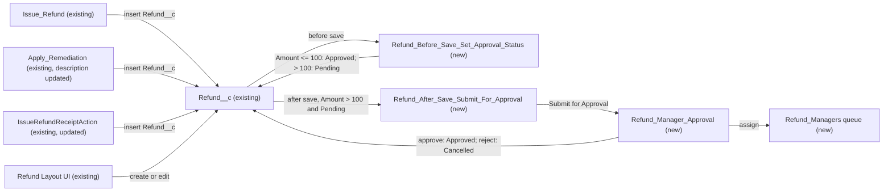

# Implementation spec — Refund auto-approval with manager approval over $100

> Approve `Refund__c` records of $100 or less instantly, and route every refund over $100 to a manager approval before it counts as approved.

_Based on the requirement, the evidence reported by AskCoworker, and read-only org queries where noted. Assumptions and missing evidence are identified below. Specification only — nothing is implemented or deployed._

---

## 1. The requirement

Refunds of $100 or less are set to `Approved` as soon as they are saved; refunds over $100 are saved as `Pending` and submitted to a manager approval, whose outcome sets the status. The requirement was read as a conditional rule (instant approval up to and including $100, manager approval above it) (*assumption*, from the wording "over $100"). The approver is a new queue of refund managers (*assumption*; the user had no preference). The request contained no deploy or data-change instruction.

| # | Responsibility | Trigger | Where it lives |
| --- | --- | --- | --- |
| 1 | Set `Status__c` = `Approved` for refunds with `Amount__c` <= 100, from every writer and the UI | `Refund__c` create; update when `Amount__c` changes | `Refund_Before_Save_Set_Approval_Status` (new before-save flow) |
| 2 | Set `Status__c` = `Pending` for refunds with `Amount__c` > 100 and submit them for approval | `Refund__c` create; update when `Amount__c` changes | `Refund_Before_Save_Set_Approval_Status`, `Refund_After_Save_Submit_For_Approval` (new) |
| 3 | A manager approves or rejects; the outcome sets `Status__c` | Approval decision | `Refund__c.Refund_Manager_Approval` (new approval process), queue `Refund_Managers` (new) |
| 4 | Managers can see the refund and its approval history | Approval request | `Refund_Manager_Access` (new permission set), `Refund__c-Refund Layout` (existing) |
| 5 | Callers stop describing every refund as approved | Agent action and flow use | `IssueRefundReceiptAction`, `Issue_Refund_Receipt`, `Apply_Remediation` (existing) |

## 2. Grounding — reuse before building

Target org: `TestWriteSpecDE` (Developer Edition, not a sandbox, ID `00Dak00001COqNeEAL`). API version: `67.0`. The org is single-currency: `Refund__c` has no `CurrencyIsoCode` field, so "$100" is compared directly to `Amount__c` (*verified by org query*).

- **`Refund__c`** (CustomObject) — the refund record. 0 records exist. Internal sharing model `ReadWrite`, external `Private`. Its 10 custom fields are `Amount__c` (currency), `Status__c`, `Payment_Method__c`, `Reason__c`, `Issue_Date__c`, `Processed_Date__c`, `Contact__c`, `Case__c`, `Storefront__c`, `Business_Account__c`. _verified by org query_
- **`Refund__c.Status__c`** (restricted picklist) — values `Pending` (default), `Approved`, `Processing`, `Completed`, `Failed`, `Cancelled`. `Approved` and `Pending` already represent the two outcomes; no new field is needed. _verified by org query_
- **`Refund__c.Amount__c`** (Currency) — the threshold field. _verified by org query_
- **Automation on `Refund__c`** — 0 Apex triggers, 0 record-triggered flows (`FlowDefinitionView` by `TriggerObjectOrEventId`), 0 validation rules, 0 workflow rules; 0 approval processes exist in the whole org (`ProcessDefinition`, no filter). _verified by org query_
- **Writers of `Refund__c`** — `MetadataComponentDependency` on the object, `Status__c`, and `Amount__c` returns `IssueRefundReceiptAction` (ApexClass), `Issue Refund` and `Apply Remediation` (Flow), and `Refund Layout`; a search of all 70 unmanaged Apex class bodies for "Refund" finds only `IssueRefundReceiptAction` and `IssueRefundReceiptActionTest`. _verified by org query_
- **`Issue_Refund`** (Flow, active, AutoLaunchedFlow) — creates `Refund__c` with `Status__c` = `'Approved'` for any amount. _verified by org query_
- **`Apply_Remediation`** (Flow, active, AutoLaunchedFlow) — creates `Refund__c` with `Status__c` = `'Approved'` for any amount; description: "Applies a make-it-right remediation by creating an approved Refund__c record and returning its confirmation number." _verified by org query_
- **`IssueRefundReceiptAction`** (ApexClass, `with sharing`, invocable) — sets `r.Status__c = 'Approved'`, inserts, re-queries the record, and returns `view.status = r.Status__c` and the message "Issued a $… refund". Invocable description: "Creates an approved refund and returns a rich refund receipt for display." It calls `ProntoWalletPassService.mintPassUrl` before the insert. _verified by org query_
- **`Issue_Refund_Receipt`** (GenAiFunction) — invokes `IssueRefundReceiptAction`; description "Creates an approved refund and returns a rich refund receipt rendered with a custom Lightning type." It is not linked to any topic in `GenAiPluginFunctionDef` (0 rows). _verified by org query_
- **`IssueRefundReceiptActionTest`** (ApexClass) — asserts status `Approved` for a 42.50 refund; still valid under the new rule. _verified by org query_
- **`Refund__c-Refund Layout`** (Layout) — related lists `RelatedActivityList`, `RelatedHistoryList`, `RelatedNoteList`; no approval history list. No FlexiPage exists for `Refund__c`. _verified by org query_
- **Access to `Refund__c`** (complete list of `ObjectPermissions` rows) — Read/Create/Edit/Delete/Modify All: permission sets `Pronto_Deep_Dive_Workshop`, `Agentforce_Reference_App`, `sfdc_accelerate_dms`, and the `System Administrator` profile; Read only: `sfdc_a360_sfcrm_data_extract`, `sfdc_slack`, and the `Analytics Cloud Integration User` profile. _verified by org query_
- **Managers and queues** — 0 active users have `ManagerId` set; users have no roles; the only queues are `Merchant_Messaging_Queue` (MessagingSession) and `Unqualified_Leads` (Lead). _verified by org query_

Candidates examined and rejected: `User.ManagerId` as the approver source — no active user has it set, and agent-created refunds run as `EinsteinServiceAgent User`, which has no manager; `Validate_Remediation` (Flow) — validates a proposed amount against a ceiling and a 500 monthly budget, but does not write `Refund__c`; `Refund_XSF_OS` (Flow) — managed (`runtime_commerce_oms`), inactive, platform-event triggered, unrelated to `Refund__c`; approval-named fields on other objects (for example `ApprovalStatus`, `Approver`) — none is on `Refund__c`. _verified by org query_

Evidence sources: `sf org display`; custom object list; Tooling `EntityDefinition`, `CustomField`, `ApexTrigger`, `ValidationRule`, `WorkflowRule`, `Flow.Metadata`, `FlowDefinition`, `MetadataComponentDependency`, `ApexClass` bodies, `GenAiFunctionDefinition`, `GenAiPluginFunctionDef`, `Layout.Metadata`, `FlexiPage`; standard `FlowDefinitionView`, `ProcessDefinition`, `User`, `Group`, `QueueSobject`, `UserRole`, `ObjectPermissions`, `FieldPermissions`, `PermissionSet`, `Organization`. AskCoworker returned no citedReferences. After four wrong AskCoworker claims (see Section 8), the *R* (runtime and security) and *T* (testing) calls were skipped and those topics were covered with the org queries above and documented platform behavior.

## 3. Architecture

Why the pieces are drawn this way:

1. All three writers insert `Refund__c` with `Status__c` = `'Approved'` (*verified by org query*). A before-save record-triggered flow runs after the writer's field values are set and before the record is committed, so its assignment is the value saved, for flows, Apex, the UI, and the API alike (*assumption (documented platform behavior)*). Putting the rule in that one flow keeps one source of truth and needs no logic change in the writers.
2. Submitting for approval needs a record Id, so it runs in an after-save flow; Submit for Approval is a standard flow action, so no Apex is needed (*assumption (documented platform behavior)*).
3. An approval process is the standard mechanism for manager sign-off: it assigns the request, locks the record, keeps approval history, and applies field updates on the decision (*assumption (documented platform behavior)*). No approval process exists to extend (*verified by org query*).
4. The approver is a queue because no user has a manager (*verified by org query*) and agent-created refunds have no human submitter.

## 4. Metadata changes

**Automation**

- **Create `Refund_Before_Save_Set_Approval_Status`** — Flow, record-triggered on `Refund__c`, "Fast Field Updates" (before save), delivered Active. Starts on create, and on update when `ISCHANGED({!$Record.Amount__c})`. Entry condition: `Amount__c` is not blank AND `Status__c` is `Pending` or `Approved` (records already `Processing`, `Completed`, `Failed`, or `Cancelled` are never changed). Decision: `{!$Record.Amount__c} > 100` → assign `Status__c` = `Pending`; otherwise → assign `Status__c` = `Approved`. A blank `Amount__c` leaves `Status__c` unchanged (default `Pending`).
- **Create `Refund_After_Save_Submit_For_Approval`** — Flow, record-triggered on `Refund__c`, "Actions and Related Records" (after save), delivered Active. Starts on create, and on update when `ISCHANGED({!$Record.Amount__c})`. Entry condition: `{!$Record.Amount__c} > 100` AND `ISPICKVAL({!$Record.Status__c}, 'Pending')`. One Submit for Approval action: record `{!$Record.Id}`, process `Refund_Manager_Approval`, comment "Refund over $100 requires manager approval." Fault path: end without rethrowing, so the writer's transaction still completes and the refund stays `Pending` (not approved).
- **Create `Refund__c.Refund_Manager_Approval`** — ApprovalProcess on `Refund__c`, active. Entry criteria: `Refund__c.Amount__c` greater than 100 AND `Refund__c.Status__c` equals `Pending`. Allowed submitters: Record Creator and Record Owner. Initial submission: lock the record. One step: assign to queue `Refund_Managers`. Final approval actions: field update `Status__c` = `Approved`; record stays locked. Final rejection actions: field update `Status__c` = `Cancelled`; unlock. Recall: unlock; `Status__c` stays `Pending`. Approver email uses the default approval assignment template.

**Security**

- **Create `Refund_Managers`** — Queue, label "Refund Managers", supported object `Refund__c`. Members: `{REFUND_MANAGER_USERS}` placeholder (blocking for delivery; see Section 8).
- **Create `Refund_Manager_Access`** — PermissionSet, label "Refund Manager Access". Object `Refund__c`: Read. Field Read on `Refund__c.Amount__c`, `Refund__c.Status__c`, `Refund__c.Reason__c`, `Refund__c.Issue_Date__c`, `Refund__c.Payment_Method__c`, `Refund__c.Case__c`, `Refund__c.Contact__c`, `Refund__c.Storefront__c`, `Refund__c.Business_Account__c`. No Edit: the approval field updates set `Status__c`, not the approver. Assigned to the members of `Refund_Managers`.

**UX**

- **Update `Refund__c-Refund Layout`** — Layout: add the Approval History related list (`ProcessInstanceHistory`) after `RelatedHistoryList`. Additive; every user of this layout sees the new list.

**Apex**

- **Update `IssueRefundReceiptAction`** — ApexClass: keep the signature, sharing mode (`with sharing`), and callout-before-DML order. Change the `@InvocableMethod` description to "Creates a refund and returns a rich refund receipt for display. Refunds of $100 or less are approved instantly; refunds over $100 are pending manager approval." Build `out.message` from the re-queried `r.Status__c`: `Approved` → "Issued a $X refund "{Name}"."; `Pending` → "Submitted a $X refund "{Name}" for manager approval." Remove the line `r.Status__c = 'Approved';` so the before-save flow is the only place that sets the status. Update the class header comment ("creates an approved Refund__c") to match.

**Agent**

- **Update `Issue_Refund_Receipt`** — GenAiFunction: change the description to "Creates a refund and returns a rich refund receipt rendered with a custom Lightning type. Refunds of $100 or less are approved instantly; refunds over $100 are pending manager approval." Input and output schemas are unchanged.

**Flows**

- **Update `Apply_Remediation`** — Flow (new version, delivered Active): change the flow description to "Applies a make-it-right remediation by creating a Refund__c record (approved instantly at $100 or less, otherwise pending manager approval) and returning its confirmation number." and the `Create_Refund` element description to "Create a Refund record capturing the remediation." No logic change.

**Tests**

- **Update `IssueRefundReceiptActionTest`** — ApexClass: keep `issuesRefundReceipt` (42.50 → `Approved`) and `validatesInputs`. Add `pendsRefundOverThreshold` (150.00 → `success` true, `receipt.status` = `Pending`, message contains "for manager approval", one `ProcessInstance` with `Status` = `Pending` for the refund) and `approvesRefundAtThreshold` (100.00 → `Approved`, no `ProcessInstance`). Register an `HttpCalloutMock` for the wallet callout in the new methods.
- **Create `Refund_Before_Save_Set_Approval_Status_Over_Threshold`** — FlowTest for `Refund_Before_Save_Set_Approval_Status`: create trigger with `Amount__c` = 150 and `Status__c` = `Approved`; assert `Status__c` = `Pending`.

## 5. Data 360 (Data Cloud) data involved

Not applicable — this change does not use Data 360.

## 6. Security considerations

- **Execution context.** Both new record-triggered flows run in system context without sharing (the default for record-triggered flows) (*assumption (documented platform behavior)*). The Submit for Approval action submits as the running user, which must be an allowed submitter (Record Creator or Record Owner). `IssueRefundReceiptAction` stays `with sharing`.
- **Approval enforcement.** The before-save flow fires on every insert path, including the API, so no writer can save a refund over $100 as `Approved` on create (*assumption (documented platform behavior)*). A user with Edit on `Status__c` can still set `Approved` by hand on an existing record while its `Amount__c` is unchanged; three permission sets and the System Administrator profile grant Edit on `Refund__c` and on `Status__c` (*verified by org query*). Standard record locking during the approval blocks this for locked records, except for administrators and users with Modify All (*assumption (documented platform behavior)*). A validation rule that blocks manual `Approved` over $100 is a proposal (Section 8), not a change.
- **CRUD/FLS.** `Refund_Manager_Access` grants Read on `Refund__c` and field Read on the nine fields listed. It grants no Edit, Delete, View All, or Modify All. Approval field updates run as the system and need no Edit grant for the approver (*assumption (documented platform behavior)*). With the internal sharing model `ReadWrite` (*verified by org query*), queue members see every refund once they have object Read. No existing permission set or profile is changed. The deployment adds no new fields, so no default field access changes.
- **Data exposure.** Approval request emails expose the refund name and approval link to queue members only.

## 7. Testing strategy

| Test | Type | Behavior covered |
| --- | --- | --- |
| `IssueRefundReceiptActionTest.issuesRefundReceipt` (existing) | Apex | 42.50 refund via the agent action → `Approved` (regression) |
| `IssueRefundReceiptActionTest.approvesRefundAtThreshold` (new) | Apex | Boundary: exactly 100.00 → `Approved`, no approval submitted |
| `IssueRefundReceiptActionTest.pendsRefundOverThreshold` (new) | Apex | 150.00 → `Pending`, "for manager approval" message, one pending `ProcessInstance` (exercises both flows and the approval process) |
| `IssueRefundReceiptActionTest.validatesInputs` (existing) | Apex | Negative: zero amount and blank reason still rejected |
| `Refund_Before_Save_Set_Approval_Status_Over_Threshold` (new) | FlowTest | A writer-supplied `Approved` on a 150 refund is saved as `Pending` |

Recommended verification (manual, in a sandbox, after adding a test user to `Refund_Managers` and assigning `Refund_Manager_Access`):

1. Run `Issue_Refund` and `Apply_Remediation` with 50 and with 150: 50 → `Approved`; 150 → `Pending` with an approval request in the queue member's Approval Requests list.
2. Create a refund in the UI with `Amount__c` = 80 and no status change → saved as `Approved` instantly.
3. Approve a pending refund → `Approved`; reject another → `Cancelled`; recall a third → stays `Pending`.
4. Edit an `Approved` 80 refund to 120 → `Pending` and submitted. Edit a `Completed` refund's amount → status unchanged.
5. Bulk: insert 200 refunds (half 50, half 150) with anonymous Apex → 100 `Approved`, 100 `Pending` with 100 approval requests; no limit errors.
6. Log in as a queue member with only `Refund_Manager_Access` → can open the refund, see Approval History, and approve; cannot edit fields.
7. Check that the Agentforce response for a 150 refund reads "Submitted … for manager approval."

No test is claimed to have run.

## 8. Open decisions

### Open

1. **Queue members (blocking for delivery).** `Refund_Managers` has no members; approval requests reach nobody until the placeholder `{REFUND_MANAGER_USERS}` is replaced with named users (or a public group) and `Refund_Manager_Access` is assigned to them. 0 active users have `ManagerId` (*verified by org query*). Recommended: name the refund managers before deployment.
2. **Allowed submitters on an amount edit (non-blocking).** When someone other than the record creator or owner raises `Amount__c` above 100, the Submit for Approval action fails and the fault path leaves the refund `Pending` and unsubmitted. Load-bearing *assumption*: refunds are created and edited by their creator or owner (the three writers insert; verified callers run as the creating user). Verification: step 4 in Section 7 as a different user. Recommended default: keep Record Creator and Record Owner; widen submitters only if this case occurs.
3. **Manual approval guard (non-blocking, proposal).** A validation rule `AND(ISPICKVAL(Status__c, 'Approved'), Amount__c > 100, ISCHANGED(Status__c), NOT($Permission.<approval bypass>))` would block setting `Approved` by hand, but it would also block the approval process's own field update unless bypassed. Not in the inventory; the standard record lock is the enforcement used.
4. **Hardcoded `'Approved'` in `Issue_Refund` and `Apply_Remediation` (non-blocking, proposal).** Both flows still assign `Status__c` = `'Approved'`; the before-save flow overrides it, so behavior is correct. Removing the assignment is a clean-up proposal, not a change.

Deployment sequence: rows 4 and 5 (queue, permission set) → row 3 (approval process) → row 1, then row 2 (flows) → rows 6–10 (layout, Apex, agent action, flow, tests) → row 11 (flow test). Then add queue members and assign `Refund_Manager_Access` (blocking setup step, Setup > Queues and Setup > Permission Sets).

### Resolved

- **Threshold boundary.** "Over $100" means `Amount__c > 100`; exactly 100.00 is approved instantly (*assumption*, from the wording).
- **Approver.** Asked "who approves refunds over $100: the submitter's manager (`User.ManagerId`), a new Refund Managers queue, or a named user?" The user had no preference; the recommended queue was taken (*assumption*).
- **Rejected outcome.** A rejected refund is set to `Cancelled`, the existing value that matches a refund that will not be paid; `Failed` implies a processing error (*assumption*).
- **Where the rule lives.** One before-save flow sets the status for all writers instead of changing the logic in each writer (*assumption*); the literal is removed from `IssueRefundReceiptAction` only because that class is already being updated.
- **Records that start or stop matching.** The flows re-evaluate on update only when `Amount__c` changes and only for `Pending` or `Approved` records, so the approval field updates (which change only `Status__c`) do not re-trigger them (*assumption*).
- **Descriptions that become false.** `IssueRefundReceiptAction`, `Issue_Refund_Receipt`, and `Apply_Remediation` describe every refund as approved (*verified by org query*); they are updated. `Issue_Refund` ("record refund decisions") stays true.
- **AskCoworker corrections.** (1) It listed `Payment_Method__c` values as only "Original Payment Method"; describe shows five values. (2) It said "0 of 4 active users" have a manager; there are 12 active users, none with a manager. (3) It claimed an explicit field value set by a writer's DML overrides a before-save flow assignment; documented behavior is the opposite (the before-save assignment is saved), so no writer logic change is needed. (4) It claimed a direct API insert bypasses a before-save flow; record-triggered flows run on API inserts. Also dropped: AskCoworker's create-only before-save scope (records that change amount would keep a stale status), Edit on `Status__c` in the permission set (not needed by approvers), and the `Refund_XSF_OS` flow (managed, unrelated). Its "prior session" labels were treated as untraceable and every kept fact was re-verified by org query.

## 9. Change set

| # | Action | Type | API name | Module | Why |
| --- | --- | --- | --- | --- | --- |
| 1 | Create | Flow | `Refund_Before_Save_Set_Approval_Status` | force-app/main/default/flows | Sets `Approved` at $100 or less and `Pending` above, for every writer |
| 2 | Create | Flow | `Refund_After_Save_Submit_For_Approval` | force-app/main/default/flows | Submits refunds over $100 for manager approval |
| 3 | Create | ApprovalProcess | `Refund__c.Refund_Manager_Approval` | force-app/main/default/approvalProcesses | Manager approval; outcome sets `Status__c` |
| 4 | Create | Queue | `Refund_Managers` | force-app/main/default/queues | Approver for refunds over $100 |
| 5 | Create | PermissionSet | `Refund_Manager_Access` | force-app/main/default/permissionsets | Read access for approvers |
| 6 | Update | Layout | `Refund__c-Refund Layout` | force-app/main/default/layouts | Shows Approval History |
| 7 | Update | ApexClass | `IssueRefundReceiptAction` | force-app/main/default/classes | Status-aware message and description; drops hardcoded status |
| 8 | Update | GenAiFunction | `Issue_Refund_Receipt` | force-app/main/default/genAiFunctions | Description no longer says every refund is approved |
| 9 | Update | Flow | `Apply_Remediation` | force-app/main/default/flows | Description no longer says every refund is approved |
| 10 | Update | ApexClass | `IssueRefundReceiptActionTest` | force-app/main/default/classes | Tests for the threshold, boundary, and approval submission |
| 11 | Create | FlowTest | `Refund_Before_Save_Set_Approval_Status_Over_Threshold` | force-app/main/default/flowtests | Asserts a 150 refund is saved as `Pending` |

A before-save flow sets the refund status by amount for every writer, an after-save flow submits refunds over $100 to a queue-based approval process, and the callers' descriptions are corrected.

Total: 11 · Create: 6 · Update: 5 · Delete: 0
