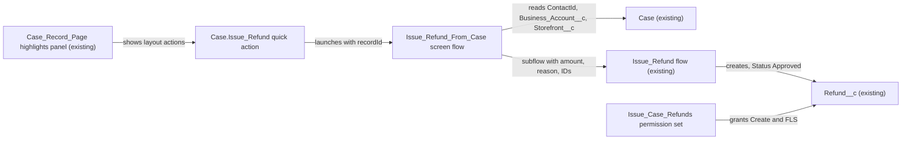

# Implementation spec — Issue a refund from the Case record page

> Give human service agents an "Issue Refund" action on the Case record page that creates a `Refund__c` linked to the case by reusing the existing `Issue_Refund` flow.

_Based on the requirement, the evidence reported by AskCoworker, and read-only org queries where noted. Assumptions and missing evidence are identified below. Specification only — nothing is implemented or deployed._

---

## 1. The requirement

Service agents need a way to issue a refund, linked to the case, from the Case record page. The user chose human service agents on the Case page over the Agentforce service agent (*user decision*). The request "Build something" was treated as a request for a specification; nothing was built or deployed.

| # | Responsibility | Trigger | Where it lives |
| --- | --- | --- | --- |
| 1 | Offer an "Issue Refund" action on the Case record page | Agent opens a Case | `Case.Issue_Refund` quick action on `Case-Case Layout` and `Case-Case %28Support%29 Layout`, shown by the highlights panel of `Case_Record_Page` |
| 2 | Capture the refund amount and reason, and create a `Refund__c` linked to the Case, its contact, business account, and storefront | Agent submits the action | `Issue_Refund_From_Case` screen flow, which calls the existing `Issue_Refund` flow |
| 3 | Give service agents the access the action needs | Permission set assignment | `Issue_Case_Refunds` permission set |

## 2. Grounding — reuse before building

Target org: `TestWriteSpecDE` (Developer Edition, `00Dak00001COqNeEAL`). API version: `67.0`.

- **`Refund__c`** (CustomObject) — the refund record. Fields `Amount__c` (currency), `Reason__c` (textarea), `Status__c` (picklist: Pending, Approved, Processing, Completed, Failed, Cancelled), `Issue_Date__c`, `Processed_Date__c`, `Payment_Method__c` (picklist: Original Payment Method, Credit Card, Gift Certificate, Account Credit, Check), and lookups `Case__c` (to `Case`, child relationship `Refunds__r`), `Contact__c`, `Business_Account__c` (to `Account`), `Storefront__c` (to `Storefront__c`). The Tooling `CustomField` list has these 10 fields and no others. 0 `Refund__c` records exist. _verified by org query_
- **`Issue_Refund`** (Flow, AutoLaunchedFlow, active, version `301ak00003SJcpiAAD`) — description: "Support agents and Agentforce can use this flow to record refund decisions against a specific case for a verified contact." Inputs `caseId`, `verifiedContactId`, `businessAccountId`, `storefrontId`, `refundAmount`, `refundReason`. Its `Create_Refund` element sets `Amount__c`, `Business_Account__c`, `Case__c`, `Contact__c`, `Reason__c`, `Storefront__c` from the inputs, `Issue_Date__c` = `$Flow.CurrentDate`, `Status__c` = "Approved", `Payment_Method__c` = "Original Payment Method". Outputs `isSuccess`, `resultMessage` ("Refund created successfully." or `$Flow.FaultMessage`), and `returnedRefunds`. `runInMode` is not set (default). `MetadataComponentDependency` shows no component that calls it. _verified by org query_
- **`Case`** fields `ContactId`, `Business_Account__c` (lookup to `Account`), and `Storefront__c` (lookup to `Storefront__c`) supply the refund's context. _verified by org query_
- **`Case_Record_Page`** (FlexiPage, the only Case record page) — its `record_flexipage:dynamicHighlights` component has `actionNames` unset, so it shows the page layout's actions. Activation and assignment cannot be read. _verified by org query_
- **Case quick actions** (Tooling `QuickActionDefinition`, `SobjectType = 'Case'`): `CloseCaseLightning`, `LogACall`, `NewChildCase`. None is refund-related, and no quick action named `%efund%` exists on any object. _verified by org query_
- **Case layouts and assignment** (Tooling `ProfileLayout`): `Case Layout` is assigned to System Administrator, Standard User, and most other profiles; `Case (Support) Layout` to `Custom: Support Profile`; `Case (Sales) Layout` and `Case (Marketing) Layout` to the Sales and Marketing profiles. Neither `Case Layout` nor `Case (Support) Layout` has a refund action or the `Refunds__r` related list. _verified by org query_
- **Access to `Refund__c`** (ObjectPermissions, complete list): `Agentforce_Reference_App`, `Pronto_Deep_Dive_Workshop`, `sfdc_accelerate_dms` (Read, Create, Edit, Delete); `sfdc_a360_sfcrm_data_extract`, `sfdc_slack`, the Analytics Cloud Integration User profile (Read); the System Administrator profile (all). FieldPermissions rows on `Refund__c` exist only for the first five permission sets; the System Administrator profile has none. `Custom: Support Profile` has Read and Create on `Case`, `Contact`, and `Account`, and no rows for `Refund__c` or `Storefront__c`. No permission set name contains "Refund". _verified by org query_
- **Personas:** `Custom: Support Profile` (Salesforce license) has 0 active users. `Customer Support Profile` and `Merchant Support Profile` use the Guest User License (site users). The only active standard users are on System Administrator, Analytics Cloud profiles, and Einstein Agent User. _verified by org query_
- **Other automation on `Refund__c`:** no Apex triggers, no record-triggered flows, no validation rules. _verified by org query_

Candidates examined and rejected:
- `IssueRefundReceiptAction` (ApexClass, invocable, `with sharing`) — creates an Approved `Refund__c` and first calls `ProntoWalletPassService.mintPassUrl` for an Apple Wallet pass. It backs the `Issue_Refund_Receipt` agent action (`GenAiFunctionDefinition`), which no topic links to (`GenAiPluginFunctionDef`). Rejected for the human path: the wallet callout is not requested and adds an external dependency. _verified by org query_
- `Apply_Remediation` (Flow, active) — creates an Approved `Refund__c` for the "Resolution Center" remediation use case and does not set `Business_Account__c` or `Payment_Method__c`. Rejected; `Issue_Refund` is the flow whose description names support agents. _verified by org query_
- `Validate_Remediation` (Flow, active) — checks an amount against a credit ceiling and monthly budget. Not used; the user set no approval limit. _verified by org query_
- `Refund_XSF_OS` (Flow, inactive, platform-event triggered on `OSAsyncChgCompletedEvent`) — not related to case refunds. _verified by org query_
- `Transaction__c.Refund_Reason__c` (CustomField) — a reason on transactions, not a refund record. _verified by org query_

Evidence sources: `sf org display`; `sf sobject list --sobject custom`; describes of `Refund__c` and `Case`; Tooling `CustomField`, `EntityDefinition`, `ApexClass` bodies, `ApexTrigger`, `ValidationRule`, `Flow.Metadata` for `Issue_Refund`, `Apply_Remediation`, `Validate_Remediation`, `FlexiPage` metadata, `Layout` metadata, `ProfileLayout`, `QuickActionDefinition`, `GenAiFunctionDefinition`, `GenAiPluginFunctionDef`, `LightningComponentBundle`, `MetadataComponentDependency`; standard `FlowDefinitionView`, `ObjectPermissions`, `FieldPermissions`, `PermissionSet`, `PermissionSetAssignment`, `User`, `Profile`, `Refund__c` counts, `Organization`. AskCoworker (discovery and inventory calls) returned no citedReferences. The behavior call (D2) was skipped because the org queries above answered its questions (automation, writers, access). After four AskCoworker claims were found wrong (Section 8), the runtime/security and testing calls were skipped and those topics were covered with org queries.

## 3. Architecture

Why the pieces are drawn this way:

1. The highlights panel of `Case_Record_Page` has no own action list, so adding the quick action to the layouts puts it on the page with no FlexiPage change. _verified by org query_
2. A Flow quick action needs a screen flow; `Issue_Refund` is autolaunched and has no screens, so a thin screen flow collects the input. _assumption (documented platform behavior)_
3. The screen flow calls `Issue_Refund` as a subflow instead of creating the record itself, so the refund defaults (`Status__c`, `Payment_Method__c`, `Issue_Date__c`) stay in one place. _verified by org query_ (defaults) and design rule (reuse).
4. No Apex is added.

## 4. Metadata changes

**Automation**

- **Create `Issue_Refund_From_Case`** — Flow (Screen Flow, delivered Active, `runInMode` default so it runs in user context). Input variable `recordId` (Text, input). Steps: (1) Get Records `Case` where `Id` = `recordId`, fields `Id`, `CaseNumber`, `ContactId`, `Business_Account__c`, `Storefront__c`. (2) Screen "Issue Refund": Currency input `Refund Amount` (required, validation `{!Refund_Amount} > 0`, error "Enter an amount greater than zero."), Long Text input `Refund Reason` (required). (3) Subflow `Issue_Refund` with `caseId` = `recordId`, `verifiedContactId` = `Case.ContactId`, `businessAccountId` = `Case.Business_Account__c`, `storefrontId` = `Case.Storefront__c`, `refundAmount`, `refundReason`. (4) Decision on `isSuccess`: true → screen showing `resultMessage` and the refund number (`returnedRefunds[0].Name` via a loop or assignment); false → screen showing `resultMessage`. Blank Case lookups are passed as blank, and `Issue_Refund` writes blank lookups. Module `force-app/main/default/flows`.

**UX**

- **Create `Case.Issue_Refund`** — QuickAction, type Flow, object `Case`, flow `Issue_Refund_From_Case`, label "Issue Refund". The platform passes the Case Id to `recordId`. Module `force-app/main/default/quickActions`.
- **Update `Case-Case Layout`** — Layout. Add `Case.Issue_Refund` to the Salesforce Mobile and Lightning Experience actions (`platformActionList`), after the existing actions. This layout is shared by System Administrator, Standard User, and most other profiles, so all of them see the action; users without the permission set get the flow's error message. Module `force-app/main/default/layouts`.
- **Update `Case-Case %28Support%29 Layout`** — Layout. Same change as `Case-Case Layout`, for `Custom: Support Profile`. Module `force-app/main/default/layouts`.

**Security**

- **Create `Issue_Case_Refunds`** — PermissionSet, label "Issue Case Refunds", license none. Object `Refund__c`: Read, Create. Field Read and Edit on every field `Issue_Refund` writes: `Refund__c.Amount__c`, `Refund__c.Reason__c`, `Refund__c.Status__c`, `Refund__c.Issue_Date__c`, `Refund__c.Payment_Method__c`, `Refund__c.Case__c`, `Refund__c.Contact__c`, `Refund__c.Business_Account__c`, `Refund__c.Storefront__c`. Field Read on `Refund__c.Processed_Date__c`. Object `Storefront__c`: Read (lookup target of `Refund__c.Storefront__c`). Flow access: `Issue_Refund_From_Case`, `Issue_Refund`. No Edit or Delete on `Refund__c`. Module `force-app/main/default/permissionsets`.

## 5. Data 360 (Data Cloud) data involved

Not applicable — this change does not use Data 360.

## 6. Security considerations

- **Execution context.** `Issue_Refund_From_Case` runs in user context (default mode for a screen flow started from a quick action), and `Issue_Refund` as its subflow runs in the same context because it sets no `runInMode`. Object permissions, field-level security, and sharing of the agent apply. _assumption (documented platform behavior)_
- **CRUD/FLS today.** No profile or permission set that a service agent holds grants any access to `Refund__c`; the System Administrator profile has object access but no `Refund__c` FieldPermissions rows. View All Data and Modify All Data do not grant field access. _verified by org query_ Without `Issue_Case_Refunds`, the create fails and the flow shows the fault message.
- **New grants.** `Issue_Case_Refunds` grants Read and Create on `Refund__c`, Read and Edit on the nine fields `Issue_Refund` writes, Read on `Refund__c.Processed_Date__c`, and Read on `Storefront__c`. Deploying it grants nothing until it is assigned. Existing permission sets (`Agentforce_Reference_App`, `Pronto_Deep_Dive_Workshop`, and the others above) are not widened.
- **Related objects.** Agents need Read on `Case`, `Contact`, and `Account` (and sharing access to the records) to read the Case and set the lookups. `Custom: Support Profile` grants Read on all three. _verified by org query_ Other profiles are not checked; see Section 8.
- **Data exposure.** The refund inherits `Refund__c` sharing (owner = the agent). Agents can create refunds of any amount; there is no approval step (Section 8).

## 7. Testing strategy

No Apex is added. Flow Tests do not support screen flows, so the new flow is covered by manual checks in a sandbox. Nothing here has been run.

Recommended verification:

1. **Main outcome.** As a user with `Issue_Case_Refunds`, open a Case that has a contact, business account, and storefront, click "Issue Refund", enter 25.00 and a reason. Expect a success screen with the refund number, and a `Refund__c` with `Case__c`, `Contact__c`, `Business_Account__c`, `Storefront__c` from the Case, `Status__c` = Approved, `Payment_Method__c` = Original Payment Method, `Issue_Date__c` = today.
2. **Blank lookups.** On a Case with no contact, business account, or storefront, the refund is created with blank lookups.
3. **Negative amount.** Enter 0 or -5; the screen blocks with "Enter an amount greater than zero." Leave the reason blank; the screen blocks.
4. **Permission.** As a user without `Issue_Case_Refunds` (on `Case Layout`), the action shows; submitting shows the fault message and creates no record.
5. **Placement.** Confirm the action appears in the highlights panel of `Case_Record_Page` for `Case Layout` and `Case (Support) Layout` users, and in the Salesforce mobile app.
6. **Storefront access.** As a user whose only `Storefront__c` access comes from `Issue_Case_Refunds`, issue a refund on a Case with a storefront; expect success.

## 8. Open decisions

### Open

1. **Permission set assignment (blocking for delivery).** `Issue_Case_Refunds` must be assigned to the service agents in Setup (Users → Permission Set Assignments). `Custom: Support Profile` has 0 active users today, so the target users are not known. Recommended default: assign it to each human service agent when they are onboarded.
2. **Refund approval or limit (non-blocking).** The user had no preference; refunds are created as Approved with no amount limit, matching `Issue_Refund` (*assumption*). Proposal for later: route amounts above a threshold to approval, or reuse `Validate_Remediation` for a ceiling.
3. **Related object access on other profiles (non-blocking).** If service agents use a profile other than `Custom: Support Profile`, confirm Read on `Case`, `Contact`, and `Account` before go-live (run Section 7 check 1 as such a user).
4. **Shared layout change (non-blocking).** `Case-Case Layout` is shared by System Administrator, Standard User, and most profiles, including guest profiles (which cannot create refunds). Alternative: a separate layout for service agents. Recommended default: keep the shared layout; the action fails safely without the permission set.
5. **Page activation (non-blocking).** `Case_Record_Page` activation cannot be read. If another page or the standard page is active, the action still comes from the layout.

### Resolved

- **Persona** (*user decision*): human service agents, from the Case record page. The Agentforce action `Issue_Refund_Receipt` stays unchanged and unassigned.
- **Reuse `Issue_Refund` instead of `IssueRefundReceiptAction` or `Apply_Remediation`** (*assumption*): it is the flow whose description names support agents, sets all Case-derived fields, and needs no callout.
- **Naming** (*assumption*): `Issue_Refund_From_Case`, `Case.Issue_Refund`, `Issue_Case_Refunds` do not exist in the org (queried FlowDefinitionView, QuickActionDefinition, PermissionSet).
- **`Refunds__r` related list on the Case layouts** (*assumption*): not added; the requirement asks to issue a refund, and the success screen shows the refund number. Listed as a proposal.
- **AskCoworker corrections:** (1) D1 said Case has no `Storefront__c`; describe and Tooling `CustomField` show `Case.Storefront__c` (lookup to `Storefront__c`). (2) D1 said FlexiPage and quick action metadata cannot be queried; Tooling `FlexiPage` and `QuickActionDefinition` returned them. (3) The inventory call said `Issue_Refund` runs "with sharing" per a class body; it is a flow with no `runInMode` set. (4) The inventory call's permission set omitted Edit on `Refund__c.Status__c`, `Refund__c.Issue_Date__c`, and `Refund__c.Payment_Method__c`, which `Issue_Refund` writes; added. (5) D1 mapped `Case.AccountId` to `Refund__c.Business_Account__c`; the design uses `Case.Business_Account__c`. (6) Its claim that a failed flow "fails silently" is wrong; `Issue_Refund` has a fault path that returns `isSuccess` = false with the fault message. Its open decisions on FlexiPage action lists and related list columns were settled by the FlexiPage query and by dropping the related list.
- **Deployment sequence:** `Issue_Refund_From_Case`, then `Case.Issue_Refund`, then the two layouts and `Issue_Case_Refunds`; then assign the permission set.

## 9. Change set

| # | Action | Type | API name | Module | Why |
| --- | --- | --- | --- | --- | --- |
| 1 | Create | Flow | `Issue_Refund_From_Case` | force-app/main/default/flows | Screen flow that collects amount and reason and calls `Issue_Refund` with the Case context |
| 2 | Create | QuickAction | `Case.Issue_Refund` | force-app/main/default/quickActions | "Issue Refund" action on Case that launches the screen flow |
| 3 | Update | Layout | `Case-Case Layout` | force-app/main/default/layouts | Places the action for profiles on the default Case layout |
| 4 | Update | Layout | `Case-Case %28Support%29 Layout` | force-app/main/default/layouts | Places the action for `Custom: Support Profile` |
| 5 | Create | PermissionSet | `Issue_Case_Refunds` | force-app/main/default/permissionsets | Grants Create on `Refund__c`, FLS on the written fields, `Storefront__c` Read, and flow access |

A Case quick action launches a thin screen flow that reuses the existing `Issue_Refund` flow, with a dedicated permission set for access.

Total: 5 · Create: 3 · Update: 2 · Delete: 0
