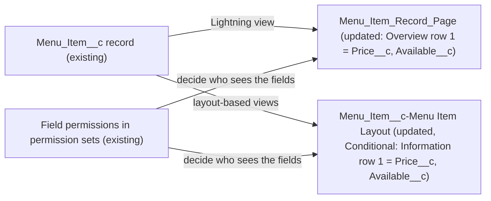

# Implementation spec — Menu Item record page: price and availability at the top

> Move `Menu_Item__c.Price__c` and `Menu_Item__c.Available__c` into the first row of the Menu Item record page, and add them as the first row of the Menu Item page layout.

_Based on the requirement, the evidence reported by AskCoworker, and read-only org queries where noted. Assumptions and missing evidence are identified below. Specification only — nothing is implemented or deployed._

---

## 1. The requirement

Rearrange the Menu Item record page so that Price and Available appear first. The Lightning record page uses Dynamic Forms, so the main change is to the FlexiPage. The page layout also changes, as a `Conditional:` row. No user decision changed the scope. The request contained no out-of-scope instructions.

| # | Responsibility | Trigger | Where it lives |
| --- | --- | --- | --- |
| 1 | Show `Price__c` and `Available__c` in the first row of the record detail on the Lightning record page | Record page view | `Menu_Item_Record_Page` (Dynamic Forms "Overview" section) |
| 2 | Show `Price__c` and `Available__c` in the first row wherever the page layout is rendered | Views that use the layout (for example the New and Clone dialogs, Salesforce Classic, or a profile/app without the FlexiPage) | `Menu_Item__c-Menu Item Layout` ("Information" section) |

## 2. Grounding — reuse before building

Target org: `TestWriteSpecDE` (`00Dak00001COqNeEAL`). API version: `67.0`.

- **`Menu_Item__c`** (CustomObject, DurableId `01Iak00000Dx4JS`) — the object in scope; 206 records. The custom object list has three menu objects: `Menu__c`, `Menu_Category__c`, and `Menu_Item__c`. _verified by org query_
- **`Menu_Item__c.Price__c`** (Currency, precision 18, scale 2, nillable) and **`Menu_Item__c.Available__c`** (Checkbox, default `true`) — the two fields to move. Tooling `CustomField` on `Menu_Item__c` returns exactly `Available`, `Calories`, `Description`, `Image_URL`, `Menu_Category`, `Menu`, `Price`. _verified by org query_
- **`Menu_Item_Record_Page`** (FlexiPage, `RecordPage`, template `flexipage:recordHomeTemplateDesktop`, unmanaged, Id `0M0ak00000GBmLLCA1`) — the only FlexiPage whose `EntityDefinitionId` is `Menu_Item__c`. It uses Dynamic Forms field sections. _verified by org query_ Current field order:
  - "Overview": column 1 `Record.Name`, `Record.Menu_Category__c`; column 2 `Record.Available__c`, `Record.Menu__c`.
  - "Item Details": column 1 `Record.Description__c`, `Record.Calories__c`; column 2 `Record.Price__c`, `Record.Image_URL__c`.
  - System Information: `Record.CreatedById`, `Record.LastModifiedById`.
  - The header region holds `force:highlightsPanel`.
- **`MetadataComponentDependency`** — the only component that references `Menu_Item_Record_Page` is CustomObject `Menu_Item`. This suggests an object-level action override (org default), but it does not show app or profile assignments. _verified by org query_
- **`Menu_Item__c-Menu Item Layout`** (Layout, `Standard`, unmanaged, Id `00hak00000dDr1PAAS`) — the only layout for the object. `ProfileLayout` assigns it to every profile returned, with no record type. The "Information" section is column 1 `Name`, `Menu__c`, `Menu_Category__c` and column 2 `OwnerId`. It does not contain `Price__c` or `Available__c`. _verified by org query_
- **Record types and compact layouts** — `RecordType` for `Menu_Item__c` returns 0 rows. Tooling `CompactLayout` for `Menu_Item__c` returns 0 rows, so the highlights panel uses the system default compact layout. _verified by org query_
- **Automation** — 0 Apex triggers (`TableEnumOrId = 'Menu_Item__c'`), 0 flows in `FlowDefinitionView` (checked by object name and by DurableId), and 0 validation rules on `Menu_Item__c`. A layout change does not interact with automation in any case. _verified by org query_
- **Other display surfaces** — unmanaged LWC bundles include `menuBrowser`. The Apex classes `MenuBrowserController`, `AgentGetMenuItemsActions`, `AgentUpdateMenuItemActions`, `AgentUpdateMenuItemPriceActions`, and `MenuDescriptionPromptGrounding` exist. _verified by org query_ They read fields by API name and are not record detail pages. _reported by AskCoworker_ `menuBrowser` is not placed on `Menu_Item_Record_Page`. _verified by org query_

Candidates examined and rejected: a new "Key Info" section above "Overview" (the requirement says rearrange, and a new section adds structure nobody asked for); a custom compact layout for the highlights panel (proposal only, see Section 8); `menuBrowser` LWC (a list surface, not the record page).

Evidence sources: `sf org display`; `sf sobject list --sobject custom`; `sf sobject describe Menu_Item__c`; Tooling `EntityDefinition`, `FlexiPage` (list and `Metadata`), `Layout` (list and `Metadata`), `ProfileLayout`, `CustomField`, `CompactLayout`, `LightningComponentBundle`, `AuraDefinitionBundle`, `ApexClass`, `ApexTrigger`, `ValidationRule`, `MetadataComponentDependency`; standard `RecordType`, `FieldPermissions`, `FlowDefinitionView`, `DataStream` count, `Menu_Item__c` count. AskCoworker (D1, D2, I, R) returned no citedReferences. After four incorrect AskCoworker claims (see Section 8), the T call was skipped; Sections 7 and 8 come from org queries and documented platform behavior.

## 3. Architecture

Why the pieces are drawn this way:

1. `Menu_Item_Record_Page` is a Dynamic Forms page, so its field sections, not the page layout, set the field order on the Lightning record page. _verified by org query_ (FlexiPage `Metadata` holds `fieldInstance` items.)
2. The page layout still drives views that do not use Dynamic Forms. Which views those are in this org depends on page activation, which cannot be read. _assumption (documented platform behavior)_
3. Field placement grants no access. Only the `FieldPermissions` rows in Section 6 decide who sees the two fields. _assumption (documented platform behavior)_
4. No Apex or automation is involved; this is a declarative metadata change.

## 4. Metadata changes

**Layout**

- **Update `Menu_Item_Record_Page`** — FlexiPage. In the "Overview" field section (`flexipage_fieldSection`), make column 1 (`Facet-ab8d7879-32a7-42c8-bbcc-d12a2ff7eaa5`) `Record.Price__c`, `Record.Name`, `Record.Menu_Category__c`, and make column 2 (`Facet-f71782e4-6802-4117-8aa3-4407cc7a60ca`) `Record.Available__c`, `Record.Menu__c`. Remove `Record.Price__c` from the "Item Details" column 2 facet (`Facet-f03e4447-b36a-41ff-a582-6737a621d453`), which leaves `Record.Image_URL__c`. Keep `uiBehavior` `none` for both fields, and keep all other regions, components, and the header `force:highlightsPanel` unchanged. Retrieve the current version before editing.
- **Update `Menu_Item__c-Menu Item Layout`** — Conditional: needed wherever the page layout still renders Menu Item details (the New and Clone dialogs, Salesforce Classic, or any app or profile without `Menu_Item_Record_Page`). Type: Layout. In the "Information" section, make column 1 `Price__c` (Edit), `Name` (Required), `Menu__c`, `Menu_Category__c`, and column 2 `Available__c` (Edit), `OwnerId`. Leave the System Information section and the related lists unchanged. Recommended default: deploy it, because the layout is assigned to every profile.

## 5. Data 360 (Data Cloud) data involved

Not applicable — this change does not use Data 360. `SELECT COUNT() FROM DataStream` returns 0. _verified by org query_

## 6. Security considerations

- Execution context and sharing: no change. The page and the layout are rendered for the viewing user and affect no DML, Apex, or sharing.
- Field access comes only from `FieldPermissions`. _verified by org query_ This list is complete for both fields:
  - Read and Edit on both `Price__c` and `Available__c`: permission sets `Agentforce_Reference_App` and `sfdc_accelerate_dms`.
  - Read only on both fields: permission sets `sfdc_a360_sfcrm_data_extract` and `sfdc_slack`.
  - No profile has a row, so no profile grants access to either field, including System Administrator. View All Data and Modify All Data do not grant field access.
- Users without one of these permission sets will not see either field in any position. The platform omits the field; it does not show it blank. _assumption (documented platform behavior)_ This change grants no access, and none is needed to rearrange the page.
- No permission set changes. No new data is exposed.
- Shared UI: `Menu_Item_Record_Page` and `Menu_Item__c-Menu Item Layout` are shared, so the new order applies to every user who sees them. The change only reorders fields; it removes no field and no access. _assumption (documented platform behavior)_

## 7. Testing strategy

These are declarative layout changes, so there are no Apex tests or Flow Tests. Recommended manual verification in a sandbox:

1. As a user with `Agentforce_Reference_App` or `sfdc_accelerate_dms`, open a `Menu_Item__c` record in Lightning. Check that the first row of "Overview" is Price (left) and Available (right), that Name, Menu Category, and Menu follow, and that "Item Details" shows Description, Calories, and Image URL.
2. Open the record page in Lightning App Builder and check Activation. Record whether `Menu_Item_Record_Page` is the org default and which apps or profiles have assignments. This check settles the `Conditional:` layout row.
3. Click New on Menu Items and check that Price and Available are the first row of the Information section. This verifies that the `Menu_Item__c-Menu Item Layout` row works for the create dialog.
4. Edit Price and Available inline on the record page and save. Both values should persist, with Available still defaulting to true on new records.
5. Negative/permission check: as a user with none of the four permission sets, open the same record. Neither field should appear, and no empty slot should be shown. This confirms that placement grants no access.
6. Check on the Salesforce mobile app that the record page shows the same order.

## 8. Open decisions

### Open

1. **Layout row is conditional (non-blocking).** `Menu_Item__c-Menu Item Layout` is `Conditional:` because `Menu_Item_Record_Page` activation and assignments cannot be read. The only reference found is from CustomObject `Menu_Item` (_verified by org query_), which suggests an org-default override. The layout is still assigned to every profile, and it drives views without Dynamic Forms, such as New and Clone. Recommended default: deploy the layout update. Settle the condition with Manual verification steps 2 and 3.
2. **Highlights panel (non-blocking, proposal).** No custom compact layout exists (_verified by org query_), so the header shows only the system default fields. A custom compact layout with `Price__c` and `Available__c`, assigned as the object's default, would also show them in the header. This is not in the inventory because the requirement asks for the page layout.
3. **No profile grants the fields (non-blocking).** No profile has `FieldPermissions` on `Price__c` or `Available__c`. Only the four permission sets in Section 6 grant access. Users outside those sets will not see the fields in the new position. A dedicated permission set for menu editors would be a separate requirement.
4. **Deployment sequence (non-blocking).** Retrieve `Menu_Item_Record_Page` and `Menu_Item__c-Menu Item Layout` into source control first, because the project has no copies. That retrieve is the backup, and redeploying it is the rollback. Then deploy both rows together.

### Resolved

- "At the top" means the first row of the first field section ("Overview"), with Price in column 1 and Available in column 2. Name, Menu Category, and Menu keep their relative order below. _assumption_ (implementation placement, decided without a question)
- The existing section is reordered rather than a new section added, because the requirement says "rearrange" and a new section is structure nobody asked for. _assumption_
- AskCoworker claimed FlexiPage is not queryable (D1, D2) and that page names were Unknown. Tooling `FlexiPage` returned `Menu_Item_Record_Page` and its `Metadata`. _verified by org query_
- AskCoworker claimed LWC and Aura bundles are not queryable (D2). Tooling `LightningComponentBundle` and `AuraDefinitionBundle` returned the unmanaged bundles. _verified by org query_
- AskCoworker (R) said fields without FLS render blank. Fields a user cannot read are omitted. _assumption (documented platform behavior)_
- AskCoworker (R) said profile FLS was unknown. `FieldPermissions` shows no profile rows, which means no profile grants access. _verified by org query_
- After these four wrong claims, every AskCoworker fact kept here was verified by org query, except that the listed Apex classes reference fields by API name (_reported by AskCoworker_; not load-bearing). The T call was skipped.
- AskCoworker named `StorefrontPickerController` and `AgentCreateMenuWithItemsActions` from a "prior session". They are dropped as untraceable; the design does not depend on them.

## 9. Change set

| # | Action | Type | API name | Module | Why |
| --- | --- | --- | --- | --- | --- |
| 1 | Update | FlexiPage | `Menu_Item_Record_Page` | force-app/main/default/flexipages | Dynamic Forms page: move Price__c and Available__c to the first row of Overview |
| 2 | Update | Layout | `Menu_Item__c-Menu Item Layout` | force-app/main/default/layouts | Conditional: add Price__c and Available__c as the first row of Information for layout-based views |

Two declarative UI changes reorder existing fields on the Dynamic Forms record page and the page layout, with no automation or access change.

Total: 2 · Create: 0 · Update: 2 · Delete: 0
