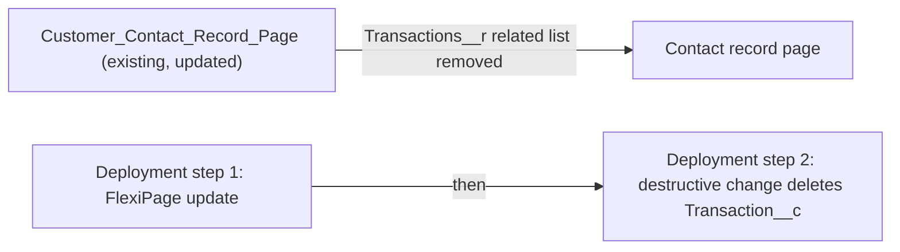

# Implementation spec — Retire the Transaction custom object

> Remove the unused `Transaction__c` custom object from the org after removing its only reference, the Transactions related list on the Contact record page.

_Based on the requirement, the evidence reported by AskCoworker, and read-only org queries where noted. Assumptions and missing evidence are identified below. Specification only — nothing is implemented or deployed._

---

## 1. The requirement

Retire (delete) the custom object labelled "Transaction" (`Transaction__c`), which the requester says nobody uses. The org confirms it holds no records and has no automation or code references; the only live reference is a related list on a Contact record page. `Loyalty_Transaction__c` and the standard `FinanceTransaction` are not in scope (see Section 8).

| # | Responsibility | Trigger | Where it lives |
| --- | --- | --- | --- |
| 1 | Remove the last UI reference to the object so that the object can be deleted and the Contact page shows no broken related list | Deployment | `Customer_Contact_Record_Page` (FlexiPage) |
| 2 | Delete the object, its 6 custom fields, its layout, and its access grants | Deployment (destructive change) | `Transaction__c` (CustomObject) |

## 2. Grounding — reuse before building

Target org: `TestWriteSpecDE` (org ID `00Dak00001COqNeEAL`, connected). API version: `67.0`. The requirement names no other environment; production usage was not checked.

- **`Transaction__c`** (CustomObject) — label "Transaction", `NamespacePrefix` null (unmanaged), `DurableId` `01Iak00000Dx4KO`, internal sharing `ReadWrite`, external `Private`. _verified by org query_
- **Custom fields on `Transaction__c`** — complete list from Tooling `CustomField`: `Transaction__c.Contact__c` (Lookup to `Contact`, relationship name `Transactions`, `deleteConstraint` `SetNull`, not required), `Transaction__c.Payment_Method__c`, `Transaction__c.Refund_Reason__c`, `Transaction__c.Total_Amount__c`, `Transaction__c.Transaction_Date__c`, `Transaction__c.Transaction_Type__c`. _verified by org query_ (`sobject describe` shows none of them because no profile grants field access to the running admin.)
- **Records** — `SELECT COUNT() FROM Transaction__c` returns 0, and the same query with `--all-rows` (including the Recycle Bin) returns 0. The running user's System Administrator profile has View All on the object. _verified by org query_
- **References** (complete for the categories listed) — `MetadataComponentDependency` on the object returns no rows; on the six fields it returns only the layout `Transaction__c-Transaction Layout` (all six fields) and the FlexiPage `Customer_Contact_Record_Page` (`Transaction__c.Contact__c`). _verified by org query_
- **`Customer_Contact_Record_Page`** (FlexiPage, `sobjectType` `Contact`, `RecordPage`, Id `0M0ak00000GBmLXCA1`) — region `relatedTabContent` holds a `force:relatedListSingleContainer` (identifier `force_relatedListSingleContainer4`) with `relatedListApiName` `Transactions__r`. _verified by org query_
- **No other references found:** no unmanaged Apex class (70 bodies searched) or trigger; no unmanaged flow (all 14 unmanaged flow versions' metadata searched; no record-triggered flow on the object; flow-to-object dependencies reference only Refund and Storefront); no LWC (58 files), Aura (17 definitions), or Visualforce page (24) source mentions it; no validation rules, workflow rules, approval processes, list views, tabs, CDC channel members, history-tracked fields, or reports whose developer name contains "Transaction". None of the 4 Contact page layouts has a Transactions related list (`Contact Layout` lists only `Loyalty_Transaction__c.Contact__c`). No agent action name or description mentions it. _verified by org query_
- **Access grants** (complete, from `ObjectPermissions`): System Administrator profile (CRUD, View All, Modify All); Analytics Cloud Integration User profile (Read, View All); managed permission sets `sfdc_accelerate_dms` (CRUD, View All, Modify All), `sfdc_a360_sfcrm_data_extract` and `sfdc_slack` (Read, View All), all namespace `sfdcInternalInt`. `FieldPermissions` rows exist only for the three managed permission sets. _verified by org query_ The three managed sets are assigned to one active user, `cloud@00dak00001coqneeal` (`CloudIntegrationUser`); the Analytics Cloud Integration User profile has one active user, `integration@00dak00001coqneeal.com`. _verified by org query_
- **Data 360** — `SELECT COUNT() FROM DataStream` returns 0. _verified by org query_
- **Project source** — `force-app` contains no `Transaction__c` object, layout, or `Customer_Contact_Record_Page` source. _verified by project file_

Candidates examined and rejected: `Loyalty_Transaction__c` — label "Loyalty Transaction", a separate loyalty-points object, not the "Transaction" object the requirement names; `FinanceTransaction` — standard object, cannot be deleted; `Agentforce_Reference_App` — AskCoworker said it grants access, but it has no `ObjectPermissions` row for `Transaction__c`.

Evidence sources: `sf org display`; `sf sobject list` (custom and all); `sobject describe Transaction__c`; Tooling `EntityDefinition`, `CustomField`, `MetadataComponentDependency`, `Layout`, `FlexiPage` (metadata by Id), `ApexClass`/`ApexTrigger` bodies, `Flow` metadata, `LightningComponentResource`, `AuraDefinition`, `ApexPage`, `ValidationRule`, `WorkflowRule`, `PlatformEventChannelMember`, `GenAiFunctionDefinition`, `NamedCredential`; standard `ObjectPermissions`, `FieldPermissions`, `PermissionSetAssignment`, `User`, `FlowDefinitionView`, `ListView`, `TabDefinition`, `Report`, `ProcessDefinition`, `CronTrigger`, `DataStream`. AskCoworker calls D1, D2 (narrowed after a timeout), I, and R returned no citedReferences. After four wrong AskCoworker claims (see Section 8), the T call was skipped and testing and open decisions were derived from org queries and documented platform behavior.

## 3. Architecture

Why the pieces are drawn this way:

1. `Customer_Contact_Record_Page` is the only component outside the object that references it (through the `Transactions__r` related list). _verified by org query_ It is updated first, so the object delete does not fail on the reference and the page does not keep a component for a deleted relationship. _assumption (documented platform behavior)_
2. `Transaction__c` is deleted in a second deployment. Deleting a custom object also deletes its custom fields, page layouts, sharing object (`Transaction__Share`), and all profile and permission set grants on it, including those in the managed permission sets that cannot be edited. _assumption (documented platform behavior)_
3. `Transaction__c` is not drawn as active after the change because it is deleted.

## 4. Metadata changes

**Prerequisites**

- **Update `Customer_Contact_Record_Page`** — FlexiPage. In region `relatedTabContent`, remove the `force:relatedListSingleContainer` component `force_relatedListSingleContainer4` (`relatedListApiName` `Transactions__r`). Leave every other component unchanged. Retrieve the page into `force-app` before editing, because no local source exists. Impact: every user of this Contact record page stops seeing the Transactions related list; it shows no rows today because the object has 0 records.

**Core**

- **Delete `Transaction__c`** — CustomObject, delivered as `destructiveChanges.xml`. Impact: removes the object, its 6 custom fields (`Transaction__c.Contact__c`, `Transaction__c.Payment_Method__c`, `Transaction__c.Refund_Reason__c`, `Transaction__c.Total_Amount__c`, `Transaction__c.Transaction_Date__c`, `Transaction__c.Transaction_Type__c`), the layout `Transaction__c-Transaction Layout`, the `Transactions` child relationship on `Contact`, and all object and field grants (System Administrator, Analytics Cloud Integration User, `sfdc_accelerate_dms`, `sfdc_a360_sfcrm_data_extract`, `sfdc_slack`). No record data is lost (0 records). Prerequisites: the `Customer_Contact_Record_Page` update is deployed; the pre-delete checks in Section 8 are done; the object and layout are retrieved into source control as the backup. Rollback: undelete the object from Setup > Object Manager > Deleted Objects within its 15-day retention window, or redeploy it from the retrieved source.

## 5. Data 360 (Data Cloud) data involved

Not applicable — this change does not use Data 360. The org has no data streams (`DataStream` count 0, _verified by org query_), although the managed `sfdc_a360_sfcrm_data_extract` permission set can read the object.

## 6. Security considerations

- No execution context applies: both changes are metadata deployments, and deleting an object is not a record DML event, so no record automation runs. _assumption (documented platform behavior)_
- Access removed: the delete removes every grant listed in Section 2, including those in the managed `sfdcInternalInt` permission sets, which cannot be edited directly. _assumption (documented platform behavior)_ No permission set or profile needs an edit.
- Field access today: only `sfdc_accelerate_dms` (Read and Edit) and `sfdc_a360_sfcrm_data_extract` and `sfdc_slack` (Read) have `FieldPermissions` rows on the six fields; no profile has any. _verified by org query_
- Data exposure: none, because no records exist. The FlexiPage update removes a related list for every user of that Contact page.
- The deploying user needs Customize Application and Modify All Data (Setup rights to delete custom objects). _assumption (documented platform behavior)_

## 7. Testing strategy

No Apex or Flow tests are needed; both changes are declarative removals. Recommended verification, run in a sandbox first and then in the target org:

1. Before deployment: re-run `SELECT COUNT() FROM Transaction__c` with `--all-rows` and confirm 0 (load-bearing assumption A1 in Section 8).
2. Before deployment: re-run Tooling `MetadataComponentDependency WHERE RefMetadataComponentId` for the object and each of the six field IDs, and confirm only the layout and `Customer_Contact_Record_Page` appear.
3. After step 1: open a Contact record that uses `Customer_Contact_Record_Page` and confirm the page renders and the Transactions related list is gone.
4. After step 2: confirm `sf sobject list --sobject custom` no longer lists `Transaction__c`, and that it appears under Setup > Object Manager > Deleted Objects.
5. After step 2: open a Contact record page and each of the 4 Contact layouts to confirm they still render.
6. Run all local Apex tests (`RunLocalTests`) with the destructive deployment to confirm no Apex compile dependency was missed.
7. Check reports, report types, and list views in Setup for `Transaction__c` (cannot be read with the allowed queries).

## 8. Open decisions

### Open

1. **CRM Analytics and integration usage (non-blocking).** The Analytics Cloud Integration User profile has Read and View All, and the managed `sfdc_accelerate_dms` set (assigned to `cloud@00dak00001coqneeal`) has Modify All on `Transaction__c`. CRM Analytics dataflows and recipes and external API callers cannot be read with the allowed queries. The object has never held a record (0 including the Recycle Bin), so no data is lost. Recommended default: check CRM Analytics Data Manager for dataflows or recipes that reference `Transaction__c`, and remove the object from them before step 2.
2. **Reports, report types, and list views (non-blocking).** No report developer name contains "Transaction", and no list view exists on the object, but custom report types and report columns cannot be read. Check them in Setup before step 2; a custom report type on the object blocks the delete until it is removed.
3. **Load-bearing assumption A1 (blocking prerequisite).** "Nobody uses it" rests on the 0-record count and the reference search. Both rows depend on it. Re-run the checks in Section 7 items 1 and 2 immediately before deployment.

**Deployment sequence:** (1) retrieve `Transaction__c` (with fields and layout) and `Customer_Contact_Record_Page` into source control as the backup; (2) deploy the `Customer_Contact_Record_Page` update; (3) deploy `destructiveChanges.xml` that deletes `Transaction__c`; (4) optionally, after the 15-day undelete window is no longer needed, erase the object from Deleted Objects so it stops counting toward the custom object limit.

### Resolved

- **Which object (assumption).** "The Transaction object" is decided as `Transaction__c` because its label is exactly "Transaction"; `Loyalty_Transaction__c` (label "Loyalty Transaction") is a different business concept and is not deleted. _verified by org query_ for the labels.
- **Retire means delete (assumption).** With 0 records and no automation, the object is deleted rather than hidden; hiding it (removing access and the related list) was rejected as it leaves unused metadata.
- **AskCoworker correction 1:** D1 said `Transaction__c` has 0 custom fields. Tooling `CustomField` shows 6. _verified by org query_
- **AskCoworker correction 2:** D1 said `Agentforce_Reference_App` grants access to `Transaction__c`. `ObjectPermissions` has no such row. _verified by org query_
- **AskCoworker correction 3:** I proposed a separate Layout delete, saying layouts must be removed before the object. Deleting a custom object deletes its layouts; the row was dropped. _assumption (documented platform behavior)_
- **AskCoworker correction 4:** R said deleted custom objects cannot be undeleted. Deleted custom objects stay in Deleted Objects for 15 days and can be undeleted. _assumption (documented platform behavior)_ AskCoworker also said a destructive deployment needs local source; a `destructiveChanges.xml` manifest needs only the member names. The retrieve is kept as the backup step, not as a blocker.
- **T skipped.** After four wrong AskCoworker claims, the T call was skipped (Rule 3); Section 7 and this section were built from org queries.
- **Dropped AskCoworker items:** the Refund and Order "same concept" fields and the loyalty roll-up gap are unrelated to this retirement.

## 9. Change set

| # | Action | Type | API name | Module | Why |
| --- | --- | --- | --- | --- | --- |
| 1 | Update | FlexiPage | `Customer_Contact_Record_Page` | force-app/main/default/flexipages | Remove the `Transactions__r` related list, the only reference to the object |
| 2 | Delete | CustomObject | `Transaction__c` | force-app/main/default/objects | Retire the unused object (0 records, no code or automation references) |

The Contact record page drops its Transactions related list, then a destructive deployment deletes `Transaction__c` with its fields, layout, and grants.

Total: 2 · Create: 0 · Update: 1 · Delete: 1
