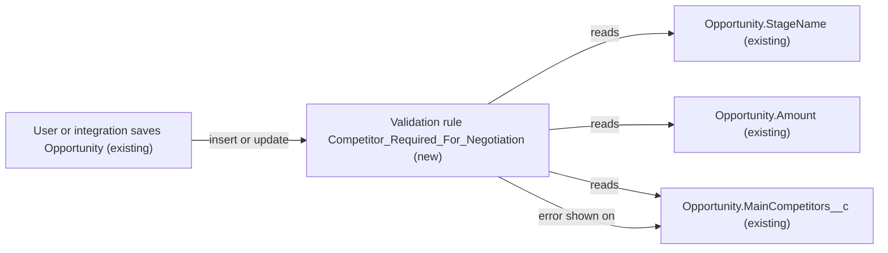

# Implementation spec — Competitor required for high-value Opportunities in Negotiation/Review

> Block saving an Opportunity with an Amount over 50,000 in the `Negotiation/Review` stage unless the Main Competitor(s) field is filled in.

_Based on the requirement, the evidence reported by AskCoworker, and read-only org queries where noted. Assumptions and missing evidence are identified below. Specification only — nothing is implemented or deployed._

---

## 1. The requirement

Opportunities with an Amount over $50,000 must have a competitor listed before they can be in the Negotiation stage. The user decided that "a competitor listed" means the existing text field `Opportunity.MainCompetitors__c` (label "Main Competitor(s)") is not blank, rather than a record on the standard Competitors related list (`OpportunityCompetitor`) (*user decision*). The request contained no out-of-scope instructions.

| # | Responsibility | Trigger | Where it lives |
| --- | --- | --- | --- |
| 1 | Reject the save of an Opportunity whose `StageName` is `Negotiation/Review`, whose `Amount` is greater than 50000, and whose `MainCompetitors__c` is blank | Opportunity insert or update (any UI, API, or automation path) | `Opportunity.Competitor_Required_For_Negotiation` (new validation rule) |
| 2 | Let users fill in the competitor so they can resolve the error | User edits the Opportunity | `Opportunity.MainCompetitors__c` (existing field, already on all four Opportunity layouts) |

## 2. Grounding — reuse before building

Target org: `TestWriteSpecDE` (Developer Edition, not a sandbox, ID `00Dak00001COqNeEAL`). API version: `67.0`.

- **`Opportunity.StageName`** (standard picklist) — values are `Prospecting`, `Qualification`, `Needs Analysis`, `Value Proposition`, `Id. Decision Makers`, `Perception Analysis`, `Proposal/Price Quote`, `Negotiation/Review`, `Closed Won`, `Closed Lost`. `Negotiation/Review` is the only value that contains "Negotiation". _verified by org query_
- **`Opportunity.Amount`** (standard Currency field) — the threshold field. _verified by org query_
- **`Opportunity.MainCompetitors__c`** (CustomField, Text(100), label "Main Competitor(s)", unmanaged, no description) — the field that records the competitor. It is placed as Edit in the "Additional Information" section of `Opportunity-Opportunity Layout`. _verified by org query_ `MetadataComponentDependency` lists exactly four readers, all layouts: `Opportunity-Opportunity Layout`, `Opportunity-Opportunity %28Marketing%29 Layout`, `Opportunity-Opportunity %28Sales%29 Layout`, `Opportunity-Opportunity %28Support%29 Layout`. _verified by org query_
- **Field access to `Opportunity.MainCompetitors__c`** — FieldPermissions returns 49 rows: every profile row (46, including `Admin`, `Standard`, `Custom%3A Sales Profile`, `Custom%3A Marketing Profile`, `Custom%3A Support Profile`, `ReadOnly`, `Salesforce API Only System Integrations`) grants Read and Edit; permission set `sfdc_accelerate_dms` grants Read and Edit; `sfdc_a360_sfcrm_data_extract` and `sfdc_slack` grant Read only. _verified by org query_
- **`OpportunityCompetitor`** (standard object, child of Opportunity through `OpportunityCompetitors`; `CompetitorName` is a combobox of length 40) — the Competitors related list (`RelatedCompetitorList`) is on `Opportunity-Opportunity Layout`. 0 records. Not used by this design (user decision). _verified by org query_
- **Existing automation on Opportunity** — 0 validation rules in the whole org (Tooling `ValidationRule`), 0 Apex triggers on `Opportunity` or `OpportunityCompetitor`, 0 flows triggered on either object (`FlowDefinitionView`), 0 approval processes (`ProcessDefinition`), 0 workflow rules. Of 70 unmanaged Apex classes, none mentions `Opportunity` in its body. _verified by org query_ Managed package code was not inspected.
- **Data shape** — 0 Opportunity records exist, so no existing record violates the new rule. No Opportunity record types or sales processes exist. _verified by org query_
- **Currency** — `Organization.DefaultCurrencyIsoCode` is not available, so the org is single-currency; the currency code itself was not read. _verified by org query_

Candidates examined and rejected: `OpportunityCompetitor` child records — the user chose the text field; `Opportunity.CurrentGenerators__c` (Text(100)) — it records incumbents, not competitors; `ssot__` Data 360 fields named `IsCompetitor*` (data model object fields) — not Opportunity data. A new permission set proposed by AskCoworker — rejected because every profile already grants Edit on `MainCompetitors__c` (Section 8).

Evidence sources: `sf sobject describe` of `Opportunity` and `OpportunityCompetitor`; Tooling queries on `CustomField`, `ValidationRule`, `ApexTrigger`, `ApexClass` bodies, `WorkflowRule`, `Layout` (metadata of `Opportunity Layout`), `FlexiPage`, `MetadataComponentDependency`; standard queries on `FlowDefinitionView`, `ProcessDefinition`, `RecordType`, `BusinessProcess`, `FieldPermissions`, `ObjectPermissions`, `Organization`, and record counts; full custom object list. AskCoworker returned no citedReferences. AskCoworker made four wrong claims (Section 8), so the *R* and *T* calls were skipped and runtime, security, and testing were covered with the org queries above.

## 3. Architecture

Why the pieces are drawn this way:

1. A validation rule is the platform's standard mechanism for rejecting a save based on field values on the same record; no flow or Apex is needed because all three inputs are fields on `Opportunity` (*assumption (documented platform behavior)*).
2. Validation rules run on every insert and update from the UI, the API, Data Loader, and flows or Apex DML (*assumption (documented platform behavior)*). No other automation on `Opportunity` exists to interact with it (*verified by org query*).
3. The error is attached to `MainCompetitors__c`, which is already editable on all four layouts (*verified by org query*), so the user can fix it in place.

## 4. Metadata changes

**Enforcement**

- **Create `Opportunity.Competitor_Required_For_Negotiation`** — ValidationRule on `Opportunity`, Active. Label "Competitor Required For Negotiation". Error condition formula: `AND(ISPICKVAL(StageName, "Negotiation/Review"), Amount > 50000, ISBLANK(TRIM(MainCompetitors__c)))`. Error location: field `MainCompetitors__c`. Error message: "List at least one competitor in Main Competitor(s) before moving an opportunity over 50,000 to Negotiation/Review." Blank handling: a blank `Amount` makes `Amount > 50000` false, so opportunities without an amount are not blocked; an Amount of exactly 50000 is not blocked ("over"). `TRIM` makes a whitespace-only value count as blank. The rule checks the state on every save, so it also fires when an Opportunity already in `Negotiation/Review` has its Amount raised above 50000 or its competitor cleared. Formula length is far below the 3,900-character limit.

## 5. Data 360 (Data Cloud) data involved

Not applicable — this change does not use Data 360.

## 6. Security considerations

- **Execution context.** Validation rules run for every user and integration, regardless of profile or permission set; there is no bypass in this design (*assumption (documented platform behavior)*).
- **Field access.** Users must be able to edit `Opportunity.MainCompetitors__c` to resolve the error. Every profile grants Read and Edit on it, and permission set `sfdc_accelerate_dms` grants Read and Edit (*verified by org query*). No permission set or profile change is needed.
- **Integrations that could be blocked.** Permission set `sfdc_a360` (managed, internal) grants Edit on `Opportunity` but has no FieldPermissions row for `MainCompetitors__c` (*verified by org query*). If a user or integration that relies only on it saves an Opportunity in the blocked state, the save fails and it cannot set the field itself. The many `force`-namespace managed permission sets with Opportunity Edit also have no row for the field (*verified by org query*), but their users may hold profile access. See Section 8.
- **Data exposure.** No new data is stored or exposed.

## 7. Testing strategy

Declarative-only change: no Apex test class or Flow Test is added. Recommended manual verification in a sandbox, as a user with the `Custom%3A Sales Profile` or `Standard` profile:

1. **Blocked (main case).** Create an Opportunity with Amount 60000, Stage `Negotiation/Review`, Main Competitor(s) blank. Expect the error on Main Competitor(s).
2. **Allowed with competitor.** Same record with Main Competitor(s) = "Acme". Expect save succeeds.
3. **Stage transition.** Opportunity at `Proposal/Price Quote`, Amount 60000, blank competitor saves; changing Stage to `Negotiation/Review` is blocked until the competitor is filled in.
4. **Boundary.** Amount exactly 50000 with blank competitor in `Negotiation/Review`: allowed. Amount 50000.01: blocked.
5. **Blank amount.** Amount blank, Stage `Negotiation/Review`, blank competitor: allowed (see Section 8).
6. **Whitespace.** Main Competitor(s) set to a single space through the API: blocked.
7. **State changes after entry.** Opportunity in `Negotiation/Review` with Amount 40000 and blank competitor: raising Amount to 60000 is blocked; clearing the competitor on a 60000 Opportunity in that stage is blocked.
8. **Other stages.** Amount 60000, blank competitor, Stage `Closed Won`: allowed (see Section 8).
9. **Bulk.** Insert 200 Opportunities through Data Loader or anonymous Apex, half violating the rule; with `allOrNone=false`, only the violating rows fail.

## 8. Open decisions

### Open

1. **Skipping the Negotiation stage (non-blocking).** The rule only gates `Negotiation/Review`. An Opportunity over 50,000 can move straight from an earlier stage to `Closed Won` or `Closed Lost` without a competitor. The requirement names only Negotiation. Recommended default: keep the literal rule; extending it to later stages is a proposal.
2. **Blank Amount (non-blocking).** Opportunities with no Amount are not gated, because "over $50k" needs a known amount. Recommended default: keep. If they should be gated, change the condition to `OR(Amount > 50000, ISBLANK(Amount))`.
3. **Integration callers (non-blocking).** Managed permission set `sfdc_a360` has Opportunity Edit but no field access to `MainCompetitors__c`. 0 Opportunity records exist today, so no integration currently writes Opportunities in this state. Recommended default: none; if an integration must save such records, it needs field access to `MainCompetitors__c` through its own profile or a dedicated permission set.
4. **Currency code (non-blocking).** The org is single-currency and its currency code was not read. The threshold 50000 is in the org currency, assumed to be USD (*assumption*). Confirm the corporate currency in Setup > Company Information.
5. **Free-text quality (non-blocking).** Any non-blank text satisfies the rule, including values like "none". Structured competitor tracking through `OpportunityCompetitor` is a proposal, not part of this spec.

### Resolved

- **What "a competitor listed" means** — Question asked: text field `Opportunity.MainCompetitors__c`, at least one `OpportunityCompetitor` record, or either. Answer: `MainCompetitors__c` is required (*user decision*).
- **"Negotiation" maps to `Negotiation/Review`** — it is the only matching `StageName` value (*verified by org query*; *assumption* for the mapping).
- **Threshold is strict** — "over $50k" means `Amount > 50000` (*assumption*).
- **Rule checks state, not only the transition** — keeps the rule true when Amount or the competitor changes after entering the stage (*assumption*, per design rules).
- **AskCoworker corrections.** (1) It said validation rules are not SOQL-queryable; Tooling `ValidationRule` returned 0 rows for the whole org. (2) It said `OpportunityCompetitor.CompetitorName` is a picklist; describe shows a combobox. (3) It said LWC bundles are not queryable; Tooling `LightningComponentBundle` returned 38 bundles (not needed for this design). (4) It proposed a new permission set `Opportunity_Competitor_Edit` because profile field access to `MainCompetitors__c` was "unknown"; FieldPermissions shows every profile already grants Read and Edit, so the row was dropped. After these four wrong claims, *R* and *T* were skipped and covered with org queries.
- **Dropped AskCoworker proposals** — a before-save flow, an approval process, and making the field universally required were rejected as less standard or broader than the requirement.

## 9. Change set

| # | Action | Type | API name | Module | Why |
| --- | --- | --- | --- | --- | --- |
| 1 | Create | ValidationRule | `Opportunity.Competitor_Required_For_Negotiation` | force-app/main/default/objects/Opportunity/validationRules | Blocks saving an Opportunity over 50,000 in `Negotiation/Review` when `MainCompetitors__c` is blank |

One validation rule on `Opportunity` enforces the gate using existing fields that every profile can already edit.

Total: 1 · Create: 1 · Update: 0 · Delete: 0
