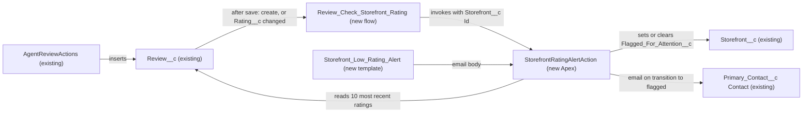

# Implementation spec — Storefront low-rating alert

> Flag a storefront and email its primary contact when the average rating of its 10 most recent reviews falls below 3.0, and clear the flag when that average recovers.

_Based on the requirement, the evidence reported by AskCoworker, and read-only org queries where noted. Assumptions and missing evidence are identified below. Specification only — nothing is implemented or deployed._

---

## 1. The requirement

When the average `Review__c.Rating__c` of a storefront's 10 most recent reviews drops below 3.0, set a new checkbox on `Storefront__c` and email the storefront's `Primary_Contact__c`. User decisions changed the scope: the flag is a new checkbox, the notification is an email, and the flag clears automatically when the average recovers to 3.0 or more. The request contained no instruction to deploy or change data.

| # | Responsibility | Trigger | Where it lives |
| --- | --- | --- | --- |
| 1 | Compute the average rating of the 10 most recent reviews of a storefront | `Review__c` created, or `Review__c.Rating__c` changed | `StorefrontRatingAlertAction`, called by `Review_Check_Storefront_Rating` |
| 2 | Flag the storefront when that average is below 3.0 | Same as #1 | `Storefront__c.Flagged_For_Attention__c`, set by `StorefrontRatingAlertAction` |
| 3 | Email the primary contact when the storefront becomes flagged | Transition of `Storefront__c.Flagged_For_Attention__c` from false to true | `StorefrontRatingAlertAction` with `Storefront_Low_Rating_Alert` |
| 4 | Clear the flag when the average recovers to 3.0 or more | Same as #1 | `StorefrontRatingAlertAction` |

## 2. Grounding — reuse before building

Target org: `TestWriteSpecDE` (Developer Edition, org ID `00Dak00001COqNeEAL`). API version: `67.0`.

- **`Storefront__c`** (CustomObject) — the storefront. 21 records, all with `Status__c` = `Active`. Internal sharing `ReadWrite`, external sharing `Private`. _verified by org query_
- **`Review__c`** (CustomObject) — the review. 92 records on 19 storefronts, 2 to 8 reviews each; no storefront has 10 or more. All 92 reviews share one `CreatedDate` day and have a null `Status__c`; none has a null `Rating__c`. Sharing `ControlledByParent`. _verified by org query_
- **`Review__c.Storefront__c`** (CustomField, Master-Detail to `Storefront__c`) — the parent link; cascade delete; `reparentableMasterDetail` is false, so a review cannot move to another storefront. _verified by org query_
- **`Review__c.Rating__c`** (CustomField, Number(1, 0), nillable) — the rating averaged by this design. _verified by org query_
- **`Review__c.Order_Date__c`** (CustomField, Date) — not used for recency, because `AgentReviewActions` does not set it on new reviews. _verified by org query_
- **`Storefront__c.Primary_Contact__c`** (CustomField, Lookup to `Contact`) — the notification recipient. All 21 storefronts have a primary contact with an `Email` value. _verified by org query_
- **`Storefront__c.Status__c`** (CustomField, Picklist: Active, Inactive, Pending Activation, Suspended, Closed) — has no "flagged" value and is not reused for the flag (user decision). _verified by org query_
- **`Storefront__c.Average_Review_Score__c`** (CustomField, Formula `Total_Score__c / Total_Reviews__c`) — averages all reviews through unfiltered roll-ups, so it does not meet the 10-most-recent rule and is not reused. _verified by org query_
- **`AgentReviewActions`** (ApexClass, `with sharing`, invocable) — the only Apex that inserts `Review__c`; sets `Status__c` = `Submitted`, not `Order_Date__c`; runs DML without `USER_MODE`; does not update or delete reviews. _verified by org query_
- **`AgentSummarizeReviewsActions`** (ApexClass) — reads reviews ordered by `Order_Date__c`; does not write. _verified by org query_
- **`MerchantRiskScoreAction`** (ApexClass) and **`Get_Partner_Quality_Watchlist`** (Flow) — read `Storefront__c.Average_Review_Score__c`; neither flags nor notifies. `MerchantRiskScoreAction` is _verified by org query_ as a reader through `MetadataComponentDependency`; the watchlist's filter logic is _reported by AskCoworker_.
- **Existing automation** — no Apex triggers and no record-triggered flows on `Storefront__c`, `Review__c`, or `Contact`; no validation rules on `Storefront__c` or `Review__c`; no `WorkflowAlert`; no `EmailTemplate` whose name contains Storefront, Review, or Rating; no `OrgWideEmailAddress`. _verified by org query_
- **New names** — `Storefront__c.Flagged_For_Attention__c`, `StorefrontRatingAlertAction`, `StorefrontRatingAlertActionTest`, `Review_Check_Storefront_Rating`, and `Storefront_Low_Rating_Alert` do not exist. _verified by org query_

Evidence sources: `sf org display`; `sf sobject describe` on `Storefront__c` and `Review__c`; `FieldDefinition`, `EntityDefinition`, Tooling `CustomField` metadata, `ApexTrigger`, `ValidationRule`, `FlowDefinitionView`, `Flow` metadata, `MetadataComponentDependency`, Apex bodies, `WorkflowAlert`, `EmailTemplate`, `OrgWideEmailAddress`, `ObjectPermissions`, `DataStream`, and aggregate data-shape queries. AskCoworker returned no citedReferences.

## 3. Architecture

Why the pieces are drawn this way:

1. `AgentReviewActions` inserts `Review__c`; it is the only Apex creator found. _verified by org query_ Reviews created in the UI or by the API also start the flow.
2. `Review_Check_Storefront_Rating` is a record-triggered after-save flow on `Review__c`. It runs when a record is created, or updated with `Rating__c` changed. A flow is the entry point because the rule reacts to a record change and no trigger or flow exists on `Review__c`. _verified by org query_
3. **Why Apex for the computation.** A roll-up summary or formula cannot limit to the 10 most recent children. A flow Get Records element has no averaging function, so a flow would need a loop, a counter, and a separate update per storefront. The Apex action runs one ordered query with `LIMIT 10` per storefront, removes duplicate storefront IDs across the bulk request, and sends all emails in one `Messaging.sendEmail` call. The user accepted Apex (user decision).
4. `StorefrontRatingAlertAction` orders by `CreatedDate DESC, Id DESC`, because new reviews have no `Order_Date__c` (verified by org query). It averages the non-null ratings among those records, including storefronts with fewer than 10 reviews (assumption; see Section 8).
5. The action compares the average with 3.0. Below 3.0 and not flagged: set the flag and queue an email. At or above 3.0 and flagged: clear the flag. Otherwise it makes no change.
6. The email uses `Storefront_Low_Rating_Alert` with `setTargetObjectId` set to the `Primary_Contact__c` Contact and `setWhatId` set to the storefront, so merge fields resolve from `Storefront__c`.

## 4. Metadata changes

**Data model**

- **Create `Storefront__c.Flagged_For_Attention__c`** — Checkbox, label "Flagged for Attention", default false. Set and cleared only by `StorefrontRatingAlertAction`. Chosen over a new `Storefront__c.Status__c` value (user decision).

**Automation**

- **Create `StorefrontRatingAlertAction`** — Apex class with one `@InvocableMethod` that accepts a list of `Storefront__c` IDs. Removes duplicate IDs. For each storefront, queries `Rating__c` from `Review__c` ordered by `CreatedDate DESC, Id DESC` with `LIMIT 10`, and averages the non-null ratings. When there is no non-null rating, it leaves the flag unchanged. Sets `Flagged_For_Attention__c` to true when the average is below 3.0 and the flag is false; sets it to false when the average is 3.0 or more and the flag is true. Updates the changed storefronts in one DML statement. For each newly flagged storefront whose `Primary_Contact__c` has an `Email`, builds a `Messaging.SingleEmailMessage` from `Storefront_Low_Rating_Alert` and sends all messages in one `Messaging.sendEmail` call with `allOrNothing` false. Declared `without sharing`, because a review creator can lack edit access to the parent storefront (see Section 6).
- **Create `Review_Check_Storefront_Rating`** — Record-triggered flow on `Review__c`, after save, "a record is created or updated". Entry condition: formula `ISNEW() || ISCHANGED({!$Record.Rating__c})`. One Action element calls `StorefrontRatingAlertAction` with `{!$Record.Storefront__c}`.
- **Create `Storefront_Low_Rating_Alert`** — Email template (text or Classic HTML) related to `Storefront__c`. Subject: "Storefront {!Storefront__c.Name} needs attention". Body: the storefront name, the statement that its average rating over its 10 most recent reviews is below 3.0, and a link to the storefront record. It does not show the computed average, because that value is not stored in a field.

**Tests**

- **Create `StorefrontRatingAlertActionTest`** — Apex test class for `StorefrontRatingAlertAction` and `Review_Check_Storefront_Rating`. Cases are listed in Section 7.

## 5. Data 360 (Data Cloud) data involved

Not applicable — this change does not use Data 360. The org has no `DataStream` records (verified by org query).

## 6. Security considerations

- **Execution context.** The flow runs in system context. `StorefrontRatingAlertAction` is `without sharing` and runs its query and DML in system mode, so the flag update and email do not depend on the running user's access. The reason: a user can create a `Review__c` with Read on the parent (`writeRequiresMasterRead` is false, verified by org query), while external sharing on `Storefront__c` is `Private` (verified by org query). A `with sharing` update could then fail and roll back the review insert. The class reads and writes only the fields named in Section 4.
- **CRUD and FLS.** No user needs access to `Storefront__c.Flagged_For_Attention__c` for the automation to work. Users who should see the flag need Read field-level security on it; Section 8 lists this as an open decision. No permission set change is in the inventory. Permission sets are not the only grant path: profiles and permission set groups can also grant field access.
- **Data exposure.** The email goes to the Contact in `Storefront__c.Primary_Contact__c`, who is outside Salesforce. It exposes only the storefront name, the threshold statement, and the record link. It does not include review text or customer identities.
- **Email limits.** Single emails to external addresses count against the org's daily single-email limit, which is low in a Developer Edition. `Messaging.sendEmail` can be called at most 10 times per transaction; the action calls it once. _Platform behavior; not verified by org query._
- **Sender.** No `OrgWideEmailAddress` exists (verified by org query), so the sender is the running user. See Section 8.

## 7. Testing strategy

`StorefrontRatingAlertActionTest` creates its own `Contact`, `Storefront__c`, and `Review__c` data and covers:

1. **Flag on drop.** Reviews rated 1, 1, 1 on an unflagged storefront set the flag, and one email is queued (`Limits.getEmailInvocations()`).
2. **No flag above threshold.** An average of 4.0 leaves the flag false and sends no email.
3. **Boundary.** An average of exactly 3.0 does not flag.
4. **Auto-clear.** A flagged storefront whose average rises to 3.0 or more is cleared, and no email is sent.
5. **No repeat email.** A flagged storefront that stays below 3.0 stays flagged and gets no second email.
6. **Update path.** Changing `Rating__c` on an existing review re-evaluates the storefront. Updating another field does not start the flow.
7. **Recency window.** With 12 reviews, only the 10 most recent by `CreatedDate DESC, Id DESC` count. Use `Test.setCreatedDate` to control order.
8. **Fewer than 10 reviews.** The average uses the reviews available.
9. **Null handling.** A null `Rating__c` is excluded. A window with no non-null rating leaves the flag unchanged and does not divide by zero. A null `Primary_Contact__c` or a Contact with no `Email` sets the flag and sends no email, without an exception.
10. **Bulk.** One insert of 200 reviews across several storefronts runs one query per storefront within limits, sets each flag correctly, and makes one `Messaging.sendEmail` call.
11. **Permission.** A review inserted by a user with Read-only access to `Storefront__c` still sets the flag (`System.runAs`).

Recommended verification (no planned test): in a sandbox, create a low review through `AgentReviewActions` and confirm the primary contact receives the email and the rendered template fields; confirm that the flag is visible to the intended users once Section 8 item 4 is settled.

## 8. Open decisions

1. **Fewer than 10 reviews (non-blocking).** No storefront has 10 reviews yet (verified by org query). The user had no preference. Default: average the reviews available; with this rule, 4 of 19 reviewed storefronts would be below 3.0 today. Alternative: evaluate only storefronts with 10 or more reviews, which would flag none today.
2. **Recency field (non-blocking).** "Most recent" uses `CreatedDate DESC, Id DESC` (assumption). `AgentSummarizeReviewsActions` orders by `Order_Date__c`, but `AgentReviewActions` does not set `Order_Date__c`, so new reviews would sort last (verified by org query). All existing reviews share one `CreatedDate` day, so their order depends on the time and `Id`.
3. **Review delete and undelete (non-blocking).** The flow does not run when a review is deleted or undeleted, so a flag can stay set after a low review is deleted. No Apex deletes or undeletes `Review__c` (verified by org query); UI and API deletes remain possible. Proposal, not in the inventory: an Apex trigger on `Review__c` after delete and after undelete that calls `StorefrontRatingAlertAction`. A before-delete flow cannot do this, because the deleted record would still be in the query.
4. **Who sees the flag (non-blocking).** No field access grant is in the inventory. Proposal: grant Read on `Storefront__c.Flagged_For_Attention__c` to the permission set of the users who follow up. AskCoworker proposed Read and Edit for `Agentforce_Reference_App` and Read for `sfdc_a360_sfcrm_data_extract`. These grants were not requested; they are not defaults.
5. **Review status filter (non-blocking).** All reviews count, whatever their `Review__c.Status__c`. All 92 existing reviews have a null status, and `AgentReviewActions` sets `Submitted` (verified by org query). Default: no filter. Restrict to `Published` only if the business moderates reviews.
6. **Sender address (non-blocking).** No `OrgWideEmailAddress` exists (verified by org query). Default: the running user is the sender. Proposal: configure an org-wide address and reference it in `StorefrontRatingAlertAction`.
7. **Bulk behavior conflict (non-blocking).** AskCoworker reported that the invocable action runs once per review in a bulk insert and that `Messaging.sendEmail` is limited to 10 emails per transaction. Documented Salesforce behavior is different: a record-triggered flow batches the inputs of the interviews into one invocable call, and the limit is 10 `sendEmail` calls per transaction, not 10 messages. The design follows documented behavior; test 10 in Section 7 checks it.
8. **Review creation grant (non-blocking, out of scope).** AskCoworker proposed granting Create on `Review__c` to `Agentforce_Reference_App`. The permission set has Read and Edit but not Create (verified by org query). `AgentReviewActions` inserts without `USER_MODE`, so object permissions do not block it. This is unrelated to the requirement and is not in the inventory.
9. **Email content (non-blocking).** The template does not show the computed average, because merge fields cannot read an unstored value (reported by AskCoworker). Proposal: store the average in a field or build the body in Apex if the contact must see the number.
10. **Corrections to the AskCoworker inventory (non-blocking).** The flow was extended from create-only to create or `Rating__c` changed, so a changed rating is re-evaluated. The order key `CreatedDate DESC` gained `Id DESC` as a tie-breaker. Sharing was changed from `with sharing` to `without sharing` (Section 6). AskCoworker also reported the org-wide default for `Storefront__c` from a "prior session"; the org query confirmed internal `ReadWrite`.

## 9. Change set

| # | Action | Type | API name | Module | Why |
| --- | --- | --- | --- | --- | --- |
| 1 | Create | CustomField | `Storefront__c.Flagged_For_Attention__c` | force-app/main/default/objects/Storefront__c/fields | Stores the attention flag (user decision: checkbox) |
| 2 | Create | ApexClass | `StorefrontRatingAlertAction` | force-app/main/default/classes | Computes the 10-review average, sets or clears the flag, and emails the primary contact |
| 3 | Create | Flow | `Review_Check_Storefront_Rating` | force-app/main/default/flows | Runs the check when a review is created or its rating changes |
| 4 | Create | EmailTemplate | `Storefront_Low_Rating_Alert` | force-app/main/default/email | Content of the email to the primary contact |
| 5 | Create | ApexClass | `StorefrontRatingAlertActionTest` | force-app/main/default/classes | Tests flagging, clearing, email, recency, nulls, bulk, and permission cases |

A record-triggered flow on `Review__c` calls one invocable Apex action that recomputes the storefront's 10-review average, sets or clears `Storefront__c.Flagged_For_Attention__c`, and emails the primary contact on the transition to flagged.

Total: 5 · Create: 5 · Update: 0 · Delete: 0
