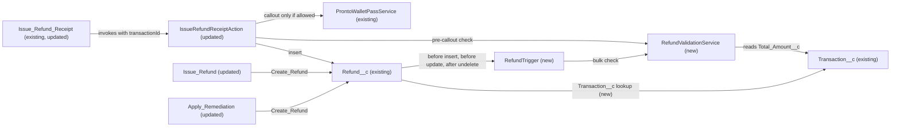

# Implementation spec — Cap refunds at the original transaction amount

> Block any `Refund__c` that would push the combined active refunds for a `Transaction__c` above that transaction's `Total_Amount__c`, and show the agent a clear error.

_Based on the requirement, the evidence reported by AskCoworker, and read-only org queries where noted. Assumptions and missing evidence are identified below. Specification only — nothing is implemented or deployed._

---

## 1. The requirement

Customers are refunded twice for the same order. The user decided the fix: key each refund to its original `Transaction__c`, allow further refunds only while the combined amount of non-Failed, non-Cancelled refunds stays within `Transaction__c.Total_Amount__c`, and otherwise block the refund with a clear error to the agent (_user decision_).

| # | Responsibility | Trigger | Where it lives |
| --- | --- | --- | --- |
| 1 | Link each refund to the transaction it refunds | Refund creation | `Refund__c.Transaction__c` (new lookup) |
| 2 | Compute the refunded total per transaction and compare it with `Transaction__c.Total_Amount__c` | Called by the trigger and by `IssueRefundReceiptAction` | `RefundValidationService` (new) |
| 3 | Block an over-limit refund on every creation path | `Refund__c` before insert, before update, after undelete | `RefundTrigger` (new) |
| 4 | Check before the wallet-pass callout so no pass is minted for a blocked refund, and return a readable message | Agent action invocation | `IssueRefundReceiptAction` (updated) |
| 5 | Return the block message to the agent from the flows | Create Records fault path | `Issue_Refund`, `Apply_Remediation` (updated) |

## 2. Grounding — reuse before building

Target org: `TestWriteSpecDE` (Developer Edition, user `epic.2b9dd11f2b2a@orgfarm.salesforce.com`). API version: `67.0`.

- **`Refund__c`** (CustomObject) — the refund record. Custom fields: `Amount__c` (Currency), `Status__c` (Picklist: Pending, Approved, Processing, Completed, Failed, Cancelled), `Case__c`, `Contact__c`, `Storefront__c`, `Business_Account__c` (Lookups), `Issue_Date__c`, `Processed_Date__c`, `Payment_Method__c`, `Reason__c`. All fields are optional. There is no order, transaction, unique, or external ID field. OWD is ReadWrite. 0 records. _verified by org query_
- **`Transaction__c`** (CustomObject) — the original sale. Custom fields: `Total_Amount__c` (Currency 7,2), `Transaction_Type__c` (Picklist: Sale, Refund), `Contact__c` (Lookup Contact), `Transaction_Date__c`, `Payment_Method__c`, `Refund_Reason__c`. No order number field. OWD is ReadWrite. 0 records. No relationship to `Refund__c` exists. _verified by org query_ (the fields are hidden from the running user by FLS, so `sf sobject describe` showed none; Tooling `CustomField` and `FieldPermissions` show them).
- **`IssueRefundReceiptAction`** (ApexClass, `with sharing`, `@InvocableMethod`, `callout=true`) — inserts an Approved `Refund__c` without checking earlier refunds. It calls `ProntoWalletPassService.mintPassUrl` before the insert, and its catch block returns `e.getMessage()`. _verified by org query_ (class body)
- **`Issue_Refund`** (Flow, active AutoLaunchedFlow) — `Create_Refund` inserts `Refund__c`; its fault path `Assign_Error_Output` sets `isSuccess = false` and `resultMessage = {!$Flow.FaultMessage}`. _verified by org query_ (Flow metadata)
- **`Apply_Remediation`** (Flow, active AutoLaunchedFlow) — `Create_Refund` inserts `Refund__c`; its fault path sets only `isSuccess = false`. It has no message output. _verified by org query_ (Flow metadata)
- **`Validate_Remediation`** (Flow, active AutoLaunchedFlow) — checks a remediation amount against a severity ceiling and monthly budget; it does not check earlier refunds. _verified by org query_ (FlowDefinitionView description)
- **`Issue_Refund_Receipt`** (GenAiFunction) — the agent action backed by `IssueRefundReceiptAction`. _verified by org query_
- **`OrderPickerAction`** / **`OrderPickerController`** (ApexClass) — return `orderNumber` and `total` from the external Orders API; orders are not stored in Salesforce. _verified by org query_ (class bodies) and _reported by AskCoworker_
- **`IssueGiftCardAction`** (ApexClass) — has a 24-hour duplicate guard for `Gift_Certificate__c`; it is a precedent for an idempotency check, not a component to reuse. _verified by org query_ (class body)
- **`IssueRefundReceiptActionTest`** (ApexClass) — existing test class for the action. _verified by org query_
- No Apex trigger, record-triggered flow, validation rule, or duplicate rule exists on `Refund__c` or `Transaction__c`. _verified by org query_ (duplicate rule: _reported by AskCoworker_)
- Create access on `Refund__c`: `Agentforce_Reference_App`, `Pronto_Deep_Dive_Workshop`, `sfdc_accelerate_dms`. Object access on `Transaction__c`: only `sfdc_accelerate_dms`. _verified by org query_

Evidence sources: `sf sobject describe` (`Refund__c`, `Transaction__c`, `Case`, `Payment_Methods__c`), `sf sobject list`, Tooling queries on `ApexTrigger`, `ApexClass` (bodies), `ValidationRule`, `CustomField` (Metadata), `EntityDefinition`, `MetadataComponentDependency`, `Flow` (Metadata), `GenAiFunctionDefinition`; standard queries on `FlowDefinitionView`, `ObjectPermissions`, `FieldPermissions`, and record counts. AskCoworker returned no citedReferences.

## 3. Architecture

Why the pieces are drawn this way:

1. `IssueRefundReceiptAction`, `Issue_Refund`, and `Apply_Remediation` are the three components that insert `Refund__c` (_verified by org query_: `MetadataComponentDependency` on `Refund__c`).
2. `RefundTrigger` is the single enforcement point, so every current and future creation path is covered. There is no existing trigger to extend (_verified by org query_).
3. `IssueRefundReceiptAction` also calls `RefundValidationService` before `ProntoWalletPassService`, because the callout runs before the insert (_verified by org query_: class body). Without this, a wallet pass is minted for a refund the trigger then blocks.
4. `RefundValidationService` holds the only copy of the cap rule. The trigger and the action both call it.
5. The lookup from `Refund__c` to `Transaction__c` is new; the cap is read from the existing `Transaction__c.Total_Amount__c`.

## 4. Metadata changes

**Schema**

- **Create `Refund__c.Transaction__c`** — Lookup(`Transaction__c`), label "Transaction", relationship name `Refunds`, not required, delete constraint Restrict (a transaction with refunds cannot be deleted). Lookup, not Master-Detail, so refunds without a transaction keep working.

**Automation**

- **Create `RefundValidationService`** — Apex class, `without sharing` so the refunded total counts every refund on the transaction regardless of the running user's visibility. Public API: `static Map<Integer, String> findOverLimit(List<Refund__c> candidates, Set<Id> excludeIds)` returns an error message per candidate index. Logic: collect non-null `Transaction__c` values; one query for `Transaction__c` (`Id`, `Name`, `Total_Amount__c`); one aggregate query `SELECT Transaction__c, SUM(Amount__c) FROM Refund__c WHERE Transaction__c IN :ids AND Status__c NOT IN ('Failed','Cancelled') AND Id NOT IN :excludeIds GROUP BY Transaction__c`; add the candidates' own amounts per transaction in list order (candidates with status Failed or Cancelled are not counted); flag any candidate whose running total exceeds `Total_Amount__c`. If `Total_Amount__c` is null, flag the candidate ("Transaction {Name} has no total amount; the refund cannot be checked."). Message format: "Refund blocked: transaction {Name} totals ${Total}, ${AlreadyRefunded} is already refunded, and at most ${Remaining} can still be refunded." Also exposes `static String check(Id transactionId, Decimal amount)` for single-record callers; it delegates to `findOverLimit`. Candidates with a null `Transaction__c` are not checked.
- **Create `RefundTrigger`** — Apex trigger on `Refund__c`, events before insert, before update, after undelete. Before insert: pass `Trigger.new`. Before update: pass only records where `Transaction__c`, `Amount__c`, or `Status__c` changed, with their own Ids in `excludeIds`. After undelete: pass `Trigger.new` with their Ids in `excludeIds`. Call `addError(message)` on each flagged record. No handler class; the trigger delegates directly to `RefundValidationService`.
- **Update `IssueRefundReceiptAction`** — add optional `@InvocableVariable String transactionId` (label "Transaction Id") to `Request`. After the existing input checks and before `mintWalletPass`, call `RefundValidationService.check`; if it returns a message, return `success = false` with that message and make no callout and no insert. Set `r.Transaction__c` when `transactionId` is not blank. In the catch block, return `e.getDmlMessage(0)` for a `DmlException` so the agent sees the trigger message without the `FIELD_CUSTOM_VALIDATION_EXCEPTION` prefix; keep `e.getMessage()` for other exceptions.
- **Update `Issue_Refund_Receipt`** — Conditional: if the GenAiFunction input schema lists the action inputs explicitly, add `transactionId` with a description telling the agent to pass the `Transaction__c` Id of the order being refunded.
- **Update `Issue_Refund`** — add optional input variable `transactionId` (Text) and map it to `Transaction__c` in `Create_Refund`. The existing fault path already returns `{!$Flow.FaultMessage}` in `resultMessage`.
- **Update `Apply_Remediation`** — add optional input variable `transactionId` (Text) mapped to `Transaction__c` in `Create_Refund`; add output variable `resultMessage` (Text) and set it to `{!$Flow.FaultMessage}` in `Assign_Error_Output`, so the agent receives the block message.

**Testing**

- **Create `RefundValidationServiceTest`** — `@isTest` class covering the service and the trigger (cases in Section 7).
- **Update `IssueRefundReceiptActionTest`** — add cases for the `transactionId` input, the pre-callout block, and the clean DML message.

**Access**

- **Update `Agentforce_Reference_App`** — grant Read on the `Transaction__c` object and Read and Edit on `Refund__c.Transaction__c`, so the agent user can set and see the lookup when a flow runs in user context. No grant on `Transaction__c.Total_Amount__c` is needed; `RefundValidationService` reads it in system mode.

## 5. Data 360 (Data Cloud) data involved

Not applicable — this change does not use Data 360. The Data Cloud connector permission set `sfdc_a360_sfcrm_data_extract` reads `Refund__c` today (_verified by org query_); it is not granted the new field (see Section 8).

## 6. Security considerations

- **Execution context.** `RefundTrigger` runs in system mode. `RefundValidationService` is `without sharing` and runs its queries in system mode (no `WITH USER_MODE`), so the cap counts every refund and reads `Total_Amount__c` even though most users have no FLS on `Transaction__c` fields. Both OWDs are ReadWrite today (_verified by org query_), so sharing would not hide records now; `without sharing` keeps the check correct if the OWD is tightened. The service returns only a message, so no hidden record data reaches the user beyond the amounts in that message.
- **Data exposure.** The block message shows the transaction name, total, refunded amount, and remaining amount to the agent. These are the order values the agent is already refunding against. See Section 8 for users without `Transaction__c` access.
- **CRUD/FLS.** `IssueRefundReceiptAction` inserts with plain DML (system mode, _verified by org query_). The flows' run mode is not set in metadata (`runInMode` is null, _verified by org query_); if they run in user context, the running user needs Edit on `Refund__c.Transaction__c`, which the `Agentforce_Reference_App` change grants.
- **Permission sets.** Only `Agentforce_Reference_App` changes. Permission sets are not the only grant path; profiles and permission set groups can also grant access. `Pronto_Deep_Dive_Workshop` and `sfdc_accelerate_dms` also create refunds; they are not changed (Section 8).
- **Bypass.** The cap cannot be bypassed through any of the three creation paths, the API, or undelete, because enforcement is in the trigger. A refund with no `Transaction__c` is not checked (Section 8).

## 7. Testing strategy

`RefundValidationServiceTest` (new):

1. First refund within `Total_Amount__c` inserts.
2. Second refund that makes the total exceed `Total_Amount__c` is blocked with the message naming the transaction and remaining amount.
3. Boundary: combined total exactly equal to `Total_Amount__c` inserts; one cent over is blocked.
4. Refunds with `Status__c` Failed or Cancelled are not counted.
5. Update: raising `Amount__c`, moving `Transaction__c` to a full transaction, or changing `Status__c` from Cancelled to Approved over the cap is blocked; editing `Reason__c` is not checked; a record is not counted twice against itself.
6. Undelete of a refund that would exceed the cap is blocked.
7. `Transaction__c.Total_Amount__c` null: the refund is blocked with the "no total amount" message.
8. Null `Transaction__c`: the refund inserts unchecked.
9. Bulk: 200 refunds across several transactions in one insert, including several in the same batch against one transaction; only the records past the cap fail, and the service uses two queries in total.
10. Permission: insert as a user with only `Agentforce_Reference_App`; the cap is still enforced.

`IssueRefundReceiptActionTest` (updated):

1. `transactionId` within the cap: `success = true`, refund linked to the transaction.
2. `transactionId` over the cap: `success = false`, the message is the service message, no `Refund__c` is inserted, and the `HttpCalloutMock` records no callout.
3. No `transactionId`: existing behavior is unchanged.
4. Existing input-validation cases still pass (_reported by AskCoworker_ that the class covers them; not verified).

Recommended verification (manual, no planned automated test): invoke `Issue_Refund` and `Apply_Remediation` with an over-limit `transactionId` and confirm `resultMessage` contains the block message; run the agent end to end and confirm it shows the message. No tests have been run.

## 8. Open decisions

1. **Source of `Transaction__c` records (blocking).** `Transaction__c` has 0 records and no order number field; orders live in the external Orders API, and `OrderPickerAction` returns `orderNumber` and `total` but no Salesforce Id (_verified by org query_). Until sale transactions exist and the agent can obtain their Id, the cap cannot apply to agent refunds. Asked the user; no preference given. Recommended default: out of scope for this spec; define in a separate spec how `Transaction__c` sale records are created from the Orders API (for example, when an order is selected) and how the Id reaches the agent.
2. **`Issue_Refund_Receipt` input schema (non-blocking).** Conditional change: whether the GenAiFunction schema must list `transactionId` explicitly was not verified. Recommended default: check the GenAiFunction bundle during build and add the input if the schema lists inputs.
3. **Refunds without a transaction (non-blocking).** All three paths accept refunds with no `Transaction__c`, and those are not checked, so duplicates remain possible there. Recommended default: keep the lookup optional until decision 1 is resolved, then consider making `transactionId` required in the agent action.
4. **Null `Total_Amount__c` (non-blocking).** Recommended default: block (fail loud) rather than allow an unchecked refund. Assumption.
5. **`Transaction_Type__c` = Refund (non-blocking).** A refund could be linked to a `Transaction__c` whose type is Refund. Recommended default: no type check; only the amount cap is enforced. Assumption.
6. **Other creating permission sets (non-blocking).** `Pronto_Deep_Dive_Workshop` and `sfdc_accelerate_dms` can create `Refund__c`; `sfdc_accelerate_dms` already has `Transaction__c` access. Granting the new field to `Pronto_Deep_Dive_Workshop`, or to the Data Cloud connector `sfdc_a360_sfcrm_data_extract`, was not requested. Recommended default: no grant.
7. **Conflict with AskCoworker (non-blocking).** AskCoworker said `RefundValidationService` would return no rows, and silently allow refunds, for users without `Transaction__c` object access. Apex SOQL without `WITH USER_MODE` runs in system mode, so this does not apply to the design; the permission test in Section 7 confirms it. AskCoworker also first reported that `Transaction__c` had no custom fields relevant to the design; the Tooling query showed six (Section 2).
8. **Flow fault message text (non-blocking).** `{!$Flow.FaultMessage}` includes Salesforce prefix text before the trigger message. Recommended default: accept it; verify in the manual check that the agent message is readable.
9. **Existing duplicates (non-blocking).** `Refund__c` has 0 records (_verified by org query_), so no data cleanup is needed.

## 9. Change set

| # | Action | Type | API name | Module | Why |
| --- | --- | --- | --- | --- | --- |
| 1 | Create | CustomField | `Refund__c.Transaction__c` | force-app/main/default/objects/Refund__c/fields | Links each refund to the transaction it refunds |
| 2 | Create | ApexClass | `RefundValidationService` | force-app/main/default/classes | Single copy of the refund cap rule, bulk-safe |
| 3 | Create | ApexTrigger | `RefundTrigger` | force-app/main/default/triggers | Enforces the cap on every creation path, update, and undelete |
| 4 | Update | ApexClass | `IssueRefundReceiptAction` | force-app/main/default/classes | Accepts `transactionId`, checks before the wallet-pass callout, returns a clean message |
| 5 | Update | GenAiFunction | `Issue_Refund_Receipt` | force-app/main/default/genAiFunctions | Conditional: exposes `transactionId` to the agent |
| 6 | Update | Flow | `Issue_Refund` | force-app/main/default/flows | Accepts `transactionId` and maps it to the refund |
| 7 | Update | Flow | `Apply_Remediation` | force-app/main/default/flows | Accepts `transactionId` and returns the block message |
| 8 | Create | ApexClass | `RefundValidationServiceTest` | force-app/main/default/classes | Tests the cap, the trigger, bulk, and undelete |
| 9 | Update | ApexClass | `IssueRefundReceiptActionTest` | force-app/main/default/classes | Tests the pre-callout block and the new input |
| 10 | Update | PermissionSet | `Agentforce_Reference_App` | force-app/main/default/permissionsets | Grants Read on `Transaction__c` and Read/Edit on the new lookup |

A trigger on `Refund__c` calls one shared service that caps combined active refunds at `Transaction__c.Total_Amount__c`, and the agent action runs the same check before its callout.

Total: 10 · Create: 4 · Update: 6 · Delete: 0
