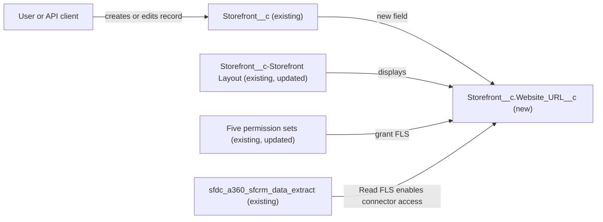

# Implementation spec — Add a website URL field to Storefront

> Add a text field on `Storefront__c` that stores the storefront's own website URL, and make it visible on the record page and readable by the permission sets that already read Storefront URL data.

_Based on the requirement, the evidence reported by AskCoworker, and read-only org queries where noted. Assumptions and missing evidence are identified below. Specification only — nothing is implemented or deployed._

---

## 1. The requirement

The requirement "Add a field." was too vague to search, so the user was asked; the user decided the field is a text field on `Storefront__c` for the storefront's website URL.

| # | Responsibility | Trigger | Where it lives |
| --- | --- | --- | --- |
| 1 | Store the storefront's own website URL | User or API edit of a `Storefront__c` record | `Storefront__c.Website_URL__c` (new) |
| 2 | Show and edit the field on the record page | Record page view | `Storefront__c-Storefront Layout` |
| 3 | Grant field-level access matching the existing `Image_URL__c` grants | Permission set assignment | Five existing permission sets |

## 2. Grounding — reuse before building

Target org: `TestWriteSpecDE` (Developer Edition, org ID `00Dak00001COqNeEAL`). API version: `67.0`.

- **`Storefront__c`** (CustomObject) — the object named by the user. The full field list has no website field; the only URL-like field is `Image_URL__c` (Text 255). No field named `Website_URL__c` exists. _verified by org query_
- **`Account.Website`** (standard URL 255 field) — reachable through `Storefront__c.Account__c` (Lookup to `Account`). It holds the account's website, not a per-storefront website, so it does not meet the requirement. _verified by org query (field and lookup); reported by AskCoworker (meaning)_
- **Automation on `Storefront__c`** — no Apex triggers, no record-triggered flows, and no validation rules. _verified by org query_
- **`Storefront__c-Storefront Layout`** (Layout) — the only page layout on `Storefront__c`. _verified by org query_
- **Sharing** — org-wide default is `ReadWrite` internal and `Private` external. _verified by org query_
- **Field permissions on `Storefront__c.Image_URL__c`** — `sfdc_accelerate_dms` (Read and Edit); `Agentforce_Reference_App`, `Pronto_Deep_Dive_Workshop`, `sfdc_a360_sfcrm_data_extract`, `sfdc_slack` (Read). No profile-owned rows. _verified by org query_
- **Object permissions on `Storefront__c`** — the same five permission sets plus two profiles have Read; `Agentforce_Reference_App` and `sfdc_accelerate_dms` also have Create and Edit. _verified by org query_
- **Apex classes** — `AgentStorefrontActions`, `AgentUpdateStorefrontDetailsActions`, `AgentGetStorefrontsByAccountActions`, `AgentUpdateStorefrontHoursActions`, and `StorefrontPickerAction` do not reference a website field. `StorefrontPickerController` selects `Image_URL__c` for the `storefrontSelector` LWC. None of them needs to change. _verified by org query (class bodies); reported by AskCoworker (LWC link)_

Evidence sources: `sf sobject describe` on `Storefront__c` and `Account`; Tooling queries on `ApexTrigger`, `EntityDefinition`, `ValidationRule`, `Layout`, `ApexClass`; standard queries on `FlowDefinitionView`, `FieldPermissions`, `ObjectPermissions`. AskCoworker returned no citedReferences.

## 3. Architecture

Why the pieces are drawn this way:

1. `Storefront__c` is the user-named object, and the new field is a plain stored value. No triggers, flows, or validation rules run on the object, so no automation node is drawn (verified by org query).
2. The layout is the only one on the object, so adding the field there makes it visible to every internal user with FLS (verified by org query).
3. The permission sets are the ones that hold FLS on `Image_URL__c`; the new field receives the same access levels (verified by org query).
4. `sfdc_a360_sfcrm_data_extract` is the Data Cloud connector permission set; Read FLS lets the connector see the field (reported by AskCoworker).

## 4. Metadata changes

**Schema**

- **Create `Storefront__c.Website_URL__c`** — Text, length 255, label "Website URL". Not required, not unique, not an external ID, no default value.

**UI**

- **Update `Storefront__c-Storefront Layout`** — add `Website_URL__c` as an editable field, in the same section as `Image_URL__c`.

**Access**

- **Update `sfdc_accelerate_dms`** — grant Read and Edit on `Storefront__c.Website_URL__c`.
- **Update `Agentforce_Reference_App`** — grant Read on `Storefront__c.Website_URL__c`.
- **Update `Pronto_Deep_Dive_Workshop`** — grant Read on `Storefront__c.Website_URL__c`.
- **Update `sfdc_a360_sfcrm_data_extract`** — grant Read on `Storefront__c.Website_URL__c`.
- **Update `sfdc_slack`** — grant Read on `Storefront__c.Website_URL__c`.

## 5. Data 360 (Data Cloud) data involved

Read-only connector access. `sfdc_a360_sfcrm_data_extract` (Data Cloud Salesforce Connector) has Read on `Storefront__c` and on `Image_URL__c` (verified by org query). With Read FLS on `Website_URL__c`, the connector can see the new field, but it is not added to any data stream automatically (reported by AskCoworker). The data space is `default` (reported by AskCoworker, not verified). No Data Cloud metadata is in this change set.

## 6. Security considerations

- **Execution context.** The change adds no code. Existing classes do not read the field. `AgentStorefrontActions` runs `without sharing`; if it is later changed to select `Website_URL__c`, it would return the value regardless of record sharing (reported by AskCoworker).
- **Record access.** `Storefront__c` is `ReadWrite` internal and `Private` external; the field inherits this (verified by org query).
- **CRUD/FLS.** A new custom field has no FLS until granted. The grants in Section 4 copy the `Image_URL__c` levels. `Agentforce_Reference_App` has object Edit but gets only field Read, matching `Image_URL__c` (verified by org query). Two profiles have object Read on `Storefront__c` but no FLS rows on `Image_URL__c`; they get no FLS here (see Section 8). Permission sets are not the only grant path; profiles and permission set groups can also grant access.
- **Data exposure.** A public website URL is low-sensitivity data. The Slack integration user and the Data Cloud connector gain Read on it.

## 7. Testing strategy

No Apex test class is in the inventory because the change is declarative only and no Apex changes. Recommended verification after deployment:

1. Recommended verification: `SELECT Website_URL__c FROM Storefront__c LIMIT 1` runs without error and returns null on existing records.
2. Recommended verification: the field appears on `Storefront__c-Storefront Layout` and saves a value for a user with `sfdc_accelerate_dms`.
3. Recommended verification (permission): a user with only `Agentforce_Reference_App` sees the field read-only; a user with none of the five permission sets does not see it.
4. Recommended verification (negative): a blank value saves; a 256-character value is rejected by the 255-character limit.
5. Recommended verification: the field is listed as available in the Data Cloud connector schema for `Storefront__c`.

## 8. Open decisions

1. **Field type: Text or URL (non-blocking).** The user asked for a text field, so the spec uses Text(255). AskCoworker recommends the URL type because it renders as a link and checks format. Recommended default: keep Text as the user decided; change to URL only if the user agrees.
2. **Field label and API name (non-blocking).** Not specified by the user. Assumption: label "Website URL", API name `Website_URL__c`.
3. **Layout placement (non-blocking).** The layout's section structure was not retrieved. Assumption: same section as `Image_URL__c`.
4. **Profile FLS (non-blocking).** Two profiles (profile-owned permission sets `X00e1a000000N1wLAAS` and `X00ex00000018ozh_128_09_04_12_1`) have object Read on `Storefront__c` but no FLS on `Image_URL__c` (verified by org query). Recommended default: no profile grants, matching `Image_URL__c`.
5. **Agent and picker UI exposure (non-blocking).** `AgentUpdateStorefrontDetailsActions` cannot write the field and `StorefrontPickerController` does not return it. Recommended default: out of scope; the requirement only adds the field.
6. **Data stream inclusion (non-blocking).** Adding the field to a Data Cloud data stream is a separate admin action. Recommended default: defer to the Data Cloud admin.

## 9. Change set

| # | Action | Type | API name | Module | Why |
| --- | --- | --- | --- | --- | --- |
| 1 | Create | CustomField | `Storefront__c.Website_URL__c` | force-app/main/default/objects/Storefront__c/fields | Stores the storefront's own website URL (user decision) |
| 2 | Update | Layout | `Storefront__c-Storefront Layout` | force-app/main/default/layouts | Shows the field on the only Storefront layout |
| 3 | Update | PermissionSet | `sfdc_accelerate_dms` | force-app/main/default/permissionsets | Read and Edit, matching `Image_URL__c` |
| 4 | Update | PermissionSet | `Agentforce_Reference_App` | force-app/main/default/permissionsets | Read, matching `Image_URL__c` |
| 5 | Update | PermissionSet | `Pronto_Deep_Dive_Workshop` | force-app/main/default/permissionsets | Read, matching `Image_URL__c` |
| 6 | Update | PermissionSet | `sfdc_a360_sfcrm_data_extract` | force-app/main/default/permissionsets | Read, matching `Image_URL__c`; Data Cloud connector access |
| 7 | Update | PermissionSet | `sfdc_slack` | force-app/main/default/permissionsets | Read, matching `Image_URL__c` |

One new stored text field on `Storefront__c`, shown on its only layout and granted with the same access as `Image_URL__c`.

Total: 7 · Create: 1 · Update: 6 · Delete: 0
