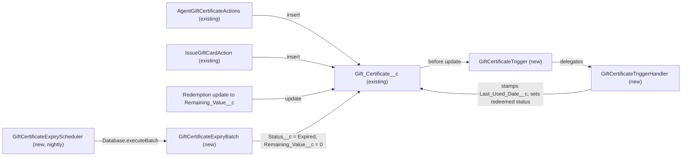

# Implementation spec — Gift certificate balance tracking and 12-month inactivity expiry

> Keep `Gift_Certificate__c.Remaining_Value__c` as the tracked balance, record when it was last used, and expire certificates that have not been used for 12 months with a nightly job.

_Based on the requirement, the evidence reported by AskCoworker, and read-only org queries where noted. Assumptions and missing evidence are identified below. Specification only — nothing is implemented or deployed._

---

## 1. The requirement

Track the remaining balance of each gift certificate and automatically expire certificates with no use in the last 12 months. The requirement also asked to "deploy it to production right away"; that instruction is out of scope and was not acted on, because this is a specification only.

| # | Responsibility | Trigger | Where it lives |
| --- | --- | --- | --- |
| 1 | Hold the current spendable balance | Set on insert by existing creators; decreased on redemption | `Gift_Certificate__c.Remaining_Value__c` (existing) |
| 2 | Record the date of last use | Before update, when `Remaining_Value__c` decreases | `GiftCertificateTrigger` → `GiftCertificateTriggerHandler` (new) |
| 3 | Reflect partial or full redemption in the status | Before update, when `Remaining_Value__c` decreases | `GiftCertificateTriggerHandler` (new) |
| 4 | Expire certificates with no use for 12 months (`Status__c` = `Expired`, `Remaining_Value__c` = 0) | Nightly scheduled Apex | `GiftCertificateExpiryScheduler` → `GiftCertificateExpiryBatch` (new) |
| 5 | Deploy to production | Not applicable | Not applicable — out of scope for a specification |

## 2. Grounding — reuse before building

Target org: `TestWriteSpecDE` (Developer Edition, `orgfarm-89b86ec88b-dev-ed`). API version: `67.0`.

- **`Gift_Certificate__c`** (CustomObject) — the business object. Internal OWD `ReadWrite`, external OWD `Private`. One record exists (`Status__c` = `Active`, `Issue_Date__c` null). No custom child objects. _verified by org query_
- **`Gift_Certificate__c.Remaining_Value__c`** (Currency 18,2, plain field, not formula or roll-up) — reused as the balance. _verified by org query_
- **`Gift_Certificate__c.Original_Value__c`** (Currency 18,2) and **`Gift_Certificate__c.Value__c`** (Currency 18,0) — face value; both creators set them equal to `Remaining_Value__c`. _verified by org query_
- **`Gift_Certificate__c.Status__c`** (Picklist: Draft, Active, Partially Redeemed, Fully Redeemed, Expired, Cancelled; default Active) — the `Expired`, `Partially Redeemed`, and `Fully Redeemed` values already exist, so no picklist change is needed. _verified by org query_
- **`Gift_Certificate__c.Issue_Date__c`** and **`Gift_Certificate__c.Expiration_Date__c`** (Date) — `Issue_Date__c` is the fallback inactivity anchor. `Expiration_Date__c` is set at issue time and nothing reads it; it is not used by this design. _verified by org query_
- **No last-used or redemption field** on `Gift_Certificate__c` (full describe scanned; no field name matches `Used` or `Redeem`). _verified by org query_
- **`Transaction__c`** (CustomObject) — has no custom fields and no lookup to `Gift_Certificate__c`, so it cannot record redemptions. _verified by org query_
- **No automation on `Gift_Certificate__c`**: no Apex trigger, no record-triggered flow, no validation rule, no custom scheduled Apex job, no Apex class named like `Expir`, `Redeem`, `Redemption`, or `GiftCertificate%`. _verified by org query_
- **`AgentGiftCertificateActions`** and **`IssueGiftCardAction`** (ApexClass, `with sharing`) — insert certificates with `Remaining_Value__c` = value, `Issue_Date__c` = today, `Status__c` = `Active`. They insert only, so a before-update trigger does not run for them. _verified by org query_ (source scanned); insert-only behavior _reported by AskCoworker_
- **`RenderGiftCardAction`** (ApexClass) — read-only renderer. _reported by AskCoworker_
- **`Agentforce_Action_Access`**, **`Agentforce_Reference_App`**, **`Pronto_Deep_Dive_Workshop`** (PermissionSet, no namespace) — Read and Edit on `Gift_Certificate__c` and Edit FLS on `Status__c`, `Remaining_Value__c`, `Issue_Date__c`. _verified by org query_
- **`sfdc_accelerate_dms`**, **`sfdc_a360_sfcrm_data_extract`**, **`sfdc_slack`** (PermissionSet, namespace `sfdcInternalInt`, type Session) — platform-managed; not editable, so not in the inventory. _verified by org query_

Evidence sources: `sf sobject describe` on `Gift_Certificate__c` and `Transaction__c`; SOQL on `ApexTrigger`, `FlowDefinitionView`, `ValidationRule`, `CustomField`, `ApexClass` (names and bodies), `CronTrigger`, `EntityDefinition`, `ObjectPermissions`, `FieldPermissions`, `PermissionSet`, and aggregate counts on `Gift_Certificate__c`. AskCoworker returned no citedReferences.

## 3. Architecture

Why the pieces are drawn this way:

1. The two existing creators insert certificates; they never update them, so the new trigger does not affect them. _verified by org query_ (class bodies).
2. The redemption update node has no named source: no component in the org decreases `Remaining_Value__c` today. It stands for any user, integration, or future process that records a redemption. See Section 8.
3. `GiftCertificateTrigger` runs before update and delegates to `GiftCertificateTriggerHandler`, which sets fields on `Trigger.new` without SOQL or DML. _proposal from AskCoworker_
4. `GiftCertificateExpiryScheduler` starts `GiftCertificateExpiryBatch` each night. The batch's update fires the trigger again; the handler must leave `Status__c` = `Expired` unchanged (see Section 6 and test T6). _reported by AskCoworker_

## 4. Metadata changes

**Schema**

- **Create `Gift_Certificate__c.Last_Used_Date__c`** — Date, not required, no default. Date on which `Remaining_Value__c` last decreased. Null means never used. It is the inactivity anchor for the expiry batch.

**Automation**

- **Create `GiftCertificateTrigger`** — Apex trigger on `Gift_Certificate__c`, `before update` only. Delegates to `GiftCertificateTriggerHandler`.
- **Create `GiftCertificateTriggerHandler`** — `with sharing`. `handleBeforeUpdate(List<Gift_Certificate__c> newList, Map<Id, Gift_Certificate__c> oldMap)`. When `Remaining_Value__c` decreases and the incoming `Status__c` is not `Expired`: set `Last_Used_Date__c` = today; set `Status__c` = `Fully Redeemed` when the new value is 0, otherwise `Partially Redeemed`. No SOQL or DML.
- **Create `GiftCertificateExpiryBatch`** — `without sharing`, implements `Database.Batchable<SObject>`. Scope: `Status__c IN ('Active', 'Partially Redeemed')`. Anchor = `Last_Used_Date__c`, else `Issue_Date__c`, else `CreatedDate` (date part). When anchor <= `Date.today().addMonths(-12)`, set `Status__c` = `Expired` and `Remaining_Value__c` = 0. Batch size 200.
- **Create `GiftCertificateExpiryScheduler`** — implements `Schedulable`; calls `Database.executeBatch(new GiftCertificateExpiryBatch(), 200)`. Scheduling it (for example, `0 0 2 * * ?`) is a post-deployment admin step, not metadata.

**Testing**

- **Create `GiftCertificateExpiryBatchTest`** — `@isTest` coverage for the batch and scheduler (Section 7).
- **Create `GiftCertificateTriggerHandlerTest`** — `@isTest` coverage for the trigger and handler (Section 7).

**Access**

- **Update `Agentforce_Action_Access`** — add Read and Edit FLS on `Gift_Certificate__c.Last_Used_Date__c`, matching its existing Edit FLS on `Status__c` and `Remaining_Value__c`.
- **Update `Agentforce_Reference_App`** — add Read and Edit FLS on `Gift_Certificate__c.Last_Used_Date__c`, matching its existing Edit FLS.
- **Update `Pronto_Deep_Dive_Workshop`** — add Read and Edit FLS on `Gift_Certificate__c.Last_Used_Date__c`, matching its existing Edit FLS.

## 5. Data 360 (Data Cloud) data involved

The platform-managed permission set `sfdc_a360_sfcrm_data_extract` (Data Cloud Salesforce Connector) has Read on `Gift_Certificate__c` and Read FLS on `Status__c` and `Remaining_Value__c`. _verified by org query_ The expiry changes to those fields will therefore be visible to any Data Cloud stream that already ingests them. `Last_Used_Date__c` will not be readable by the connector unless its FLS is granted outside this inventory. No Data Cloud metadata is changed. Whether a data stream actually ingests `Gift_Certificate__c` was not specified.

## 6. Security considerations

- **Trigger context.** `GiftCertificateTriggerHandler` runs `with sharing` in the context of the user who updates the certificate. It sets fields on `Trigger.new` only; Apex does not enforce FLS on those assignments. Users without Edit FLS on `Remaining_Value__c` cannot start the update through the UI.
- **Batch context.** Scheduled Apex runs as the user who scheduled it. `GiftCertificateExpiryBatch` is `without sharing` so that no certificate is skipped because of record sharing. With internal OWD `ReadWrite` the difference is small today, but `without sharing` keeps the job complete if OWD is tightened. _verified by org query_ (OWD); design _reported by AskCoworker_
- **Scheduling user.** The user who schedules `GiftCertificateExpiryScheduler` needs Edit on `Gift_Certificate__c` through a profile or one of the permission sets above. Permission sets are not the only grant path; profiles also grant access.
- **Trigger and batch interaction.** The batch's update decreases `Remaining_Value__c` to 0. Without a guard the handler would change `Status__c` from `Expired` to `Fully Redeemed` and stamp `Last_Used_Date__c`. The handler must skip records whose incoming `Status__c` is `Expired`.
- **Permission sets.** Rows 8 to 10 add FLS for the new field. The three `sfdcInternalInt` permission sets cannot be edited and are left unchanged.
- **Data exposure.** `Last_Used_Date__c` shows customer activity timing only; it contains no payment data. External OWD is `Private`, and no external-facing permission set has Edit on the object. _reported by AskCoworker_

## 7. Testing strategy

Planned tests (in the inventory). No tests have been run.

`GiftCertificateTriggerHandlerTest`:

- T1: `Remaining_Value__c` decreases → `Last_Used_Date__c` = today.
- T2: decrease to 0 → `Status__c` = `Fully Redeemed`.
- T3: decrease above 0 → `Status__c` = `Partially Redeemed`.
- T4 (negative): `Remaining_Value__c` increases → no stamp, status unchanged.
- T5 (negative): unrelated field (`Notes__c`) changes → no stamp, status unchanged.
- T6 (recursion guard): one update sets `Status__c` = `Expired` and `Remaining_Value__c` = 0 → `Status__c` stays `Expired`, `Last_Used_Date__c` not stamped.
- T7 (bulk): 200 records with mixed changes in one DML → correct records stamped; no SOQL in the handler.

`GiftCertificateExpiryBatchTest`:

- T8: `Last_Used_Date__c` 13 months ago, `Active` → `Expired`, balance 0.
- T9: `Last_Used_Date__c` null, `Issue_Date__c` 13 months ago → expired (first fallback).
- T10: both dates null, `CreatedDate` 13 months ago via `Test.setCreatedDate` → expired (second fallback).
- T11 (negative): last use 6 months ago → unchanged.
- T12: `Partially Redeemed`, anchor 13 months ago → expired.
- T13 (negative): `Fully Redeemed`, `Cancelled`, `Draft`, `Expired` records → not touched.
- T14 (boundary): anchor exactly 12 months ago → expired; 12 months minus one day → unchanged.
- T15 (bulk): more than 200 records across batch chunks → correct split.
- T16: `GiftCertificateExpiryScheduler.execute` enqueues the batch (`System.schedule` inside `Test.startTest`/`Test.stopTest`).

Delete and undelete do not fire `before update`, and `Gift_Certificate__c` has no master-detail parent, so no delete or reparenting case applies. _verified by org query_ (all relationships are lookups)

Recommended verification (manual, in a sandbox, not planned tests):

- Reduce `Remaining_Value__c` on a test certificate and confirm the stamp and status.
- Run the batch against a certificate with an old anchor and confirm `Expired` and 0 balance.
- Confirm the existing `Active` record (`Issue_Date__c` null, last modified 2026-08-27) is not expired.
- As a user with only `Agentforce_Reference_App`, confirm `Last_Used_Date__c` is visible.

## 8. Open decisions

1. **Deployment request (non-blocking).** The requirement asked to deploy to production immediately. This spec does not deploy or change the org. Deployment is a separate, reviewed activity.
2. **Definition of "used" (non-blocking).** Assumption: a certificate is used when `Remaining_Value__c` decreases. No other usage source exists in the org (no redemption object; `Transaction__c` has no fields). _verified by org query_ Recommended default: this definition. If the business later adds a redemption ledger, the stamp should move to that object.
3. **Source of redemptions (non-blocking).** No component in the org decreases `Remaining_Value__c` today. The design stamps whatever process performs that update. A redemption action or UI is not in scope.
4. **Balance on expiry (non-blocking).** Assumption: expiry sets `Remaining_Value__c` to 0, and the pre-expiry balance is not kept elsewhere. Recommended default: set to 0; enable field history on `Remaining_Value__c` later if an audit trail is needed.
5. **Inactivity anchor for never-used certificates (non-blocking).** Assumption: fallback order `Last_Used_Date__c`, `Issue_Date__c`, `CreatedDate`. The existing record has a null `Issue_Date__c`. _verified by org query_
6. **Twelve-month calculation (non-blocking).** Assumption: `Date.today().addMonths(-12)` (calendar months), not 365 days.
7. **Schedule time (non-blocking).** Recommended default: nightly at 02:00 org time. Scheduling is a manual step after deployment.
8. **`Expiration_Date__c` is not enforced (non-blocking).** `IssueGiftCardAction` sets a 90-day `Expiration_Date__c`, and nothing expires certificates on that date. _verified by org query_ This requirement is about inactivity, so fixed-date expiry is not added. Confirm whether the batch should also expire on `Expiration_Date__c`.
9. **Recipient notification (non-blocking).** The requirement does not mention notifying recipients. No notification is in scope.
10. **FLS enforcement in the handler (non-blocking).** Recommended default: no `Security.stripInaccessible` in the before-update handler, because the stamp is system-maintained.
11. **Conflict: currency field precision (non-blocking).** AskCoworker reported `Original_Value__c` and `Remaining_Value__c` as Currency(16,2); `sf sobject describe` returns precision 18, scale 2. The org query wins. The difference does not change the design.
12. **Unverified AskCoworker facts dropped (non-blocking).** AskCoworker cited a "prior session" for `Transaction__c` and mentioned `AgentUpdateStorefrontDetailsActions` as a certificate writer. The first was re-verified by describe; the second was not verified and is not used.

## 9. Change set

| # | Action | Type | API name | Module | Why |
| --- | --- | --- | --- | --- | --- |
| 1 | Create | CustomField | `Gift_Certificate__c.Last_Used_Date__c` | force-app/main/default/objects/Gift_Certificate__c/fields | Inactivity anchor; no last-used field exists |
| 2 | Create | ApexTrigger | `GiftCertificateTrigger` | force-app/main/default/triggers | Before-update entry point; no trigger exists on the object |
| 3 | Create | ApexClass | `GiftCertificateTriggerHandler` | force-app/main/default/classes | Stamps last use and redeemed status |
| 4 | Create | ApexClass | `GiftCertificateExpiryBatch` | force-app/main/default/classes | Expires certificates unused for 12 months |
| 5 | Create | ApexClass | `GiftCertificateExpiryScheduler` | force-app/main/default/classes | Runs the batch nightly |
| 6 | Create | ApexClass | `GiftCertificateExpiryBatchTest` | force-app/main/default/classes | Tests expiry batch and scheduler |
| 7 | Create | ApexClass | `GiftCertificateTriggerHandlerTest` | force-app/main/default/classes | Tests trigger and handler |
| 8 | Update | PermissionSet | `Agentforce_Action_Access` | force-app/main/default/permissionsets | FLS for the new field |
| 9 | Update | PermissionSet | `Agentforce_Reference_App` | force-app/main/default/permissionsets | FLS for the new field |
| 10 | Update | PermissionSet | `Pronto_Deep_Dive_Workshop` | force-app/main/default/permissionsets | FLS for the new field |

A before-update trigger records last use on `Gift_Certificate__c`, and a nightly batch expires certificates unused for 12 months by setting `Status__c` to `Expired` and the balance to 0.

Total: 10 · Create: 7 · Update: 3 · Delete: 0
