# Implementation spec — Keep Contact loyalty tier in step with the net points balance

> Derive `Contact.Loyalty_Tier__c` from a new net points balance (Earn minus Redeem) that is recalculated whenever a `Loyalty_Transaction__c` is inserted, updated, deleted, or undeleted.

_Based on the requirement, the evidence reported by AskCoworker, and read-only org queries where noted. Assumptions and missing evidence are identified below. Specification only — nothing is implemented or deployed._

---

## 1. The requirement

Keep the loyalty tier on each Contact up to date from the Contact's points balance. The user decided that the balance is net points (Earn minus Redeem across all Loyalty Transactions), that the tier is recalculated on every transaction insert, update, and delete, that tiers can go down, and that the thresholds are Explorer 0–999, Insider 1,000–4,999, Pronto Plus 5,000–9,999, Pronto One 10,000–24,999, Pronto Elite 25,000 and above (_user decision_). The request contained no deploy or data-change instruction.

| # | Responsibility | Trigger | Where it lives |
| --- | --- | --- | --- |
| 1 | Give each transaction a signed point value (Redeem subtracts, Earn adds) | Formula evaluation on read | `Loyalty_Transaction__c.Signed_Points__c` (new) |
| 2 | Hold the Contact's net points balance | Insert, update, delete, undelete of a `Loyalty_Transaction__c` | `Contact.Points_Balance__c` (new roll-up) |
| 3 | Set the tier from the balance, up or down | Contact create or update, including the parent save caused by roll-up recalculation | `Contact_Set_Loyalty_Tier` (new before-save flow) writing `Contact.Loyalty_Tier__c` (existing) |
| 4 | Bring the 198 existing Contacts in step | One-time data step after deployment | Section 8, Open item 2 |

## 2. Grounding — reuse before building

Target org: `TestWriteSpecDE` (Developer Edition, `00Dak00001COqNeEAL`, not a sandbox). API version: `67.0`.

- **`Contact.Loyalty_Tier__c`** (CustomField, picklist) — the target. Values Explorer, Insider, Pronto Plus, Pronto One, Pronto Elite; default Explorer; description "The customer's current loyalty program tier." All 198 Contacts have it blank today. _verified by org query_
- **`Loyalty_Transaction__c`** (CustomObject) — the points source. 0 records today. _verified by org query_
- **`Loyalty_Transaction__c.Contact__c`** (CustomField, Master-Detail to `Contact`) — relationship name `Loyalty_Transactions`, not reparentable, cascade delete. This makes a roll-up on `Contact` possible. _verified by org query_
- **`Loyalty_Transaction__c.Points__c`** (CustomField, Number(18,0), nillable) — "The number of loyalty points involved in the transaction." _verified by org query_
- **`Loyalty_Transaction__c.Transaction_Type__c`** (CustomField, picklist) — values Earn and Redeem. _verified by org query_ (AskCoworker D1 reported "Earn only"; the org query overrides it.)
- **`Loyalty_Transaction__c.Transaction_Source__c`** (CustomField, picklist) — Order, Promotion, Manual Adjustment. Manual adjustments may carry negative Earn values, so Earn points keep their sign. _verified by org query_ (values); _assumption_ (use of negative adjustments)
- **`AgentGetLoyaltyTierActions`** (ApexClass, `with sharing`) — the only reader of `Contact.Loyalty_Tier__c` among the 70 unmanaged Apex classes and in `MetadataComponentDependency`; it reads the tier and does not write it. It benefits from the change and needs no edit. _verified by org query_ (reader list is complete for Apex and metadata dependencies; flows and reports reading the field were covered only by `MetadataComponentDependency`)
- **Automation on the two objects** — 0 Apex triggers, 0 record-triggered flows, 0 validation rules on `Contact` or `Loyalty_Transaction__c`. _verified by org query_
- **Field-level access on `Contact.Loyalty_Tier__c`** — Edit: `Agentforce_Reference_App`, `sfdc_accelerate_dms`; Read only: `sfdc_a360_sfcrm_data_extract`, `sfdc_slack`, `Pronto_Deep_Dive_Workshop` (permission sets only; no profile rows returned). _verified by org query_

Candidates examined and rejected: `Contact.Lifetime_Value__c` and `Contact.Lifetime_Orders__c` — app-side order aggregates, not points; `Transaction__c` — payment transactions, not loyalty points; a tier threshold custom metadata type — none exists in the custom object list, and the thresholds are fixed by the user. No existing field named like Point, Balance, or Tier exists other than `Points__c` and `Loyalty_Tier__c` (Tooling `CustomField` search). No flow named like Loyalty or Tier exists. _verified by org query_

Evidence sources: `sf org display`; `sf sobject describe` of `Contact`, `Loyalty_Transaction__c`, `Transaction__c`; `sf sobject list --sobject custom`; Tooling `CustomField` (name search, descriptions, `Contact__c` metadata), `ApexTrigger`, `ValidationRule`, `ApexClass` bodies, `MetadataComponentDependency`; `FlowDefinitionView`; `FieldPermissions`; aggregates on `Contact` and `Loyalty_Transaction__c`; `Organization`; `DataStream` count. AskCoworker returned no citedReferences.

## 3. Architecture

```mermaid
flowchart LR
  lt["Loyalty_Transaction__c (existing)"] -->|"Points__c and Transaction_Type__c feed"| sp["Signed_Points__c formula (new)"]
  sp -->|"SUM via Contact__c master-detail"| pb["Contact.Points_Balance__c roll-up (new)"]
  pb -->|"roll-up recalculation saves parent Contact"| fl["Contact_Set_Loyalty_Tier before-save flow (new)"]
  fl -->|"assigns"| tier["Contact.Loyalty_Tier__c (existing)"]
  tier -->|"read by"| ag["AgentGetLoyaltyTierActions (existing)"]
```

Why the pieces are drawn this way:

1. `Signed_Points__c` turns each transaction into a signed value so that one SUM roll-up gives the net balance. Redeem uses `-ABS(Points__c)`, so it subtracts whether redemptions are stored as positive or negative numbers. The sign convention is not specified and there are no records to inspect. _verified by org query_ (0 records); _assumption_ (design choice).
2. `Points_Balance__c` is a roll-up summary because `Contact__c` is master-detail. A roll-up is recalculated by the platform on child insert, update, delete, and undelete, which covers every event the user named without code. _verified by org query_ (master-detail); _assumption (documented platform behavior)_ (recalculation events; a roll-up may summarize a number formula on the detail that has no cross-object references).
3. When a roll-up changes, the parent Contact goes through its save procedure, so a before-save record-triggered flow on `Contact` sees the new stored balance and sets the tier in the same transaction with no extra DML. _assumption (documented platform behavior)_, load-bearing.
4. `Loyalty_Tier__c` stays a stored picklist rather than becoming a formula because `AgentGetLoyaltyTierActions` and the permission sets already use it, and changing a field's type to formula is not possible in place. _verified by org query_ (reader and grants); _assumption (documented platform behavior)_ (type change).
5. No Apex is used. The AskCoworker proposal of an after-insert/after-update/after-delete trigger on `Loyalty_Transaction__c` was rejected (Section 8, Resolved).

## 4. Metadata changes

**Data model**

- **Create `Loyalty_Transaction__c.Signed_Points__c`** — Formula (Number, 18, 0 decimal places), label "Signed Points", blank handling `BlankAsZero`. Formula: `IF(ISPICKVAL(Transaction_Type__c, "Redeem"), -ABS(Points__c), IF(ISPICKVAL(Transaction_Type__c, "Earn"), Points__c, 0))`. Results: blank `Points__c` gives 0; zero gives 0; blank `Transaction_Type__c` gives 0; Earn keeps its sign; Redeem is always negative. The formula is far below the 3,900-character limit. No permission set grant (Section 8, Open item 4).
- **Create `Contact.Points_Balance__c`** — Roll-Up Summary, label "Points Balance", SUM of `Loyalty_Transaction__c.Signed_Points__c` over `Loyalty_Transactions`, no filter criteria. Depends on `Loyalty_Transaction__c.Signed_Points__c`. No permission set grant and no layout placement (Section 8, Open item 4).

**Automation**

- **Create `Contact_Set_Loyalty_Tier`** — Record-triggered flow on `Contact`, "A record is created or updated", optimized for Fast Field Updates (before save), no entry conditions, active. One Decision on `$Record.Points_Balance__c` evaluated top-down: greater than or equal to 25000 → Pronto Elite; greater than or equal to 10000 → Pronto One; greater than or equal to 5000 → Pronto Plus; greater than or equal to 1000 → Insider; default outcome (below 1000, zero, negative, or blank) → Explorer. Each outcome has one Assignment to `$Record.Loyalty_Tier__c` with the exact picklist API value. No Get Records and no DML.

**Tests**

- **Create `Contact_Set_Loyalty_Tier_Boundaries`** — Conditional: only if Flow Tests accept a value for the read-only roll-up `Points_Balance__c` in the test's initial triggering record; otherwise drop this row and use the manual verification in Section 7. FlowTest for `Contact_Set_Loyalty_Tier` (update trigger) asserting the tier at balances 999, 1000, 4999, 5000, 9999, 10000, 24999, 25000, 0, and -500.

## 5. Data 360 (Data Cloud) data involved

Not applicable — this change does not use Data 360. The org has 0 data streams (_verified by org query_). `sfdc_a360_sfcrm_data_extract` reads `Contact` and `Loyalty_Transaction__c` (_verified by org query_), but it is not granted the new fields (Section 8, Open item 4).

## 6. Security considerations

- **Execution context.** The formula and roll-up are computed by the platform without regard to the saving user's sharing or FLS. The before-save flow runs in system context, so it sets `Loyalty_Tier__c` even when the user who saved a transaction cannot edit that field. _assumption (documented platform behavior)_
- **Who can trigger a recalculation.** Anyone who can create, edit, or delete `Loyalty_Transaction__c` records changes a Contact's tier. Edit on `Loyalty_Transaction__c` is granted by `Agentforce_Reference_App` and `sfdc_accelerate_dms` (_reported by AskCoworker_; FieldPermissions for `Points__c` Edit on these two sets is _verified by org query_). This design adds no grant.
- **Manual tier edits.** Users with Edit on `Contact.Loyalty_Tier__c` (`Agentforce_Reference_App`, `sfdc_accelerate_dms`, _verified by org query_) can still type a tier, but the flow overwrites it on that same save with the balance-derived value. The field becomes system-maintained in effect.
- **Permission sets.** No permission set changes. The new fields are not granted to any permission set; users without "View All Data"-style access will not see them. The existing tier field keeps its current grants.
- **Data exposure.** `Points_Balance__c` is a new aggregate of existing data; it is not exposed until a grant is added (Section 8, Open item 4). `AgentGetLoyaltyTierActions` (`with sharing`) will return a maintained tier instead of a blank value; it already shows Explorer for a blank tier, so Contacts with a zero balance see no change. _verified by org query_ (class body reads the field); _reported by AskCoworker_ (Explorer fallback in the message)

## 7. Testing strategy

No Apex is in the inventory, so no Apex coverage is needed.

- **FlowTest `Contact_Set_Loyalty_Tier_Boundaries`** (conditional, Section 8, Open item 3): boundaries 999 → Explorer, 1000 → Insider, 4999 → Insider, 5000 → Pronto Plus, 9999 → Pronto Plus, 10000 → Pronto One, 24999 → Pronto One, 25000 → Pronto Elite; 0 → Explorer; -500 → Explorer.
- **Recommended verification (manual, in a sandbox or this org after deployment):**
  1. Earn 1,000 on a Contact → `Points_Balance__c` = 1000, tier Insider.
  2. Redeem 500 stored as positive → balance 500, tier Explorer (tier goes down).
  3. Redeem 500 stored as -500 → same result as step 2.
  4. Edit `Points__c` or change `Transaction_Type__c` from Earn to Redeem → balance and tier recalculate (records that start or stop counting as Redeem).
  5. Delete a transaction → balance and tier recalculate; undelete it → restored.
  6. Transaction with blank `Points__c` or blank `Transaction_Type__c` → contributes 0.
  7. Bulk: insert 200 Earn transactions across 200 Contacts, and 200 on one Contact, with Data Loader → every tier is correct.
  8. Manual tier edit to Pronto Elite on a Contact with balance 0 → saved value is Explorer.
  9. New Contact with no transactions → tier Explorer.
  10. Invoke `AgentGetLoyaltyTierActions` for a tested Contact → returns the maintained tier.
- **Permission case:** save a transaction as a user holding only `sfdc_accelerate_dms` and confirm the tier updates. No test assumes grants beyond the verified ones.
- Tests have not been run.

## 8. Open decisions

### Open

1. **Deployment sequence (non-blocking).** Deploy `Loyalty_Transaction__c.Signed_Points__c`, then `Contact.Points_Balance__c`, then activate `Contact_Set_Loyalty_Tier`, then `Contact_Set_Loyalty_Tier_Boundaries` if kept, then run the backfill in item 2.
2. **Backfill of existing Contacts (blocking for delivery).** All 198 Contacts have a blank tier (_verified by org query_), and creating the roll-up does not save Contacts through the flow (_assumption (documented platform behavior)_). After the flow is active, re-save every Contact once (for example a Data Loader update of `Id` only) so the flow sets the tier (Explorer for all, since there are 0 transactions). Backup: export `Id` and `Loyalty_Tier__c` first. Rollback: deactivate `Contact_Set_Loyalty_Tier`, then restore the exported values. Re-run the count query before the step, because the 198 figure may change.
3. **FlowTest feasibility (non-blocking).** `Contact_Set_Loyalty_Tier_Boundaries` is Conditional: on Flow Tests allowing a value for the read-only roll-up `Points_Balance__c` in the initial record. If they do not, drop the row and rely on the manual verification in Section 7. Recommended default: try it; fall back to manual checks.
4. **Access to the new fields (non-blocking).** No responsibility needs people or integrations to see `Points_Balance__c` or `Signed_Points__c`; the tier is the output. If the business wants the balance visible, add a new dedicated permission set with Read on both fields and place `Points_Balance__c` on the Contact layout. Do not widen `sfdc_a360_sfcrm_data_extract`, `sfdc_slack`, or other broad sets without a stated need. Recommended default: no grant in this change.
5. **Redeem sign convention (non-blocking).** How redemptions are stored is not specified and there is no data. The formula subtracts Redeem either way. A redemption entered as Earn with a negative value is also subtracted. Recommended default: document that Redeem rows carry the points redeemed as a positive number.
6. **Load-bearing assumptions.** (a) Roll-up recalculation saves the parent Contact through before-save flows in the same transaction; (b) a SUM roll-up may summarize the same-object number formula `Signed_Points__c`; (c) a before-save flow on Contact reads the recalculated roll-up value. All are _assumption (documented platform behavior)_; manual verification steps 1–5 confirm them. If (b) fails at deployment, replace the single roll-up with two filtered SUM roll-ups (Earn, Redeem) and a formula balance, and have the flow compute the balance from the two stored roll-ups instead of a formula.
7. **Unreadable components (non-blocking).** Page layouts, list views, and reports that show `Contact.Loyalty_Tier__c` were not read. They keep working; they will show maintained values.
8. **Future transaction types (non-blocking).** Any new `Transaction_Type__c` value contributes 0 until the formula is updated.

### Resolved

- **Thresholds, balance definition, recalculation events, downgrades** — _user decision_ (see Section 1).
- **Negative or blank balance → Explorer** — _assumption_: Explorer starts at 0 and is the lowest tier; the field default is Explorer.
- **Flow has no entry condition** — _assumption_: recomputing on every Contact save keeps the tier correct after manual edits and lets the backfill be a plain re-save; the flow has no queries or DML, so cost is small.
- **AskCoworker proposed an Apex trigger and handler on `Loyalty_Transaction__c` that reads the roll-up in after-triggers** — rejected. Roll-up recalculation runs after the child's after-triggers in the order of execution, so the trigger would read a stale balance; record-triggered flows and roll-ups do cover delete; and Rule 4 prefers declarative features. _assumption (documented platform behavior)_
- **AskCoworker proposed two filtered roll-ups and `Earned_Points__c - ABS(Redeemed_Points__c)`** — replaced by one roll-up over `Signed_Points__c`. ABS over a summed Redeem total is wrong when Redeem rows mix signs, and a before-save flow reading a Contact formula field may see a value that is not recalculated. Kept as the fallback in Open item 6.
- **AskCoworker said `Transaction_Type__c` has only Earn** — the org shows Earn and Redeem. _verified by org query_
- **AskCoworker said roll-ups are deferred asynchronously in bulk DML** — not adopted; roll-ups on normal DML recalculate in the same transaction. _assumption (documented platform behavior)_ Bulk manual verification step 7 covers it.
- **AskCoworker marked FLS grants for the new fields as blocking** — changed to non-blocking Open item 4, because no responsibility needs them and the flow runs in system context.
- **Dropped AskCoworker proposals:** removing the Explorer default from `Contact.Loyalty_Tier__c`, a custom metadata type for thresholds, a balance-floor validation rule, and grants to broad or integration permission sets — none is required by the requirement.

## 9. Change set

| # | Action | Type | API name | Module | Why |
| --- | --- | --- | --- | --- | --- |
| 1 | Create | CustomField | `Loyalty_Transaction__c.Signed_Points__c` | force-app/main/default/objects/Loyalty_Transaction__c/fields | Signed point value so Redeem subtracts and Earn adds |
| 2 | Create | CustomField | `Contact.Points_Balance__c` | force-app/main/default/objects/Contact/fields | Net points balance recalculated on every transaction change |
| 3 | Create | Flow | `Contact_Set_Loyalty_Tier` | force-app/main/default/flows | Sets `Loyalty_Tier__c` from the balance on every Contact save |
| 4 | Create | FlowTest | `Contact_Set_Loyalty_Tier_Boundaries` | force-app/main/default/flowtests | Conditional boundary tests for the tier thresholds |

A same-object signed formula feeds one SUM roll-up on Contact, and a before-save Contact flow maps that balance to the existing tier picklist.

Total: 4 · Create: 4 · Update: 0 · Delete: 0
