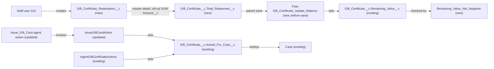

# Implementation spec — Gift certificate remaining balance and service-recovery case link

> Record each partial redemption against a `Gift_Certificate__c`, keep `Gift_Certificate__c.Remaining_Value__c` equal to the original value minus the redemptions, and let every issuance path link a service-recovery certificate to its `Case`.

_Based on the requirement, the evidence reported by AskCoworker, and read-only org queries where noted. Assumptions and missing evidence are identified below. Specification only — nothing is implemented or deployed._

---

## 1. The requirement

Gift certificates must show how much balance is left after partial redemptions, and must link to the `Case` they were issued for when the certificate is a service recovery. The org already has both fields (`Gift_Certificate__c.Remaining_Value__c` and `Gift_Certificate__c.Issued_For_Case__c`), so this spec designs only the missing parts: nothing records a redemption or lowers the balance today, and one of the two issuance actions (`IssueGiftCardAction`) cannot set the case link. The user had no preference on who records redemptions or on enforcing the case link, so the recommended defaults were taken (internal staff in the Salesforce UI; link made possible, not required). The request contained no deploy or data-change instruction.

| # | Responsibility | Trigger | Where it lives |
| --- | --- | --- | --- |
| 1 | Record each partial (or full) redemption with its amount and date | Staff user creates a redemption record in the UI | `Gift_Certificate_Redemption__c` (new) with `Gift_Certificate_Redemption__c.Amount__c`, `Gift_Certificate_Redemption__c.Redemption_Date__c`, related list on `Gift_Certificate_Record_Page` and `Gift_Certificate__c-Gift Certificate Layout` |
| 2 | Keep the remaining balance current after redemptions | Insert, edit, delete, or undelete of a redemption (roll-up recalculation saves the parent); any save of `Gift_Certificate__c` | `Gift_Certificate__c.Total_Redeemed__c` (new roll-up), flow `Gift_Certificate_Update_Balance` (new) writing existing `Gift_Certificate__c.Remaining_Value__c` |
| 3 | Prevent redemptions that are zero, negative, or larger than the balance | Save of a redemption; parent save after roll-up | `Gift_Certificate_Redemption__c.Redemption_Amount_Positive`, `Gift_Certificate__c.Remaining_Value_Not_Negative` (new validation rules) |
| 4 | Link a service-recovery certificate to the case it was issued for | Certificate created by agent action `Issue_Gift_Card` or `Create_Gift_Certificate_179Kj000000oapj`, or edited in the UI | Existing `Gift_Certificate__c.Issued_For_Case__c`; `IssueGiftCardAction` and `Issue_Gift_Card` updated to accept a case Id; existing `AgentGiftCertificateActions` already sets it |
| 5 | Let staff see the balance and redemption history | Viewing a gift certificate | `Gift_Certificate_Record_Page` (Dynamic Forms) and `Gift_Certificate_Redemption_Access` (new permission set) |

## 2. Grounding — reuse before building

Target org: `TestWriteSpecDE` (Developer Edition, not a sandbox, org ID `00Dak00001COqNeEAL`). API version: `67.0`.

- **`Gift_Certificate__c`** (CustomObject, `DurableId` `01Iak00000Dx4JX`) — the gift certificate. Internal OWD `ReadWrite`, external `Private`. 1 record exists (Type `Recovery`, Status `Active`, `Remaining_Value__c` 50 = `Original_Value__c` 50, `Issued_For_Case__c` blank). _verified by org query_
- **`Gift_Certificate__c.Remaining_Value__c`** (Currency 18,2, stored, description "The remaining monetary value available for redemption.") — reused as the balance field. _verified by org query_
- **`Gift_Certificate__c.Original_Value__c`** (Currency 18,2, "The original monetary value of the gift certificate at time of issue.") — base for the balance. _verified by org query_
- **`Gift_Certificate__c.Value__c`** (Currency 18,0, "The monetary value of the gift certificate.") — set equal to `Original_Value__c` by both issuance classes; not used by this design. _verified by org query_
- **`Gift_Certificate__c.Issued_For_Case__c`** (Lookup(Case), description "Links this gift certificate to the service Case it was issued for (e.g., recovery).") — already meets the link half of the requirement at the data-model level. _verified by org query_
- **`Gift_Certificate__c.Type__c`** (picklist: Purchased, Recovery, Promotion, Loyalty Reward, Referral Bonus) and **`Gift_Certificate__c.Status__c`** (Draft, Active, Partially Redeemed, Fully Redeemed, Expired, Cancelled). _verified by org query_
- **`AgentGiftCertificateActions`** (ApexClass, `with sharing`, agent action `Create_Gift_Certificate_179Kj000000oapj`) — inserts certificates with `Remaining_Value__c = Original_Value__c = Value__c = giftValue` and sets `Issued_For_Case__c` from an optional `caseId`. Reused unchanged. _verified by org query_
- **`IssueGiftCardAction`** (ApexClass, `with sharing`, agent action `Issue_Gift_Card`, test `IssueGiftCardActionTest`) — inserts certificates (type defaults to `Recovery`) with the same balance fields, has no `caseId` input, and never sets `Issued_For_Case__c`. _verified by org query_
- **`IssueGiftCardActionTest`** — asserts `out.giftCard.value`, but `IssueGiftCardAction.GiftCardView` declares `amount`, not `value`; both classes report `IsValid = false`. _verified by org query_
- **`RenderGiftCardAction`** (ApexClass, read-only, agent action `Render_Gift_Card`) — displays `Value__c`; its comment says "Resolution Center owns the money-moving write". _verified by org query_
- **`Gift_Certificate_Record_Page`** (FlexiPage, Dynamic Forms field instances) — shows `Original_Value__c`, `Value__c`, `Issued_For_Case__c`, and others, but not `Remaining_Value__c`, and has no related list component. _verified by org query_
- **`Gift_Certificate__c-Gift Certificate Layout`** (Layout) — the only layout on the object. _verified by org query_
- **Permissions on `Gift_Certificate__c`** — Create/Edit: `Agentforce_Action_Access`, `Agentforce_Reference_App`, `Pronto_Deep_Dive_Workshop`, `sfdc_accelerate_dms`, and one profile; Read only: `sfdc_a360_sfcrm_data_extract`, `sfdc_slack`, and one profile. Edit on `Remaining_Value__c` and `Issued_For_Case__c`: `Agentforce_Action_Access`, `Agentforce_Reference_App`, `Pronto_Deep_Dive_Workshop`, `sfdc_accelerate_dms`. `Agentforce_Action_Access` has no `Case` object permission. _verified by org query_
- **Absence of existing behavior** — no Apex trigger and no record-triggered flow on `Gift_Certificate__c` or `Case`; no validation rule on `Gift_Certificate__c`; no custom child object of `Gift_Certificate__c`; the only unmanaged Apex classes that reference `Gift_Certificate__c`, `Remaining_Value__c`, or `Issued_For_Case__c` are the four above, and none lowers `Remaining_Value__c` or records a redemption; `MetadataComponentDependency` on the object and its balance, case, and status fields lists only those classes and `Storefront_Record_Page` (reads `Original_Value__c`). _verified by org query_
- **No redemption concept elsewhere** — no custom field anywhere (excluding Data 360 `9sd` objects) matches Gift, Certificate, Balance, Redeem, Redemption, Remaining, or Voucher except `Remaining_Value__c`; no object name matches redemption or voucher except the standard `CouponCodeRedemption`. _verified by org query_

Candidates examined and rejected: `CouponCodeRedemption` — standard promotions object tied to coupon codes, not to `Gift_Certificate__c`; `Loyalty_Transaction__c` (Earn/Redeem points for a `Contact`) — tracks points, has no link to a certificate; `Refund__c` (has `Case__c` and a "Gift Certificate" payment method) — a refund record, not a redemption, and no lookup to `Gift_Certificate__c`; `Transaction__c` — no custom fields; converting `Remaining_Value__c` to a formula — the field is written by two Apex classes, so a formula would break them.

Evidence sources: `sf sobject list`, `sf sobject describe` of `Gift_Certificate__c`, `Transaction__c`, `Refund__c`, `Loyalty_Transaction__c`; Tooling `EntityDefinition`, `CustomField` (by object and by name keywords), `ApexTrigger`, `ValidationRule`, `ApexClass` bodies, `MetadataComponentDependency`, `GenAiFunctionDefinition`, `Layout`, `FlexiPage` (and its `Metadata`); `FlowDefinitionView`, `ObjectPermissions`, `FieldPermissions`, `EntityDefinition` sharing model, `Organization`, `DataStream` count, and aggregate record counts. AskCoworker returned no citedReferences.

## 3. Architecture

Why the pieces are drawn this way:

1. A child ledger `Gift_Certificate_Redemption__c` gives one record per redemption, so the balance has a history and can be corrected by editing or deleting one redemption. The master-detail relationship is required for a roll-up summary, and it makes the child's sharing follow the parent. _assumption (implementation decision)_
2. `Total_Redeemed__c` is a roll-up SUM, which is declarative and recalculates on child insert, edit, delete, and undelete. _assumption (documented platform behavior)_
3. When a roll-up value changes, the parent record goes through its save procedure in the same transaction, so the before-save flow recomputes `Remaining_Value__c` and the parent validation rule then runs. _assumption (documented platform behavior; load-bearing)_
4. `Remaining_Value__c` stays a stored field because `AgentGiftCertificateActions` and `IssueGiftCardAction` write it on insert. _verified by org query_ On insert, the roll-up is 0, so the flow sets the same value the Apex already sets.
5. The over-redemption check sits on the parent (`Remaining_Value__c < 0`) rather than only on the child, because it sees the recomputed total, including several redemptions saved in one transaction and edits of an existing redemption.
6. Apex is changed only where the case link is set inside an existing invocable Apex method (`IssueGiftCardAction`); no declarative feature can add an input to it. The agent action `Issue_Gift_Card` must expose the new input. `GiftCertificateRedemptionTest` is test-only Apex that exercises the roll-up, flow, and validation rules through DML.

## 4. Metadata changes

**Data model**

- **Create `Gift_Certificate_Redemption__c`** — Custom object, label "Gift Certificate Redemption", plural "Gift Certificate Redemptions". Name field Auto Number `GCR-{0000}`. Sharing model `ControlledByParent`. No tab. Allow Reports on.
- **Create `Gift_Certificate_Redemption__c.Gift_Certificate__c`** — Master-Detail(`Gift_Certificate__c`), label "Gift Certificate", relationship name `Redemptions`, related list label "Redemptions". Reparenting not allowed. Write access requires Read on the master.
- **Create `Gift_Certificate_Redemption__c.Amount__c`** — Currency(16,2), required, label "Amount", description "Amount redeemed in this transaction."
- **Create `Gift_Certificate_Redemption__c.Redemption_Date__c`** — Date, required, default `TODAY()`, label "Redemption Date".
- **Create `Gift_Certificate__c.Total_Redeemed__c`** — Roll-Up Summary, SUM of `Gift_Certificate_Redemption__c.Amount__c`, no filter, label "Total Redeemed". Returns 0 when there are no redemptions.

**Automation**

- **Create `Gift_Certificate_Update_Balance`** — Record-triggered flow on `Gift_Certificate__c`, before-save (Fast Field Updates), on create and update. Entry condition: `Original_Value__c` Is Null = false. One Assignment: `$Record.Remaining_Value__c` = formula `{!$Record.Original_Value__c} - BLANKVALUE({!$Record.Total_Redeemed__c}, 0)`. Results: Original 50, no redemptions → 50; Original 50, redeemed 20 → 30; Original 50, redeemed 50 → 0. Blank `Original_Value__c` → flow does not run and `Remaining_Value__c` is left unchanged. No Get Records, no DML. Active.
- **Create `Gift_Certificate_Redemption__c.Redemption_Amount_Positive`** — Validation rule. Error condition `Amount__c <= 0`. Error on field `Amount__c`: "Redemption amount must be greater than zero." `Amount__c` is required, so it is never blank at this point.
- **Create `Gift_Certificate__c.Remaining_Value_Not_Negative`** — Validation rule. Error condition `AND(Total_Redeemed__c > 0, Remaining_Value__c < 0)`. Error message: "Redemptions cannot exceed the gift certificate's remaining balance." It fires only once a redemption exists, so certificates with no redemptions keep today's behavior. A blank `Remaining_Value__c` makes the condition false. Also blocks lowering `Original_Value__c` below `Total_Redeemed__c`.

**Security**

- **Create `Gift_Certificate_Redemption_Access`** — Permission set, label "Gift Certificate Redemption Access". Object: `Gift_Certificate_Redemption__c` Create, Read, Edit (no Delete, no View All, no Modify All); `Gift_Certificate__c` Read. Fields: Read and Edit on `Gift_Certificate_Redemption__c.Redemption_Date__c` and `Gift_Certificate_Redemption__c.Amount__c` (required fields; entries included only where the metadata API accepts them); Read on `Gift_Certificate__c.Total_Redeemed__c`, `Gift_Certificate__c.Remaining_Value__c`, and `Gift_Certificate__c.Original_Value__c`. No existing permission set is changed.

**UX**

- **Update `Gift_Certificate__c-Gift Certificate Layout`** — Add `Total_Redeemed__c` and `Remaining_Value__c` (read-only) next to `Original_Value__c`, and add the `Redemptions` related list (columns `Name`, `Amount__c`, `Redemption_Date__c`, `CreatedBy`). Retrieve before editing.
- **Update `Gift_Certificate_Record_Page`** — Add field instances for `Remaining_Value__c` and `Total_Redeemed__c` (read-only) in the section that holds `Original_Value__c`, and add a Related List - Single component for `Redemptions` on the main tab. Retrieve before editing. This page change is visible to everyone who uses the page.

**Apex**

- **Update `IssueGiftCardAction`** — Add to `Request` an optional `@InvocableVariable(label='Case Id' description='Optional Case Id the gift certificate was issued for (Gift_Certificate__c.Issued_For_Case__c), for service recovery.' required=false) public Id caseId;` and set `gc.Issued_For_Case__c = req.caseId;` before `insert gc`, matching `AgentGiftCertificateActions`. Duplicate guard, defaults, and response are unchanged. An Id that does not exist fails at `insert`, is caught by the existing `catch`, and returns `success = false` with the platform message.

**Other**

- **Update `Issue_Gift_Card`** — GenAiFunction for `IssueGiftCardAction`: add the optional `caseId` input to its input schema, with an instruction to pass the Case Id of the current service case when the gift is a service recovery. Retrieve before editing.

**Tests**

- **Update `IssueGiftCardActionTest`** — Fix the existing assertion `out.giftCard.value` to `out.giftCard.amount`. Add: a Case is created, the action is invoked with `caseId`, and `Issued_For_Case__c` equals it; invoked without `caseId`, `Issued_For_Case__c` is null; `Remaining_Value__c` equals `Original_Value__c` after insert.
- **Create `GiftCertificateRedemptionTest`** — Apex test class that exercises the roll-up, flow, and validation rules through DML (cases in Section 7).

## 5. Data 360 (Data Cloud) data involved

Not applicable — this change does not use Data 360. The org has 0 `DataStream` records _(verified by org query)_. `sfdc_a360_sfcrm_data_extract` can read `Gift_Certificate__c` _(verified by org query)_, but no stream is configured and none is added.

## 6. Security considerations

- **Execution context.** `Gift_Certificate_Update_Balance` is a record-triggered flow, which runs in system context, so it can set `Remaining_Value__c` even for users without Edit on that field. _assumption (documented platform behavior)_ Validation rules run for every user and every API caller. `IssueGiftCardAction` stays `with sharing`. _verified by org query_
- **Sharing.** `Gift_Certificate_Redemption__c` is `ControlledByParent`: a user sees a redemption only if they can see its certificate, and can create one only if they can at least read the certificate (the "Read" master-detail setting). Internal OWD of `Gift_Certificate__c` is `ReadWrite`, so internal users see all certificates. _verified by org query_
- **CRUD/FLS.** Only users assigned `Gift_Certificate_Redemption_Access` (or with Modify All Data) can create or edit redemptions; nobody can delete them except administrators. `Total_Redeemed__c` is readable only through the new permission set; holders of `Agentforce_Action_Access`, `Agentforce_Reference_App`, `Pronto_Deep_Dive_Workshop`, `sfdc_accelerate_dms`, `sfdc_a360_sfcrm_data_extract`, and `sfdc_slack` do not get it. Profiles are not changed. Permission sets are not the only grant path; profiles and Modify All Data can also grant access.
- **Behavior change on a shared field.** The four permission sets with Edit on `Remaining_Value__c` keep it, but a manual edit is overwritten by the flow on save when `Original_Value__c` is filled in. Nothing in the org writes `Remaining_Value__c` after insert _(verified by org query of Apex bodies, triggers, and flows)_, so only manual edits change.
- **Case link.** Setting `Issued_For_Case__c` requires Edit on that field (`Agentforce_Action_Access` has it, _verified by org query_) and access to the target `Case` record; `Case` internal OWD is `ReadWriteTransfer` _(verified by org query)_. The agent user's `Case` access is not specified (see Section 8).
- **Data exposure.** No new data leaves the org. Redemption amounts are visible to anyone who can see the certificate and has Read on the new object.

## 7. Testing strategy

Test classes in the inventory: `GiftCertificateRedemptionTest` (new) and `IssueGiftCardActionTest` (updated). Tests are designed here and have not been run.

`GiftCertificateRedemptionTest` (creates a `Gift_Certificate__c` with `Original_Value__c` and `Remaining_Value__c` 100):

1. Partial redemption: insert a redemption of 30 → `Total_Redeemed__c` 30, `Remaining_Value__c` 70 (verifies the load-bearing assumption that the roll-up save runs the before-save flow).
2. Second redemption of 70 → `Remaining_Value__c` 0.
3. Over-redemption: with 70 remaining, insert 80 → `DmlException` with the `Remaining_Value_Not_Negative` message; no redemption saved.
4. Edit: change a redemption from 30 to 40 → `Remaining_Value__c` 60; change it to 110 → blocked.
5. Delete a redemption → balance restored; undelete it → balance lowered again; undelete that would make the balance negative → blocked.
6. Zero and negative amounts → blocked by `Redemption_Amount_Positive`.
7. Bulk: insert 200 redemptions of 0.50 across 2 certificates in one DML → balances correct; a batch whose total exceeds one certificate's balance fails for that certificate.
8. Certificate with no redemptions: edit `Original_Value__c` from 100 to 120 → `Remaining_Value__c` 120; certificate with blank `Original_Value__c` → `Remaining_Value__c` unchanged and no error.
9. Transition: set `Original_Value__c` below `Total_Redeemed__c` → blocked.
10. Permission: a user with only `Gift_Certificate_Redemption_Access` (created in the test with a standard profile) can insert a redemption in `System.runAs`; for a user without it, `Schema.sObjectType.Gift_Certificate_Redemption__c.isCreateable()` returns false in `System.runAs`.

`IssueGiftCardActionTest`: with `caseId` → `Issued_For_Case__c` set; without → null; a well-formed but nonexistent Case Id → `success = false`; the fixed `amount` assertion; `Remaining_Value__c = Original_Value__c`.

Recommended verification (manual):

- On `Gift_Certificate_Record_Page`, confirm `Remaining_Value__c`, `Total_Redeemed__c`, and the Redemptions related list appear, and that creating a redemption from the related list updates the balance.
- In the agent builder, invoke `Issue_Gift_Card` from a service conversation with a case in context and confirm `Issued_For_Case__c` is filled in, and without a case that the certificate is still created.
- Two users redeem against the same certificate at the same time: confirm the second save either succeeds with the correct balance or is blocked (master-detail child saves lock the parent record). _assumption (documented platform behavior)_

## 8. Open decisions

### Open

1. **Permission set assignment (blocking for delivery).** No user can record redemptions until `Gift_Certificate_Redemption_Access` is assigned. Which staff users redeem certificates is not specified. Recommended default: assign it to the users who today hold `Agentforce_Reference_App` or `sfdc_accelerate_dms` and handle gift certificates.
2. **Agent Case context (non-blocking).** `Issue_Gift_Card` can only link a case if the agent has the Case Id in context. Whether its topic has one is not specified. The input is optional, so without it certificates are still issued unlinked. Also confirm the agent user can access the `Case` record; `Agentforce_Action_Access` grants no `Case` permission _(verified by org query)_.
3. **Case link enforcement (non-blocking).** The link is not required for `Type__c` = `Recovery`, because `Issue_Gift_Card` would then fail whenever no case is passed. Proposal only: a validation rule `AND(ISPICKVAL(Type__c, "Recovery"), ISBLANK(Issued_For_Case__c))` once every issuance path passes a case.
4. **`Total_Redeemed__c` visibility for existing permission sets (non-blocking).** Only the new permission set grants Read on `Total_Redeemed__c`. Granting it to the six existing permission sets would widen broad sets and is not needed for any responsibility; add it only if their users need the total.
5. **Delete of redemptions (non-blocking).** The permission set grants no Delete, so mistakes are corrected by editing the amount. Grant Delete if the business wants staff to remove redemptions.
6. **Deployment sequence (non-blocking).** Deploy rows 1–5 (object, fields, roll-up), then rows 7 and 8 (validation rules), row 6 (flow), row 9 (permission set), rows 10–11 (layout, page), then rows 12–15 (Apex, agent action, tests) together, because `IssueGiftCardActionTest` must compile with the updated class and currently references `GiftCardView.value`, which does not exist _(verified by org query)_. No data backfill is needed: the one existing certificate has `Remaining_Value__c` = `Original_Value__c` = 50 and no redemptions _(verified by org query)_; `Total_Redeemed__c` is calculated for existing records when it is created. The activation state of `Gift_Certificate_Record_Page` could not be read.
7. **Records that stop matching (non-blocking).** If `Original_Value__c` is cleared on a certificate with redemptions, the flow stops recomputing and `Remaining_Value__c` keeps its last value. Recommended default: accept; both issuance classes always set `Original_Value__c` _(verified by org query)_.
8. **Load-bearing assumptions (non-blocking; verified by Section 7 test 1).** A roll-up summary change saves the parent in the same transaction and runs its before-save flow and validation rules; before-save flows run before custom validation rules. If either were false, the balance would not update. _assumption (documented platform behavior)_

Proposals not in the inventory: set `Status__c` to `Partially Redeemed` or `Fully Redeemed` from the balance (the picklist values exist but the requirement does not ask for status changes); show `Remaining_Value__c` instead of `Value__c` in `RenderGiftCardAction` and `IssueGiftCardAction.GiftCardView`; add a gift certificate related list to the `Case` layout.

### Resolved

- **Who records redemptions** — internal staff in the Salesforce UI. _assumption (user had no preference; recommended default)_
- **Case link enforcement** — made possible on every issuance path, not required. _assumption (user had no preference; recommended default)_
- **Ledger versus direct edit of `Remaining_Value__c`** — ledger object with roll-up chosen so each redemption is recorded and the balance cannot drift from the history. _assumption (implementation decision)_
- **Over-redemption check moved to the parent.** AskCoworker proposed a child rule `Amount__c > Gift_Certificate__r.Remaining_Value__c`. That rule wrongly blocks valid edits (the stored balance already includes the old amount) and misses several redemptions saved in one transaction. Replaced by `Gift_Certificate__c.Remaining_Value_Not_Negative` plus a child rule for zero and negative amounts.
- **Roll-up timing.** AskCoworker said bulk roll-up recalculation may be deferred asynchronously and that concurrent redemptions could both pass. Rejected: roll-up summaries on master-detail recalculate in the same transaction, and a detail save locks the master record. _assumption (documented platform behavior)_
- **Invalid Case Id.** AskCoworker called an invalid `caseId` an unhandled exception. Rejected: the variable is typed `Id`, and a nonexistent Id fails at `insert` inside the existing `try/catch`, returning `success = false`. No extra query added.
- **Permission set assignment.** AskCoworker proposed assigning the new permission set "to" `Agentforce_Reference_App` and `sfdc_accelerate_dms` and granting `Total_Redeemed__c` to six existing sets. Permission sets are assigned to users, and widening broad sets is not needed; see Open items 1 and 4.
- **FlexiPage row.** AskCoworker treated the page as unknown; the page metadata shows Dynamic Forms with no `Remaining_Value__c` and no related list _(verified by org query)_, so the Update is unconditional and also places the balance fields.
- **Agent action and test rows added.** `Issue_Gift_Card` (GenAiFunction) and `IssueGiftCardActionTest` were folded into the `IssueGiftCardAction` row by AskCoworker; they are separate deployable components. `GiftCertificateRedemptionTest` added to cover the declarative behavior.
- **Validation rule check.** AskCoworker reported validation rules as unknown; the org query found none on `Gift_Certificate__c`.
- Dropped AskCoworker items: an Apex `FOR UPDATE` trigger for concurrency (not needed), and Data 360 stream proposals (not asked).

## 9. Change set

| # | Action | Type | API name | Module | Why |
| --- | --- | --- | --- | --- | --- |
| 1 | Create | CustomObject | `Gift_Certificate_Redemption__c` | force-app/main/default/objects/Gift_Certificate_Redemption__c | One record per redemption |
| 2 | Create | CustomField | `Gift_Certificate_Redemption__c.Gift_Certificate__c` | force-app/main/default/objects/Gift_Certificate_Redemption__c/fields | Master-detail needed for the roll-up and parent sharing |
| 3 | Create | CustomField | `Gift_Certificate_Redemption__c.Amount__c` | force-app/main/default/objects/Gift_Certificate_Redemption__c/fields | Amount redeemed |
| 4 | Create | CustomField | `Gift_Certificate_Redemption__c.Redemption_Date__c` | force-app/main/default/objects/Gift_Certificate_Redemption__c/fields | When the redemption happened |
| 5 | Create | CustomField | `Gift_Certificate__c.Total_Redeemed__c` | force-app/main/default/objects/Gift_Certificate__c/fields | Declarative sum of redemptions |
| 6 | Create | Flow | `Gift_Certificate_Update_Balance` | force-app/main/default/flows | Keeps existing `Remaining_Value__c` equal to original minus redeemed |
| 7 | Create | ValidationRule | `Gift_Certificate_Redemption__c.Redemption_Amount_Positive` | force-app/main/default/objects/Gift_Certificate_Redemption__c/validationRules | Blocks zero and negative redemptions |
| 8 | Create | ValidationRule | `Gift_Certificate__c.Remaining_Value_Not_Negative` | force-app/main/default/objects/Gift_Certificate__c/validationRules | Blocks redemptions above the balance |
| 9 | Create | PermissionSet | `Gift_Certificate_Redemption_Access` | force-app/main/default/permissionsets | Least-access grant for staff who redeem |
| 10 | Update | Layout | `Gift_Certificate__c-Gift Certificate Layout` | force-app/main/default/layouts | Balance fields and Redemptions related list |
| 11 | Update | FlexiPage | `Gift_Certificate_Record_Page` | force-app/main/default/flexipages | Dynamic Forms page lacks the balance and related list |
| 12 | Update | ApexClass | `IssueGiftCardAction` | force-app/main/default/classes | Optional `caseId` sets `Issued_For_Case__c` |
| 13 | Update | GenAiFunction | `Issue_Gift_Card` | force-app/main/default/genAiFunctions | Exposes the new `caseId` input to the agent |
| 14 | Update | ApexClass | `IssueGiftCardActionTest` | force-app/main/default/classes | Covers the case link and fixes the `value` assertion |
| 15 | Create | ApexClass | `GiftCertificateRedemptionTest` | force-app/main/default/classes | Tests roll-up, flow, and validation rules |

A master-detail redemption ledger with a roll-up and a before-save flow maintains the existing `Remaining_Value__c`, and `IssueGiftCardAction` gains the case link that `AgentGiftCertificateActions` already has.

Total: 15 · Create: 10 · Update: 5 · Delete: 0
