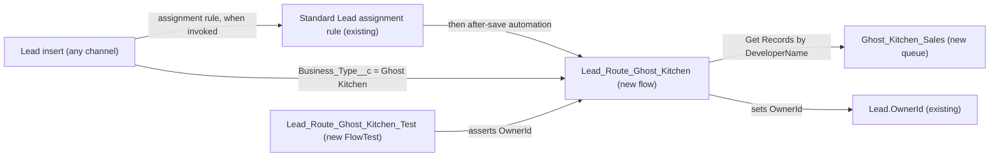

# Implementation spec — Ghost Kitchen lead routing

> Assign every new Lead whose `Lead.Business_Type__c` is "Ghost Kitchen" to a new "Ghost Kitchen Sales" queue, and leave all other leads unchanged.

_Based on the requirement, the evidence reported by AskCoworker, and read-only org queries where noted. Assumptions and missing evidence are identified below. Specification only — nothing is implemented or deployed._

---

## 1. The requirement

When a new Lead with `Lead.Business_Type__c` = "Ghost Kitchen" is created, set its owner to the queue "Ghost Kitchen Sales"; leads of any other business type keep their current routing. The queue name and "other leads unchanged" are *user decisions*. The request contained no out-of-scope instruction.

| # | Responsibility | Trigger | Where it lives |
| --- | --- | --- | --- |
| 1 | Identify a lead as coming from a ghost kitchen | Lead create | `Lead.Business_Type__c` (existing picklist value "Ghost Kitchen") |
| 2 | Provide the Ghost Kitchen sales team queue that can own leads | Not applicable (configuration) | `Ghost_Kitchen_Sales` (new Queue) |
| 3 | Assign new Ghost Kitchen leads to that queue, on every creation channel | Lead create (after save) | `Lead_Route_Ghost_Kitchen` (new Flow) |
| 4 | Leave all other leads unchanged | Lead create | Entry condition of `Lead_Route_Ghost_Kitchen` |
| 5 | Prove the routing works | Deployment / test run | `Lead_Route_Ghost_Kitchen_Test` (new FlowTest) and manual checks in Section 7 |

## 2. Grounding — reuse before building

Target org: `TestWriteSpecDE` (Developer Edition, not a sandbox). API version: `67.0`.

- **`Lead.Business_Type__c`** (CustomField, picklist) — the ghost kitchen identifier. Restricted picklist, not required; active values include "Ghost Kitchen" alongside 11 others (for example "Restaurant Group", "Food Truck"). The only metadata reference is `Lead Layout`. _verified by org query_
- **No other field means "ghost kitchen" for leads.** Tooling `CustomField` search for `%Kitchen%`, `%Ghost%`, `%Business_Type%` found only `Lead.Business_Type__c` and a Data 360 data model field `KitchenCount` (`9sd…` object), which is not a lead field. `Lead.Cuisine_Type__c` and `Lead.Industry` have no ghost kitchen value. _verified by org query_
- **`Lead.OwnerId`** (reference to User or Group) — the routing field. _verified by org query_ (field exists); accepting a queue Id is _assumption (documented platform behavior)_.
- **Queues** — only `Merchant_Messaging_Queue` (supports `MessagingSession`) and `Unqualified_Leads` (supports `Lead`) exist; each has 1 member. No queue, public group, or role named like "Ghost" or "Kitchen" exists. _verified by org query_
- **Lead automation** — 0 Apex triggers on `Lead`; the only record-triggered flow on `Lead` is `ApprovalDispatcher` (after save, create), inactive; 0 validation rules on `Lead`. _verified by org query_
- **`Standard`** (AssignmentRule, `Lead`) — active. Its entries cannot be read with the allowed commands. _verified by org query_
- **Lead creators** — active namespaced flows `sales_sfa_flows__CreateSalesLead` and `sfdc_fieldservice__CreateLeadAndOpp` exist and can create leads (partial list; unmanaged Apex bodies (70 classes) contain no `Business_Type__c`, "ghost", or assignment-rule header references). _verified by org query_
- **Sharing** — Lead organization-wide default is Public Read/Write/Transfer. _verified by org query_
- **Data shape** — 5 leads exist, all with `Business_Type__c` blank and all owned by users. No existing Ghost Kitchen lead needs backfill. _verified by org query_
- **Name availability** — no flow named like `%Ghost%` exists; 0 FlowTest records exist. _verified by org query_
- Permission sets `Agentforce_Reference_App` and `sfdc_accelerate_dms` have Create and Edit on `Lead`. _reported by AskCoworker_

Candidates examined and rejected: `Unqualified_Leads` — a different business purpose; reusing it would mix ghost kitchen leads with unqualified leads. Extending the `Standard` Lead assignment rule — see Section 8 Resolved.

Evidence sources: `sf org display`; Group, QueueSobject, GroupMember, UserRole, User, AssignmentRule, Organization, Lead aggregate, FlowDefinitionView, and DataStream queries; `sobject describe Lead`; Tooling CustomField, CustomField.Metadata, ApexTrigger, ValidationRule, MetadataComponentDependency, ApexClass body, FlexiPage, and FlowTest queries. AskCoworker returned no citedReferences.

## 3. Architecture

Why the pieces are drawn this way:

1. Leads are created through several channels, including namespaced flows that do not invoke assignment rules. A record-triggered flow runs on every insert, whatever the channel. _verified by org query_ (creators exist); flow Create Records not invoking assignment rules is _assumption (documented platform behavior)_.
2. The `Standard` Lead assignment rule is active _verified by org query_. Assignment rules run only when invoked (Web-to-Lead, the UI "Assign using active assignment rule" checkbox, or the API `AssignmentRuleHeader`), and they run after before-save flows and before after-save flows in the save order. An after-save flow therefore has the last word for Ghost Kitchen leads, and a before-save flow would be overwritten. _assumption (documented platform behavior)_
3. The flow looks up the queue by `DeveloperName` = `Ghost_Kitchen_Sales` and `Type` = `Queue` so no record Id is hard-coded. _assumption_ (design choice)
4. The flow assigns `$Record.OwnerId` and updates the triggering record. The platform bulkifies these updates across interviews in one transaction. _assumption (documented platform behavior)_
5. Declarative only; no Apex is needed.

## 4. Metadata changes

**Data model**

- **Create `Ghost_Kitchen_Sales`** — Queue, label "Ghost Kitchen Sales", `queueSobject` = `Lead`, no email, `doesSendEmailToMembers` = false. Members: named placeholder `{Ghost Kitchen sales team members}` (users or a public group), to be supplied by the sales owner; see Section 8. Deploy before the flow.

**Automation**

- **Create `Lead_Route_Ghost_Kitchen`** — Record-triggered Flow on `Lead`, trigger type `RecordAfterSave`, record trigger type `Create`, active. Entry condition: `ISPICKVAL({!$Record.Business_Type__c}, 'Ghost Kitchen')`. Elements: (a) Get Records `Group` where `DeveloperName` = `Ghost_Kitchen_Sales` and `Type` = `Queue`, first record only; (b) Decision: queue found? (c) if not found, Custom Error element with message "Ghost Kitchen Sales queue not found; contact your Salesforce administrator." (fail loud; the lead insert rolls back); (d) if found, Assignment `{!$Record.OwnerId}` = queue Id, then Update Records using `$Record`. No scheduled paths. Runs in system context without sharing.

**Tests**

- **Create `Lead_Route_Ghost_Kitchen_Test`** — FlowTest for `Lead_Route_Ghost_Kitchen`. Initial `$Record`: a new Lead with `LastName`, `Company`, and `Business_Type__c` = "Ghost Kitchen". Assertion: `{!$Record.OwnerId}` equals the Id returned by the Get Records element (the `Ghost_Kitchen_Sales` queue).

## 5. Data 360 (Data Cloud) data involved

Not applicable — this change does not use Data 360. The org has 0 data streams _verified by org query_.

## 6. Security considerations

- **Execution context.** `Lead_Route_Ghost_Kitchen` runs in system context without sharing, so the creating user's CRUD and field-level security on `Lead.OwnerId` does not affect routing. _assumption (documented platform behavior)_
- **Access to routed leads.** Lead organization-wide default is Public Read/Write/Transfer _verified by org query_, so every internal user, including queue members, can read, edit, and transfer routed leads. The creating user keeps access after ownership moves to the queue. No sharing change is needed.
- **Permission sets.** No permission set changes. Queue membership, not a permission set, determines who works the queue; membership is set in the Queue metadata or in Setup.
- **Data exposure.** No new fields. Only the value of `Lead.OwnerId` changes for Ghost Kitchen leads. Integrations that read `Lead` (for example through `sfdc_slack`, _reported by AskCoworker_) will see the queue as owner.
- **Placement.** The queue appears as an owner option in Lead views; a dedicated "Ghost Kitchen Sales" list view is not included (Section 8).

## 7. Testing strategy

Automated (FlowTest, `Lead_Route_Ghost_Kitchen_Test`):

- Ghost Kitchen lead on create: `$Record.OwnerId` equals the `Ghost_Kitchen_Sales` queue Id.

Recommended verification (manual, no planned automated test):

1. UI insert of a Lead with `Business_Type__c` = "Ghost Kitchen", with and without "Assign using active assignment rule": owner is the Ghost Kitchen Sales queue.
2. UI insert with another value (for example "Food Truck") and with a blank value: owner is the same as before this change (creator or `Standard` rule result).
3. API insert of a Ghost Kitchen lead (for example with `sf data create record` in a sandbox, or Workbench): routed to the queue.
4. Bulk: load 200 leads mixing Ghost Kitchen and other values in one transaction; only the Ghost Kitchen leads are routed, and no governor limit error occurs.
5. Update an existing non-Ghost Kitchen lead to "Ghost Kitchen": owner does not change (create-only by design).
6. Negative, in a sandbox: with the queue's `DeveloperName` changed, a Ghost Kitchen insert fails with the Custom Error message.
7. Web-to-Lead, if the org uses it: a Ghost Kitchen submission ends up in the queue even when the `Standard` rule assigns it elsewhere.

Tests have not been run.

## 8. Open decisions

### Open

1. **Queue members (blocking for delivery).** The team members for `Ghost_Kitchen_Sales` are not specified; the org has one active human user (a System Administrator) _verified by org query_. Recommended default: the sales owner names the users or a public group before go-live; deploy the queue with the placeholder `{Ghost Kitchen sales team members}` replaced. Without members, routed leads have no one working them.
2. **`Standard` Lead assignment rule entries (non-blocking).** Its entries cannot be read. The flow overrides whatever the rule sets for Ghost Kitchen leads, which is the intended result; other leads are not affected. Recommended: review the rule in Setup before deployment in case it already has a Ghost Kitchen entry that should be retired.
3. **Queue list view (non-blocking, proposal).** A Lead list view filtered to owner "Ghost Kitchen Sales" would help the team; not requested, so not in the inventory.
4. **Deployment sequence (non-blocking).** Deploy `Ghost_Kitchen_Sales` (with members), then `Lead_Route_Ghost_Kitchen`, then run `Lead_Route_Ghost_Kitchen_Test`.
5. **Load-bearing assumptions.** (a) After-save record-triggered flows run after assignment rules, so the flow's owner wins. (b) Every lead creation channel performs a DML insert that fires record-triggered flows. If either is wrong, some Ghost Kitchen leads keep another owner.

### Resolved

- Queue name "Ghost Kitchen Sales"; leads that are not Ghost Kitchen stay unchanged — *user decision*.
- Route only on create, not when an existing lead is later changed to "Ghost Kitchen" — *assumption* from "comes in"; the user had no preference. To change later: record trigger type `CreateAndUpdate` with an `ISCHANGED` entry condition.
- Missing queue raises a Custom Error rather than silently leaving leads unrouted — *assumption* (fail loud); trade-off: Ghost Kitchen inserts fail until the queue is restored.
- Flow instead of a new entry in the `Standard` assignment rule — *assumption*: the rule's entries cannot be read, and assignment rules do not run for API and flow inserts without the header, so a rule entry would miss channels. AskCoworker listed the rule entry as an alternative.
- Before-save flow rejected — an invoked assignment rule would overwrite `OwnerId` afterward — *assumption (documented platform behavior)*.
- Correction to AskCoworker: it reported that bulk inserts of more than 150 Ghost Kitchen leads would hit the DML statement limit. Record-triggered flow updates are bulkified across interviews, so one batch uses one update — *assumption (documented platform behavior)*.
- Correction to AskCoworker: it reported that routed leads are visible only to admins until members are added. Lead OWD is Public Read/Write/Transfer, so all internal users can see them — *verified by org query*.
- Correction to AskCoworker: it stated the `Standard` rule fires on every insert; it fires only when invoked — *assumption (documented platform behavior)*.
- Correction to AskCoworker: it proposed a FlowTest that mocks Get Records returning null; FlowTest cannot mock queries, so that case is manual check 6.
- Dropped AskCoworker items: callers needing Edit on `OwnerId`, case-sensitivity of `ISPICKVAL` (the picklist is restricted), and transient ownership notes; none change the design.

## 9. Change set

| # | Action | Type | API name | Module | Why |
| --- | --- | --- | --- | --- | --- |
| 1 | Create | Queue | `Ghost_Kitchen_Sales` | force-app/main/default/queues | Routing target for Ghost Kitchen leads; supports `Lead` |
| 2 | Create | Flow | `Lead_Route_Ghost_Kitchen` | force-app/main/default/flows | Sets `OwnerId` to the queue on create when `Business_Type__c` is Ghost Kitchen |
| 3 | Create | FlowTest | `Lead_Route_Ghost_Kitchen_Test` | force-app/main/default/flowtests | Proves the routing on the happy path |

A new Lead queue plus an after-save, create-only record-triggered flow routes Ghost Kitchen leads on every channel without touching other leads.

Total: 3 · Create: 3 · Update: 0 · Delete: 0
