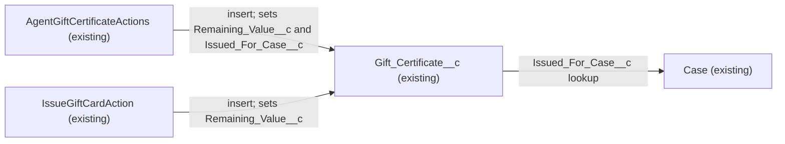

# Implementation spec — Gift certificate remaining balance and service recovery case link

> Confirm that gift certificates already store the balance left after partial redemptions and the Case they were issued for, so no metadata change is needed.

_Based on the requirement, the evidence reported by AskCoworker, and read-only org queries where noted. Assumptions and missing evidence are identified below. Specification only — nothing is implemented or deployed._

---

## 1. The requirement

Gift certificates must record the balance left after partial redemptions and, for service recovery, the Case they were issued for; both are already modelled on `Gift_Certificate__c`, so this spec has no metadata changes. The request contained no deploy or data-change instruction.

| # | Responsibility | Trigger | Where it lives |
| --- | --- | --- | --- |
| 1 | Store the balance left after partial redemptions | Issue of a certificate (initial value); each redemption (Not specified who records it) | `Gift_Certificate__c.Remaining_Value__c`, with `Gift_Certificate__c.Original_Value__c` and `Gift_Certificate__c.Status__c` (existing) |
| 2 | Link a service recovery certificate to the Case it was issued for | Issue of a certificate | `Gift_Certificate__c.Issued_For_Case__c` (existing) |

## 2. Grounding — reuse before building

Target org: `TestWriteSpecDE` (Org ID `00Dak00001COqNeEAL`, Developer Edition instance). API version: `67.0`.

- **`Gift_Certificate__c`** (CustomObject, DurableId `01Iak00000Dx4JX`) — the dedicated gift certificate object. _verified by org query_
- **`Gift_Certificate__c.Remaining_Value__c`** (CustomField, Currency) — description: "The remaining monetary value available for redemption." _verified by org query_
- **`Gift_Certificate__c.Original_Value__c`** (CustomField, Currency) — description: "The original monetary value of the gift certificate at time of issue." _verified by org query_
- **`Gift_Certificate__c.Status__c`** (CustomField, Picklist) — values `Draft`, `Active`, `Partially Redeemed`, `Fully Redeemed`, `Expired`, `Cancelled`. _verified by org query_
- **`Gift_Certificate__c.Type__c`** (CustomField, Picklist) — values `Purchased`, `Recovery`, `Promotion`, `Loyalty Reward`, `Referral Bonus`; `Recovery` identifies service recovery certificates. _verified by org query_
- **`Gift_Certificate__c.Issued_For_Case__c`** (CustomField, Lookup(Case), optional) — description: "Links this gift certificate to the service Case it was issued for (e.g., recovery)." _verified by org query_
- **`AgentGiftCertificateActions`** (ApexClass, `with sharing`, invocable "Create Gift Certificate") — on insert sets `Value__c`, `Original_Value__c`, and `Remaining_Value__c` to the gift value, and sets `Issued_For_Case__c` from its optional `caseId` input. Backs agent action `Create_Gift_Certificate_179Kj000000oapj`. _verified by org query_
- **`IssueGiftCardAction`** (ApexClass, `with sharing`, invocable "Issue Gift Card") — on insert sets `Original_Value__c` and `Remaining_Value__c` to the gift value and defaults `Type__c` to `Recovery`; it has no Case input and does not set `Issued_For_Case__c`. Backs agent action `Issue_Gift_Card`. _verified by org query_
- **Field access** — `Remaining_Value__c` and `Issued_For_Case__c` are readable and editable through permission sets `Agentforce_Reference_App`, `Pronto_Deep_Dive_Workshop`, `Agentforce_Action_Access`, and `sfdc_accelerate_dms`, and read-only through `sfdc_a360_sfcrm_data_extract` and `sfdc_slack` (complete list of explicit `FieldPermissions` grants). _verified by org query_
- **Automation** — no Apex triggers on `Gift_Certificate__c`, no record-triggered flows on `Gift_Certificate__c`, and no validation rules on `Gift_Certificate__c`. The only Apex classes (unmanaged) whose bodies reference `Remaining_Value__c` are `AgentGiftCertificateActions` and `IssueGiftCardAction`; both only insert. _verified by org query_
- **Data shape** — 1 `Gift_Certificate__c` record: `Status__c = Active`, `Type__c = Recovery`, `Remaining_Value__c` populated, `Issued_For_Case__c` blank. _verified by org query_

Candidates examined and rejected: `Refund__c` (has `Case__c` Lookup(Case) and a `Payment_Method__c` value `Gift Certificate`) — it records a refund paid by gift certificate, not the certificate and its balance; `Gift_Certificate__c` is the dedicated object. `Loyalty_Transaction__c` (`Transaction_Type__c` values `Earn`, `Redeem`; `Points__c`) — loyalty points, not certificate currency, and it has no lookup to `Gift_Certificate__c`. _verified by org query_

Evidence sources: `sf sobject list --sobject custom`; `sf sobject describe` of `Gift_Certificate__c`, `Refund__c`, `Loyalty_Transaction__c`, `Transaction__c`; Tooling `CustomField` by object and an org-wide `CustomField` name search (Gift, Redeem, Redemption, Balance, Remaining, Voucher, Certificate; Data 360 `9sd` fields ignored); Tooling `ApexTrigger`, `ValidationRule`, `MetadataComponentDependency`, `GenAiFunctionDefinition`, `Layout`; `FlowDefinitionView`; `FieldPermissions`; Apex body search; a record aggregate. AskCoworker returned no citedReferences.

## 3. Architecture

Why the pieces are drawn this way:

1. `AgentGiftCertificateActions` and `IssueGiftCardAction` are the only verified writers of `Remaining_Value__c`, and only on insert. _verified by org query_
2. `Gift_Certificate__c.Issued_For_Case__c` is a Lookup to `Case`. _verified by org query_
3. No component records a redemption; the balance after a redemption is kept by editing `Remaining_Value__c` (and `Status__c`). _verified by org query (no trigger, flow, or other Apex writer)_

## 4. Metadata changes

No metadata changes are required. `Gift_Certificate__c.Remaining_Value__c` already stores the balance left after partial redemptions, and `Gift_Certificate__c.Issued_For_Case__c` already links a certificate to the Case it was issued for.

## 5. Data 360 (Data Cloud) data involved

Not applicable — this change does not use Data 360. The permission set `sfdc_a360_sfcrm_data_extract` has read access to the existing fields; nothing changes for it. _verified by org query_

## 6. Security considerations

No access changes. The existing grants in Section 2 already let the agent action permission sets read and edit `Remaining_Value__c` and `Issued_For_Case__c`. Both Apex classes run `with sharing`. _verified by org query_

## 7. Testing strategy

No new tests, because nothing changes. Recommended verification:

1. Open the `Gift Certificate Layout` record page and confirm `Remaining_Value__c` and `Issued_For_Case__c` are shown to the users who redeem and issue certificates (layout contents cannot be read with the allowed commands).
2. As a user with `Agentforce_Action_Access`, edit a test certificate's `Remaining_Value__c` from its issued value to a lower value and set `Status__c` to `Partially Redeemed`; confirm the save succeeds.
3. Run "Create Gift Certificate" with a `caseId` and confirm `Issued_For_Case__c` is set.

## 8. Open decisions

### Open

1. **How redemptions update the balance (non-blocking).** No trigger, flow, or Apex class decrements `Remaining_Value__c` or sets `Status__c` to `Partially Redeemed` or `Fully Redeemed`; today this is a manual edit. Proposal, not in scope: a redemption record or automation if the business needs a per-redemption audit trail or automatic status changes.
2. **`IssueGiftCardAction` does not link the Case (non-blocking).** It issues `Recovery` certificates by default but has no Case input, so certificates issued through `Issue_Gift_Card` have a blank `Issued_For_Case__c`. `AgentGiftCertificateActions` does accept `caseId`. Proposal, not in scope: add an optional Case input to `IssueGiftCardAction` and the `Issue_Gift_Card` agent action, or route service recovery issuance through "Create Gift Certificate".
3. **Existing record without a Case (non-blocking).** The one `Recovery` certificate has a blank `Issued_For_Case__c`. If it came from a service Case, a user can set the lookup by hand.

### Resolved

- **Scope (assumption).** The requirement's "track" and "link" are met by the existing fields, whose descriptions match the requirement's wording; no question was asked because the zero-change outcome is safe and reversible.
- **AskCoworker correction.** Discovery (D1) mapped gift certificates to `Refund__c` and reported that no gift certificate object exists; `sf sobject list` and `describe` show `Gift_Certificate__c` with the fields above. Behavior discovery (D2) reported that validation rules cannot be queried; Tooling `ValidationRule` returned 0 rules for `Gift_Certificate__c`. D2 listed an unnamed permission set; `FieldPermissions` names it as `Agentforce_Action_Access`. After two wrong AskCoworker claims, every AskCoworker fact kept here was checked by org query; unverified LWC details were dropped.
- **AskCoworker proposals dropped.** New `Remaining_Balance__c` and `Redeemed_Amount__c` fields on `Refund__c`, a new redemption child object, and changes to `IssueGiftCardAction` and its renderer — not needed for the requirement (see Open 1 and 2).

## 9. Change set

| # | Action | Type | API name | Module | Why |
| --- | --- | --- | --- | --- | --- |

No metadata changes are required; the existing `Gift_Certificate__c` fields already deliver both responsibilities.

Total: 0 · Create: 0 · Update: 0 · Delete: 0
