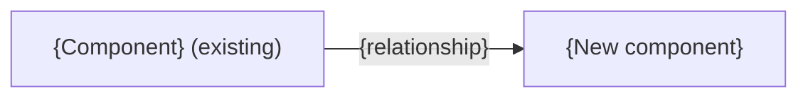

# Spec format

`scripts/validate_spec.py` checks the mechanical rules here. The content rules are yours to follow.

## Style

- Clear technical English, short sentences, one meaning per term.
- Backtick every API name. Never shorten or rename an identifier. Use full metadata API names: `Object__c.Field__c` for fields and `Object__c-Layout Name` for layouts.
- No metaphors (hero, seam, moving parts).
- Use "Not specified" when the evidence is missing and "Not applicable" when the topic is out of scope. They mean different things.
- A section with no evidence keeps its heading and gets one honest sentence.

## Skeleton (copy exactly; replace `{…}`)

````markdown
# Implementation spec — {title}

> {one-sentence purpose}

_Based on the requirement, the evidence reported by AskCoworker, and read-only org queries where noted. Assumptions and missing evidence are identified below. Specification only — nothing is implemented or deployed._

---

## 1. The requirement

{One-sentence summary. Mention any user decision that changed the scope, and any out-of-scope instruction in the request (deploy, data change) that was not acted on.}

| # | Responsibility | Trigger | Where it lives |
| --- | --- | --- | --- |
| 1 | {what} | {event or "Not specified"} | {component or "Not specified"} |

## 2. Grounding — reuse before building

Target org: `{alias}` ({org type/ID if known}). API version: `{version}`. {If the requirement names a different environment (for example production) than this org, say so.}

- **`{ApiName}`** ({metadata type}) — {why it matters}. _{verified by org query | reported by AskCoworker}_

Candidates examined and rejected: {component — reason}.

Evidence sources: {queries run, in brief}; AskCoworker {returned no citedReferences | cited …}.

## 3. Architecture



Why the pieces are drawn this way:

1. {Each node and edge, with its evidence.}

## 4. Metadata changes

**{Group}**

- **{Create|Update|Delete} `{ApiName}`** — {detail}

## 5. Data 360 (Data Cloud) data involved

{Details | "Not applicable — this change does not use Data 360." | "Data 360 involvement was not specified."}

## 6. Security considerations

{Execution context and sharing; CRUD/FLS; permission sets and profile grants (including default field access given to profiles on deploy); data exposure.}

## 7. Testing strategy

{Test components in the inventory mapped to behaviors; bulk, negative, permission, recursion, and delete/undelete cases as they apply. Label cases without a planned test as recommended verification. For flow-only changes, use Flow Tests (`FlowTest` metadata) or manual checks, not Apex tests that cannot exercise the flow. Flow Tests cannot cover asynchronous paths or generative AI actions; use manual checks for those. A flow whose only logic runs on a scheduled path gets no test row, only manual checks. Declarative-only changes (validation rules, formulas) get manual checks, not new Apex test classes. Add a Flow Test row (Type `FlowTest`) only when it can assert the flow's main outcome. When an Apex DML test exercises the flow better (for example, a flow driven by a roll-up recalculation), use the Apex test instead. Never claim tests ran.}

## 8. Open decisions

### Open

1. **{Topic} ({blocking | non-blocking}).** {Question or gap, evidence, recommended default.}

### Resolved

- {User decisions, corrections to AskCoworker proposals, and conflicts settled by org queries, each with its evidence.}

## 9. Change set

| # | Action | Type | API name | Module | Why |
| --- | --- | --- | --- | --- | --- |
| 1 | {Create} | {CustomField} | `{Obj__c.Field__c}` | {force-app/... or "Not specified"} | {why; escape \| } |

{One-sentence architecture summary.}

Total: {n} · Create: {n} · Update: {n} · Delete: {n}
````

## Rules the validator enforces

- Title line is `# Implementation spec — {title}`. For a `-draft-spec.md` file only, the title starts with `Draft — `.
- Exactly these nine `##` headings, in order, and no others. Use `###` inside sections if you need more structure.
- Section 4 has one bullet per change, exactly `- **{Action} `{ApiName}`** — {detail}` (nothing between the bold part and the em dash; put the type in the detail). Section 9 has one row per change. They list the same (Action, API name) pairs. A change is identified by (Type, API name), so an object and its tab can share a name; each (Type, API name) appears once in Section 9.
- Section 9 rows are numbered 1 to N. Action is `Create`, `Update`, or `Delete`. The API name is in backticks. Type, Module, and Why are not empty. Literal `|` inside a cell is escaped as `\|`.
- The counts line is exactly `Total: N · Create: N · Update: N · Delete: N` and matches the table.
- A zero-change spec has an empty Section 9 table (header only), and Sections 4 and 9 both contain "No metadata changes are required."
- Every `Conditional:` change is named in Section 8.
- Section 2 contains "verified by org query", "verified by project file", or "reported by AskCoworker".
- In Mermaid, every node label and edge label is in double quotes.
- Code fences are balanced.

## Content rules (not machine-checked)

- If the inventory uses Apex where a declarative feature could work, the "Why" list in Section 3 gives the reason.
- For a zero-change spec, the diagram shows the existing flow the spec relies on, or is replaced by one sentence.
- The diagram shows the flow after the change. It includes only evidenced components, and it labels unchanged ones "(existing)". A deleted component is never shown as active. If no flow is evidenced, replace the diagram with one sentence and add the gap to Section 8.
- Group Section 4 by the Group value AskCoworker supplied, in first-seen order. Otherwise use: Data model, Apex, Automation, Tests, UX, Security, Other.
- Existing dependencies appear in Sections 2 and 3, never as changes.
- Module is the `force-app/...` path. For a new component, use the standard source-format folder for its type in the default package directory (for example `force-app/main/default/flows`). Reports and dashboards live under `reports/<Folder>/` and `dashboards/<Folder>/`; shared ones go in a named folder, not `unfiled$public`. Use "Not specified" if the type has no standard folder. Do not invent other paths.
- When an invocable Apex signature changes, include the agent action (`GenAiFunction`) whose input schema must change.
- List every deployable component on its own row, once. Merge a Create and later Updates of the same component into the Create row. Do not fold dependent parts into one row (for example, a data stream and its data model object and mapping, or a flow and its custom metadata).
- When changes depend on each other or on a data step (backfill, migration), give the deployment sequence as an item in Section 8. A data step without which a responsibility fails is also *blocking for delivery*. The same applies to required setup that is not metadata (permission set assignments, feature settings, licenses).
- A row that depends on a `Conditional:` row is also `Conditional:` ("depends on row N"). A spec whose rows are all Conditional is still complete; list the blocking conditions first in Section 8.
- A change that is made through a Setup action rather than a deployment (for example promoting a picklist to a global value set) is still a row; begin its Detail with "Delivered by Setup step:".
- Queue and group members are part of the Queue or Group metadata. When they are unknown, use a named placeholder in that row and mark it blocking for delivery.
- Describe non-metadata setup steps as Setup UI actions where one exists (for example scheduling an Apex class from Setup).
- A Create that depends on a system or component that only AskCoworker reports, and no query can confirm, is `Conditional:`, and its condition is blocking in Section 8.
- Every Delete, and every data operation that changes or removes business records, states its impact, its prerequisites, a backup or export step, and a rollback path. For a metadata Delete, the backup is a retrieve into source control, and rollback is redeploying it or restoring a deleted custom field within its retention window.
- A list tagged *verified by org query* (grants, readers, creators) is complete, or it says "partial".
- Every new field or component that people or integrations must see or use includes its access (permission set) and, where the type has a UI and people use it, its placement, or Section 8 says why not. A field written and read only by an integration needs no layout placement by default. When the record page uses Dynamic Forms, place the field on the FlexiPage, and update the layout only if it is still used (for example on mobile or by unassigned pages).
- For each automation, cover records that start or stop matching its criteria on update, not only on create, so that the requirement's rule stays true. Do not add behavior in the opposite direction unless correctness needs it. List any uncovered transitions in Section 8.
- Counts and cross-references in the prose match the final inventory and section numbering.
- Flag formulas that may exceed Salesforce formula size limits (3,900 characters, or 5,000 compiled bytes), and give a fallback such as helper formula fields.
- For each new formula, state its blank handling (`BlankAsZero` or `BlankAsBlank`) and its result for blank and zero inputs.
- A claim that two implementations behave the same is checked at the edge cases (nulls, zero, rounding, bulk).
- Section 8 lists only items that affect this spec. Summarize dropped AskCoworker proposals in one Resolved line.
- A zero-change spec is short: sections with nothing to change get one or two sentences.
- When the requirement fixes a weakness or cleans up a set of components, check every object for siblings with the same pattern or origin (same kind of action, same naming or ID block). Cover them or list them in Section 8.
- Changing an existing shared UI component (list view, layout, page) changes it for everyone who uses it. Say so, and prefer adding a new one when the change would mislead or remove access.
- A security fix must not be bypassable by the same actor, for example through a caller-supplied ID used for authorization. If it can be bypassed, that is blocking.
- Test setups use only permission grants and data that the verified facts show are available.
- Each load-bearing platform assumption gets a verification case in Section 7. When one assumption drives most of the inventory, its check is a blocking prerequisite in Section 8 that names the rows depending on it.
- Mark the assumptions the design depends on (it fails if they are wrong) as *load-bearing* in Section 8.
- Tag each claim separately. When a sentence mixes a verified fact with an inference about platform behavior, split it or tag each part.
- Never present an assumption or an AskCoworker `[Proposal]` as a verified fact.
- Grant the least access that meets the requirement. A new, dedicated permission set is an acceptable default. For a new field, name the exact permission sets and profiles that get access and those that do not. Read access verbs in their normal business sense: "manage" means create, read, edit, and delete; "create" includes editing what was created. Access that a delivered responsibility needs in order to work (for example Read on a lookup target) is included, not deferred. A grant to an integration, connector, or broad permission set that no responsibility needs is an open decision in Section 8, not a default. A grant an integration user needs for a delivered responsibility is included, with the reason.
