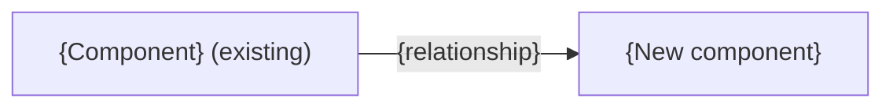

# Spec format

`scripts/validate_spec.py` checks the mechanical rules here. The content rules are yours to follow.

## Style

- Clear technical English, short sentences, one meaning per term.
- Backtick every API name. Never shorten or rename an identifier. Use full metadata API names: `Object__c.Field__c` for fields, `Object__c-Layout Name` for layouts, and the URL-encoded profile name (for example `Custom%3A Support Profile`) for profiles.
- No metaphors (hero, seam, moving parts).
- Use "Not specified" when the evidence is missing and "Not applicable" when the topic is out of scope. They mean different things.
- A section with no evidence keeps its heading and gets one honest sentence.

## Skeleton (copy exactly; replace `{…}`)

````markdown
# Implementation spec — {title}

> {one-sentence purpose}

_Based on the requirement, the evidence reported by AskCoworker, and read-only org queries where noted. Assumptions and missing evidence are identified below. Specification only — nothing is implemented or deployed._

---

## 1. The requirement

{One-sentence summary. Mention any user decision that changed the scope, and any out-of-scope instruction in the request (deploy, data change) that was not acted on.}

| # | Responsibility | Trigger | Where it lives |
| --- | --- | --- | --- |
| 1 | {what} | {event or "Not specified"} | {component or "Not specified"} |

## 2. Grounding — reuse before building

Target org: `{alias}` ({org type/ID if known}). API version: `{version}`. {If the requirement names a different environment (for example production) than this org, say so.}

- **`{ApiName}`** ({metadata type}) — {why it matters}. _{verified by org query | reported by AskCoworker}_

Candidates examined and rejected: {component — reason}.

Evidence sources: {queries run, in brief}; AskCoworker {returned no citedReferences | cited …}.

## 3. Architecture



Why the pieces are drawn this way:

1. {Each node and edge, with its evidence.}

## 4. Metadata changes

**{Group}**

- **{Create|Update|Delete} `{ApiName}`** — {detail}

## 5. Data 360 (Data Cloud) data involved

{Details | "Not applicable — this change does not use Data 360." | "Data 360 involvement was not specified."}

## 6. Security considerations

{Execution context and sharing; CRUD/FLS; permission sets and profile grants (including default field access given to profiles on deploy); data exposure.}

## 7. Testing strategy

{Test components in the inventory mapped to behaviors; bulk, negative, permission, recursion, and delete/undelete cases as they apply. Label cases without a planned test as recommended verification. For flow-only changes, use Flow Tests (`FlowTest` metadata) or manual checks, not Apex tests that cannot exercise the flow. Flow Tests cannot cover asynchronous paths or generative AI actions; use manual checks for those. A flow whose only logic runs on a scheduled path, or whose main outcome is a created related record, gets no test row, only manual checks. Declarative-only changes (validation rules, formulas) get manual checks, not new Apex test classes. Add one Flow Test row (Type `FlowTest`) for the main outcome, only when it can assert that outcome without org-specific record IDs; cover other scenarios with manual checks. When an Apex DML test exercises the flow better (for example, a flow driven by a roll-up recalculation), use the Apex test instead. Time-based boundaries (for example "created in the last 30 days") can be tested in Apex with `Test.setCreatedDate`. Manual verification steps are for people to run in a sandbox, and may include anonymous Apex. Never claim tests ran.}

## 8. Open decisions

### Open

1. **{Topic} ({blocking | non-blocking}).** {Question or gap, evidence, recommended default.}

### Resolved

- {User decisions, corrections to AskCoworker proposals, and conflicts settled by org queries, each with its evidence.}

## 9. Change set

| # | Action | Type | API name | Module | Why |
| --- | --- | --- | --- | --- | --- |
| 1 | {Create} | {CustomField} | `{Obj__c.Field__c}` | {force-app/... or "Not specified"} | {why; escape \| } |

{One-sentence architecture summary.}

Total: {n} · Create: {n} · Update: {n} · Delete: {n}
````

## Rules the validator enforces

- Title line is `# Implementation spec — {title}`. For a `-draft-spec.md` file only, the title starts with `Draft — `.
- Exactly these nine `##` headings, in order, and no others. Use `###` inside sections if you need more structure.
- Section 4 has one bullet per change, exactly `- **{Action} `{ApiName}`** — {detail}` (nothing between the bold part and the em dash; put the type in the detail). Section 9 has one row per change. They list the same (Action, API name) pairs. A change is identified by (Type, API name), so an object and its tab can share a name; each (Type, API name) appears once in Section 9.
- Section 9 rows are numbered 1 to N. Action is `Create`, `Update`, or `Delete`. The API name is in backticks. Type, Module, and Why are not empty. Literal `|` inside a cell is escaped as `\|`.
- The counts line is exactly `Total: N · Create: N · Update: N · Delete: N` and matches the table.
- A zero-change spec has an empty Section 9 table (header only), and Sections 4 and 9 both contain "No metadata changes are required."
- Every `Conditional:` change is named in Section 8 by its API name (a row number is not enough).
- Section 2 contains "verified by org query", "verified by project file", or "reported by AskCoworker".
- In Mermaid, every node label and edge label is in double quotes.
- Code fences are balanced.

## Content rules (not machine-checked)

Design choices (reuse, mechanism, scope, access, transitions, siblings, shared UI, security fixes) follow [design-rules.md](design-rules.md). The rules below cover how the spec records them.

### Inventory rows
- List every deployable component on its own row, once. Merge a Create and later Updates of the same component into the Create row. Do not fold dependent parts into one row (for example a data stream and its data model object and mapping, or a flow and its custom metadata).
- A flow row may state its delivered status (Active or Draft); activating it in the org is not part of the spec.
- LWC Jest tests live inside the component bundle and belong to its row. Field and object permissions are part of the PermissionSet (or Profile) component and belong to its row.
- When an invocable Apex signature changes, include the agent action (`GenAiFunction`) whose input schema must change; each per-agent copy is its own row.
- Module is the `force-app/...` path. For a new component, use the standard source-format folder for its type (for example `force-app/main/default/flows`). Reports and dashboards go under `reports/<Folder>/` and `dashboards/<Folder>/`; shared ones (and email templates) go in a named folder, not `unfiled$public`; add the folder as a row if it does not exist. Use "Not specified" if the type has no standard folder. Do not invent paths.
- A change made through a Setup action rather than a deployment (for example promoting a picklist to a global value set) is still a row. Begin its Detail with "Delivered by Setup step:".
- Queue and group members are part of the Queue or Group metadata. Unknown members are a named placeholder in that row, blocking for delivery.
- A Create that depends on a system only AskCoworker reports is `Conditional:`. A row that depends on a `Conditional:` row is also `Conditional:` ("depends on row N"). A condition may be settled by a sandbox check when no read-only query can settle it; say so. A spec whose rows are all Conditional is still complete; list its blocking conditions first in Section 8.
- Every new field or component that people or integrations use includes its access and, where the type has a UI people use, its placement, or Section 8 says why not. Name the exact permission sets and profiles that get access. A field used only by an integration needs no layout placement. With Dynamic Forms, place the field on the FlexiPage; when page activation cannot be read, the layout update is a `Conditional:` row. The same applies to placing components on a record page.

### Evidence and honesty
- Tag each claim separately; split sentences that mix a verified fact with an inference. Never present an assumption or an AskCoworker `[Proposal]` as a verified fact.
- A list tagged *verified by org query* (grants, readers, creators) is complete, or it says "partial".
- Mark *load-bearing* assumptions (the design fails if they are wrong) in Section 8, and give each a verification case in Section 7. When one assumption drives most of the inventory, its check is a blocking prerequisite that names the rows depending on it.
- A claim that two implementations behave the same is checked at the edge cases (nulls, zero, rounding, bulk).
- Counts and cross-references in the prose match the final inventory and section numbering.

### Architecture (Section 3)
- The diagram shows the flow after the change, with only evidenced components; unchanged ones are labelled "(existing)", and deleted ones are never shown as active. If no flow is evidenced, or the spec is zero-change, use the existing flow or one sentence.
- If Apex is used where a declarative feature could work, the "Why" list gives the reason.
- Existing dependencies appear in Sections 2 and 3, never as changes.
- Group Section 4 by the Group value AskCoworker supplied, in first-seen order; otherwise Data model, Apex, Automation, Tests, UX, Security, Other.

### Deletes, data, and deployment
- Every Delete, and every data operation that changes or removes business records, states its impact, prerequisites, a backup or export step, and a rollback path. For a metadata Delete, the backup is a retrieve into source control, and rollback is redeploying it or restoring the field within its retention window.
- When changes depend on each other or on a data step, give the deployment sequence in Section 8. A data step or non-metadata setup (permission set assignments, feature settings, licenses) without which a responsibility fails is *blocking for delivery*. Describe setup as Setup UI actions where one exists. Integration users and OAuth clients that an external owner manages are setup steps, not rows.

### Formulas
- State each new formula's blank handling (`BlankAsZero` or `BlankAsBlank`) and its result for blank and zero inputs.
- Flag formulas that may exceed 3,900 characters or 5,000 compiled bytes, and give a fallback (for example helper formula fields).

### Length
- Section 8 lists only items that affect this spec; summarize dropped AskCoworker proposals in one Resolved line.
- A zero-change spec is short: sections with nothing to change get one or two sentences.
- Test setups use only grants and data that the verified facts show are available.
