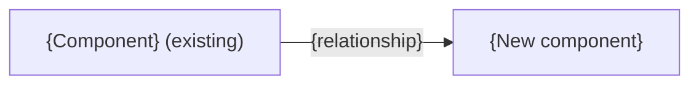

# Spec format

`scripts/validate_spec.py` checks the mechanical rules here. The content rules are yours to follow.

## Style

- Clear technical English, short sentences, one meaning per term.
- Backtick every API name. Never shorten or rename an identifier. Use full metadata API names: `Object__c.Field__c` for fields and `Object__c-Layout Name` for layouts.
- No metaphors (hero, seam, moving parts).
- Use "Not specified" when the evidence is missing and "Not applicable" when the topic is out of scope. They mean different things.
- A section with no evidence keeps its heading and gets one honest sentence.

## Skeleton (copy exactly; replace `{…}`)

````markdown
# Implementation spec — {title}

> {one-sentence purpose}

_Based on the requirement, the evidence reported by AskCoworker, and read-only org queries where noted. Assumptions and missing evidence are identified below. Specification only — nothing is implemented or deployed._

---

## 1. The requirement

{One-sentence summary. Mention any user decision that changed the scope, and any out-of-scope instruction in the request (deploy, data change) that was not acted on.}

| # | Responsibility | Trigger | Where it lives |
| --- | --- | --- | --- |
| 1 | {what} | {event or "Not specified"} | {component or "Not specified"} |

## 2. Grounding — reuse before building

Target org: `{alias}` ({org type/ID if known}). API version: `{version}`.

- **`{ApiName}`** ({metadata type}) — {why it matters}. _{verified by org query | reported by AskCoworker}_

Evidence sources: {queries run, in brief}; AskCoworker {returned no citedReferences | cited …}.

## 3. Architecture



Why the pieces are drawn this way:

1. {Each node and edge, with its evidence.}

## 4. Metadata changes

**{Group}**

- **{Create|Update|Delete} `{ApiName}`** — {detail}

## 5. Data 360 (Data Cloud) data involved

{Details | "Not applicable — this change does not use Data 360." | "Data 360 involvement was not specified."}

## 6. Security considerations

{Execution context and sharing; CRUD/FLS; permission sets (these are not the only grant path); data exposure.}

## 7. Testing strategy

{Test components in the inventory mapped to behaviors; bulk, negative, permission, recursion, and delete/undelete cases as they apply. Label cases without a planned test as recommended verification. Never claim tests ran.}

## 8. Open decisions

1. **{Topic} ({blocking | non-blocking}).** {Question or gap, evidence, recommended default.}

## 9. Change set

| # | Action | Type | API name | Module | Why |
| --- | --- | --- | --- | --- | --- |
| 1 | {Create} | {CustomField} | `{Obj__c.Field__c}` | {force-app/... or "Not specified"} | {why; escape \| } |

{One-sentence architecture summary.}

Total: {n} · Create: {n} · Update: {n} · Delete: {n}
````

## Rules the validator enforces

- Title line is `# Implementation spec — {title}`. For a `-draft-spec.md` file only, the title starts with `Draft — `.
- Exactly these nine `##` headings, in order, and no others. Use `###` inside sections if you need more structure.
- Section 4 has one bullet per change, and Section 9 has one row per change. They list the same (Action, API name) pairs, each once.
- Section 9 rows are numbered 1 to N. Action is `Create`, `Update`, or `Delete`. The API name is in backticks. Type, Module, and Why are not empty. Literal `|` inside a cell is escaped as `\|`.
- The counts line is exactly `Total: N · Create: N · Update: N · Delete: N` and matches the table.
- A zero-change spec has an empty Section 9 table (header only), and Sections 4 and 9 both contain "No metadata changes are required."
- Every `Conditional:` change is named in Section 8.
- Section 2 contains "verified by org query" or "reported by AskCoworker".
- In Mermaid, every node label and edge label is in double quotes.
- Code fences are balanced.

## Content rules (not machine-checked)

- If the inventory uses Apex where a declarative feature could work, the "Why" list in Section 3 gives the reason.
- For a zero-change spec, the diagram shows the existing flow the spec relies on, or is replaced by one sentence.
- The diagram shows the flow after the change. It includes only evidenced components, and it labels unchanged ones "(existing)". A deleted component is never shown as active. If no flow is evidenced, replace the diagram with one sentence and add the gap to Section 8.
- Group Section 4 by the Group value AskCoworker supplied, in first-seen order. Otherwise use: Data model, Apex, Automation, Tests, UX, Security, Other.
- Existing dependencies appear in Sections 2 and 3, never as changes.
- Every Delete, and every data operation the spec describes, states its impact, its prerequisites, a backup or export step, and a rollback path.
- Tag each claim separately. When a sentence mixes a verified fact with an inference about platform behavior, split it or tag each part.
- Never present an assumption or an AskCoworker `[Proposal]` as a verified fact.
- Grant the least access that meets the requirement. A grant to an integration, connector, or broad permission set that the requirement did not ask for is an open decision in Section 8, not a default.
